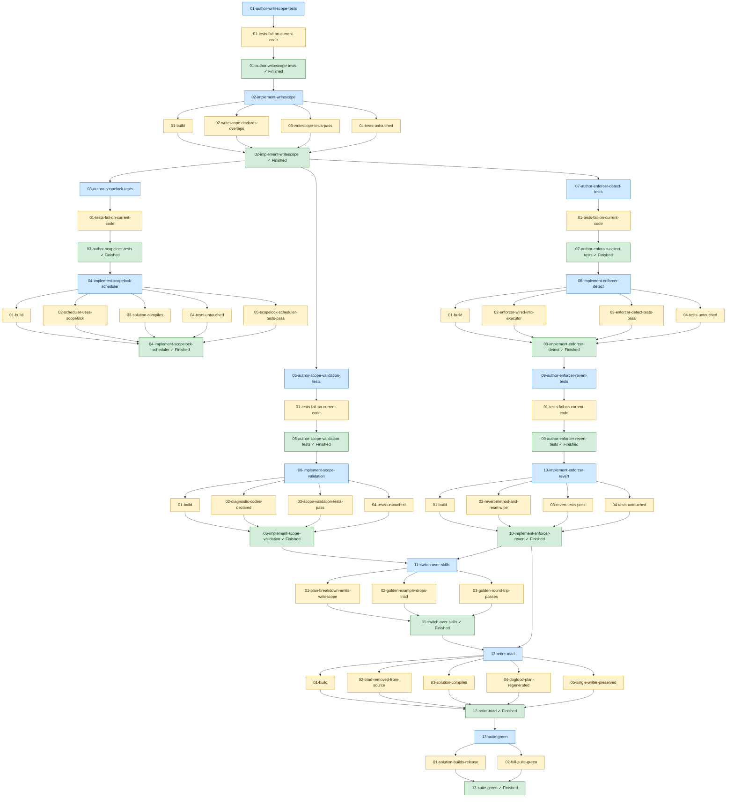

<!-- guardrails:graph v1 source-sha256=6158b0d344c03b9d2e3932d38b619b4da6799cc86e92ba18737ec976df370854 -->

```mermaid
flowchart TD
  task_01_author_writescope_tests["01-author-writescope-tests"]:::task
  gr_01_author_writescope_tests_0["01-tests-fail-on-current-code"]:::guardrail
  task_01_author_writescope_tests --> gr_01_author_writescope_tests_0
  gr_01_author_writescope_tests_0 --> done_01_author_writescope_tests
  done_01_author_writescope_tests["01-author-writescope-tests ✓ Finished"]:::done
  task_02_implement_writescope["02-implement-writescope"]:::task
  gr_02_implement_writescope_0["01-build"]:::guardrail
  task_02_implement_writescope --> gr_02_implement_writescope_0
  gr_02_implement_writescope_0 --> done_02_implement_writescope
  gr_02_implement_writescope_1["02-writescope-declares-overlaps"]:::guardrail
  task_02_implement_writescope --> gr_02_implement_writescope_1
  gr_02_implement_writescope_1 --> done_02_implement_writescope
  gr_02_implement_writescope_2["03-writescope-tests-pass"]:::guardrail
  task_02_implement_writescope --> gr_02_implement_writescope_2
  gr_02_implement_writescope_2 --> done_02_implement_writescope
  gr_02_implement_writescope_3["04-tests-untouched"]:::guardrail
  task_02_implement_writescope --> gr_02_implement_writescope_3
  gr_02_implement_writescope_3 --> done_02_implement_writescope
  done_02_implement_writescope["02-implement-writescope ✓ Finished"]:::done
  task_03_author_scopelock_tests["03-author-scopelock-tests"]:::task
  gr_03_author_scopelock_tests_0["01-tests-fail-on-current-code"]:::guardrail
  task_03_author_scopelock_tests --> gr_03_author_scopelock_tests_0
  gr_03_author_scopelock_tests_0 --> done_03_author_scopelock_tests
  done_03_author_scopelock_tests["03-author-scopelock-tests ✓ Finished"]:::done
  task_04_implement_scopelock_scheduler["04-implement-scopelock-scheduler"]:::task
  gr_04_implement_scopelock_scheduler_0["01-build"]:::guardrail
  task_04_implement_scopelock_scheduler --> gr_04_implement_scopelock_scheduler_0
  gr_04_implement_scopelock_scheduler_0 --> done_04_implement_scopelock_scheduler
  gr_04_implement_scopelock_scheduler_1["02-scheduler-uses-scopelock"]:::guardrail
  task_04_implement_scopelock_scheduler --> gr_04_implement_scopelock_scheduler_1
  gr_04_implement_scopelock_scheduler_1 --> done_04_implement_scopelock_scheduler
  gr_04_implement_scopelock_scheduler_2["03-solution-compiles"]:::guardrail
  task_04_implement_scopelock_scheduler --> gr_04_implement_scopelock_scheduler_2
  gr_04_implement_scopelock_scheduler_2 --> done_04_implement_scopelock_scheduler
  gr_04_implement_scopelock_scheduler_3["04-tests-untouched"]:::guardrail
  task_04_implement_scopelock_scheduler --> gr_04_implement_scopelock_scheduler_3
  gr_04_implement_scopelock_scheduler_3 --> done_04_implement_scopelock_scheduler
  gr_04_implement_scopelock_scheduler_4["05-scopelock-scheduler-tests-pass"]:::guardrail
  task_04_implement_scopelock_scheduler --> gr_04_implement_scopelock_scheduler_4
  gr_04_implement_scopelock_scheduler_4 --> done_04_implement_scopelock_scheduler
  done_04_implement_scopelock_scheduler["04-implement-scopelock-scheduler ✓ Finished"]:::done
  task_05_author_scope_validation_tests["05-author-scope-validation-tests"]:::task
  gr_05_author_scope_validation_tests_0["01-tests-fail-on-current-code"]:::guardrail
  task_05_author_scope_validation_tests --> gr_05_author_scope_validation_tests_0
  gr_05_author_scope_validation_tests_0 --> done_05_author_scope_validation_tests
  done_05_author_scope_validation_tests["05-author-scope-validation-tests ✓ Finished"]:::done
  task_06_implement_scope_validation["06-implement-scope-validation"]:::task
  gr_06_implement_scope_validation_0["01-build"]:::guardrail
  task_06_implement_scope_validation --> gr_06_implement_scope_validation_0
  gr_06_implement_scope_validation_0 --> done_06_implement_scope_validation
  gr_06_implement_scope_validation_1["02-diagnostic-codes-declared"]:::guardrail
  task_06_implement_scope_validation --> gr_06_implement_scope_validation_1
  gr_06_implement_scope_validation_1 --> done_06_implement_scope_validation
  gr_06_implement_scope_validation_2["03-scope-validation-tests-pass"]:::guardrail
  task_06_implement_scope_validation --> gr_06_implement_scope_validation_2
  gr_06_implement_scope_validation_2 --> done_06_implement_scope_validation
  gr_06_implement_scope_validation_3["04-tests-untouched"]:::guardrail
  task_06_implement_scope_validation --> gr_06_implement_scope_validation_3
  gr_06_implement_scope_validation_3 --> done_06_implement_scope_validation
  done_06_implement_scope_validation["06-implement-scope-validation ✓ Finished"]:::done
  task_07_author_enforcer_detect_tests["07-author-enforcer-detect-tests"]:::task
  gr_07_author_enforcer_detect_tests_0["01-tests-fail-on-current-code"]:::guardrail
  task_07_author_enforcer_detect_tests --> gr_07_author_enforcer_detect_tests_0
  gr_07_author_enforcer_detect_tests_0 --> done_07_author_enforcer_detect_tests
  done_07_author_enforcer_detect_tests["07-author-enforcer-detect-tests ✓ Finished"]:::done
  task_08_implement_enforcer_detect["08-implement-enforcer-detect"]:::task
  gr_08_implement_enforcer_detect_0["01-build"]:::guardrail
  task_08_implement_enforcer_detect --> gr_08_implement_enforcer_detect_0
  gr_08_implement_enforcer_detect_0 --> done_08_implement_enforcer_detect
  gr_08_implement_enforcer_detect_1["02-enforcer-wired-into-executor"]:::guardrail
  task_08_implement_enforcer_detect --> gr_08_implement_enforcer_detect_1
  gr_08_implement_enforcer_detect_1 --> done_08_implement_enforcer_detect
  gr_08_implement_enforcer_detect_2["03-enforcer-detect-tests-pass"]:::guardrail
  task_08_implement_enforcer_detect --> gr_08_implement_enforcer_detect_2
  gr_08_implement_enforcer_detect_2 --> done_08_implement_enforcer_detect
  gr_08_implement_enforcer_detect_3["04-tests-untouched"]:::guardrail
  task_08_implement_enforcer_detect --> gr_08_implement_enforcer_detect_3
  gr_08_implement_enforcer_detect_3 --> done_08_implement_enforcer_detect
  done_08_implement_enforcer_detect["08-implement-enforcer-detect ✓ Finished"]:::done
  task_09_author_enforcer_revert_tests["09-author-enforcer-revert-tests"]:::task
  gr_09_author_enforcer_revert_tests_0["01-tests-fail-on-current-code"]:::guardrail
  task_09_author_enforcer_revert_tests --> gr_09_author_enforcer_revert_tests_0
  gr_09_author_enforcer_revert_tests_0 --> done_09_author_enforcer_revert_tests
  done_09_author_enforcer_revert_tests["09-author-enforcer-revert-tests ✓ Finished"]:::done
  task_10_implement_enforcer_revert["10-implement-enforcer-revert"]:::task
  gr_10_implement_enforcer_revert_0["01-build"]:::guardrail
  task_10_implement_enforcer_revert --> gr_10_implement_enforcer_revert_0
  gr_10_implement_enforcer_revert_0 --> done_10_implement_enforcer_revert
  gr_10_implement_enforcer_revert_1["02-revert-method-and-reset-wipe"]:::guardrail
  task_10_implement_enforcer_revert --> gr_10_implement_enforcer_revert_1
  gr_10_implement_enforcer_revert_1 --> done_10_implement_enforcer_revert
  gr_10_implement_enforcer_revert_2["03-revert-tests-pass"]:::guardrail
  task_10_implement_enforcer_revert --> gr_10_implement_enforcer_revert_2
  gr_10_implement_enforcer_revert_2 --> done_10_implement_enforcer_revert
  gr_10_implement_enforcer_revert_3["04-tests-untouched"]:::guardrail
  task_10_implement_enforcer_revert --> gr_10_implement_enforcer_revert_3
  gr_10_implement_enforcer_revert_3 --> done_10_implement_enforcer_revert
  done_10_implement_enforcer_revert["10-implement-enforcer-revert ✓ Finished"]:::done
  task_11_switch_over_skills["11-switch-over-skills"]:::task
  gr_11_switch_over_skills_0["01-plan-breakdown-emits-writescope"]:::guardrail
  task_11_switch_over_skills --> gr_11_switch_over_skills_0
  gr_11_switch_over_skills_0 --> done_11_switch_over_skills
  gr_11_switch_over_skills_1["02-golden-example-drops-triad"]:::guardrail
  task_11_switch_over_skills --> gr_11_switch_over_skills_1
  gr_11_switch_over_skills_1 --> done_11_switch_over_skills
  gr_11_switch_over_skills_2["03-golden-round-trip-passes"]:::guardrail
  task_11_switch_over_skills --> gr_11_switch_over_skills_2
  gr_11_switch_over_skills_2 --> done_11_switch_over_skills
  done_11_switch_over_skills["11-switch-over-skills ✓ Finished"]:::done
  task_12_retire_triad["12-retire-triad"]:::task
  gr_12_retire_triad_0["01-build"]:::guardrail
  task_12_retire_triad --> gr_12_retire_triad_0
  gr_12_retire_triad_0 --> done_12_retire_triad
  gr_12_retire_triad_1["02-triad-removed-from-source"]:::guardrail
  task_12_retire_triad --> gr_12_retire_triad_1
  gr_12_retire_triad_1 --> done_12_retire_triad
  gr_12_retire_triad_2["03-solution-compiles"]:::guardrail
  task_12_retire_triad --> gr_12_retire_triad_2
  gr_12_retire_triad_2 --> done_12_retire_triad
  gr_12_retire_triad_3["04-dogfood-plan-regenerated"]:::guardrail
  task_12_retire_triad --> gr_12_retire_triad_3
  gr_12_retire_triad_3 --> done_12_retire_triad
  gr_12_retire_triad_4["05-single-writer-preserved"]:::guardrail
  task_12_retire_triad --> gr_12_retire_triad_4
  gr_12_retire_triad_4 --> done_12_retire_triad
  done_12_retire_triad["12-retire-triad ✓ Finished"]:::done
  task_13_suite_green["13-suite-green"]:::task
  gr_13_suite_green_0["01-solution-builds-release"]:::guardrail
  task_13_suite_green --> gr_13_suite_green_0
  gr_13_suite_green_0 --> done_13_suite_green
  gr_13_suite_green_1["02-full-suite-green"]:::guardrail
  task_13_suite_green --> gr_13_suite_green_1
  gr_13_suite_green_1 --> done_13_suite_green
  done_13_suite_green["13-suite-green ✓ Finished"]:::done
  done_01_author_writescope_tests --> task_02_implement_writescope
  done_02_implement_writescope --> task_03_author_scopelock_tests
  done_02_implement_writescope --> task_05_author_scope_validation_tests
  done_02_implement_writescope --> task_07_author_enforcer_detect_tests
  done_03_author_scopelock_tests --> task_04_implement_scopelock_scheduler
  done_05_author_scope_validation_tests --> task_06_implement_scope_validation
  done_06_implement_scope_validation --> task_11_switch_over_skills
  done_07_author_enforcer_detect_tests --> task_08_implement_enforcer_detect
  done_08_implement_enforcer_detect --> task_09_author_enforcer_revert_tests
  done_09_author_enforcer_revert_tests --> task_10_implement_enforcer_revert
  done_10_implement_enforcer_revert --> task_11_switch_over_skills
  done_10_implement_enforcer_revert --> task_12_retire_triad
  done_11_switch_over_skills --> task_12_retire_triad
  done_12_retire_triad --> task_13_suite_green
  classDef task fill:#cfe8ff,stroke:#1b6ec2,color:#0b2545;
  classDef guardrail fill:#fff3cd,stroke:#b8860b,color:#3d2c00;
  classDef done fill:#d4edda,stroke:#2e7d32,color:#10341a;
```

_Structure only — retry, feedback, and needs-human edges are omitted._
