<!-- guardrails:graph v1 source-sha256=8e2475198db3d9137657d38d3f4641e101b2387c8329ac6ace432bb730e36d5a -->
<!-- REAL render, minimally hand-enhanced. The DAG shape + all node labels (everything the
     source-sha256 above covers) are the byte-for-byte output of the real `guardrails graph` on
     this partition-validating folder — there is NO validating twin and NO PREFLIGHT subgraph.
     Two HONEST, cosmetic additions were made by hand AFTER the render:
       (1) the three Bucket-A/B baseline TASK nodes (00, 01, 02) carry a subtle :::baseline tag —
           they are ORDINARY first-wave nodes, NOT a separate phase or lane;
       (2) exactly ONE simulated node (precond_05_requestid_delivered) was added to represent
           05's Bucket-C `preflights/` check, gating ONLY 05 (and thus only 05's cone), styled
           dashed-violet :::precond. This node is the only hand-added DAG element; it is NOT part
           of the real render and NOT covered by the source-sha256. See ../README.md. -->

```mermaid
flowchart TD
  task_00_baseline_core_tests_green["00-baseline-core-tests-green"]:::baseline
  gr_00_baseline_core_tests_green_0["Bucket A (positive baseline): Acme.Payments.Core.Tests are already green NOW (fail fast on a broken start). A no-op-root doctrine task with a scope:&quot;local&quot; guardrail — ships and validates today."]:::guardrail
  task_00_baseline_core_tests_green --> gr_00_baseline_core_tests_green_0
  gr_00_baseline_core_tests_green_0 --> done_00_baseline_core_tests_green
  done_00_baseline_core_tests_green["00-baseline-core-tests-green ✓ Finished"]:::done
  task_01_baseline_api_endpoint_up["01-baseline-api-endpoint-up"]:::baseline
  gr_01_baseline_api_endpoint_up_0["Bucket A (positive NON-TEST baseline): Acme.Payments.Api's GET /health route is already wired NOW. A deterministic byte-check on the wired source (NOT a live probe). A no-op-root doctrine task with a scope:&quot;local&quot; guardrail — ships and validates today."]:::guardrail
  task_01_baseline_api_endpoint_up --> gr_01_baseline_api_endpoint_up_0
  gr_01_baseline_api_endpoint_up_0 --> done_01_baseline_api_endpoint_up
  done_01_baseline_api_endpoint_up["01-baseline-api-endpoint-up ✓ Finished"]:::done
  task_02_baseline_correlation_absent["02-baseline-correlation-absent"]:::baseline
  gr_02_baseline_correlation_absent_0["Bucket B (negative/assert-absent baseline): the RequestId field is ABSENT from the charge result now. Inverted polarity — FAILS if it is already present. ONE-SHOT at run start; scope:&quot;local&quot; so it is NEVER re-run at a union/terminal gate. A cross-reference to, not a fork of, tests-fail-on-current-code."]:::guardrail
  task_02_baseline_correlation_absent --> gr_02_baseline_correlation_absent_0
  gr_02_baseline_correlation_absent_0 --> done_02_baseline_correlation_absent
  done_02_baseline_correlation_absent["02-baseline-correlation-absent ✓ Finished"]:::done
  task_03_author_correlation_tests["03-author-correlation-tests"]:::task
  gr_03_author_correlation_tests_0["01-new-tests-exist"]:::guardrail
  task_03_author_correlation_tests --> gr_03_author_correlation_tests_0
  gr_03_author_correlation_tests_0 --> done_03_author_correlation_tests
  gr_03_author_correlation_tests_1["Anti-tautology: the new RequestId tests are RED against current code (the per-task polarity that the 02 Bucket-B negative baseline generalizes). scope:local — never re-run at a union."]:::guardrail
  task_03_author_correlation_tests --> gr_03_author_correlation_tests_1
  gr_03_author_correlation_tests_1 --> done_03_author_correlation_tests
  done_03_author_correlation_tests["03-author-correlation-tests ✓ Finished"]:::done
  task_04_implement_correlation["04-implement-correlation"]:::task
  gr_04_implement_correlation_0["The new RequestId tests now PASS and the pre-existing Core tests STILL pass (the green that the 02 Bucket-B negative baseline makes attributable to this task). scope:local."]:::guardrail
  task_04_implement_correlation --> gr_04_implement_correlation_0
  gr_04_implement_correlation_0 --> done_04_implement_correlation
  done_04_implement_correlation["04-implement-correlation ✓ Finished"]:::done
  task_05_wire_api_correlation_middleware["05-wire-api-correlation-middleware"]:::task
  gr_05_wire_api_correlation_middleware_0["01-health-still-200"]:::guardrail
  task_05_wire_api_correlation_middleware --> gr_05_wire_api_correlation_middleware_0
  gr_05_wire_api_correlation_middleware_0 --> done_05_wire_api_correlation_middleware
  gr_05_wire_api_correlation_middleware_1["02-request-id-flows"]:::guardrail
  task_05_wire_api_correlation_middleware --> gr_05_wire_api_correlation_middleware_1
  gr_05_wire_api_correlation_middleware_1 --> done_05_wire_api_correlation_middleware
  done_05_wire_api_correlation_middleware["05-wire-api-correlation-middleware ✓ Finished"]:::done
  precond_05_requestid_delivered["Bucket C (SIMULATED #183) — dependency-delivery precondition at taskBase: did 04 thread RequestId into Acme.Payments.Core? Gates ONLY 05 (no burn on fail)."]:::precond
  precond_05_requestid_delivered -.-> task_05_wire_api_correlation_middleware
  task_06_integration_gate["06-integration-gate"]:::task
  gr_06_integration_gate_0["Whole-repo integration gate: the merged plan branch builds and the touched-area suite is green. Re-run at every union and on the terminal merged HEAD."]:::guardrail
  task_06_integration_gate --> gr_06_integration_gate_0
  gr_06_integration_gate_0 --> done_06_integration_gate
  done_06_integration_gate["06-integration-gate ✓ Finished"]:::done
  done_00_baseline_core_tests_green --> task_03_author_correlation_tests
  done_01_baseline_api_endpoint_up --> task_05_wire_api_correlation_middleware
  done_02_baseline_correlation_absent --> task_03_author_correlation_tests
  done_03_author_correlation_tests --> task_04_implement_correlation
  done_04_implement_correlation --> task_05_wire_api_correlation_middleware
  done_04_implement_correlation --> task_06_integration_gate
  done_05_wire_api_correlation_middleware --> task_06_integration_gate
  classDef task fill:#cfe8ff,stroke:#1b6ec2,color:#0b2545;
  classDef guardrail fill:#fff3cd,stroke:#b8860b,color:#3d2c00;
  classDef done fill:#d4edda,stroke:#2e7d32,color:#10341a;
  classDef baseline fill:#cfe8ff,stroke:#1b6ec2,stroke-width:2px,stroke-dasharray:2 2,color:#0b2545;
  classDef precond fill:#f3ecff,stroke:#8a63d2,stroke-width:2px,stroke-dasharray:5 3,color:#2a0f55;
```

_Structure only — retry, feedback, and needs-human edges are omitted. Nodes 00/01/02 are ordinary
first-wave **Bucket-A/B baseline** tasks (subtle dashed outline) — not a separate phase. The lone
dashed-violet **Bucket C** node is per-task JIT: it gates only 05's cone, not the whole plan._
