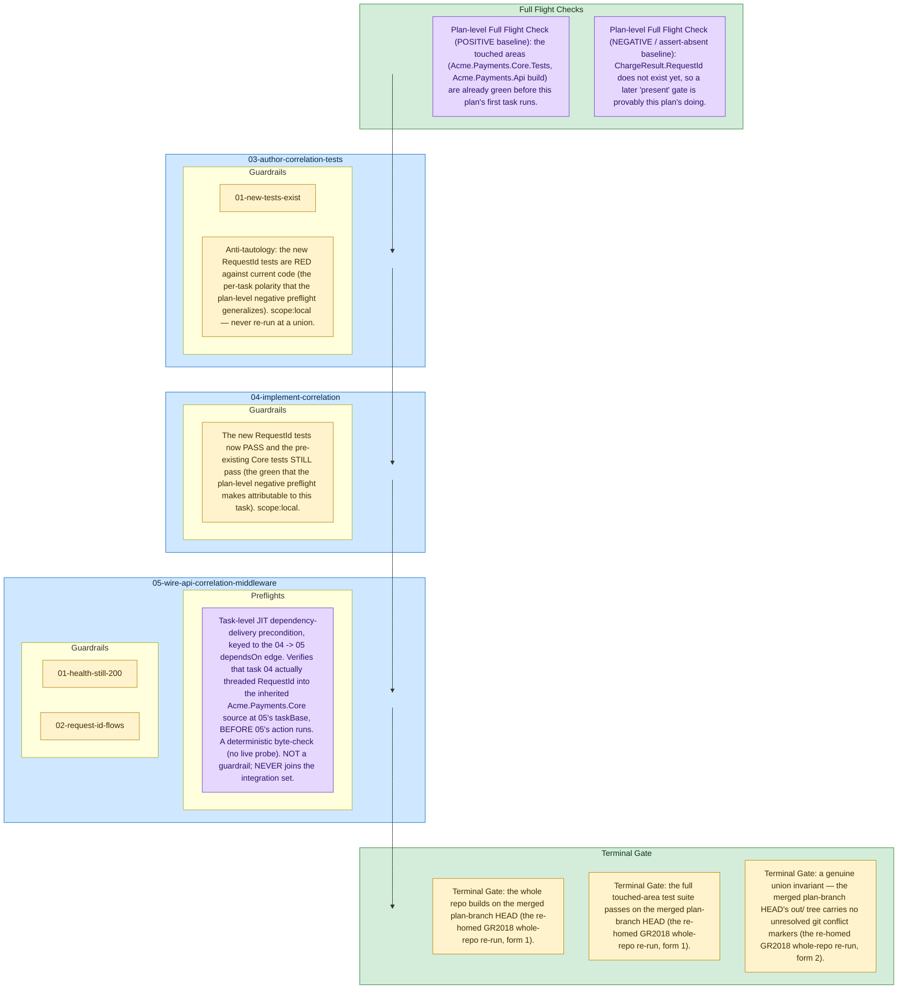

<!-- guardrails:graph v1 source-sha256=963cbfdd0b9433fe56fbd7060483286224cfe6cee5a2796edd37154ba3bdaae8 -->

```mermaid
flowchart TD
  subgraph plan_preflights["Full Flight Checks"]
    plan_preflights_anchor[" "]:::invisible
    plan_preflights_0["Plan-level Full Flight Check (POSITIVE baseline): the touched areas (Acme.Payments.Core.Tests, Acme.Payments.Api build) are already green before this plan's first task runs."]:::preflight
    plan_preflights_1["Plan-level Full Flight Check (NEGATIVE / assert-absent baseline): ChargeResult.RequestId does not exist yet, so a later 'present' gate is provably this plan's doing."]:::preflight
  end
  class plan_preflights planLevel;
  subgraph task_03_author_correlation_tests["03-author-correlation-tests"]
    task_03_author_correlation_tests_anchor[" "]:::invisible
    subgraph task_03_author_correlation_tests_guardrails["Guardrails"]
      task_03_author_correlation_tests_gr_0["01-new-tests-exist"]:::guardrail
      task_03_author_correlation_tests_gr_1["Anti-tautology: the new RequestId tests are RED against current code (the per-task polarity that the plan-level negative preflight generalizes). scope:local — never re-run at a union."]:::guardrail
    end
  end
  class task_03_author_correlation_tests task;
  subgraph task_04_implement_correlation["04-implement-correlation"]
    task_04_implement_correlation_anchor[" "]:::invisible
    subgraph task_04_implement_correlation_guardrails["Guardrails"]
      task_04_implement_correlation_gr_0["The new RequestId tests now PASS and the pre-existing Core tests STILL pass (the green that the plan-level negative preflight makes attributable to this task). scope:local."]:::guardrail
    end
  end
  class task_04_implement_correlation task;
  subgraph task_05_wire_api_correlation_middleware["05-wire-api-correlation-middleware"]
    task_05_wire_api_correlation_middleware_anchor[" "]:::invisible
    subgraph task_05_wire_api_correlation_middleware_preflights["Preflights"]
      task_05_wire_api_correlation_middleware_pf_0["Task-level JIT dependency-delivery precondition, keyed to the 04 -&gt; 05 dependsOn edge. Verifies that task 04 actually threaded RequestId into the inherited Acme.Payments.Core source at 05's taskBase, BEFORE 05's action runs. A deterministic byte-check (no live probe). NOT a guardrail; NEVER joins the integration set."]:::preflight
    end
    subgraph task_05_wire_api_correlation_middleware_guardrails["Guardrails"]
      task_05_wire_api_correlation_middleware_gr_0["01-health-still-200"]:::guardrail
      task_05_wire_api_correlation_middleware_gr_1["02-request-id-flows"]:::guardrail
    end
  end
  class task_05_wire_api_correlation_middleware task;
  subgraph plan_guardrails["Terminal Gate"]
    plan_guardrails_anchor[" "]:::invisible
    plan_guardrails_0["Terminal Gate: the whole repo builds on the merged plan-branch HEAD (the re-homed GR2018 whole-repo re-run, form 1)."]:::guardrail
    plan_guardrails_1["Terminal Gate: the full touched-area test suite passes on the merged plan-branch HEAD (the re-homed GR2018 whole-repo re-run, form 1)."]:::guardrail
    plan_guardrails_2["Terminal Gate: a genuine union invariant — the merged plan-branch HEAD's out/ tree carries no unresolved git conflict markers (the re-homed GR2018 whole-repo re-run, form 2)."]:::guardrail
  end
  class plan_guardrails planLevel;
  plan_preflights_anchor --> task_03_author_correlation_tests_anchor
  task_03_author_correlation_tests_anchor --> task_04_implement_correlation_anchor
  task_04_implement_correlation_anchor --> task_05_wire_api_correlation_middleware_anchor
  task_05_wire_api_correlation_middleware_anchor --> plan_guardrails_anchor
  classDef task fill:#cfe8ff,stroke:#1b6ec2,color:#0b2545;
  classDef preflight fill:#e6d7ff,stroke:#6f42c1,color:#2e1065;
  classDef guardrail fill:#fff3cd,stroke:#b8860b,color:#3d2c00;
  classDef planLevel fill:#d4edda,stroke:#2e7d32,color:#10341a;
  classDef invisible fill:none,stroke:none;
```

_Structure only — retry, feedback, and needs-human edges are omitted._
