<!-- guardrails:graph v1 source-sha256=0f57f140165ea86ee5613f76abfa45bb35fbc5c5e9bf533f502b91ae47eec7db -->
<!-- SIMULATED + HAND-ENHANCED — see diagram.html's header and ../README.md. Generated by the
     real `guardrails graph` against a VALIDATING TWIN (scope:"precondition" downgraded to
     scope:"local"), then hand-enhanced with the PREFLIGHT subgraph + :::preflight/:::precond
     classes. DAG shape + labels (the staleness hash) are unchanged from the real render. -->

```mermaid
flowchart TD
  subgraph PREFLIGHT["🛫 PREFLIGHT phase — scope:&quot;precondition&quot; · runs once, pre-DAG, against user HEAD (SIMULATED — #183 Phase-2)"]
  direction LR
  task_00_baseline_core_tests_green["00-baseline-core-tests-green"]:::preflight
  gr_00_baseline_core_tests_green_0["POSITIVE preflight: Acme.Payments.Core.Tests are already green NOW (fail fast on a broken start)."]:::precond
  task_00_baseline_core_tests_green --> gr_00_baseline_core_tests_green_0
  gr_00_baseline_core_tests_green_0 --> done_00_baseline_core_tests_green
  done_00_baseline_core_tests_green["00-baseline-core-tests-green ✓ Finished"]:::done
  task_01_baseline_api_endpoint_up["01-baseline-api-endpoint-up"]:::preflight
  gr_01_baseline_api_endpoint_up_0["POSITIVE non-test preflight: Acme.Payments.Api's GET /health route is already wired and responding NOW. The endpoint-up generalization (deterministic byte check, not a live probe)."]:::precond
  task_01_baseline_api_endpoint_up --> gr_01_baseline_api_endpoint_up_0
  gr_01_baseline_api_endpoint_up_0 --> done_01_baseline_api_endpoint_up
  done_01_baseline_api_endpoint_up["01-baseline-api-endpoint-up ✓ Finished"]:::done
  task_02_baseline_correlation_absent["02-baseline-correlation-absent"]:::preflight
  gr_02_baseline_correlation_absent_0["NEGATIVE preflight (attribution): the RequestId field is ABSENT from the charge result now. Inverted polarity — FAILS if it is already present. Generalizes tests-fail-on-current-code."]:::precond
  task_02_baseline_correlation_absent --> gr_02_baseline_correlation_absent_0
  gr_02_baseline_correlation_absent_0 --> done_02_baseline_correlation_absent
  done_02_baseline_correlation_absent["02-baseline-correlation-absent ✓ Finished"]:::done
  end
  task_03_author_correlation_tests["03-author-correlation-tests"]:::task
  gr_03_author_correlation_tests_0["01-new-tests-exist"]:::guardrail
  task_03_author_correlation_tests --> gr_03_author_correlation_tests_0
  gr_03_author_correlation_tests_0 --> done_03_author_correlation_tests
  gr_03_author_correlation_tests_1["Anti-tautology: the new RequestId tests are RED against current code (the local polarity that the 02 negative preflight generalizes). scope:local — never re-run at a union."]:::guardrail
  task_03_author_correlation_tests --> gr_03_author_correlation_tests_1
  gr_03_author_correlation_tests_1 --> done_03_author_correlation_tests
  done_03_author_correlation_tests["03-author-correlation-tests ✓ Finished"]:::done
  task_04_implement_correlation["04-implement-correlation"]:::task
  gr_04_implement_correlation_0["The new RequestId tests now PASS and the pre-existing Core tests STILL pass (the green that the 02 negative preflight makes attributable to this task). scope:local."]:::guardrail
  task_04_implement_correlation --> gr_04_implement_correlation_0
  gr_04_implement_correlation_0 --> done_04_implement_correlation
  done_04_implement_correlation["04-implement-correlation ✓ Finished"]:::done
  task_05_wire_api_correlation_middleware["05-wire-api-correlation-middleware"]:::task
  gr_05_wire_api_correlation_middleware_0["01-health-still-200"]:::guardrail
  task_05_wire_api_correlation_middleware --> gr_05_wire_api_correlation_middleware_0
  gr_05_wire_api_correlation_middleware_0 --> done_05_wire_api_correlation_middleware
  gr_05_wire_api_correlation_middleware_1["02-request-id-flows"]:::guardrail
  task_05_wire_api_correlation_middleware --> gr_05_wire_api_correlation_middleware_1
  gr_05_wire_api_correlation_middleware_1 --> done_05_wire_api_correlation_middleware
  done_05_wire_api_correlation_middleware["05-wire-api-correlation-middleware ✓ Finished"]:::done
  task_06_integration_gate["06-integration-gate"]:::task
  gr_06_integration_gate_0["Whole-repo integration gate: the merged plan branch builds and the touched-area suite is green. Re-run at every union and on the terminal merged HEAD."]:::guardrail
  task_06_integration_gate --> gr_06_integration_gate_0
  gr_06_integration_gate_0 --> done_06_integration_gate
  done_06_integration_gate["06-integration-gate ✓ Finished"]:::done
  done_00_baseline_core_tests_green --> task_03_author_correlation_tests
  done_01_baseline_api_endpoint_up --> task_05_wire_api_correlation_middleware
  done_02_baseline_correlation_absent --> task_03_author_correlation_tests
  done_03_author_correlation_tests --> task_04_implement_correlation
  done_04_implement_correlation --> task_05_wire_api_correlation_middleware
  done_04_implement_correlation --> task_06_integration_gate
  done_05_wire_api_correlation_middleware --> task_06_integration_gate
  classDef task fill:#cfe8ff,stroke:#1b6ec2,color:#0b2545;
  classDef guardrail fill:#fff3cd,stroke:#b8860b,color:#3d2c00;
  classDef done fill:#d4edda,stroke:#2e7d32,color:#10341a;
  classDef preflight fill:#e6dcff,stroke:#6f42c1,stroke-width:2px,color:#2a0f55;
  classDef precond fill:#f3ecff,stroke:#8a63d2,stroke-dasharray:5 3,color:#2a0f55;
  style PREFLIGHT fill:#ede4ff,stroke:#8a63d2,stroke-width:2px,color:#2a0f55;
```

_Structure only — retry, feedback, and needs-human edges are omitted. The violet **PREFLIGHT phase** box is the SIMULATED first-class preflight lane (`scope:"precondition"`, #183 Phase-2); it gates the blue work tasks._
