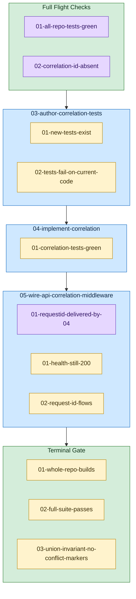

<!-- guardrails:graph v1 source-sha256=4799a4c471356032d4fe860532e7ab55922cd51978ffeaed3e37ecc8611f8a36 -->

_Structure only — retry, feedback, and needs-human edges are omitted._

**Legend**

- 🟣 **Preflight** — verified BEFORE the task's attempt loop; gates entry (dependency-delivery precondition)
- 🟡 **Guardrail** — verified AFTER the task's action; must pass for the task to finish
- 🟢 Plan-level containers ("Full Flight Checks" top, "Terminal Gate" bottom) run the same two checks once for the whole plan, at the very start and very end.
- ➡️ **Edge direction** — every edge runs in execution order, from a dependency to its dependent: an edge `A → B` means B runs after A (B dependsOn A). A long edge that routes *past* an unrelated box is NOT a dependency on that box — follow the arrowhead to its real target. (In `diagram.html`, a mid-edge arrow marks each edge's direction where a crossing edge passes between boxes.)
