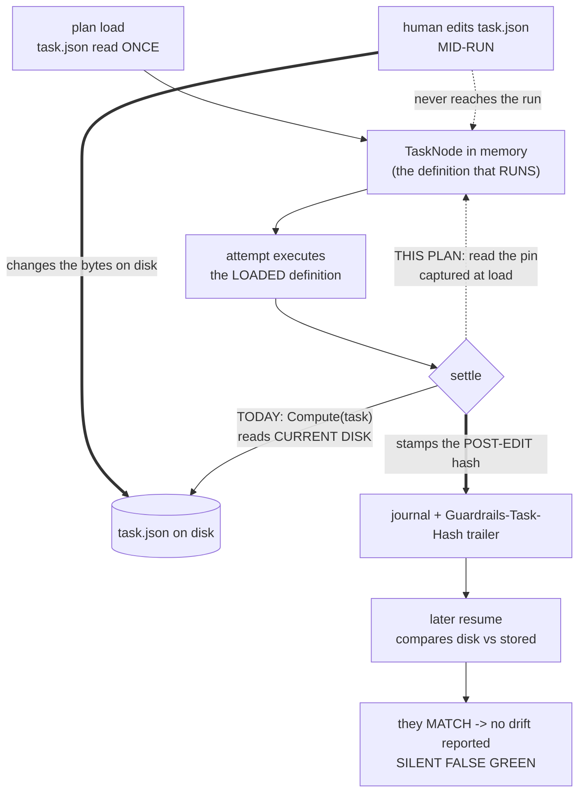

# 32 — The executed-definition hash (#556)

**Issue:** #556 — *Definition-hash is stamped from disk at settle, not from the bytes executed: a mid-run
`task.json` edit yields a silent false green no resume can detect.*

**Status:** design of record. Delivered as a draft PR for inline review (#106) before any implementation
milestone starts.

**Why this is its own plan.** Plan 31 §10 refused to absorb it: *"the fix is small but it changes §7.2's
drift semantics, and shipping a drift-contract change inside a three-issue hardening plan is how a
contract change goes unreviewed."* That refusal stands. This is a §7.2 contract change and it gets its own
design, its own review and its own run.

---

## 1. What a silent false green costs

Every other failure this harness produces is loud. A guardrail fails and the attempt retries. A scope
violation is reverted. An escalation halts and names a human. The product's whole claim — *a prompt may
propose, only a deterministic gate may certify* — rests on the certification being **checkable after the
fact**, and §7.2's `definitionHash` is the mechanism that makes it checkable: it is the record of *what
was verified*, and a resume re-derives it and halts when it moved.

This defect makes that record describe something that never ran. The hash stamped at settle is the hash of
the bytes **on disk at settle**, not the bytes the attempt executed. Edit a `task.json` while its task is
in flight and the harness certifies the old definition, records the new one, and every downstream
mechanism that trusts the record — the resume pre-pass (§7.2), the Part C safe-suffix rewind (§7.2), the
`Guardrails-Task-Hash:` trailer (§5.3), `WaveDefinitionHash` (§14.5) — agrees that nothing is wrong.

There is no surface for it at either end. Not during the run, not at the next resume, not ever.

**It is not academic.** Every one of plan 28's seven escalations was fixed by editing the plan folder. Each
was hand-sequenced *after* the run exited specifically to dodge this hazard — which worked, but only
because the operator knew. `mergeOnSuccess` now defaults ON (#340, preview.40+), so an unattended
overnight run that reaches this state does not merely record a lie: **it delivers.**

---

## 2. The premise, re-verified (#563)

#563 requires a design citing an issue to re-check the issue's load-bearing claims rather than inherit
them. Done, at `e835817`:

| #556's claim | Verdict |
|---|---|
| `AttemptJournaler.cs:90` stamps `TaskDefinitionHash.Compute(task)` at settle | **Holds** — now `:91` (plan 31 moved it one line). |
| `TaskDefinitionHash.Compute` hashes current on-disk bytes | **Holds** — `TaskDefinitionHash.cs:41` folds `HashText.AppendFile(builder, file.Label, file.AbsolutePath)` over `TaskDefinitionFiles.Enumerate(task)`. |
| `task.json` and the DAG are held from plan load | **Holds, and is now stronger than the issue states.** `TaskNode` is a `sealed record` with every property `init`-only (`TaskNode.cs:6-89`); nothing in `src/` mutates one. The enclosing `PlanDefinition` changes only by **full re-load** (`Scheduler.cs:1938`) and re-binding (`SpliceAuthoredWave`, `Scheduler.cs:1860`). |
| The action prompt is re-read per attempt | **Holds** — `ActionRunner.cs:107`. |
| Plan 31's watch reduces the chance but does not close it | **Holds** — and plan 31 wrote the limitation into the SSOT itself (§7.2, lines 2883-2895), naming #556 as the fix. §14 below *replaces* that paragraph rather than adding to it. |

**Nothing has addressed it since it was filed.** `git log --all --grep 556` returns two commits, both plan
31's own doc and review commits.

**Three corrections the re-verification produced.** All are load-bearing:

1. **The issue names one write site. There are six** — four task-level, one wave-level, and one
   (`RecordDriftAccepted`) that an adversarial pass found after the first draft missed it too — and the one it names is
   the **serial-mode** settle. Plan 28's motivating overnight run was a worktree-mode run, whose
   authoritative settle is `Scheduler.cs:3953`. A fix applied at the cited line alone would not have
   covered the incident that motivated the issue.
2. **The issue calls candidate (3) "a good companion." It is required.** Candidate (1)'s detection fires
   only on a *resume*, and a run that goes green to completion never resumes. With `mergeOnSuccess` on by
   default, (1) alone leaves the headline scenario — an unattended run that finishes green and ships —
   entirely uncaught (§6.1).
3. **The issue phrases (3) as "refuse to record a success." That form is unshippable** — it discards paid
   work (#554's defect, fixed hours earlier) and leaves a plan-branch commit whose journal says otherwise,
   which is the state Part C rule 3 refuses to rewind past. §6.4 re-specifies it as *record the success,
   block the delivery*.

**Housekeeping: #556 is CLOSED and must be reopened.** It was auto-closed at `1490d2a` — plan 31's own doc
commit, whose body says in as many words *"Files three defects the design surfaced but deliberately does
not fix."* GitHub read a closing keyword out of prose. #557, filed in the same breath, is still open.

---

## 3. Scope, ordered — and the order is decided

Three milestones, sequential, each green before the next.

| # | Milestone | Why here in the order |
|---|---|---|
| **A** | **The task pin.** `TaskNode` carries the definition hash captured from the bytes the loader read; the four task-level WRITE sites stamp that instead of recomputing from disk. | The record is the contract. Everything downstream reads it, so it is fixed first. |
| **B** | **The wave twin.** `WaveNode` carries the same pin; `WaveDefinitionHash`'s wave-completion WRITE folds task pins rather than recomputing. | **Not optional.** §7.2/§14.5 state that the wave hash changes *iff* a constituent task hash changes — *"the levels cannot drift apart."* Fixing A alone makes that statement false. Leaving B out is not neutral; it breaks a documented invariant. |
| **C** | **The settle-time divergence gate.** At each successful settle, compare pin against disk; on a mismatch record both, and block **delivery** for the run. | A and B make the *next resume* honest. C makes *this run* honest — which is the only thing that helps a run that finishes green. |

Then D: the SSOT and the domain-knowledge skill, in the same change (invariant 4).

---

## 4. The mechanism, corrected



> **Warning:** **The blend is what hides it.** The recorded hash is computed over both liveness classes at once. For the
> held-from-load half it records bytes that were never executed; for the re-read-per-attempt half it records
> bytes that *were*. One hash, two opposite meanings, and the result is indistinguishable from a correct
> record — which is why no resume can flag it and why this defect has no surface today.

### 4.1 The asymmetry, stated once

The plan folder has **two liveness classes**, and nothing in the codebase says so:

| Input | Liveness | A mid-run edit… |
|---|---|---|
| `task.json` — `writeScope`, `dependsOn`, `retries`, `maxTurns`, `model`, `stagingOutputs` | **Held from load** (`PlanLoader.LoadTask`, `PlanLoader.cs:1011`) | does **not** apply to this run |
| The DAG (`dependsOn` edges, topological order) | **Held from load** | does **not** apply |
| The resolved action file | **Re-read per attempt** (`ActionRunner.cs:107`) | **applies** to the next attempt |
| `guardrails/**`, `preflights/**` scripts | **Re-read per invocation** | **applies** |

The recorded hash is computed at settle over **all four rows above**, from disk. So for the held-from-load half it
records bytes that were never executed, and — this is the part that hides it — for the live half it
records bytes that *were*. The two halves behave oppositely, the hash blends them, and the blend is
indistinguishable from a correct record.

### 4.2 Six write sites, not one

Every site below **stamps** a definition hash into something durable. The issue names **one** of them —
and it is the *serial-mode* settle, while plan 28's motivating overnight run was a worktree-mode run.

| Site | Path | Mode | Stamps |
|---|---|---|---|
| W1 | `src/Guardrails.Core/Execution/AttemptJournaler.cs:91` | serial / shared-workspace | the journal `tasks[].definitionHash` |
| W2 | `src/Guardrails.Core/Execution/Scheduler.cs:3953` | worktree, deferred B1 settle — **the default for a real run** | the journal **and** the `Guardrails-Task-Hash:` trailer |
| W3 | `src/Guardrails.Core/Execution/Scheduler.cs:3676` | worktree, non-deferred | the trailer only (the executor already journaled) |
| W4 | `src/Guardrails.Core/Execution/TaskExecutor.cs:590` | `guardrails revalidate` — a synthetic succeeded attempt | the journal |
| W5 | `src/Guardrails.Core/Execution/Scheduler.cs:689` | wave completion, via `WaveDefinitionHash.Compute(wave)` | the wave journal entry **and** the `Guardrails-Wave:` marker commit |
| **W6** | `src/Guardrails.Core/Journal/RunJournal.cs:482-497` — `RecordDriftAccepted` | operator drift-accept (`[a]`) | **overwrites** `tasks[].definitionHash` with a value sourced from `DefinitionDriftProbe.cs:69` — **current disk** |

**W6 is the one nobody had counted, and it escaped for a structural reason worth naming.** It calls no
hash function at all — it is a *write* whose value is handed to it by a site §4.3 classifies as a *read*
(`DefinitionDriftProbe.Evaluate`). Any enumeration built by searching for `TaskDefinitionHash.Compute`
misses it by construction, which is how the first draft and the first adversarial pass both lost it. Its consequences are handled in §6.6 and §14 rather than waved at:
the SSOT sentence "never the current on-disk bytes" needs its exception stated, and the `[a]` branch is
one keystroke from re-creating exactly the lie this plan removes.

W2 is the one that matters most and the one the issue does not name. The trailer chain is
`Scheduler.cs:3953` → `handle.DefinitionHash` → `GitWorktreeProvider.cs:176` → `TrailerMessage` →
`GitWorktreeProvider.cs:355`.

### 4.3 The full call-site taxonomy — and the rule, corrected

An earlier draft split the sites into a WRITE table and a READ table, said *"reads recompute from disk;
writes read the pin,"* and built §9's guardrail on that split. **The split was wrong**: three sites listed
as READ are durable *writes* of a disk-computed hash, so the sentence was false as written and the
guardrail derived from it under-counted. The honest rule:

> **Reads recompute from disk. Writes of the EXECUTED-DEFINITION RECORD read the pin.**
> Every other durable write of a hash is a different record with its own contract, enumerated below and
> deliberately left on disk.

There are **12** `TaskDefinitionHash.Compute` call sites in `src/` today. All 12, with what each becomes:

| # | Site | Member | Role | After |
|---|---|---|---|---|
| 1 | `AttemptJournaler.cs` | `CompleteSucceededOrInvalidFragment` | **W1** — executed-definition record (serial) | **pin** |
| 2 | `Scheduler.cs` | `SettleAsync` | **W2** — executed-definition record + trailer (worktree, the default) | **pin** |
| 3 | `Scheduler.cs` | `SettleGreenIfWorktreeAsync` | **W3** — trailer only | **pin** |
| 4 | `TaskExecutor.cs` | `RevalidateAsync` | **W4** — executed-definition record (`revalidate`) | **pin** |
| 5 | `Scheduler.cs` | `DetectDefinitionDrift` | READ — the resume drift pre-pass | disk |
| 6 | `Scheduler.cs` | `BuildResolvedTasks` | READ — Part C audit rows | disk |
| 7 | `Scheduler.cs` | `ConsumePendingAnswers` | READ — answer-file anti-stale key | disk |
| 8 | `DryRun.cs` | `IsDrifted` | READ — `--dry-run` preview | disk |
| 9 | `DefinitionDriftProbe.cs` | `Evaluate` | READ — the pre-run probe | disk |
| 10 | `RunReset.cs` | `SafeComputeHash` | READ — reset audit rows | disk |
| 11 | `WaveDefinitionHash.cs` | `Compute` | READ — the disk form's task fold | disk |
| 12 | `Scheduler.cs` | `ClassifyTaskGateAsync` | **durable WRITE of a disk value** — the escalation record's anti-stale binding (§4.4) | **disk, deliberately** |

**So the post-fix count is 8**, not the six an earlier draft derived by counting only the READ table — it
omitted #11 and #12, which appeared in neither. That number is load-bearing: §9's anchor test enumerates
exactly this set.

Two further durable writes of a disk-computed hash exist at **wave** granularity and are equally
deliberate: `Scheduler`'s wave-checkpoint and review-gate escalation records, via
`WaveDefinitionHash.Compute`. And one write is fed by a read — **W6**, `RecordDriftAccepted` — which is
why it escaped both tables in the first draft (§4.2).

### 4.4 Also considered, and deliberately NOT changed

- **`Scheduler.cs:2996` / `:3099` / `:3236` — the escalation record's `definitionHash`.** This is #361's
  answer-file anti-stale binding, and its contract (§7.2, *"Resume answer-injection binding"*) requires the
  answer's hash to equal both the escalation record's *and* the unit's **CURRENT** hash at consumption
  (R3, `Scheduler.cs:3429`). **Both sides of that equality read disk, and they must stay on the same side**:
  pinning the stamping half alone would make a legitimate answer fail its own binding after any mid-run
  edit, while pinning both halves would compare a pin against a pin and check nothing. **An earlier draft
  justified this with "consumption always follows a fresh plan load." That is false** — `ConsumePendingAnswers`
  is called at `Scheduler.cs:2902`, inside the dispatch loop, mid-run, with no fresh load. The conclusion
  survives on the internal-consistency argument alone, but the reason had to be replaced, and the fact it
  replaces is worth stating plainly: **after this plan the answer-injection channel is the only surface
  still keyed on current disk while everything else is keyed on the pin.** `Scheduler.cs:2996` is also
  itself a durable write — `EscalationRequest.DefinitionHash` → `FileEscalationSink.cs:88` →
  `logs/<runId>/escalations/<seq>-<gate>.json` — as are the wave-level `:1506` and `:1916`. Deliberately
  unchanged, all three.
- **`ReviewMarker.KeyHash` (`ReviewMarker.cs:176`).** A review marker keys on *what a human reviewed*,
  which is the bytes on disk when they reviewed it — no run is in flight. Correct as-is.
- **`HashText.EnumerateFolderFiles`'s file set.** Untouched, deliberately: changing it moves **every**
  recorded definition hash in every plan and turns the next resume of each into a drift halt. That is plan
  31 §14's open migration question and it stays open. **This plan changes *when* the hash is computed,
  never *what* it is computed over** — which is precisely what makes §5.5's no-op property hold.

---

## 5. Milestones A and B — pin at load, stamp the pin

| Candidate | What it does | Verdict |
|---|---|---|
| **(1) Stamp the bytes actually executed** — capture at load, journal the pin | The record finally describes what ran, so a later resume compares against a truthful baseline | **Adopted (milestones A + B).** Smallest change that makes the record honest |
| **(2) Re-read `task.json` per attempt** — match the action prompt's liveness | Removes the asymmetry by making everything live | **Rejected (§5.7).** Makes DAG shape mutable mid-run; the hazards it opens are larger than the one it closes |
| **(3) Detect the divergence and act on it** | Compares the pin against disk at settle and blocks delivery | **Adopted (milestone C) — and REQUIRED, not a companion.** (1) alone only surfaces on a *resume*, and a green run never resumes, so with `mergeOnSuccess` default-on the false green **ships** |

### 5.1 The rule

> **A stamped definition hash is computed from a snapshot taken no later than the moment the harness
> committed to executing the unit, and never adopts a change made after that moment.**

For a task, that moment is **plan load** — because `task.json`, the least-live and most load-bearing input,
is fixed then and the in-memory `TaskNode` is what the attempt runs against.

### 5.2 Why the pin lives on `TaskNode`, and why that dissolves the hard part

`TaskNode` is a `sealed record` with every property `init`-only and exactly **one** `new TaskNode`
expression in `src/` (`PlanLoader.cs:1061`, inside `LoadTask` declared at `:1011`). So:

```csharp
// TaskNode.cs — both captured by the loader from the bytes it just read.
public string? DefinitionHashAtLoad { get; init; }                                // FULL surface, aggregate. The journal records THIS.
public IReadOnlyDictionary<string, string>? DefinitionFilesAtLoad { get; init; }  // UNFILTERED, per file. The GATE filters BOTH sides and diffs THIS.
```

**Two captures, not one — and the second is not optional.** An adversarial pass found that a single
aggregate string cannot serve milestone C at all: §6.2 decides the gate compares the *ignore-list-filtered*
surface while the journal records the *full* one, and §6.3 requires the gate to name **which files moved**.
A per-file diff needs per-file load-time state, and one hash carries none. An implementation handed only
`DefinitionHashAtLoad` has exactly three ways out and all three are worse than the defect: compare two
different file sets (wrong on any task carrying an editor artifact), abandon §6.2 and block deliveries on a
`.DS_Store`, or drive the gate off `LivePlanEditWatch`'s moving baseline (P15). **So the map lands in stage
3, with the aggregate** — not discovered at stage 13 by an agent whose `writeScope` cannot reach
`TaskNode.cs`.

**The map is captured UNFILTERED, and the FILTERING happens at the gate — corrected here rather than left
to a breakdown note.** An earlier revision of this section said the map was captured *filtered*, which is
not buildable in the order §15 sequences the stages: the ignore predicate is
`LivePlanEditWatch.IsEditorArtifact`, `private` until **stage 5**, and stage 5 is *downstream* of stage 3
because it needs stage 3's pin before it can stamp it. Filtering at capture would therefore force a
**second copy of the ignore list** into `PlanLoader.cs` — the exact escape §15.2 says every pressure on this
plan points at, and the one that silently un-decides §6.2.

So: **stage 3 captures the full per-file map; stage 13 applies the one shared predicate to BOTH sides
before diffing.** The verdict is identical, because the filter is a pure function of the file name —
filtering a map at capture time and filtering both maps at compare time remove the same labels. What it
buys is that the predicate has exactly one call path and one home, which is what §6.2 actually asks for.
**Both sides, not just the settle walk:** filtering only the recompute would leave every artifact already
present at LOAD in the *before* map and absent from the *after* map, reading as a vanished label — so a
`.DS_Store`, or a `.orig`/`.rej` left by any pre-run git operation, would block delivery on a run nobody
edited. That is §13's "disabled within a week" arriving through the one door P16 cannot see, which is why
§6.7 carries **P16b** beside P16.

**Cost.** A handful of entries per task — `task.json`, one action file, each guardrail/preflight script and
sidecar; on this repo's own plans typically 3–8 short strings, held for the life of the run.
`PlanDefinitionHash` already walks and hashes the identical enumeration at load for every plan, so the walk
is a cost the harness already pays; only the retention is new, and it is bounded by the plan's size.

**One construction mechanic, named here so it is not discovered at implementation time.**
`TaskDefinitionHash.Compute(task)` needs a fully-built node — it reads `task.Directory` and the *resolved*
`task.Action.Path` — so the pin cannot be set inside the object initializer. `LoadTask` builds the node and
immediately returns the pinned copy:

```csharp
var node = new TaskNode { /* … as today … */ };
return node with { DefinitionHashAtLoad = TaskDefinitionHash.Compute(node) };
```

**Nullable rather than `required`, and the null case is decided.** `src/` contains **exactly one**
`new TaskNode` — the loader's. `tests/` contains **27, across 21 files**. `required` would therefore turn a
two-file change into a repo-wide test edit and pull `tests/**` into implementation stages that §11 forbids
from holding it. So the pin is nullable, and:

> **A null pin records a null hash. There is no fallback to disk, at any write site, ever.**

That is not a hole — it is the state §7.2 already defines and already handles: *"recorded hash absent ⇒
treated as 'unknown — assume unchanged' → match,"* the same path a pre-#274 journal entry takes. In
production it is unreachable, because the loader is the only constructor. A `?? TaskDefinitionHash.Compute(task)`
fallback is the **cheapest wrong implementation of this entire plan** — it passes every behavioral pin,
reads like defensive coding, and silently restores the defect for any node the loader did not build. §9
makes it a grep guardrail for exactly that reason.

**The pin's lifetime is the `TaskNode`'s lifetime, by construction.** That single fact removes the entire
re-baselining problem that `LivePlanEditWatch` had to solve with six call sites:

- A JIT wave breakdown does a **full fresh `PlanLoader.Load`** (`Scheduler.cs:1938`) and splices a **new**
  `PlanDefinition` (`Scheduler.cs:1860`). New `TaskNode`s, new pins, automatically correct.
- `BreakdownInventory.Revert`, the trailing-folder sweep, and `QuarantineWholeTasksFolder` remove or
  restore folders belonging to tasks that never settle. Nothing to re-pin.
- A `TryResolveDrift` that resolved journal-resets its set to `pending`; those tasks re-run against the
  same in-memory `TaskNode`s they were loaded with, which is what the rewound tree now contains.

There is **no re-pin hook list to maintain and no way to forget one**. This is the design's main claim, and
it is a structural argument rather than a checklist.

**One correction, because an earlier draft overstated it.** "One construction site, no `with`-clone
anywhere" is **false**: `PlanLoader.QualifyWaveDependencies` clones both (`PlanLoader.cs:949`,
`task with { DependsOn = qualified }`, and `:952`, `wave with { Tasks = … }`). The conclusion survives — a
record `with`-expression copies every property it does not name, so both captures ride through, and that
clone rebinds only `DependsOn`, which lives *inside* `task.json` and is therefore already inside the hash.
But the premise had to be corrected rather than left standing, and it sharpens the real requirement: **a
clone that rebound `Directory` or `Action` would carry a pin describing a different folder.** Neither does
today, and §9's anchor test pins that too.

**Zero plumbing at the write sites.** All five already hold the `TaskNode` (or the `WaveNode`) whose hash
they are stamping — `AttemptJournaler.CompleteSucceededOrInvalidFragment(TaskNode task, …)`,
`Scheduler.SettleAsync`, `SettleGreenIfWorktreeAsync`, `TaskExecutor.RevalidateAsync`, the wave loop. Each
change is `TaskDefinitionHash.Compute(task)` → `task.DefinitionHashAtLoad`, in place. No parameter is
threaded, no field is added to a handle, no new object is passed anywhere.

**Correctness floor.** `DefinitionHashAtLoad` must be computed **eagerly** at construction, from the bytes
the loader is reading. A lazy or cached-on-first-access implementation reads disk later and silently
restores the defect — §11 makes that the first thing an unattended run is forbidden to do.

### 5.3 Why NOT `LivePlanEditWatch` — and it is not a close call

Plan 31 shipped `LivePlanEditWatch`, which holds a per-task, per-file definition baseline over the same
`TaskDefinitionFiles.Enumerate` surface. Reusing it would avoid a second notion of "the definition as of
when we started," and two components disagreeing about that would be its own defect. It was evaluated and
**rejected on three independent grounds**, any one of which is disqualifying:

1. **Its baseline is a moving target, deliberately.** `Poll()` re-baselines after reporting, so an edit is
   reported once and then **adopted** (`LivePlanEditWatch.cs:109-112`). Its baseline immediately after an
   edit is the **post-edit** bytes — exactly the wrong value. The watch answers *"did a human touch this
   since the last boundary?"*; the pin answers *"what bytes did this unit execute?"* Different questions,
   opposite lifetimes.
2. **Its aggregate is a different number for the same bytes.** `TaskSnapshot.Of` folds *(label, per-file
   hash)* pairs; `TaskDefinitionHash.Compute` folds the file **bodies** into one builder. They are not
   interchangeable, and `LivePlanEditWatchTests.cs:191` already computes `TaskDefinitionHash` separately
   for exactly this reason.
3. **Its file set is deliberately narrower.** The `.DS_Store` / `Thumbs.db` / `*.swp` / `*.orig` / `*.rej`
   ignore list makes it strictly quieter than the hash. Sourcing the journalled hash from it would move
   every recorded definition hash in every plan — plan 31 §14's refused migration, arrived at by the back
   door.

**And a fourth, which is a finding rather than an argument.** The watch is constructed from the
**run-start** `plan` (`Scheduler.cs:143`) and the `_plan` field is never rebased onto the spliced plan
`SpliceAuthoredWave` returns. A JIT-authored wave's tasks are therefore **invisible to the watch
entirely** — its "adopt a task with no baseline silently" branch (`LivePlanEditWatch.cs:95-100`) appears
unreachable from the Scheduler-constructed watch. That is a gap in #545 part 3 as shipped, filed
separately (§16); it is **not** fixed here, and it is one more reason the watch cannot be this plan's
source of truth.

**What they must still share:** both fold `TaskDefinitionFiles.Enumerate`. The two may disagree about
*when*; they may never disagree about *what defines a task*.

### 5.4 The wave twin (milestone B)

`WaveDefinitionHash.Compute(wave)` folds `TaskDefinitionHash.Compute(task)` per constituent task, then the
wave's `guardrails/**`, `preflights/**` and optional `brief.md`. It is a **WRITE** at wave completion
(`Scheduler.cs:689` → the journal + the `Guardrails-Wave:` marker commit) and a **READ** at the wave-drift
compare (`:533`), the answer key (`:3505`) and `ReviewMarker`.

Same split as the task level, so the same two functions:

- `WaveDefinitionHash.Compute(wave)` — **unchanged**, current disk, for every READ.
- A pinned form for the single WRITE, folding each task's `DefinitionHashAtLoad` plus a
  `WaveNode.DefinitionHashAtLoad` capture of the wave's gate folders and brief taken at `WaveNode`
  construction.

**Why B is not optional, concretely.** Ship A alone and, on an edited run, each task's stamped hash
describes its **pre-edit** bytes while the wave's stamped hash — still recomputing
`TaskDefinitionHash.Compute(task)` from disk inside its fold — describes the **post-edit** ones. The two
levels then disagree about the same tasks in the same journal, which is precisely the state §14.5's
*"the wave hash changes iff a constituent task hash changes"* asserts cannot happen. A also makes the
disagreement **harder** to notice than it is today, because today both levels are consistently wrong.

**Why the wave gate folders are pinned too, even though the gate scripts are re-read at execution.** For
the same reason §5.6 gives for the action file: a mid-run edit makes *any* single recorded hash a lie, and
the design choice is only which lie fails loud. Pinning fails loud.

### 5.5 The no-op property — the reason this is safe to ship

**On every run in which nobody edits the plan folder mid-run, this change is a no-op down to the recorded
bytes.** The pin is `TaskDefinitionHash.Compute(task)` evaluated at load; today's value is the same
function over the same file set evaluated at settle. If disk did not move in between, they are byte-identical.

Consequences, all of them things this plan does **not** do:

- No definition-hash migration wave. No plan resumes into a drift halt on upgrade.
- No `state/guardrails-review.json` marker is re-staled. A plan marker keys on `PlanDefinitionHash`, which
  this plan does not touch at all; a **wave** marker keys on `WaveDefinitionHash` (`ReviewMarker.cs:176`,
  `:260`), which is untouched *for reads* — §5.4 adds a pinned form beside `Compute(wave)` rather than
  replacing it. Stating both cases, because the plan-level reason alone does not cover waves.
- No `Guardrails-Task-Hash:` trailer already on a plan branch becomes uncorroborated, so Part C's
  safe-suffix rule 3 keeps resolving `Safe` for every legitimate modern settle.
- Absent-hash handling (*"unknown — assume unchanged"*) is unchanged.

### 5.6 A legitimate definition change BETWEEN runs — what the resume reports

The question worth asking of candidate (1), and the answer is: **nothing changes.**

1. Run N executes and settles task 07. No mid-run edit ⇒ pin == disk ⇒ the recorded hash is exactly
   today's value.
2. Between runs the operator edits `07-…/task.json`.
3. Run N+1's resume pre-pass recomputes 07's **current** hash (R1, unchanged) and compares it to the
   recorded one. Mismatch ⇒ `RunReport.DefinitionDrift`, exit 2, with the per-file breakdown, the
   `git diff` reference command and the transitive-descendant set — **the same message, the same
   remediations, the same exit code as today.**

The only case whose behavior moves is the one the issue is about: an edit landing *during* the run.
There, the recorded value becomes the **pre-edit** hash, so step 3 now mismatches and the resume flags a
task it previously waved through.

**The false-drift objection, and why it is the correct direction.** An operator who edits
`action.prompt.md` mid-run edits a file that is genuinely re-read per attempt: the **new** bytes ran, and
the pin records the **old** ones, so the next resume halts on a task that arguably succeeded honestly.
That is real. It is also the right answer, for a reason that generalizes:

> A mid-run definition edit means the task was verified under a **mixed** definition — part held-from-load,
> part re-read-live — corresponding to **no version of the folder that ever existed on disk**. There is no
> honest single hash for that state. Every option records something false; the only choice is which
> falsehood fails loud.

A load-time pin fails loud (a halt, one command to resolve, work preserved on the plan branch). A
settle-time disk read fails silent (a certificate for something that never ran). Invariant 5 decides it.

And the noise budget is not strained: the halt fires **only** when someone edited the plan folder while the
run was live, which is not "nothing is wrong" — it is the exact condition worth reporting.

### 5.7 Why candidate (2) — re-read `task.json` per attempt — is wrong

The issue suspects it. Agreed, and the decisive argument is not the one the issue gives.

- **It does not fix the bug.** It narrows the window from *load → settle* (hours) to *attempt-start →
  settle* (seconds). The silent false green survives; it just becomes rare. Rare is **worse**: a defect
  that fires once a quarter is found later and trusted more in between.
- **It makes the DAG mutable in flight.** `dependsOn` decides the topological order, the ready set, the
  fan-in worktree bases and the integration order. A new edge mid-run can introduce a cycle, add a
  dependency on an already-settled task, or orphan a running one. None of the scheduler's invariants
  survive a graph that changes underneath it.
- **It makes `writeScope` ambiguous per attempt.** The containment hook is injected at attempt start from
  the load-time scope; the write-scope check runs at settle. Re-reading means the two can disagree about
  what was permitted, with no principled answer for which one is the contract.
- **It breaks the product's own premise.** The plan folder is *a reviewed draft a human approved before it
  ran*. Making it live means the thing that ran was never the thing reviewed, and
  `state/guardrails-review.json` certifies a state that no longer exists.

**Rejected.**

### 5.8 Regression pins — milestones A and B

The issue's pin, stated verbatim as the acceptance criterion:

> **P1.** A task whose `task.json` is modified on disk *after* the run loads it and *before* it settles
> must **not** record a `succeeded` whose stored `definitionHash` equals the post-edit bytes. The
> **pre-edit** hash is recorded, so the next resume flags drift.

**P1 must be asserted against today's WRONG behavior first** so the pin is known to bite. It can be, and
without naming a single new API member — which is what lets the test milestone compile and fail on
today's tree with no stub stage:

```
hashBefore = TaskDefinitionHash.Compute(task)   // public today
edit tasks/07-.../task.json
run to settle
assert journal.definitionHash == hashBefore     // FAILS today
assert journal.definitionHash != TaskDefinitionHash.Compute(task)   // FAILS today
```

The remaining pins:

- **P2 — every write site, not just the serial one.** P1 asserted separately in **serial** mode (W1) and
  **worktree** mode (W2/W3). Without this, an implementation that fixes `AttemptJournaler.cs` alone passes
  the issue's own pin while leaving the default execution mode broken.
- **P3 — the trailer agrees with the journal.** The `Guardrails-Task-Hash:` trailer on the integration
  commit equals the journal's recorded hash, asserted on a **real git segment**. This is what keeps Part
  C's rule-3 corroboration sound.
- **P4 — `revalidate` (W4).** A `guardrails run --revalidate-task` settle records the pin. **Stated
  honestly: this is a consistency pin, not a defect pin.** Revalidate loads the plan, re-runs the
  guardrails and journals a synthetic success in one shot, with no window in which a human could edit
  between load and settle — so pin and disk agree there today and W4 is a no-op in practice. It is fixed
  anyway because "every write site, one rule" is the property the §9 guardrails enforce, and an
  exception carved out for the site that "cannot" hit the window is how the fifth site gets written the
  old way later.
- **P5 — the no-op pin (§5.5).** A run with **no** mid-run edit records byte-identical hashes before and
  after the change. Asserted as: the recorded hash equals `TaskDefinitionHash.Compute(task)` computed
  after the run. This is the pin that proves no migration is needed, and it is the one most worth having.
- **P6 — the READ sites still read disk. RESPECIFIED, because the obvious form is a tautology.**
  An earlier draft said *"after a between-runs edit, the resume still halts with `DefinitionDrift`."* An
  adversarial pass showed that **passes with `Scheduler.cs:2520` fully pinned**: a between-runs edit is on
  disk *before* run N+1's load, so the pin computed at that load already equals the post-edit bytes, the
  pre-pass mismatches against the *recorded* hash either way, and the substitution is unobservable. The
  pin that was called "the single most important in this plan" could not fail the implementation it exists
  to fail. Two forms replace it, and the plan needs **both**:
  - **P6a (Core, cheap).** Load a plan, capture the pin, mutate `task.json` on disk, then invoke the drift
    pre-pass **without re-loading**. It must see the **post-edit** hash. This is a direct assertion that
    R1 recomputes, and it is the only form that separates a pinned read site from a disk one at all.
  - **P6b (waved, the reachable production shape) — REPAIRED, the first version was unsatisfiable.** An
    earlier draft asked for drift on *an earlier wave's* settled task. That cannot happen: `DrainAsync` is
    called per wave with **that wave's tasks only** (`Scheduler.cs:632-635`,
    `DrainAsync(plan, wave.Tasks, waveGraph, …)`) and `DetectDefinitionDrift` iterates exactly that list,
    so nothing re-checks an earlier wave within one run. The scenario that *is* reachable and *does*
    discriminate: **a task in wave N, settled green in a PREVIOUS run, whose definition is edited after
    this run's load and before wave N's drain.** Its pin and its recorded hash are both the pre-edit value,
    so a pinned read site sees a match and waves it through while a disk read halts. That needs a waved,
    two-run fixture.
- **P7 — the wave levels do not drift apart (§5.4). TWO legs, because one covers half of milestone B.**
  - **P7a — the task fold.** Editing one constituent task's `task.json` mid-run changes the wave's
    recorded hash *iff* it changes that task's recorded hash.
  - **P7b — the wave-gate fold.** An implementation that folds `task.DefinitionHashAtLoad` for the task
    half but still calls `AppendFolder(builder, wave.Directory, "guardrails")` from **current disk**
    (`WaveDefinitionHash.cs:51-52`) passes P7a exactly, while leaving the wave-level half of the defect
    intact. So: edit a wave **gate** file mid-run and assert the stamped wave hash is **unmoved**.
  - **Neither leg may compute its expected value by calling the production pinned function** — that is an
    echo-judge, green by construction. The test reconstructs the fold independently, separators and labels
    included (`WaveDefinitionHash.cs:43-49`). That duplicates production logic, which is its own hazard;
    it is named as a deliberate trade rather than discovered by the implementer.
- **P8 — `TaskDefinitionHash.Compute`'s output has not moved.** A byte-pin on a fixed fixture folder. This
  plan changes *when*, never *what*; a task that "simplifies" the file set or the framing to make something
  pass would trigger a repo-wide drift wave, and this pin is the tripwire.

---

## 6. Milestone C — the settle-time divergence gate

### 6.1 The gap milestone A leaves, which is the whole reason C exists

Milestone A makes the **next resume** honest. But:

> **A run that goes green to completion never resumes.**

So for the headline scenario — an unattended overnight run, a mid-run edit, everything ends green — A
alone changes nothing an operator will ever see. `mergeOnSuccess` defaults ON, so the run **delivers** the
stale-definition work to the user's branch and prints a green summary. The stored pre-edit hash is
correct, honest and never read by anybody.

This is why #556's *"(1) looks right and (3) is a good companion"* is wrong. **(3) is required.**

### 6.2 The comparison surface — the decision that makes or breaks this gate

**The gate does NOT compare the recorded pin against the whole-surface disk hash.** An adversarial pass
found the reason, and it is not hypothetical — it is a **shipped test**:
`tests/Guardrails.Integration.Tests/PlanEditedDuringRunTests.cs:178-211` (`StrayDsStoreInTargetGuardrails`)
drops a `.DS_Store` into a task's `guardrails/` folder mid-run and asserts, in the same test, that
`report.AllSucceeded` is **true** and that the recorded `TaskDefinitionHash` **changed**. `HashText.EnumerateFolderFiles`
globs `"*"` and filters nothing, so an editor or OS artifact **is** part of a task's definition today.

A whole-surface gate would therefore block delivery on a `.DS_Store`, a `Thumbs.db`, a `.swp` left by an
operator who opened a guardrail to *read* it, or a `.orig`/`.rej` from any git operation in the checkout —
and it samples at **every** settle, so a thirty-task run gives a stray file thirty chances to be present at
one of them. A delivery gate that does that is disabled within a week, and then the real signal is gone
too (#229). §13's rule applies to the gate this plan builds, not only to the ones it inherits.

**The decision, stated once:**

> **The recorded hash is the FULL-surface pin. The in-run gate compares the IGNORE-LIST-FILTERED surface.**

- `definitionHash` keeps the exact file set it has today — `HashText` is untouched, no hash moves, no
  migration (§5.5 stands unchanged).
- The gate fires only when a **real** definition file moved: `task.json`, the action file, a guardrail or
  preflight script or sidecar. It never fires on `.DS_Store`, `Thumbs.db`, `*.swp`, `*.orig`, `*.rej`.
- A stray artifact therefore still moves the recorded hash relative to disk, so the **next resume** still
  reports it as drift — pre-existing behavior that §7.2 already owns, and that `LivePlanEditWatch.cs:38-45`
  already documents in as many words.

**This does not reintroduce a second notion of "what defines a task"** — the §5.3 objection, checked
against itself. The hashed file **set** is unchanged; the ignore list is a *reporting* filter applied by
the two surfaces that speak to humans, exactly as plan 31 §5.2 established for the watch. The gate and the
watch therefore **share one ignore predicate**, extracted from `LivePlanEditWatch.IsEditorArtifact` to a
single internal home so a future addition cannot reach one and miss the other. They still differ in the
only way that matters: the watch's baseline **moves** (it adopts an edit after reporting it), the gate's
baseline is **pinned** and never adopts anything.

**And the shipped `.DS_Store` test stays green, unchanged.** That is the check on this decision: a design
whose gate turned that test red would have been wrong.

### 6.3 What C does

At every successful settle — W1 through W4 — the gate diffs **two per-file maps over the same filtered
surface**. It never compares two aggregates, and in particular it never compares the full-surface
`DefinitionHashAtLoad` against a filtered recompute — those hash different file sets, so on a task carrying
an editor artifact they differ with nobody having edited anything:

| | Value | Cost |
|---|---|---|
| before | `task.DefinitionFilesAtLoad` — per file, captured **unfiltered** at load (§5.2), **filtered here** | free |
| after | the same per-file walk over `TaskDefinitionFiles.Enumerate`, at settle, **filtered here** | one file walk |

> **The gate filters BOTH sides, and that is not a detail.** The capture is unfiltered (§5.2 says why: the
> predicate is private until stage 5, which is downstream of stage 3), so the gate applies
> `LivePlanEditWatch.IsEditorArtifact` to the load-time map **and** to the settle walk before comparing.
> Filtering only the settle side leaves any artifact present **at load** in the *before* map and absent
> from the *after* map — it reads as a **vanished label**, and the run is blocked on a `.DS_Store`, a
> `.swp`, or a `.orig`/`.rej` from any pre-run git operation, with nobody having edited anything. P16
> cannot see that (its artifact appears mid-run, so it is absent from both maps and correctly ignored);
> **P16b** is the pin that can.

The **verdict** is "some label's hash moved, or a label appeared or vanished." That is also exactly the
breakdown §6.2 requires the gate to report, so the diff is not extra work done for the check — it *is* the
check. On a non-empty diff:

1. **Record `succeeded` with the pin** — as milestone A does, unconditionally.
2. **Record `definitionHashAtSettle`** on the journal entry — a new **optional** field carrying the
   full-surface hash at settle. **Its presence is driven by the GATE VERDICT, never by hash inequality.**
   That distinction is load-bearing and an earlier draft got it wrong three different ways in three
   sections: keyed on inequality, a stray `.DS_Store` writes the field on a green, delivering run — and
   §6.6's `[a]`-refusal then keys off it and fires for ordinary artifact drift, which §12 puts explicitly
   out of scope. Gate fired ⇒ field present. Gate silent ⇒ field absent, and an unedited run's `run.json`
   is byte-identical.
3. **Append one decision entry** — `boundary: "definition-divergence"`, `decision: "halted"`
   (`DecisionTokens.Halted`, already defined at `DecisionEntry.cs:98`) — naming the task and which
   definition files moved, straight from the map diff.
4. **Set `RunReport.ExecutedDefinitionDivergence`** — a report record, sibling of `DefinitionDrift`,
   carrying **both** per-task hashes and the moved-file list (P15).

### 6.4 What C deliberately does NOT do — and the two things it must never be

**It never refuses the settle.** #556 phrases candidate (3) as *"refuse to record a success."* That is
wrong for two reasons, and re-specifying it is this design's second correction to the issue:

- **It discards paid work** — the exact defect #554 fixed eight hours before this was written. The attempt
  ran, the guardrails passed, the fragment merged. Throwing that away because someone touched a file is
  the same mistake in a new place.
- **It corrupts the plan branch.** In worktree mode the integration commit lands **before** the journal
  settle. A commit carrying a `Guardrails-Task:` trailer whose journal says *not succeeded* is precisely
  the **present-but-uncorroborated** state §7.2 Part C rule 3 **refuses to rewind past** — turning a
  recoverable drift into a mandatory full `guardrails reset -y`. The fix would make the remediation path
  strictly worse than the bug.

**It never cancels in-flight work and never stops dispatch.** The run drains to completion. Killing
workers to save money discards paid work (#554 again) and needs new cancellation semantics in the parallel
scheduler for no correctness gain: **every subsequent task carries its own pin and its own check**, so
nothing after the divergence goes undetected. The cost exposure is real and is accepted in §13, bounded by
the existing `--max-cost-usd` cap.

### 6.5 The delivery gate — one seam, and it already exists

`RunReport.AllSucceeded` (`RunReport.cs:184`) is the single predicate that gates delivery, the green
summary and the exit code:

```csharp
// before
public bool AllSucceeded => !HasDefinitionDrift && !HasWaveHalt && !Aborted && Tasks.All(t => t.IsGreen);
// after
public bool AllSucceeded => !HasDefinitionDrift && !HasWaveHalt && !Aborted
                         && !HasExecutedDefinitionDivergence && Tasks.All(t => t.IsGreen);
```

One added term. **No new delivery path is introduced**, which is what keeps the blast radius of a
delivery-gate change to one expression — and is the lesson of #457, where a *second* gate that ran after
delivery was the defect.

**Every consumer inherits the term. All seven are traced here rather than discovered at implementation
time,** because "one term" is only a small change if nothing downstream is surprised by it:

| Consumer | Effect on a divergence run | Verdict |
|---|---|---|
| `Scheduler`'s `deliverable` | no merge to the user's branch | **the intended one** (P9) |
| `Scheduler`'s `WhollyGreenButUndelivered` | the "you forgot to merge" banner does **not** fire | **correct** — it would be the wrong banner. The divergence halt renders instead, and §9 asserts on its string precisely so the run does not go quiet |
| The **legacy** in-Scheduler terminal integration gate (flat plans with no `<plan>/guardrails/`, §3.3) | not run | **accepted, same reasoning as the row below** — a pre-delivery soundness re-check with no delivery to gate |
| `RunCommand`'s `willEvaluateTerminalGate` / `planGuardrailsPassed` — the terminal plan-guardrail gate | **not evaluated** | **accepted, and named.** Consistent with how a failed run behaves today, but it does cost the operator the whole-repo soundness verdict on an otherwise-green run. The alternative — evaluating a gate whose result cannot change the outcome — spends real money for a number nobody acts on |
| `RunReport.DeliveryPendingTerminalGate` (#457) | stays false; no deferred-delivery path is entered | **correct** — the two were already documented as never both set |
| `WorktreeReclaim`'s retention predicate | task worktrees are **retained** | **correct and desirable** — the same forensic retention every halted run gets; the operator inspecting a divergence wants the segments |
| `RunCommand`'s exit-code and summary rendering | exit **2**, halt summary instead of the green one | **the intended one** |

**Exit 2**, following `DefinitionDrift`'s precedent (§7.2) — actionable / needs-human, never exit 1, which
is reserved for infrastructure faults.

**But NOT rendered where `DefinitionDrift` is rendered.** An earlier draft said so and it was a concrete
wrong answer. `DefinitionDrift` returns from a **pre-DAG early return** in `RunCommand`, correct for drift
precisely because nothing ran and no logs were written. A divergence run executed every task. Returning
there would skip `WriteDurableFinalSite`, `IngestRunTelemetry` (#535), `PrintSummary` and
`PrintStaticIndexLink` — discarding the logs, telemetry and summary for a run that did thirty tasks' worth
of work. The divergence halt renders in the **normal end-of-run path**, after the summary, changing only
the exit code and the headline.

> **Every `RunCommand.cs` reference in this document names a MEMBER, never a line.** An earlier draft's
> five line numbers were all stale within hours — two pointing at a different member — because a
> concurrent change to §12 of the SSOT shifted that file underneath them. The members named here
> (`RenderPlanEditWarning`, `DescribeDelivery`, `planGuardrailsPassed`, `willEvaluateTerminalGate`) are
> stable; the line numbers were not, and a handoff that sends an agent to the wrong member is worse than
> one that sends it to a file.

**Three consequences of the `AllSucceeded` term that are corrections, not inheritances** (§6.5's table
lists all seven; these three are the ones that need work rather than acceptance):

1. **`planGuardrailsPassed` short-circuits to `true`** — `RunCommand`'s `planGuardrailsPassed` is
   `!report.AllSucceeded || await PlanGuardrailPhase.EvaluateAsync(...)`. So a divergence run does not
   merely skip the terminal gate; it records that the gate **passed**. Stage 15 must make the divergence
   case report the gate as *not evaluated*, never as passed.
2. **`DescribeDelivery`'s durable reason becomes self-contradicting** — `RunCommand.DescribeDelivery` would
   write *"the run was not wholly green, so delivery was never attempted"* into `run.json` for a run whose
   `tasks{}` shows every task `succeeded`. That record exists (#542) so an unattended pipeline with no
   console has a machine-readable answer; a wrong one is worse than none. It needs its own reason string.
3. **The `*** WORK NOT DELIVERED ***` banner is suppressed** — `WhollyGreenButUndelivered`
   (computed in `Scheduler`'s `BuildReport`) goes false. That is correct *only* because the divergence halt replaces it. If
   stage 15 renders nothing, the run goes quiet, which is the failure this plan exists to prevent, one
   level up. §9 asserts on the rendered string for exactly this reason.

### 6.6 The two halts agree — and the `[a]` branch that would break the agreement

After a divergence halt, the operator runs `guardrails run <folder>` again. The §7.2 resume pre-pass
compares current disk against the recorded **pin**, mismatches on exactly the diverged tasks, and halts
with the existing `DefinitionDrift` report — same set, same per-file breakdown, same remediations
(`--autonomy auto`, `guardrails reset <folder> <taskId>`, `guardrails reset <folder> -y`).

So **C is A's finding delivered one run earlier**, and C needs no remediation vocabulary of its own: its
message points at §7.2's. An implementation in which the two disagree about the set is wrong, and that is
pin P11.

**Except for one branch, which this plan must close because it creates the traffic through it.** That
interactive halt offers `[y] / [a] / [N]`, and `[a]` — presented as the cheap option
— calls `RecordDriftAccepted` (W6), which **overwrites the recorded hash with current disk and does not
re-run the task**. Reached from a divergence halt, that is one keystroke from re-creating precisely the lie
#556 is about: a journal saying the task was built against the new definition when it was built against
the old one. It is worse than the original defect, because it also **un-corroborates the plan branch** —
the task's commit still carries the old `Guardrails-Task-Hash:` trailer while the journal now carries the
new hash, so `SafeSuffixEvaluator`'s trailer-corroboration rule refuses any later Part C rewind covering that task and steers
the operator to a full `guardrails reset -y`. (Its own comment asserts *"the recorded value does
not move through a drift."* `RecordDriftAccepted` moves it — a pre-existing inaccuracy, surfaced here.)

**Decided: `[a]` is REFUSED for divergence-originated drift.** The condition is cheap and needs no new
state — a task whose journal entry carries `definitionHashAtSettle` (§6.3) is by construction one that ran
a definition it does not match, and accepting its current disk hash is never sound. The prompt drops the
`[a]` option for those tasks and says why, naming `guardrails reset <folder> <taskId>` instead. `[a]`'s
behavior for an ordinary between-runs edit is **unchanged** — that trade is already reviewed and is not
this plan's to relitigate.

### 6.7 Regression pins — milestone C

- **P9 — the run does not deliver.** A run with a mid-run `task.json` edit, `mergeOnSuccess` ON, all tasks
  green: nothing is merged to the user's branch, the plan branch retains the work, exit code is **2**.
  **This is milestone C's acceptance criterion.** An implementation that passes every other bullet and
  still merges has not fixed the reported defect.
- **P10 — no divergence, no change.** An unedited run still delivers, still exits 0, and its `run.json`
  contains **no** `definitionHashAtSettle` key and **no** `definition-divergence` decision — asserted on
  the *full* decisions list, not on the absence of one token. (Plan 31 §8's lesson: a silence pin that
  checks one token passes trivially when the mechanism is broken.)
- **P11 — the two halts name the same set.** The in-run divergence report and the subsequent resume's
  `DefinitionDrift` report list the same task ids.
- **P12 — the harness's own writers. The reachability analysis is DONE HERE, and it collapses the pin.**
  An earlier draft asked for five negative pins, one per harness writer, with the instruction *"each must
  test a reachable state."* That is an instruction no guardrail can check, handed to an unattended agent
  under retry pressure — the exact shape plan 31 §5.5 deleted a pin for. So the analysis is done once,
  here, by a human. All five act at **wave boundaries**: the breakdown attempt (`Scheduler.cs:1603`),
  `BreakdownInventory.Revert` (`:2075`), the trailing-folder sweep (`:1613`, `:2150`),
  `QuarantineWholeTasksFolder` (`:2083`), and a resolved `TryResolveDrift` (`:2749`). **None can execute
  between a task's dispatch and that task's settle within a wave**, so none can produce a divergence, and
  five negative pins would be five vacuous tests. **P12 is therefore ONE pin, and it is two-sided** (§7):
  a JIT breakdown writing **inside** its own wave is silent — the splice gives that wave fresh pins — and
  one writing **outside** it **fires** on the victim wave's next settle. The firing half is what makes the
  silent half worth asserting; a one-sided silence pin is satisfied by a gate that never fires at all.
- **P14 — the pin is captured at LOAD, not at attempt start.** §5.7 rejects candidate (2) in prose and
  nothing pinned the rejection: an implementation capturing the hash at *attempt start* passes P1, P2, P3,
  P4, P5, P9, P11 and P13, because a single mid-run edit lands after both. The discriminator is a **retry**:
  run a task that fails once, edit `task.json` between attempt 1 and attempt 2, and assert the recorded
  hash still equals the **run-start** value. An attempt-start capture records the post-edit hash and fails.
- **P15 — the gate's DECISION comes from the pin, not the watch.** Milestone C is fully satisfiable
  without ever consulting `DefinitionFilesAtLoad`: drive `ExecutedDefinitionDivergence` from
  `LivePlanEditWatch`'s already-collected `PlanEdit`s and P9 through P13 all pass, shipping the watch's
  **moving** baseline under this plan's name. **Asserting the report's payload is not enough** — a
  watch-driven implementation can populate both hash fields from the watch's own before/after snapshot and
  satisfy a payload pin exactly. The pin must discriminate on **provenance**: after a mid-run edit that
  `Poll()` has ALREADY reported and re-baselined on (so the watch holds the post-edit bytes and will never
  report that file again), the settling task must **still** diverge. Only a pinned baseline survives that.
- **P16 — the gate is quieter than the recorded hash** (§6.2). A mid-run stray `.DS_Store` under a task's
  `guardrails/` leaves the run **green and delivering** while that task's *recorded* hash still differs
  from disk. This is the shipped `StrayDsStoreInTargetGuardrails` assertion, and it must survive this plan
  unchanged — it is the only thing standing between the delivery gate and being muted within a week.
- **P16b — the gate filters the LOAD side too, not just the settle walk.** P16's artifact appears
  **mid-run**, so it is absent from the load-time map and present in the settle walk; an implementation
  that filters only the settle side still passes it. The reachable failure it cannot see is an artifact
  present **at load** — a `.DS_Store` already in the checkout, a `.swp` from an operator who opened a
  guardrail to read it, a `.orig`/`.rej` from any pre-run git operation. Filtered on one side only, that
  label is in *before* and not in *after*, reads as **vanished**, and blocks delivery on a run nobody
  edited. So: **a task carrying a pre-existing editor artifact leaves the run green and delivering.** It
  is green today and must stay green, exactly as P16 is — a declared exemption, not a defect pin — and
  together the two make the gate's quietness a two-sided property rather than a one-sided one.
- **P13 — the work survives.** After a divergence halt, the diverged task's integration commit is on the
  plan branch and its journal entry reads `succeeded`. Nothing is discarded, and the branch stays
  Part-C-corroborable (§6.3).

---

## 7. Relationship to #557 — and why this plan does not absorb it

**#557** (*JIT wave breakdown has plan-wide write authority but wave-scoped revert*) is the mechanism most
likely to **produce** the mid-run definition edit that #556 hides. `WaveBreakdownInvoker.cs:133-134` runs
with `workingDirectory` and `planDirectory` at the **plan** root, `PermissionMode = "acceptEdits"`, full
authoring tools, no containment hook and no `writeScope`; `BreakdownInventory` is scoped to one wave. The
set the agent can write is strictly larger than the set the harness can revert. #557 step 3 names #556 by
number as the reason its failure is silent.

**What #556's fix does for #557 — stated precisely, because the temptation is to overclaim:**

> #556 converts #557's worst outcome from **silent corruption** into a **loud halt**. It does not narrow
> #557's authority by one byte.

**The mechanism that makes this precise, and it is not obvious.** `SpliceAuthoredWave`
(`Scheduler.cs:1859-1865`) replaces **only the one authored wave**:

```csharp
var updatedWaves = plan.Waves
    .Select(w => string.Equals(w.Dir, authoredWave.Dir, StringComparison.Ordinal) ? authoredWave : w)
    .ToList();
```

Every **other** wave's `WaveNode` — and therefore every other wave's `TaskNode`s and their pins — is
carried through the splice **unchanged**. So the pin distinguishes, mechanically and for free, exactly the
two cases #557 is about:

- a breakdown writing **inside** its own wave produces a fresh `WaveNode` from the fresh
  `PlanLoader.Load`, hence fresh pins, hence **no divergence** — its sanctioned work is silent;
- a breakdown writing **outside** its own wave leaves the victim wave's pins pointing at bytes that are no
  longer on disk, so the victim task's settle **diverges** — #557's exact violation, detected.

That is not designed-for; it falls out of pinning at `TaskNode` construction. It is also why P12's negative
pin is meaningful rather than vacuous: the reachable in-wave case must stay silent while the out-of-wave
case fires.

Concretely, against #557's own scenario — a wave-3 breakdown editing wave-1's `tasks/04-…/`:

| #557 step | Today | After this plan |
|---|---|---|
| Task 04 already succeeded; the edit lands after its settle | Recorded hash was stamped from post-edit disk; the next resume reads equal and **never flags it** | Recorded hash is task 04's **pin**; the next resume mismatches and halts with the per-file breakdown |
| Task 04 in flight when the edit lands | Runs stale semantics, settles, stamps the new hash — **silent** | Runs stale semantics, settles with the pin, and the settle-time check **halts the run and blocks delivery** |
| Task 04 has not yet run | #557 says it *"runs a definition no human wrote."* **Half true, and the half matters**: an edit to its `task.json` does NOT take effect (held from load, and the splice preserved its `TaskNode`); an edit to its `action.prompt.md` or a guardrail script DOES | **The edit still lands either way — #556 does not stop the write.** But task 04's settle now compares a stale pin against moved bytes and **halts the run** in both halves. It is no longer possible for that task to go green quietly |
| The breakdown is rejected and reverted | The wave-1 edit survives the revert, uninventoried | **Unchanged.** #556 does not touch this |

**Three of four rows improve. The fourth does not move at all**, and it is the one that matters most:
nothing here stops the write, inventories it, or makes it revertable. **#556 is not a partial fix for #557
and must not be used to deprioritize it** — the containment change is what stops the write, and it remains
a bigger hole than anything this plan closes (plan 31 §10 said so and that judgment stands).

**One deliberate consequence, decided rather than discovered.** A JIT breakdown that edits an
already-loaded task's folder outside its own wave **will halt the run**. The harness cannot distinguish
that write from an operator's, and it must not try: honest-halt says report it. Until #557 is fixed, that
halt is the only signal the violation produces — which is a benefit of shipping this first, not merely a
tolerable cost.

**Not absorbed here.** #557 is a containment change to the harness's own agent-invocation path, with its
own blast radius and its own regression pin. It gets its own design.

---

## 8. How this is tested

Three levels, and the split is deliberate rather than habitual.

**Core unit (`tests/Guardrails.Core.Tests/Journal/`)** — P1 in serial mode, P5, P7, P8. Fast, deterministic,
drives the settle path directly, no run required. This is where a failure is local and a retry is cheap.

**Integration, real git (`tests/Guardrails.Integration.Tests/`)** — P2 (worktree mode), P3 (the trailer on
a real segment), P6, P9, P11, P13. These cannot be faked: #382's lesson is that a fake-masked unit
guardrail certifies green while the real composition-root path is broken, and **the default execution mode
for a real run is worktree mode**. A design that proved this only in serial mode would have proved it in
the mode plan 28 did not use.

**Full-list silence assertions** — P10 and P12 assert on the **entire** decisions list and the entire
diagnostic surface. A silence pin scoped to one token is satisfied by a mechanism that never fires at all.

**Sequencing the mid-run edit deterministically.** The edit must land after load and before settle, which
is a timing problem. Plan 31 already shipped the fixture that solves it —
`tests/Guardrails.Integration.Tests/PlanEditedDuringRunTests.cs`, whose `CreateMidRunEditPlan` performs a
mid-run plan-folder edit and which at `:185` already computes
`TaskDefinitionHash.Compute(before.Plan!.Tasks.Single(...))`. **The new integration pins reuse that
mechanism in their own file** rather than inventing a second one. If it proves unable to sequence an edit
against a *specific task's* settle, the fallback is named here rather than left for the implementer to
improvise: a Core-level test driving the settle path directly with a `TaskNode` whose pin and disk bytes are
constructed to differ.

**And that same file is a LIABILITY, not only an asset — stage 2 exists because of it.** It encodes
today's contract as four passing assertions, and this plan inverts them. §15.1 specifies each rewrite
exactly; the one that must NOT move (`StrayDsStoreInTargetGuardrails`'s `AllSucceeded`) is this design's own
tripwire for §6.2.

---

## 9. Done when

Each bullet closes a specific wrong-but-passing implementation.

**Milestone A — the task pin**

- P1 holds in **both** serial and worktree mode (P2). A fix at `AttemptJournaler.cs` alone fails this, and
  that is the point: it is the fix the issue's evidence section would have produced.
- The `Guardrails-Task-Hash:` trailer equals the journal hash on a **real git segment** (P3).
- `revalidate` records the pin (P4).
- **The unedited run is byte-identical** (P5) — the pin that proves no migration wave.
- **A between-runs edit still produces `DefinitionDrift` with the same per-file breakdown and exit 2**
  (P6). Without this, the cheapest passing implementation pins the read sites too and silences drift
  entirely.
- **`TaskDefinitionHash.Compute` output has not moved** (P8), byte-pinned on a fixture.
**The tripwire — a SOURCE-READING ANCHOR TEST, not a plan-folder guardrail.** Two rounds of adversarial
review broke three successive drafts, and the defeats are the specification:

| Draft | What defeats it |
|---|---|
| *"`handle.DefinitionHash = Journal.TaskDefinitionHash.Compute` matches zero times in `src/`"* | It matches **once today** — `SettleGreenIfWorktreeAsync` — and **zero** times at W1, W2 and W4, because `SettleAsync` hoists to a local, `AttemptJournaler` has no `Journal.` prefix, and `TaskExecutor` uses a named argument. Fixing only W3 turns it green with the defect intact in serial mode, `revalidate`, **and the default worktree settle** |
| *"the write-site expressions read `.DefinitionHashAtLoad`"* | Satisfied verbatim by `public string DefinitionHashAtLoad => TaskDefinitionHash.Compute(this);` — every site reads the identifier, the defect is 100% intact |
| *"`TaskDefinitionHash.Compute(` appears exactly N times"* | **Two separate defects.** The derivation gave **6** against a true **8** (§4.3 — it omitted `WaveDefinitionHash.Compute` and `ClassifyTaskGateAsync`, which appeared in neither of the old tables). And a bare count is a **tautology magnet**: an agent that meets a wrong number under retry pressure runs the grep and writes down whatever it says — installing the exact anti-pattern in the guardrail whose job is to prevent one |

**All three shared a deeper flaw: they were plan-folder guardrails, which evaporate when the run ends.**
Risk 6's hazard — *"a seventh site added later by someone who has not read this document"* — is
repo-lifetime. A guard living only inside this plan's task folder cannot address it.

So the tripwire is a **committed anchor test**, following the repo's own idiom (`SeamDoctrineAnchorTests`,
`ModelAppropriatenessDoctrineAnchorTests`): it reads `src/` as text and asserts the **enumerated SET** of
`TaskDefinitionHash.Compute` call sites — **file + enclosing member**, never a bare count. A set is
self-documenting, fails informatively ("`Scheduler.SettleAsync` is calling Compute again"), and cannot be
satisfied by writing down whatever the grep says.

**The set it pins, exactly — 8 sites** (§4.3's table, minus the four that become pins):

| File | Member | Why it stays on disk |
|---|---|---|
| `Scheduler.cs` | `DetectDefinitionDrift` | the resume drift pre-pass |
| `Scheduler.cs` | `BuildResolvedTasks` | Part C audit rows |
| `Scheduler.cs` | `ConsumePendingAnswers` | answer-file anti-stale key |
| `Scheduler.cs` | `ClassifyTaskGateAsync` | escalation record binding (§4.4) |
| `DryRun.cs` | `IsDrifted` | `--dry-run` preview |
| `DefinitionDriftProbe.cs` | `Evaluate` | the pre-run probe |
| `RunReset.cs` | `SafeComputeHash` | reset audit rows |
| `WaveDefinitionHash.cs` | `Compute` | the disk form's task fold |

And **zero** in `AttemptJournaler.cs`, `TaskExecutor.cs`, `TaskNode.cs`, `WaveNode.cs`.

Three more anchors in the same test, each closing a hole no behavioral pin reaches:

- **The declaration shape.** `TaskNode.cs` and `WaveNode.cs` contain **zero** occurrences of
  `TaskDefinitionHash` / `WaveDefinitionHash`, and every capture is a bodiless auto-property. A property
  that cannot name the hash function cannot compute it lazily in any syntax — which is what defeats the
  expression-bodied form that beat draft 2.
- **No fallback to disk.** No line in `src/` contains both `DefinitionHashAtLoad` and `Compute(`. A
  `?? Compute(task)` is the **cheapest wrong implementation of this entire plan**: it reads like defensive
  coding and survives every behavioral pin.
- **No identity-rebinding clone.** No `with`-expression on a `TaskNode` may rebind `Directory` or `Action`
  (§5.2) — that would carry a pin describing a different folder.

**Because §11 forbids implementation stages from writing `tests/**`, this needs its own test-authoring
row** — stage 6 in §15.

**Milestone B — the wave twin**

- P7: the wave's stamped hash equals a fold over its tasks' **stamped** hashes, so §7.2/§14.5's
  *"the levels cannot drift apart"* is true rather than aspirational.
- The wave **READ** sites (§4.3, plus `ReviewMarker` and `RunCommand`'s wave-drift confirm) still
  compute from current disk; the wave-drift halt and `mark-reviewed` are unchanged.

**Milestone C — the divergence gate**

- **P9 is the acceptance criterion**: a green run with a mid-run edit **does not deliver**, and exits 2.
- P10: an unedited run's `run.json` gains **no** new key and **no** new decision, asserted on the full list.
- P11: the in-run report and the next resume's `DefinitionDrift` name the same task set.
- P12: ONE two-sided pin (§6.7 does the reachability analysis; five per-writer negatives would be vacuous).
- P13: the work survives — commit on the plan branch, journal `succeeded`, Part-C-corroborable.
- **P15: the report carries BOTH hashes.** Without it, milestone C is fully satisfiable by driving the flag
  from `LivePlanEditWatch`'s moving baseline and never reading the pin at all — a different mechanism
  wearing this plan's name, passing P9 through P13.
- **P16: the gate is quieter than the hash.** The shipped `StrayDsStoreInTargetGuardrails` `AllSucceeded`
  assertion survives untouched. An implementation whose gate compares the full surface turns it red, and
  that is the whole check on §6.2.
- **The terminal gate reports NOT EVALUATED, never PASSED** (`RunCommand`'s `planGuardrailsPassed` short-circuits
  `planGuardrailsPassed` to `true`), and `run.json`'s delivery reason does not say "not wholly green" for a
  run whose every task is `succeeded`.
- **`[a]` is refused for a divergence-originated drift** (§6.6) — asserted on the prompt's rendered options.
- The halt text names all three facts an operator needs: which files moved, that the task ran the *pinned*
  bytes, and that `task.json` is held from load while prompts and guardrail scripts are not. This is the
  one place a half-true message actively misleads, so it is asserted on the string.

**All**

- SSOT §7 (both wire comments), §7.2 (the third boundary call, the covers paragraph, and a new
  divergence-gate subsection) and §14.5 carry every change (§14), and `guardrails-domain-knowledge` is
  updated in the same change (invariant 4).

---

## 10. Invariants in play

| # | Invariant | How this design stands with it |
|---|---|---|
| 1 | Deterministic guardrails over prompt-judges | The entire mechanism is a byte comparison of two SHA-256 values. No judge is consulted, at any point, for any part of the verdict. |
| 2 | The harness is the single writer of merged state | Strengthened materially. The journal's `definitionHash` was the single-writer record of *what was verified*, and it was recording something the harness never verified. This makes the record true. |
| 4 | §02 is the schema SSOT; a contract change lands in the same change | §14 spells the edits out verbatim and milestone D lands them with the code. |
| 5 | Honest halts; needs-human is a feature | The load-bearing call. §5.6 chooses a loud false halt over a silent false green, and §6.5 refuses to *deliver* work whose definition moved underneath it. |
| 6 | Plain files, light setup | No watcher, no thread, no daemon, no new persisted store, no new source file. **Not "one field and one term"** — an earlier draft said so and understated it: milestone C also adds an optional journal field, a `decisions[]` boundary token, a `RunReport` record and predicate, a CLI render path, an exit-code branch, and behavior changes to two terminal gates, one banner and one durable delivery record (§6.5). Still plain files; not still small, and §11's sizing is derived from the honest version. |
| 3 | Verdicts come from verdict files, never exit codes | Untouched. The gate here is a run-level delivery gate, not a task verdict. |

---

## 11. Running this plan unattended

Executed by the harness with `--autonomous --max-cost-usd <cap> --no-merge-on-success`.

**This plan is FLAT — no waves.** Deliberately: a waved plan invokes the JIT breakdown, whose plan-wide
write authority (#557) is the single most likely producer of the very mid-run edit this plan is about. A
run of *this* plan tripping *this* defect would be a good story and a bad afternoon.

**The harness running this plan is the installed tool, not the tree being edited.** So milestone C's new
delivery gate cannot gate its own implementation run. Stated explicitly because the reverse would be a real
hazard.

**What an unattended run of this plan must not be allowed to do.** Every deliverable here is a *detector*,
and the cheapest wrong implementation of a detector is always to weaken the thing that would catch its
absence:

- **`DefinitionHashAtLoad` must not become lazy.** A `Lazy<>`, a `??=`, or a computed property that reads
  disk on access passes every test that does not edit inside the exact window, and silently restores the
  defect. §9 makes it a grep guardrail because no behavioral test reliably catches it.
- **No task may pin the READ sites.** Pinning R1 would make P1 pass and silence definition drift entirely —
  a strictly worse product than today. P6 exists solely to make that implementation fail, and it is the
  single most important pin in this plan.
- **No task may touch `HashText` or `TaskDefinitionFiles`.** Changing the file set or the framing moves
  every recorded hash in every plan (plan 31 §14). P8 is the tripwire; neither file appears in any
  `writeScope` in §15.
- **No task may make the mid-run edit conditional, retimed, or removed to reach green.** The edit is the
  fixture. A task that "stabilizes a flaky timing test" by deleting the thing under test has deleted the
  plan.
- **No implementation task writes under `tests/**`, and no task holds a blanket test glob.** §15 pins every
  `writeScope` verbatim as concrete paths. Every implementation stage additionally carries a
  `tests-untouched` protected-artifact guardrail (SSOT §3.4).
- **No task may narrow an assertion, delete a fixture, or relax a guardrail to reach green.** The
  deterministic per-attempt re-check is the load-bearing guarantee.
- **`--no-merge-on-success` means a green run does not deliver.** The plan branch is merged by hand, and
  the loud post-summary banner (#340/#542) says so. Read to the end of the output and check
  `git branch --no-merged master` before claiming this shipped.

**Sizing.** Seventeen stages — nine test-authoring, seven implementation, one documentation. (The seventeenth was added after a run halted at stage 13; §15.1a records why.) **No new source
file.** No stage touches more than four files, and the `Scheduler.cs` edits are each a small number of
expression-level changes at sites this design names by line. Nothing needs model tiering, local inference
or network access.

**Why thirteen and not nine.** An earlier draft folded milestone C into three stages, one of which held
five files and every one of C's concerns at once — the structural over-scope fingerprint `GR2042` fires on
and the sharper half of #378: a fan-in sink whose every guardrail miss re-runs the whole change, and whose
first real exercise of every integration path lands in one action that cannot fix the cross-file bug it
finds. Since this plan is itself run unattended, **a cheap retry is worth more than a tidy table.** C is
now split by collaborator — the record (stage 12), the gate (stage 13), the rendering (stage 15) — each
verifiable on its own.

---

## 12. Out of scope

- **Constraining `WaveBreakdownInvoker`'s plan-wide write authority — #557** (§7). This plan changes what
  the harness *records and delivers*; #557 changes what an agent is *allowed to write*. Absorbing it would
  put a containment change inside a contract change, which is the mistake plan 31 refused to make in the
  other direction.
- **The plan-edit watch's blindness to JIT-authored waves — #568** (§5.3, fourth point). A real gap in #545 part 3
  as shipped; filed separately (§16). It is one component's wiring, not this contract.
- **Re-reading `task.json` per attempt** — candidate (2), rejected with reasons (§5.7). Not deferred;
  decided against.
- **Refusing the settle on divergence** — candidate (3) as #556 phrases it, re-specified in §6.3. The
  refusal form discards paid work and corrupts the plan branch.
- **Stopping dispatch or cancelling in-flight work on divergence** (§6.3). The run drains. Accepted in §13.
- **An ignore list on `HashText.EnumerateFolderFiles`.** Plan 31 §14's open migration question, still open,
  still unfunded. This plan is designed so it does not have to be answered (§5.5), and §6.2's filtered gate
  is deliberately NOT that change: it filters what the *gate compares*, never what the *hash covers*.
- **Containing `GUARDRAILS_TASK_DIR` — #569** (Risk 0). Every action and guardrail is handed the main checkout's
  task-folder path (`TaskExecutor.cs:511`, `:2029`), outside the segment worktree and therefore invisible to
  the write-scope check. Real, and it belongs with #557's containment work.
- **Changing `RecordDriftAccepted`'s behavior for an ordinary between-runs edit** (§6.6). Only the
  divergence-originated case is refused; the existing trade is already reviewed and is not this plan's to
  relitigate.
- **The escalation record's `definitionHash`** (§4.4) — #361's answer binding, a different contract.
- **`ReviewMarker`'s key hash** (§4.4) — correct as-is.
- **Any new `validate` diagnostic.** Nothing here is statically decidable from a plan folder; the condition
  is a run-time comparison. The `GR20xx` next-free marker stays at **GR2070**.
- **Detecting an edit to a file a prompt names in free prose.** §7.2's first named boundary call, unchanged
  and still a known limitation shared with `writeScope`, `PlanHash` and the review marker.

---

## 13. Risks accepted

**The shared risk, first.** Plan 31's rule applies unchanged: *a signal firing when nothing is wrong is
worse than no signal* — it gets muted, and then the real one is invisible too. **And this plan builds the
first mechanism in the product where that rule bites at full strength**, because the consequence is not a
warning line but a blocked delivery on an overnight run.

An earlier draft claimed the gate was *"provably inert on a run where nobody edits the plan folder."*
**That was false**, and the disproof was a shipped test: `HashText.EnumerateFolderFiles` globs `"*"` and
filters nothing, so a `.DS_Store`, a `Thumbs.db`, a `.swp` from opening a guardrail to read it, or a
`.orig` left by any git operation **is** part of a task's definition — and the gate samples at every
settle, giving a stray file one chance per task. §6.2 is the answer: the gate compares the
**ignore-list-filtered** surface while the recorded hash keeps the full one. The honest statement of
inertness is therefore narrower, and it is this:

> On a run where nobody edits a **real** definition file — `task.json`, an action file, a guardrail or
> preflight script or sidecar — the gate is inert, and the recorded hash is byte-identical to today's.
> An editor or OS artifact appearing mid-run leaves the run green and delivering, and remains what it is
> today: a resume-time drift condition §7.2 already owns.

**Risk 0 — a task's own action can trip the gate on itself.** `TaskExecutor.cs:511` and `:2029` hand every
action and guardrail process `GUARDRAILS_TASK_DIR = task.Directory` — the **main checkout's** task folder,
outside the segment worktree. The write-scope check runs `git diff` in the *worktree*, so a write there is
invisible to it. Today that silently moves the recorded hash (the #556 defect, self-inflicted). After this
plan it **halts the run**, on a path the harness itself handed the agent. **Accepted, and it is the correct
direction** — a task rewriting its own or a sibling's definition mid-run is exactly what must never pass
silently — but it is named here because it is the one trip a *well-behaved operator* can hit without
touching anything, and because the real fix (containing that env var) belongs with #557's containment work,
not here.

**Risk 1 — a mid-run edit to `action.prompt.md` or a guardrail script produces a drift halt on a task that
arguably succeeded honestly.** Those files *are* re-read per attempt, so the new bytes ran and the pin
records the old ones. **Accepted, and it is the correct direction** (§5.6): a mixed-definition attempt
corresponds to no on-disk state, so every recorded hash is false and the only choice is which falsehood
fails loud. The cost is one halt and one command; the alternative is a certificate for something that never
ran.

**Risk 2 — a divergence lets the rest of the run pay for work that will not be delivered.** A divergence on
task 3 of 30 leaves 27 tasks to run at full cost with delivery already blocked. **Accepted** (§6.4):
stopping dispatch means killing in-flight attempts and discarding paid work — the defect #554 fixed
hours before this was written — for no correctness gain, since every later task carries its own pin and
its own check. Bounded by the existing `--max-cost-usd` cap, and plan 31's shipped plan-edit watch already
warns at the next scheduler boundary, so an attended operator sees it long before end-of-run.

**Risk 3 — the delivery gate is one expression, and a wrong term there blocks every green run's delivery.**
`AllSucceeded` gates delivery, the exit code and the banner for **every** run. A defect in
`HasExecutedDefinitionDivergence` — a non-null default, an inverted comparison — silently stops the product
delivering anything. **Accepted with one mitigation, and it is P10 rather than review**: an unedited run
must still deliver and still exit 0, asserted end-to-end in the integration suite. The reason the risk is
worth taking is the alternative: a second delivery path, which is how #457's defect (a gate that ran after
delivery) happened in the first place.

**Risk 4 — a JIT breakdown that legitimately touches an in-flight task now halts the run** (§7). **Accepted
and decided, not discovered.** The harness cannot distinguish that write from an operator's, and a
breakdown reaching outside its own wave is #557's hazard realized. Halting is the honest response, and it
also puts a loud signal on #557 while #557 is unfixed — which is a benefit, not merely a tolerable cost.

**Risk 5 — the timing fixture is the load-bearing test and timing fixtures rot.** P1's integration form
requires an edit to land between load and settle. **Accepted and bounded**: it extends plan 31's shipped
`PlanEditedDuringRunTests` rather than inventing a mechanism, and §8 names the Core-level fallback in
advance so an implementer who cannot sequence it does not improvise a weaker assertion.

**Risk 6 — six hash-stamping sites is five more than the issue implies, and a seventh could be added later
by someone who does not read this document.** An earlier draft answered this with two greps and **both were
satisfied by the unfixed tree** — §9 records the drafts and their defeats, because the defeats are the
specification. **Accepted, with the replacements**: a **type** guardrail (`TaskNode.cs` may not mention
`TaskDefinitionHash` at all) and a **per-site positive count** of the READ sites. Counting the reads is what
makes a seventh write site written *any* way fail the build; pattern-matching the writes only catches the
one spelling the author happened to imagine.

**Risk 7 — `DefinitionHashAtLoad` costs a full definition-file walk per task at plan load.** For a
300-task plan that is 300 walks over small folders at startup. **Accepted**: `PlanDefinitionHash` already
performs the identical walk over the identical enumeration at load for every plan, so the cost is a known
constant of a shape the harness already pays.

---

## 14. Exact SSOT edits (`docs/plans/02-schemas-and-contracts.md`)

Invariant 4: these land in the same change as the code they describe.

**1. §7 wire example, line ~2090 — the `tasks[].definitionHash` comment.** It currently says the hash is
*"stamped at this task's most recent successful settle."* That is exactly the defect. Replace the comment
block with:

```jsonc
"definitionHash": "sha256:…",        // task.json + action.* + guardrails/** + preflights/**, CAPTURED AT
                                     // PLAN LOAD (TaskNode.DefinitionHashAtLoad) and stamped at this
                                     // task's most recent successful settle — the bytes the attempt
                                     // EXECUTED, never the current on-disk bytes (§7.2, #556). Absent on
                                     // an entry predating this field (treated as "unknown — assume
                                     // unchanged," never forces a halt on upgrade).
"definitionHashAtSettle": "sha256:…",// OPTIONAL, ABSENT when it equals definitionHash. Present only when
                                     // the plan folder was edited between this task's load and its
                                     // settle: the on-disk hash at settle. Its presence is the durable
                                     // record of an executed-definition divergence (§7.2).
```

**2. §7.2, replace the third boundary call in its entirety (lines 2883-2895).** The bullet currently
titled *"Known limitation — the plan folder is only partially LIVE during a run"* documents this defect as
accepted. Replace with:

> - **Partial liveness — and what the stamped hash therefore records (issue #556, plan 32).** The plan
>   folder is only partially LIVE during a run. An action prompt file and a guardrail/preflight script are
>   re-read **per attempt** (from disk, on every invocation), so a mid-run edit to either **applies** to the
>   next attempt. `task.json` (`writeScope`, `dependsOn`, retries, `maxTurns`) and the DAG are read
>   **once, at plan load** into an immutable `TaskNode`, so a mid-run edit to either does **NOT** apply to
>   this run. A mid-run edit therefore leaves the attempt verified under a **mixed** definition
>   corresponding to no on-disk state, for which no single hash is true.
>   **The contract is that the stamped hash is the LOAD-TIME one.** `TaskNode.DefinitionHashAtLoad` is
>   computed eagerly at `TaskNode` construction (`PlanLoader.LoadTask`) and is what every WRITE site
>   stamps — the journal entry, the `Guardrails-Task-Hash:` trailer, and (via `WaveDefinitionHash`) the
>   wave record. Every READ site — the resume pre-pass below, the `--dry-run` preview, the Part C audit
>   rows, the answer-file anti-stale key — recomputes from **current disk**, which is what makes the
>   comparison mean anything. The rule: **reads recompute from disk; writes read the pin.**
>   Because the pin is the same function over the same file set, a run in which the folder is not edited
>   records a byte-identical hash — there is no migration and no drift wave.
>   The consequence, which is the intended one: a task edited mid-run runs the OLD `task.json` semantics,
>   succeeds, and records the **pre-edit** hash, so the next resume's comparison **mismatches and halts**.
>   The live plan-edit watch (below) reports the edit as it happens; the divergence gate (below) refuses to
>   deliver the run.

**3. §7.2, "What `definitionHash` covers" (line ~2859) — add a WHEN clause.** After the sentence ending
*"…so the two hashes cannot drift on 'what defines a task'"*, append:

> It is **captured at plan load and stamped at settle** (see the partial-liveness boundary call below); the
> file set and the framing are identical either way, so *when* it is computed changes nothing about *what*
> it is computed over.

**4. §7.2 — a new block inserted between the `**`--dry-run` preview.**` paragraph (line ~2980) and the
`#### Safe-auto-resolve + scoped rewind (Part C, issue #274)` heading (line ~2988).** Placed there
deliberately: everything above it is the *resume* story (pre-pass → what the halt reports → the `jsonc`
example → remediation paths → dry-run preview) and splitting that run of text would break it. This is the
*in-run* story, and it belongs after the resume story is finished and before Part C picks it up.

> **The executed-definition divergence gate (issue #556, plan 32 §6).** The resume pre-pass above makes the
> *next* run honest. A run that drains green to completion never resumes, and `mergeOnSuccess` defaults ON
> (#340) — so a mid-run edit would otherwise be **delivered** with nothing ever reading the record. At every
> successful settle the harness therefore compares the task's `DefinitionHashAtLoad` against a **current**
> on-disk recompute.
>
> **The comparison surface is the IGNORE-LIST-FILTERED one** — `.DS_Store`, `Thumbs.db`, `*.swp`, `*.orig`,
> `*.rej` excluded, the same predicate `LivePlanEditWatch` applies and now shares. The **recorded** hash
> keeps the full unfiltered surface, so no hash moves and no migration is owed. The gate is therefore
> **strictly quieter than the recorded hash and never noisier**: a stray editor artifact appearing mid-run
> leaves the run green and delivering, and remains what it is today — a resume-time drift condition this
> section already owns. This is not a second notion of "what defines a task": the hashed file set is
> unchanged, and the ignore list is a reporting filter on the two surfaces that speak to humans.
>
> On a mismatch the harness:
> 1. records `succeeded` with the **pin** (the settle is never refused — the attempt ran, its guardrails
>    passed, and in worktree mode its integration commit is already on the plan branch; refusing the journal
>    record would discard paid work AND create the present-but-uncorroborated commit Part C rule 3 refuses
>    to rewind past);
> 2. records `definitionHashAtSettle` (§7) with the on-disk value;
> 3. appends one `boundary:"definition-divergence"` / `decision:"halted"` `decisions[]` entry naming the
>    task and its moved definition files; and
> 4. sets `RunReport.ExecutedDefinitionDivergence`, which is a term of `RunReport.AllSucceeded` — so
>    **delivery does not fire**, the run is not reported green, and the CLI exits **2**
>    (actionable/needs-human), never 1. The halt renders in the **normal end-of-run path**, NOT at the
>    pre-DAG early return `DefinitionDrift` uses: a divergence run executed its tasks, and returning there
>    would discard its logs, telemetry and summary. Because `AllSucceeded` also gates the terminal
>    plan-guardrail phase, a divergence run reports that gate as **not evaluated** — never as *passed*.
>
> The run **drains to completion**; no in-flight attempt is cancelled and no dispatch is stopped (each later
> task carries its own pin and its own check, so nothing after the divergence goes undetected). The
> subsequent resume's pre-pass reports the **same** task set through the existing `DefinitionDrift` path, so
> the gate carries no remediation vocabulary of its own: `--autonomy auto`,
> `guardrails reset <folder> <taskId>...`, `guardrails reset <folder> -y`.
>
> **The drift-accept `[a]` branch is REFUSED for a divergence-originated drift.** `RunJournal.RecordDriftAccepted`
> overwrites a task's recorded `definitionHash` with the current on-disk value **without re-running the
> task** — sound for an ordinary between-runs edit the operator is choosing to adopt, and never sound here:
> it would re-create precisely the record this section exists to remove, and would leave the task's
> plan-branch `Guardrails-Task-Hash:` trailer uncorroborated against the journal, so any later Part C rewind
> covering that task refuses. A task whose journal entry carries `definitionHashAtSettle` is by construction
> such a task; the prompt drops `[a]` for it and names `guardrails reset <folder> <taskId>` instead.

**5. §7 wire example, line ~2211 — the wave comment.** Replace with:

```jsonc
"definitionHash": "sha256:…",     // WaveDefinitionHash at completion (§7.2/§14.5) — folds the wave's task
                                  // PINS (each task's DefinitionHashAtLoad) + the wave-gate folders and
                                  // brief.md as captured at WaveNode construction. Never recomputed from
                                  // disk at completion (#556).
```

**6. §14.5 — the paragraph beginning `**WaveDefinitionHash**` *"(§7.2/§7.3 nesting) folds each constituent
task's `TaskDefinitionHash` (in wave-relative task-id order)…"*.** Located by that text, not by line
number: a concurrent change to §12 was in flight in this checkout when this was written, and every line
reference in this section past §12 will have moved by the time it lands. Append:

> The wave hash's WRITE at wave completion folds each constituent task's **stamped** hash
> (`DefinitionHashAtLoad`), not a recomputation from disk — which is what makes *"the wave hash changes iff
> a constituent task hash changes"* true rather than aspirational (#556). The READ form
> (`WaveDefinitionHash.Compute(wave)`, used by the wave-drift compare, the answer key and `mark-reviewed`)
> is unchanged and still reads current disk.

**7. §7 wire example, line ~2090 — one more sentence on `definitionHash`, naming the one exception.** The
comment in edit 1 says the recorded value is *"the bytes the attempt EXECUTED, never the current on-disk
bytes."* That is false in exactly one reachable case and the exception must be in the contract, not left as
folklore: `RunJournal.RecordDriftAccepted` (the `[a]` branch of the resume drift prompt) **overwrites** it
with a current-disk value. Append:

```jsonc
                                     // ONE exception: the operator's `[a]` drift-accept
                                     // (RunJournal.RecordDriftAccepted) overwrites this with the
                                     // CURRENT on-disk hash without re-running the task — a
                                     // deliberate operator trade, refused for a divergence-
                                     // originated drift (§7.2).
```

**8. `.claude/skills/guardrails-domain-knowledge/SKILL.md`.** Add to the execution-semantics section: the
two liveness classes (held-from-load vs re-read-per-attempt), the reads-recompute / writes-read-the-pin
rule, and the divergence gate's effect on delivery and exit code.

---

## 15. Implementation handoff

Sequenced; each stage green before the next. Stages 1–7 are **milestone A**, 8–9 **milestone B**, 10–15
**milestone C**, 16 the SSOT, and **17 a fixture re-baseline milestone C forces** (§15.1a) — a root, like
stage 2, that stage 13 depends on.

> **Filtered test guardrails, and the ONE test that may never be filtered out.** Stage 2 re-baselines two
> of `PlanEditedDuringRunTests`' methods to the final contract, so that file carries red until its
> implementer lands; stages 3–12 therefore run **filtered** `tests-pass` guardrails, the shipped idiom
> (plan 31 stage 8's *"the filtered Core `tests-pass`"*). Stage 15 carries the first unfiltered one.
>
> **§15.4 is the exception and it is not optional.** `AStrayDsStoreMidRun_...` — called in §15.1 "this
> design's own tripwire" and in §6.7 "the only thing standing between the delivery gate and being muted
> within a week" — must be **inside stage 13's filter**, the one stage that can trip it (§15.4). An earlier draft
> filtered it out, which is precisely why the three-line wrong implementation of §6.3 survived every other
> pin.

> **`RunJournal.cs` in stage 12 is not padding — it closes a real #553-class defect this table had, and one
> neither GR2068 nor GR2069 would have reported.**
> Stage 12 was originally written as *"`RunReport.cs`, `DecisionEntry.cs`, `JournalModel.cs`,
> `Scheduler.cs` — the divergence detection, `definitionHashAtSettle`, the token, the `AllSucceeded`
> term."* Tracing where `definitionHashAtSettle` is actually *written* found `RunJournal.RecordAttempt` /
> `RecordSettle` / `RecordSettleWithAttempt` (`RunJournal.cs:235`, `:287`, `:322`), in a file **no row's
> `writeScope` reached** — a task told to deliver a field it could not persist, which is precisely the
> shape that cost plan 28 $3.84 and blocked 21 of 31 tasks (#553). Found by hand here; it is worth saying
> that GR2068/GR2069 as shipped would **not** have caught it, because the broken cell named no
> unreachable path — it simply failed to name a needed one. That residual is plan 31 §4.8's, unchanged.

**Every `writeScope` below is pinned verbatim, as concrete paths.** This is an instruction to
`/plan-breakdown`, not a suggestion: across every plan folder in this repo — re-counted at `e835817`,
**299 `task.json` files, 508 `writeScope` entries** — **zero** contain a glob. The `filesTouched` column
and the `writeScope` array are the **same list**, per row, so this table is self-covering under
GR2068/GR2069 (§15.3).

| # | Agent | filesTouched | `writeScope` (verbatim) | Deliverable |
|---|---|---|---|---|
| 1 | `guardrails-test-author` | `tests/Guardrails.Core.Tests/Journal/ExecutedDefinitionHashTests.cs` | the same path | P1 (serial), P5, P8, P14. **No assertion names a new API member** — each computes `TaskDefinitionHash.Compute(task)` before the edit and compares against the journal — so these compile on today's tree and fail on it, with no stub stage. Guardrails: `build-passes`, then `tests-fail-on-stubs` (observed RED). |
| 2 | `guardrails-test-author` | `tests/Guardrails.Integration.Tests/PlanEditedDuringRunTests.cs` | the same path | **Re-baseline the shipped plan-31 assertions milestone A inverts** — §15.1 rows 1–2 ONLY. The three that depend on the CLI advisory string move to stage 14, paired with the stage that changes that string. Without this stage the plan has no green path: stage 5 turns `:209` red on a file no other row may write. Guardrails: `build-passes`, then `tests-fail-on-stubs`. |
| 3 | `guardrails-harness-developer` | `src/Guardrails.Core/Model/TaskNode.cs`, `src/Guardrails.Core/Loading/PlanLoader.cs` | the same two paths | **Both captures** (§5.2): `DefinitionHashAtLoad` (full-surface aggregate, what the journal records) **and** `DefinitionFilesAtLoad` (the filtered per-file map the gate diffs), computed eagerly at the single `new TaskNode` (`PlanLoader.cs:1061`). The map is NOT deferrable to milestone C — stage 13's `writeScope` cannot reach this file. |
| 4 | `guardrails-harness-developer` | `src/Guardrails.Core/Execution/AttemptJournaler.cs`, `src/Guardrails.Core/Execution/TaskExecutor.cs` | the same two paths | Write sites **W1** (`AttemptJournaler.CompleteSucceededOrInvalidFragment`) and **W4** (`TaskExecutor.RevalidateAsync`) stamp the pin. |
| 5 | `guardrails-harness-developer` | `src/Guardrails.Core/Execution/Scheduler.cs`, `src/Guardrails.Core/Execution/LivePlanEditWatch.cs` | the same two paths | Write sites **W2** (`SettleAsync`) and **W3** (`SettleGreenIfWorktreeAsync`) stamp the pin; **every READ site in `Scheduler.cs` is left alone** (§4.3). Also promotes `LivePlanEditWatch.IsEditorArtifact` from `private static` to `internal static` so §6.2's gate can share the one ignore predicate — the extraction has no other legal home (§15.3), and leaving it unowned is the pressure that makes an implementer skip the ignore list. |
| 6 | `guardrails-test-author` | `tests/Guardrails.Core.Tests/ExecutedDefinitionHashAnchorTests.cs` | the same path | **The repo-lifetime tripwire** (§9): a committed source-reading anchor test asserting the enumerated **SET** of 8 `TaskDefinitionHash.Compute` call sites by file + member, the two declaration-shape anchors, and the no-disk-fallback / no-identity-rebinding-clone anchors. Follows `SeamDoctrineAnchorTests`. **A bare count is forbidden** — it is a tautology magnet an agent resolves by writing down whatever the grep says. |
| 7 | `guardrails-test-author` | `tests/Guardrails.Integration.Tests/MidRunDefinitionEditTests.cs` | the same path | P2, P3, P6a, P6b on a **real git segment**. P6b is a **waved, two-run** fixture: a wave-N task settled green in a previous run, edited after this run's load and before wave N's drain (§5.8) — the only reachable shape that separates a pinned read site from a disk one. |
| 8 | `guardrails-test-author` | `tests/Guardrails.Core.Tests/Journal/WaveExecutedDefinitionHashTests.cs` | the same path | P7a and P7b. The expected fold is reconstructed independently — **never** by calling the production pinned function, which would be an echo-judge green by construction (§5.8). |
| 9 | `guardrails-harness-developer` | `src/Guardrails.Core/Model/WaveNode.cs`, `src/Guardrails.Core/Journal/WaveDefinitionHash.cs`, `src/Guardrails.Core/Loading/PlanLoader.cs`, `src/Guardrails.Core/Execution/Scheduler.cs` | the same four paths | `WaveNode.DefinitionHashAtLoad` (gate folders + `brief.md`, captured at construction); the pinned fold **alongside** the unchanged disk-reading `Compute(wave)`; write site **W5** (`Scheduler.cs:689`) stamps the pin. The wave READ sites (§4.3) are untouched. |
| 10 | `guardrails-test-author` | `tests/Guardrails.Core.Tests/Execution/ExecutedDefinitionDivergenceTests.cs` | the same path | P10, P12, P15, P16 — the **silence** pins on the full decisions list, plus P15's **provenance** discriminator (a re-baselined watch must still diverge) and P16 (the gate is quieter than the hash). P12 is ONE two-sided pin; §6.7 does the reachability analysis. Guardrails: `build-passes`, then `tests-fail-on-stubs`. |
| 11 | `guardrails-test-author` | `tests/Guardrails.Integration.Tests/DivergenceDeliveryGateTests.cs` | the same path | P9, P11, P13 end-to-end — **P9 is milestone C's acceptance criterion** — plus the two §6.5 corrections: the terminal gate must report *not evaluated*, never *passed*, and `run.json`'s delivery reason must not say the run was not wholly green when every task is `succeeded`. Guardrails: `build-passes`, then `tests-fail-on-stubs`. |
| 12 | `guardrails-harness-developer` | `src/Guardrails.Core/Journal/JournalModel.cs`, `src/Guardrails.Core/Journal/RunJournal.cs`, `src/Guardrails.Core/Execution/DecisionEntry.cs` | the same three paths | **The record.** `TaskEntry.DefinitionHashAtSettle` (beside `JournalModel.cs:374`), **written on the GATE VERDICT, never on hash inequality** (§6.3); its path through `RunJournal.RecordAttempt` / `RecordSettle` / `RecordSettleWithAttempt` as an **optional** parameter; the `definition-divergence` boundary token. Pure data shape; unit-verifiable with no run. |
| 13 | `guardrails-harness-developer` | `src/Guardrails.Core/Execution/RunReport.cs`, `src/Guardrails.Core/Execution/Scheduler.cs` | the same two paths | **The gate.** The **filtered per-file map diff** at settle (§6.3), using stage 5's shared ignore predicate; `RunReport.ExecutedDefinitionDivergence` carrying both hashes and the moved-file list; **the one added term in `AllSucceeded`**. No new delivery path (§6.5). **Its test guardrail must NOT filter out P16** (§15.4). |
| 14 | `guardrails-test-author` | `tests/Guardrails.Integration.Tests/PlanEditedDuringRunTests.cs` | the same path | **§15.1 rows 3–5** — the three assertions in `TheRenderedText_CarriesAllThreeSection51Consequences` that depend on the CLI advisory string, authored RED immediately before the stage that changes it rather than eleven stages earlier. |
| 15 | `guardrails-harness-developer` | `src/Guardrails.Cli/Commands/RunCommand.cs` | the same path | The halt rendered in the **normal end-of-run path**, **exit 2**; `RenderPlanEditWarning`'s advisory text corrected (§15.1); the terminal-gate *not-evaluated* fix at `planGuardrailsPassed`; `DescribeDelivery`'s reason; and the `[a]` refusal for divergence-originated drift (§6.6). Carries the full unfiltered `tests-pass`. Commit body carries a literal `Fixes #556`. |
| 16 | `guardrails-skill-author` | `docs/plans/02-schemas-and-contracts.md`, `.claude/skills/guardrails-domain-knowledge/SKILL.md` | the same two paths | §14's edits, items 1–8. |
| 17 | `guardrails-test-author` | `tests/Guardrails.Core.Tests/SchedulerWaveExecutionTests.cs` | the same path | **Added after a run halted at stage 13 (§15.1a).** Two shipped wave-resume fixtures model a resume as a second scheduler run over the **same in-memory plan**, so run 2's `TaskNode`s carry pins from before the fixture's own on-disk edit and the settle-time gate correctly reports a divergence. Run 2 gets its own `b.Load().Plan!`, as a real resume does. **Every assertion untouched.** A ROOT (`dependsOn: []`, like stage 2), and **stage 13 `dependsOn` it** so the fixture is correct before the gate lands. |

> **Overlapping write scopes, and why each is expected.** `PlanLoader.cs` is claimed by stages 3 and 9;
> `Scheduler.cs` by stages 5, 9 and 13. Overlap serializes those tasks, which costs nothing because this
> plan is strictly sequential, and `WriteScope.OverlappingWriteScopeHint` already documents the hint as a
> WEAK signal. `Scheduler.cs`'s three claims are three *different, named* expression sites — W2/W3 (stage
> 5), W5 (stage 9), the settle-time comparison (stage 13) — not three attempts at the same surface.
> `PlanEditedDuringRunTests.cs` is claimed by stages **2 and 14**, deliberately (§15.1): the split is what
> pairs the advisory string with its assertions instead of stranding them twelve stages apart.

> **Closing keywords are not optional (#547's lesson).** A `fix(#556):` conventional-commit **scope is not
> a closing keyword**. Stage 15 must carry a literal `Fixes #556` line in the commit body, and the PR body
> must repeat it.

> **`.claude/` writes need `stagingOutputs`.** Stage 16 touches `.claude/skills/**`; in worktree mode a
> task action cannot write under `.claude/` directly (SSOT §3.5 / §9). It must declare `stagingOutputs`,
> and its `writeScope` gates the post-move destinations.

### 15.1 The re-baseline of `PlanEditedDuringRunTests` — all five assertions, split across two stages

Specified here rather than delegated, because an agent that meets a red assertion it is forbidden to
rewrite will find the cheapest green. For a section justified by that sentence, imprecision is
self-defeating — so tests are named by **method**, not by the `MidRunWrite` enum value the fixture happens
to pass, and every anchor is re-checked.

`tests/Guardrails.Integration.Tests/PlanEditedDuringRunTests.cs` shipped with plan 31 and encodes **today's**
contract: that a mid-run plan-folder edit is advisory and inert. This plan makes it gating. **Five
assertions move, across three test methods** — an earlier draft found four across two and missed
`TheRenderedText_CarriesAllThreeSection51Consequences` entirely.

| # | Test method | Line | Today | After, and why | Stage |
|---|---|---|---|---|---|
| 1 | `AStrayDsStoreMidRun_EmitsNothingWhileTheDefinitionHashStillChanges` | `:209` | `Assert.NotEqual(hashAtStart, recorded)` | `Assert.Equal(...)`. The recorded hash is now the load-time pin, and `hashAtStart` is the same bytes at the same moment | **2** |
| 2 | `AGuardrailEditedMidRun_EmitsExactlyOneObservedPlanEditDecision` | `:77` | `Assert.True(report.AllSucceeded)` for a mid-run **guardrail-script** edit | `Assert.False(...)`. A guardrail script is a real definition file, so the gate fires | **2** |
| 3 | `ARunCarryingOnlyAPlanEditObservation_FastForwardsAndExitsZero` | `:161`, `:167` | `Assert.Equal(ExitCodes.Success, exit)`, `Assert.True(delivery!.Delivered)` | exit **2**, `Delivered == false`, work retained on the plan branch. The method name itself no longer describes the behavior and is renamed | **2** |
| 4 | `TheRenderedText_CarriesAllThreeSection51Consequences` | `:251` | `Assert.Contains("post-edit", advisory)` | The advisory says the **post-edit** hash is recorded. After this plan the **pre-edit** hash is recorded, so the string and the assertion both invert | **14** |
| 5 | `TheRenderedText_CarriesAllThreeSection51Consequences` | `:257` | `Assert.Contains("Nothing was halted", advisory)` | On a real definition edit something **is** halted. See below — this is the one that would have cost a run | **14** |

**Why rows 4-5 are stage 14 and not stage 2, and why that split is the whole point.** Both assert on text
emitted by `RunCommand.RenderPlanEditWarning` — the literal `"Nothing was halted and nothing was re-run."`. Only stage 15 may write `RunCommand.cs`; only a test-authoring stage may write
`PlanEditedDuringRunTests.cs`. An earlier draft put every rewrite in stage 2 and the string fix in the
**last** stage, which carries the first unfiltered `tests-pass` — twelve stages apart, with the red landing
on the one stage that cannot fix it.

**And the stall was not the worst outcome.** The cheapest green leaves rows 4 and 5 **passing**: an
implementer who never touches the advisory ships a harness that prints

> `Nothing was halted and nothing was re-run.`

beside `exit 2` and a blocked delivery — a message that is now false, on the exact surface this plan exists
to make honest, in the product whose thesis is that nothing is marked done unverified. Pairing the string
and its assertions into one author-tests → implement pair (stages 14, 15) is what removes that option.

**The `:204-206` comment is not a comment — it is the SSOT's reasoning, and it must be re-derived, not
deleted.** It reads: *"HashText enumerates `"*"` and filters nothing, so the artifact IS part of the
definition — and must stay that way. Moving the ignore list into HashText would move every recorded
definition hash in every plan."* Every word stays true (§4.4, §5.5). What changes is the sentence it
supports: the artifact is still part of the recorded definition, and is now deliberately **outside the
in-run gate's comparison surface** (§6.2). Stage 2's guardrail asserts the file still carries that
rationale, so the red cannot be resolved by deleting the reasoning along with the assertion.

**What stages 2 and 14 must NOT do:** delete a test, mark one skipped, or narrow it to its passing half.
Guardrail: the file's `[Fact]` count is unchanged (5) across both stages.

**One assertion that must NOT move, and it is this design's own tripwire.**
`AStrayDsStoreMidRun_...` at `:190` asserts `report.AllSucceeded` is **true** for a mid-run `.DS_Store`.
§6.2's filtered gate is what keeps it true. An implementation whose gate compares the full surface turns it
red — which is P16, and why §15.4 forbids filtering P16 out.

### 15.2 The ignore predicate needs a legal home — stage 5 gives it one

§6.2 says the gate and the watch share one ignore predicate. `IsEditorArtifact` is **`private static` inside
`LivePlanEditWatch.cs`**, which appeared in no row's `writeScope`; `HashText` and `TaskDefinitionFiles` are
forbidden by §11 (touching either moves every recorded hash in every plan), and so is a new source file.
Every one of those pressures points at the same escape — **skip the ignore list** — which silently
un-decides §6.2, the sharpest call in this document.

**Decided: stage 5 owns `LivePlanEditWatch.cs` and promotes the predicate to `internal static`.** That is
the smallest change that gives it a home: no new file, no move, no behavior change to the watch, and the
one place the list lives stays the one place a future pattern gets added. Stage 5 already owns the other
half of the seam (`Scheduler.cs`), so the row stays deliverable by a single task.

**Row 5 has ZERO margin, and that is worth knowing before `/plan-breakdown` touches it.** Measured against
the real check: `Scheduler.cs` is owned by tasks {5, 9, 13}, `LivePlanEditWatch.cs` by **{5} alone**, and
the intersection is exactly {5}. Every other row in §15 tolerates a scope edit; this one does not. **If
stage 5 loses either entry from its `writeScope`, row 5 splits and GR2069 fires immediately** — and the
failure it would be reporting is real, not cosmetic: the two halves of one seam handed to two tasks, with
the ignore predicate on one side of the boundary and its only consumer on the other. Do not "tidy" this row
by moving `LivePlanEditWatch.cs` elsewhere.

### 15.3 Hand-run of GR2068 / GR2069 against this table

Run against `HandoffScopeCoverage.cs` as authored at `4495653` (its only commit; merged to master in
`9bc285c`). Extraction takes **backticked spans in the
`filesTouched` cell only**; a span is a path when it contains `/` or its last segment has an extension; the
anchor test requires the candidate's first segment to equal a **whole** segment of some `writeScope` entry
in the plan; a concrete candidate is covered when an entry equals it or ends with `/` + it; a row is clean
when **one** task covers **every** candidate.

| Row | Candidates | Anchor root | Covering tasks | Verdict |
|---|---|---|---|---|
| 1 | 1 | `tests` | {1} | clean |
| 2 | 1 (`PlanEditedDuringRunTests.cs`) | `tests` | {2, 14} | clean — **one task (2) covers it** |
| 3 | 2 | `src` | `TaskNode.cs`→{3}, `PlanLoader.cs`→{3,9} | clean — task 3 covers both |
| 4 | 2 | `src` | {4}, {4} | clean |
| 5 | 2 (`Scheduler.cs`, `LivePlanEditWatch.cs`) | `src` | {5,9,13}, {5} | clean — **task 5 covers BOTH** |
| 6 | 1 | `tests` | {6} | clean |
| 7 | 1 | `tests` | {7} | clean |
| 8 | 1 | `tests` | {8} | clean |
| 9 | 4 | `src` | {9}, {9}, `PlanLoader.cs`→{3,9}, `Scheduler.cs`→{5,9,13} | clean — task 9 covers all four |
| 10 | 1 | `tests` | {10} | clean |
| 11 | 1 | `tests` | {11} | clean |
| 12 | 3 | `src` | {12} for all three | clean |
| 13 | 2 | `src` | `RunReport.cs`→{13}, `Scheduler.cs`→{5,9,13} | clean — task 13 covers both |
| 14 | 1 (`PlanEditedDuringRunTests.cs`) | `tests` | {2, 14} | clean — **one task (14) covers it** |
| 15 | 1 | `src` | {15} | clean |
| 16 | 2 | `docs`, `.claude` | {16}, {16} | clean |
| 17 | 1 | `tests` | {17} | clean |

**Predicted: GR2068 ×0, GR2069 ×0.** Seventeen rows, seventeen tasks, `filesTouched` == `writeScope` per row. Row 17 was added later (§15.1a) and re-checked the same way: one candidate, anchor root `tests`, covered by task 17 alone.

**Two rows now share a file deliberately, and neither trips GR2069.** Rows 2 and 14 both name
`PlanEditedDuringRunTests.cs` (§15.1's split). GR2069 asks whether **some single** task covers **all** of a
row's candidates — not whether a candidate is uniquely owned — and each row names exactly that one path,
which its own task covers. Row 5 is the sharper case: it names two paths and **task 5 owns both**, which is
what keeps the ignore-predicate extraction (§15.2) inside a single deliverable instead of splitting it.

**Measured, not only reasoned — and the measurement is the point.** The installed `guardrails` 1.12.0 does
**not** contain `HandoffScopeCoverage` (the feature postdates that tag), so running it would have produced a
**false zero**. The check was built from `src/` at `e835817` and run against a fixture reproducing this
table as real `task.json` files, each `writeScope` parsed straight out of its `filesTouched` cell so no
transcription could diverge. **Result: GR2068 ×0, GR2069 ×0**, with the only diagnostic being the
fixture's own missing review attestation (GR2025). **That measurement was taken on the 14-row precursor of
this table**; the re-cut to 16 rows adds two rows and one shared path, changes no path root, and preserves
one-task-per-row — it is re-run below rather than assumed.

A zero is worthless unless the check can fire, so three things were established rather than assumed:

- **Two controls fire.** A row naming `src/Guardrails.Core/Nonexistent/Bogus.cs` produces GR2068; a row
  naming `TaskNode.cs` + `RunCommand.cs` produces GR2069, attributing both owning tasks by id.
- **A per-row probe sweep.** Replacing each row's real paths with same-directory near-misses, one row at a
  time, fires exactly the expected rows — including the shared-path fan-out. On the 14-row precursor that
  matched the hand-run row for row; the 16-row re-cut is re-verified the same way, with the new expected
  fan-out `Scheduler.cs` → rows 5, 9, 13; `PlanLoader.cs` → rows 3, 9;
  `PlanEditedDuringRunTests.cs` → rows 2, 14.
- **The other tables are provably invisible, three ways.** For §15.1 and §6.5 — the two tables densest in
  backticked paths and `:NNN` refs — deleting the table leaves the output byte-identical; injecting an
  unreachable path into its first data cell yields zero; and the same injection **with only the first
  column header renamed to `filesTouched` fires GR2068 immediately**. The missing column is demonstrably
  the only thing suppressing them — not a well-formedness accident, and not the check reading one table
  and stopping.

Three things that would have broken it, checked explicitly rather than assumed:

- **Row 5's two paths, and the shared `Scheduler.cs`.** Task 5's `writeScope` holds both
  `Scheduler.cs` and `LivePlanEditWatch.cs`, so one task covers every candidate in the row. That
  `Scheduler.cs` is *also* owned by tasks 9 and 13 is irrelevant to the predicate.
- **Backticked paths in the `Deliverable` column** — `AttemptJournaler.cs:91`, `RunReport.cs:184`,
  `PlanLoader.cs:1061`, and the `:NNNN` line references. `Candidates()` is called on `row.FilesTouched`
  **only**, so nothing outside that cell is extracted. Confirmed against `HandoffScopeCoverage.cs:169`.
- **Other tables in this document.** The check scans **every** markdown table whose header normalizes to
  `filestouched`. This document carries **16 tables** and **exactly one** has that column — the §15 handoff
  table. The two worth naming are the dense ones: **§4.3**'s twelve-row call-site table
  (`# | Site | Member | Role | After`), now the densest collection of backticked paths in the document, and
  **§15.1**'s assertion table (`# | Test method | Line | Today | After, and why | Stage`), which carries
  `:NNN` refs. Neither header matches — verified below rather than reasoned.

---

### 15.4 The one test guardrail that may not be filtered

Stages 3–12 run filtered `tests-pass` guardrails (§15's blockquote), because §15.1's re-baseline leaves
`PlanEditedDuringRunTests` legitimately red until stage 15. **Stage 13's filter must nonetheless INCLUDE
`AStrayDsStoreMidRun_EmitsNothingWhileTheDefinitionHashStillChanges`.**

Stage 13 is the stage that builds the gate. It is therefore the only stage whose implementation can turn
that test red — by comparing the full surface instead of the filtered one (§6.3), which is a three-line
wrong implementation that passes P9 through P15 and every other guardrail in this plan. Filtering it out of
the one stage that can trip it is why an earlier draft's tripwire caught nothing.

Concretely: stage 13's `tests-pass` guardrail runs the Core divergence suite **plus** that single
integration method by name. Its other four methods stay filtered out until stage 15.

---

## 16. Decisions this plan leaves to the maintainer

> **Note:** **Review round 1 is settled.** All three questions below were answered on 2026-09-01 and each answer
> matched the recommended lean. Both filings the reviewer asked for have been made, and §12 now cites them:
>
> - the plan-edit watch's JIT-wave blindness → **#568**
> - the `GUARDRAILS_TASK_DIR` containment escape → **#569**
> - stopping dispatch on divergence → deferred to v2, unchanged (Risk 2)
>
> One correction found while filing: the watch is constructed at `Scheduler.cs:346`, not `:143` as an
> earlier draft of the question said. The mechanism is unaffected — `_planEditWatch` is assigned exactly
> once, so it never rebases after `SpliceAuthoredWave` — but the anchor is now the member, not the line.

> **Note:** **#556 has been reopened.** It was auto-closed at `1490d2a` by plan 31's own doc commit, whose body read
> *"deliberately does not fix:"* followed by the issue number — GitHub's parser matches the bare word `fix`
> and binds it across the newline, and the negation is invisible to it. Nothing to decide; recorded so the
> history reads correctly.

**Q: The plan-edit watch is blind to JIT-authored waves — file it against #545, or fold it into this plan?** — Answered: File it against #545's component
_Question — id: `jit-wave-watch-blindness`; mode: `single`; target: `human`; options: `File it against #545's component`, `Fold it into this plan`, `Leave it recorded here only`; recommended: `File it against #545's component`_
_Why: Scheduler.cs:143 builds LivePlanEditWatch from the run-start plan; SpliceAuthoredWave returns a NEW PlanDefinition and the field is never rebased, so a JIT-authored wave's tasks are invisible to the #545-part-3 warning, and LivePlanEditWatch.cs:95-100's adopt-silently branch looks unreachable in production. It is a gap in what shipped this morning, in #545's component, not in this contract - folding it in would mix a second defect into a drift-contract change, which is the exact reason plan 31 refused to absorb #556. Stated as a filing rather than a claim: it was found while evaluating reuse and has NOT been verified against the test suite._

**Q: Should the divergence gate eventually stop dispatch, rather than only blocking delivery?** — Answered: Defer to v2 - revisit only on measured evidence
_Question — id: `gate-stops-dispatch`; mode: `single`; target: `human`; options: `Defer to v2 - revisit only on measured evidence`, `Build it in this plan`, `Rule it out permanently`; recommended: `Defer to v2 - revisit only on measured evidence`_
_Why: Declined for v1 in Risk 2 with reasons. Stopping dispatch mid-run means killing in-flight tasks and reasoning about partially-settled state, against a benefit nobody has measured: the cost of the work a run does AFTER a divergence it has already detected. That measurement does not exist yet. Ruling it out permanently would discard a real option on no more evidence than building it would._

**Q: GUARDRAILS_TASK_DIR hands every action the MAIN checkout's task folder, outside the segment worktree - where does that get fixed?** — Answered: File against #557's containment work
_Question — id: `task-dir-escape`; mode: `single`; target: `human`; options: `File against #557's containment work`, `Fold into this plan`, `File as its own issue`; recommended: `File against #557's containment work`_
_Why: TaskExecutor.cs:511 and :2029 hand every action and guardrail a path outside the segment worktree, so writes there are invisible to the write-scope check. TODAY that silently moves a recorded hash; AFTER this plan it halts a run - so this plan makes an existing hole louder rather than creating one, which is an argument for fixing it beside #557's containment work rather than inside a drift-contract change. Worth your judgment because the severity changes on the day this ships._

> **Note:** **The #552 sequencing note is resolved.** It warned that this plan's stage 16 and the concurrent
> log-server work would both touch `02-schemas-and-contracts.md`, so whichever landed second would rebase.
> #552 has since merged (`bbc5e4f`, released in v1.13.0), so stage 16 rebases against merged master and
> there is no open collision. Every §14 anchor was re-verified against the working tree after that merge.

**One question deliberately NOT reopened:** whether `HashText.EnumerateFolderFiles` gets an ignore list
(plan 31 §14). This plan is designed so that question does not have to be answered — it changes *when* the
hash is computed and never *what* it is computed over (§4.4, §5.5). Answering it still costs a repo-wide
drift wave and still wants its own change.

---

### 16.1 What the adversarial pass changed — read this first if you are reviewing the draft PR

An independent adversarial pass was run against the first draft of this document before it was opened for
review. It found **six blocker-class defects**, all of which are fixed above. They are listed here because
the fixes are the least obvious parts of the design and a reviewer should attack them first:

| # | The defect in the first draft | Where it is fixed |
|---|---|---|
| 1 | The plan had **no green path**: milestone A turns shipped assertions in `PlanEditedDuringRunTests` red, on a file no row could write, with §11 forbidding the only cheap escape | §15.1 + stages 2 and 14 |
| 2 | **P6 — called "the single most important pin" — was a tautology**: it passed with the read sites fully pinned, i.e. against the catastrophic wrong fix it existed to catch | §5.8, P6a + P6b |
| 3 | All three **structural guardrails were already satisfied by the unfixed tree**, and one by an expression-bodied property that keeps the defect 100% intact | §9, rewritten as shape checks |
| 4 | **"Provably inert on an unedited run" was false.** A stray `.DS_Store` would have blocked an overnight run's delivery — disproved by a *shipped test* | §6.2 (the filtered gate), §13 |
| 5 | A **sixth write site** — `RecordDriftAccepted` — was missed, and the remediation this design recommends routes the operator one keystroke from re-creating the defect | §4.2 (W6), §6.6, §14 item 7 |
| 6 | The `AllSucceeded` term **silently reports the terminal gate as PASSED**, writes a self-contradicting delivery reason, and the specified render location would have discarded the run's logs and telemetry | §6.5, §6.6, stage 15 |

**A SECOND, non-authoring pass then found five more — all in the implementability layer, and it credited
the diagnosis and milestone A's mechanism as right.** Its headline: *milestone C as specified could not be
built from what milestone A produced.* Also fixed above:

| # | The defect | Where it is fixed |
|---|---|---|
| 7 | **The gate had nothing to diff.** §6.3 said the harness "already holds both numbers," but the pin was a full-surface aggregate and the gate needs a *filtered per-file* comparison — and a per-file diff needs per-file load-time state one string cannot carry. Every escape route led back to abandoning §6.2 | §5.2 (`DefinitionFilesAtLoad`), §6.3, stage 3 |
| 8 | **The count guardrail was a tautology magnet with a wrong number** (6 against a true 8), and all three structural guardrails were plan-folder guardrails that evaporate when the run ends — against a repo-lifetime hazard | §9 (a committed anchor test asserting the enumerated SET), stage 6 |
| 9 | **The advisory string and its assertions were twelve stages apart**, and the cheapest green shipped a harness printing *"Nothing was halted and nothing was re-run"* beside `exit 2` and a blocked delivery | §15.1, stages 2 + 14 |
| 10 | **P6b was unsatisfiable** — `DrainAsync` runs per wave with that wave's tasks only, so nothing re-checks an earlier wave within one run | §5.8 (a waved, two-run fixture) |
| 11 | **The shared ignore predicate had no legal home**, and every pressure pointed at skipping the ignore list — silently un-deciding §6.2 | §15.2, stage 5 |

Plus four smaller ones: `definitionHashAtSettle` had three contradictory specs (now gate-verdict-driven,
§6.3); P15 pinned a payload a watch-driven implementation could fake (now pins provenance, §6.7); the
READ/WRITE taxonomy misclassified three durable writes (§4.3); and every `RunCommand.cs` line reference was
stale, two pointing at a different member — those are now located by member name.

**Confirmed right by attack, and a reviewer need not re-derive:** CRLF normalization cannot move a hash
(`HashText.cs:26-27`); guardrail verdict files land under `logs/`, not beside the scripts; and the
harness-generated `.gitignore` is at the plan root, outside the hashed surface. **One earlier "confirmed"
item was withdrawn:** §16.1 previously said `TaskNode` has *"no `with`-clone anywhere in `src/`."* False —
`PlanLoader.cs:949` and `:952` both clone. The conclusion survives (init-only properties ride through a
`with`) but the premise did not, and §5.2 now states the real requirement: no clone may rebind `Directory`
or `Action`.

<!-- charter: answers-sha256=none -->

<!-- charter: plan-sha256=713392a4122088213862987f5edcac8ffe138ad48269d5c0c3c0d0bf1df925e0 -->