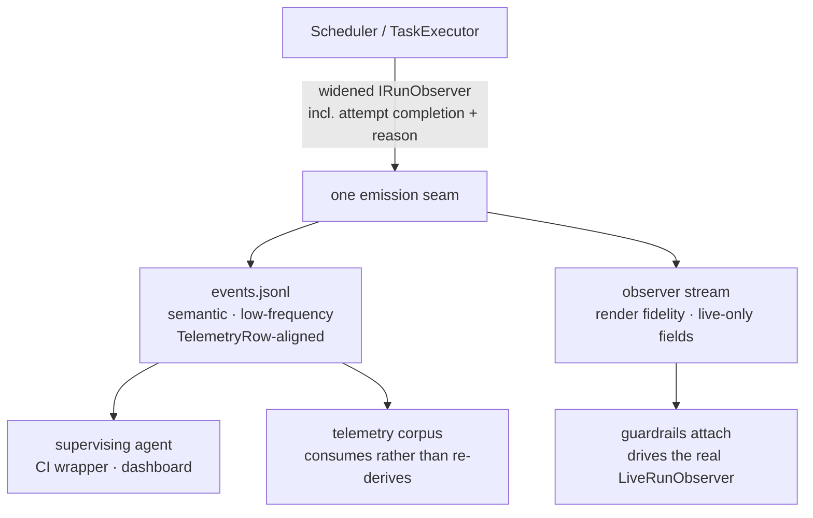

# 34 — A run's state, emitted once and consumed twice (#585, #560)

**Issues:** #585 (structured run event stream) and #560 (attach mode).
**Status:** charter draft, for human review before breakdown.
**Binds to:** `TelemetryRow` as it stands on master after plan 30 (#548) — this plan defines no
vocabulary of its own.

---

## 1. Why these two are one plan

They were raised separately, three weeks apart, from opposite ends of the product: #585 from an **agent**
supervising a run and getting it wrong, #560 from a **human** wanting to look in on one. The suggestion that
they share "the transport of delivery" is right that they belong together, but transport is the shallow
reading — two features writing JSONL into `logs/<run>/` is a coincidence of file format, not a reason to
merge plans.

The real reason is that **neither can be built well without the same missing piece**, and building it twice
guarantees the two copies diverge.

:::note
This plan does not decide *which* observability surface matters more. It asserts only that the seam beneath
both is one seam, and that whoever cuts it should cut it once.
:::

## 2. The finding that binds them: there is no attempt-completion event

`IRunObserver` (`src/Guardrails.Core/Execution/IRunObserver.cs`) is the run's state seam. It has three
attempt-scoped members:

| Member | Fires |
|---|---|
| `AttemptStarting(task, attempt, budget)` | before the attempt runs |
| `AttemptModelResolved(task, attempt, model, requestedModel)` | at route resolution |
| `AttemptRouteResolved(...)` | at route resolution |

**There is no member for an attempt finishing.** The next thing an observer hears is `TaskFinished(TaskResult)`
— after the whole retry loop is over.

That is precisely the gap #585 was written about. Its motivating complaint is that `[retry] 01-…: attempt 2/3`
is not actionable, because the supervisor still has to open `feedback.md` to learn whether the cause was
`max_turns` (the harness already escalated the budget — **let it run**) or a guardrail failure that will
repeat (**stop and fix**). Those demand opposite responses, and the issue calls the `reason` field *"not
optional… the whole point of the layer."*

`[retry] … attempt 2/3` is `AttemptStarting`. **The uninformative notification is uninformative because the
informative event does not exist.**

:::warn
This is the load-bearing consequence for #560. Its recommended design is *"the run writes every
`IRunObserver` call as a line to an append-only `observer.jsonl`."* Serializing every call on today's
interface produces a stream that **cannot answer #585's motivating question** — the failure reason is not on
the seam being serialized. Built in that order, #560 ships a stream #585 then has to widen, and the widening
touches every event already written.
:::

## 3. The second shared hazard: this interface silently swallows new events

`IRunObserver` members are default-implemented, so **a decorator that does not forward a member explicitly
inherits the empty body and swallows the event in every mode.** The interface's own documentation names this
trap four separate times, each time as a defect that already happened:

- `VerifierAdvisoryFound` — the original
- `AttemptModelResolved` — *"the identical trap"*
- `WaveGateFinished` — *"a decorator that does not declare it inherits the empty body and swallows the event"*
- `WaveBreakdownStarting` — *"or the phase goes silent again in every mode"*

The remedy is already established: assert forwarding **on the decorators themselves**, not only on the
renderer.

#560's publisher is another decorator. A publisher that silently drops events produces exactly the failure
#585 exists to remove — a consumer that cannot distinguish *"nothing happened"* from *"I am not being told."*
One plan gates this once, against one new member set. Two plans re-litigate it, and the odds that both get it
right are worse than the odds that one does.

## 4. The vocabulary is already settled — do not fork it

#585 is explicit: *"Do NOT invent a second vocabulary… #570's Phase A already owns that schema; this should
extend it, not fork it."* When the issue was written that schema was still in flight. It no longer is —
plan 30 ran green and `TelemetryRow` on master now carries:

```
SchemaVersion RunId TaskId Attempt StartedAt EndedAt Outcome
Model Runner Kind Tier TierSource Effort CostUsd InputTokens OutputTokens Repo
Bucket ModelDigest Turns ActionMs GuardrailMs RouteWarm Host Os
```

So the constraint has a concrete target: **an event and its eventual telemetry row must agree field-for-field
on everything they share.** The event stream is that row emitted *live* rather than at settle.

:::note
This also resolves the risk of chartering these before plan 30: there is nothing left to race. The schema
exists, it is on master, and this plan cites it rather than proposing one.
:::

## 5. The shape: one emission seam, two projections

The refinement this plan argues for, against the simpler reading that the two features share one file.

:::diagram

:::

**Why not one physical stream.** The two consumers need different things, and forcing one file serves one of
them badly:

:::comparison
| | Single stream | One seam, two projections |
|---|---|---|
| Agent consumer | gets render ticks it must filter — reintroducing filtering, the thing #585 removes | reads semantic events only |
| Renderer consumer | starved unless live-only fields (elapsed, current guardrail, cost ticking) are added to every row | keeps the fidelity #560 requires |
| Telemetry | must skip presentation rows | consumes `events.jsonl` directly |
| Drift risk | one schema pulled in two directions | one **seam**; projections cannot disagree about what happened |
:::

#560's own argument for fidelity — *"a second table that renders the same data will drift from the first"* —
is the same argument applied one layer down. The thing that must not be duplicated is the **emission**, not
the file.

## 6. Scope

**In:**

- Widen `IRunObserver` with attempt completion carrying a closed-set `reason`
  (`max_turns` · `guardrail_failed` · `write_scope_violation` · `needs_human` · `state_rejected` ·
  `action_error` · `cancelled`), plus decorator-forwarding assertions for every new member.
- `logs/<run>/events.jsonl` — durable, append-only, field-aligned with `TelemetryRow`.
- The observer projection and `guardrails attach`, driving the **real** `LiveRunObserver`.
- The acceptance #560 states: a run started `--no-ui`, backgrounded, output redirected, attachable from a
  second terminal, twice concurrently, neither watcher perturbing the run.

**Out, and where each one lives:**

- **`--on-event <url>` webhooks** — #585 layer 3. Delivery-failure, retry and ordering semantics that layers
  1 and 2 do not have. Stays in **#585**, which remains open for it.
- **Interactivity from the attached view** (pause/cancel), authentication, remote attach over anything but a
  shared filesystem — explicitly out of scope in **#560**, which remains open for it.
- **`guardrails status --watch`** — #560 calls it a stopgap worth ~60% of the value. Only if it falls out
  cheaply; it is not the deliverable.

## 7. Decisions for the reviewer

:::question
{ "id": "stream-shape", "title": "One physical stream, or one emission seam with two projections?",
  "mode": "single",
  "options": ["One seam, two projections (events.jsonl + observer stream)", "One combined stream both consumers filter", "Two fully independent streams with no shared seam"],
  "recommended": "One seam, two projections (events.jsonl + observer stream)",
  "rationale": "The consumers have genuinely different fidelity needs: an agent wants semantic low-frequency events with a reason field, a renderer wants live-only fields like elapsed time and the currently-executing guardrail. A single stream serves one of them badly. Two independent streams reintroduce the drift both issues warn about. Sharing the emission point while projecting twice keeps them unable to disagree about what happened.",
  "target": "human", "answer": ["One seam, two projections (events.jsonl \u002B observer stream)"] }
:::

:::question
{ "id": "attempt-seam", "title": "Where does the attempt-completion event come from?",
  "mode": "single",
  "options": ["Widen IRunObserver with a new attempt-completion member", "Add a separate publisher tap that does not touch IRunObserver", "Derive it after the fact from the journal"],
  "recommended": "Widen IRunObserver with a new attempt-completion member",
  "rationale": "IRunObserver is already the run's state seam and already has the decorator-forwarding test pattern this needs. A separate tap would be a second place run state is published, which is the divergence this plan exists to prevent. Deriving from the journal loses the liveness that is the entire point.",
  "target": "human", "answer": ["Widen IRunObserver with a new attempt-completion member"] }
:::

:::question
{ "id": "v1-scope", "title": "Does v1 include the SSE/WebSocket endpoint, or stop at the durable file?",
  "mode": "single",
  "options": ["File plus the /events endpoint on the existing log server", "File only — endpoint follows in a second pass", "File plus endpoint plus webhooks"],
  "recommended": "File plus the /events endpoint on the existing log server",
  "rationale": "#585 argues layer 2 matters most for our own use, because the agent-side monitor takes a ws: source natively and that removes grep from the path entirely rather than mitigating it. The log server already runs headless since #552, so /events is an addition to something that exists rather than new infrastructure. Webhooks are excluded because they add delivery, retry and ordering semantics that should wait until the vocabulary has been used in anger.",
  "target": "human", "answer": ["File plus the /events endpoint on the existing log server"] }
:::

:::question
{ "id": "roadmap-slot", "title": "Where does this sit against the Mac Studio roadmap in #570?",
  "mode": "single",
  "options": ["Interleave — build it alongside Phase B bring-up fixes", "Preempt — do it before Phase B", "Defer until after the October hardware work"],
  "recommended": "Interleave — build it alongside Phase B bring-up fixes",
  "rationale": "This is not on #570's Phase A to D critical path, so it is additional scope before October and worth saying so plainly. But its motivating evidence is a supervising agent silently losing track of an unattended run, and long unattended runs are exactly what the Mac Studio arc depends on. Phase B is already a set of small bring-up fixes including #517 and #515, which touch adjacent surfaces.",
  "target": "human", "answer": ["Interleave \u2014 build it alongside Phase B bring-up fixes"] }
:::

:::question
{ "id": "status-watch", "title": "Is `guardrails status --watch` in this plan at all?",
  "mode": "single",
  "options": ["Only if it falls out cheaply from the projection work", "Yes — ship it as an explicit deliverable", "No — leave it in #560 as a separate stopgap"],
  "recommended": "Only if it falls out cheaply from the projection work",
  "rationale": "#560 prices it honestly at about 60 percent of the value and calls it a snapshot-refresher rather than attach. Once the observer projection exists the real table is available, which makes a journal-polling table redundant rather than complementary. Worth taking only if it is nearly free.",
  "target": "human", "answer": ["Only if it falls out cheaply from the projection work"] }
:::
