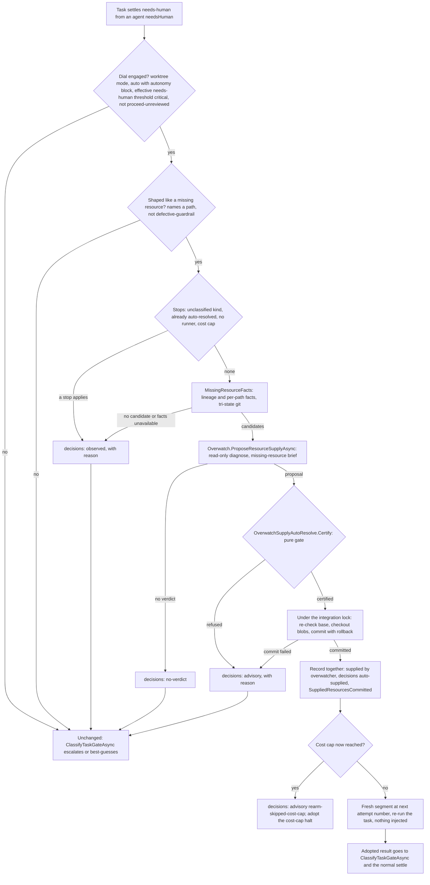

# 41 — Wiring the overwatcher's missing-resource auto-resolve

Design of record for **issue #712**. Status: **REVIEWED — the four review decisions are recorded below.**
Nothing here is built yet.

This design wires a decision that is already made. Design 40 §3 (`40-in-flight-resource-supply.md`, DECIDED
in review as `d40-overwatcher-autoresolve`) says: *the overwatcher MAY auto-resolve a missing-resource halt,
but ONLY at `dial:critical`, and an auto-resolve MUST write the §4 provenance record naming the overwatcher
as the supplier.* Plan 40 shipped that decision as a function nothing calls. This document specifies the
part design 40 never named: what proposes, what certifies, what acts, where the commit lands, and which test
proves the real path. It does not reopen whether to wire it. You decided that before the next release.

The draft was attacked by a separate adversarial reviewer before this version. §10 lists what that review
changed.

**Four decisions were taken in review, and this document is written on them.** Each is folded into the prose
where it applies, and each question block below carries its answer:

- **`d41-supply-source`** — the file comes from the operator's checkout, as committed at the checkout's
  `HEAD` and unmodified in the working tree (§2).
- **`d41-candidate-scope`** — a path qualifies only when no other task in the plan may produce it: every
  other task declares a `writeScope`, and none covers it (§2.2).
- **`d41-below-critical`** — below `dial:critical` the overwatcher is not consulted about this halt at all;
  the deterministic halt text is the proposal (§3.2).
- **`d41-terminal-gate-names-supply`** — the terminal gate halt names supplied and refreshed content, in this
  change (§6).

The decisions settle the design, not the implementation. §11 hands the work off, and none of it is written.

---

## What's being asked

A task halts `needs-human` because a file it needs is not on the run's base. That is design 40's measured
case: `vendor/mermaid.min.js` was committed to `master`, but the run's integration branch had been cut
earlier. At `dial:critical`, the overwatcher should be able to put the file on the run's base and re-run the
task, without a human running `supply`, `reset` and `run`.

Three things are missing today. Nothing lets the overwatcher propose that fix. No deterministic gate exists
that the proposal must pass. Nothing acts on a certified fix.

**The ambiguity, named and settled.** Design 40 §3 describes the judgement as *"deciding that the file in the
operator's checkout is the file the task should have."* Plan 40's code, its tests and #712 all read it as
*"matching an already-staged file to the halted task."* Those are two different features, and at
`dial:critical` nobody is watching, so the staged-only reading would almost never fire.
**DECIDED (review, `d41-supply-source`): the source is the operator's checkout — the file as committed at the
checkout's `HEAD`, unmodified in the working tree.** The staging tree stays the operator's own channel, and
this document is written on that decision throughout.

---

## What the code does today (as of `fed690f2`)

Each fact below was read from the code. The ones marked **new** are not in #712.

1. **Nothing reaches `OverwatchSupplyAutoResolve.Resolve`** (`OverwatchDecision.cs:102-152`). The
   overwatcher's fix vocabulary (`Overwatch.cs:583-584`) lists `guidance`, `budget`, `file-edit` and
   `task-field`. `OverwatchProposal.ParseFix` has no case for a resource supply, and nothing consumes
   `OverwatchDecisionKind.AutoResolve`. This confirms #712.
2. **New: the overwatcher is never consulted on this halt, by contract.** The missing-resource halt is an
   agent-emitted `needsHuman`: the agent refused to stub the file and asked. SSOT §9.2 and design 11 §4 both
   say the overwatcher *"does NOT fire when the agent itself emitted `needsHuman`."* `TaskExecutor` returns
   that result at once (`TaskExecutor.cs:351-369`). It consults the overwatcher only for a permission wall.
   So a fix-vocabulary entry alone would still be unreachable. Wiring needs a new consult point, and #712
   does not mention one.
3. **New: at `dial:critical` today, this halt goes to the autonomy layer.** `Scheduler.ClassifyTaskGateAsync`
   (`Scheduler.cs:4159`) classifies it as a judgment call (`GateClassifier.cs:188`). The `CriticalityJudge`
   then escalates or proceeds on a best guess, and a best guess is re-driven by the #550 path
   (`Scheduler.cs:4550`). #709's false alarm travelled that route.
4. **New: `Resolve` drains the whole staging tree, not the proposed file.** `SuppliedDrain.Drain` takes no
   path (`SuppliedDrain.cs:28`), so `resourceSupply.TargetPath` is ignored. Any file an operator had staged
   would be committed as `Supplied-By: overwatcher`. That is false provenance, in the opposite direction
   from #712's second defect.
5. **`Resolve` drains onto `plan.Workspace`**, which in worktree mode is the user's checkout. This confirms
   #712's second defect.
6. **New: `Resolve` never re-arms and never announces.** It raises no `SuppliedResourcesCommitted`. At
   `critical` with nothing staged, it returns text that begins *"Below dial:critical the overwatcher only
   proposes..."*, which is wrong at that dial.
7. **New: the run-start drain is silent.** `RunCommand.cs:487-503` writes `supplied[]` but raises no
   `SuppliedResourcesCommitted`. The measured case's drain therefore prints nothing to the console or the
   live table, and writes nothing to `events.jsonl`. That contradicts design 40 §2 step 3 and SSOT §8.1. The
   `IRunObserver` doc comment has it backwards: it names the run-start drain as the *only* place the event
   fires, but the task boundary is the only place it actually fires.
8. **New: every shipped drain hard-codes `by: "operator"`** (`Scheduler.cs:4890` and `:4922`,
   `RunCommand.cs:488` and `:501`). That includes a file staged by a task-invoked `guardrails supply`,
   design 40 §5a's JIT case. Nothing ever writes `task:<folder>`.
9. **New: only wave gate halts name supplied content.** `UnauthoredContentNote` is applied in
   `Scheduler.BuildGateHalt` (`Scheduler.cs:2992`), which builds wave entry and exit gate halts. The
   terminal gate halt (`PlanGuardrailPhase.cs:169-179`) does not name `supplied[]`. #712 says gate halts
   will name every `supplied[]` record, but on a flat plan none does. See `d41-terminal-gate-names-supply`
   (§6).
10. **The two stale doc comments #712 lists are real, and they have moved.** They are now at
    `IRunObserver.cs:358-378` and `JournalModel.cs:71-86`. **New:** a third of the same kind sits beside the
    second, at `JournalModel.cs:88-106`: `Refreshed` still calls itself *"the STUB half of task 24"*.
11. **New: the delivery interlock is spelled twice.** `RunOutcomePolicy.SuppressingDecision`
    (`RunOutcomePolicy.cs:56-59`, used at run end, `Scheduler.cs:1187`) and `SuppressingDecisionForDelivery`
    (`:82-87`, used at every wave barrier, `Scheduler.cs:3085`) each list the suppressing tokens separately.
    A new suppressing token added to only one of them leaks machine-decided work onto the user's branch at a
    wave barrier.

> **Warning:** Facts 2, 4, 7, 8 and 11 mean more than #712 describes:
>
> - Wiring `Resolve` as written would still leave the halt unreachable (fact 2).
> - It would commit operator-staged files under the overwatcher's name (fact 4).
> - The provenance promise is already broken twice elsewhere (facts 7 and 8).
> - The interlock this design relies on can leak through one of its two spellings (fact 11).
>
> This design fixes facts 1–6, 9 (pending your answer), 10 and 11. It names facts 7 and 8 as separate issues,
> because they concern the operator's own supply path.

---

## Placement

- **Harness** (`Guardrails.Core`): the overwatcher, the proposal parser, a pure certification gate, the
  Scheduler consumer, one commit primitive in `SuppliedDrain`, and a single owner for the delivery-interlock
  token set and for the effective gate threshold.
- **Harness** (`Guardrails.Cli`): `RunCommand` shares the halt predicate and updates its interlock wording,
  the observers render `by`, and (depending on `d41-terminal-gate-names-supply`) the terminal gate halt
  changes.
- **Schema**: SSOT §1, §2.1, §5.3, §7, §8, §8.1 and a new §9.2.2. The edits are in §12.
- **Skill**: `guardrails-domain-knowledge`. An agent has to know that naming the exact path is what makes
  this fire.
- **v1, not a v2 bet.** Roadmap bet #6 is overwatcher auto-heal of *authoring defects* plus inter-wave
  adjustment. This is narrower: one fix kind, at one gate, at one dial. It is the first overwatcher action
  that writes onto the run's base, and is recorded as such so it is not read as bet #6 landing.
- **No new diagnostic codes.**

---

## Invariants in play

**1 — Deterministic guardrails over prompt-judges; judges never alone.** The design follows the standing
rule literally: *a prompt may propose; only a deterministic gate may certify.* The model contributes one
judgement, whether the halt is about a given candidate file, and that judgement cannot be checked. It is
bounded instead:

- the harness computes every fact about the file itself (§2.2), including two facts that prove a lineage gap
  rather than a mere absence;
- the re-armed task's own guardrails decide the result;
- delivery stays off until a human delivers (§6).

**2 — The harness is the single writer of merged state.** The overwatcher keeps its read-only tool profile
(Read, Glob, Grep). The Scheduler makes the commit, under the same integration lock that serializes every
other commit onto the plan branch. The commit goes onto the integration worktree, never the user's checkout.

**5 — Honest halts.** A refusal changes nothing: the halt continues down today's autonomy path. At the dial
that promised an auto-resolve, every reason it did not happen is recorded (§2.1, §6). #712 was a silent
capability, and this must not become another.

**Never-weaker.** Nothing changes for a run below `critical`, a serial run, or a run with no missing-resource
halt. The one visible exception is that the `[supplied]` line gains a `by` field.

**Standing rulings.**

- **`dial:critical` with `proceed-unreviewed` is forbidden.** GR2040 (the load-time error for
  `proceed-unreviewed` combined with a reachable `critical` threshold) already rejects that config, and
  re-checks it after the CLI flags are applied. Certification refuses it again at runtime anyway.
- **Never forge a review attestation.** The auto-resolve touches no guardrail, preflight, `task.json` or
  review marker. Paths under the plan folder or `.claude/` are never candidates, so `PlanDefinitionHash` and
  every prompt task's tool environment stay unchanged.
- **No dead code.** `Resolve`'s staged-tree drain, `ProposedSequenceFor`, `OverwatchDecisionKind.AutoResolve`
  and `OverwatchDecision.AutoResolvedPaths` are deleted (§3.4).

---

## 1. The pipeline



Everything happens in `Scheduler.OnSettledAsync`, between the green settle and the existing classify-then-act
dispatch. Steps up to and including certification run *outside* the integration lock. The diagnose can take
minutes, and other tasks' settles must not wait on it. Every step up to the commit is wrapped the way the
#550 re-drive is wrapped (`Scheduler.cs:4563-4573`), so a thrown git call or runner never faults the run.

---

## 2. Proposal — how the overwatcher proposes a resource supply

### 2.1 When it is consulted, and when it says why not

The harness decides, never the model, in three tiers. None of them costs anything.

**Tier 0: is the dial engaged?** If not, there is no record, because nothing was promised.

- The run is in worktree mode with a live integration handle (`context.Integ`), and the journal is the real
  `RunJournal`.
- `autonomyPolicy` is `auto` and an `autonomy` block is present.
- The **effective `needs-human` threshold** is `critical`. It is computed by one shared rule,
  `GateThreshold.Effective(autonomy, CriticalityGate.NeedsHuman)`: `gateThresholds.needs-human` if set,
  else `escalationThreshold`. Today that rule is spelled twice, in `CriticalityJudge.EffectiveThreshold` and
  `Scheduler.EffectiveThresholdToken` (`Scheduler.cs:4464-4479`). Both are replaced by the shared rule.
- `gateThresholds.review-gate` is not `proceed-unreviewed`.

**Tier 1: is the halt shaped like a missing resource?** If not, there is no record: it is an ordinary design
question.

- The task settled `NeedsHuman` with a non-empty `NeedsHumanQuestion`.
- The question names at least one workspace path (`MissingResourceSignal`).
- Its `kind` is not `defective-guardrail`.

**Tier 2: stops.** Each is recorded as one `observed` decision with its reason token.

| stop | reason token |
|---|---|
| the agent gave no `kind` (the free-text `{"needsHuman": "..."}` form) | `unclassified-kind` |
| `decisions[]` already holds an `auto-supplied` entry for this task in this run's journal (durable, so it survives a resume) | `already-auto-resolved` |
| no `overwatch`-capable runner resolved | `no-runner` |
| `maxCostUsd` already reached | `cost-cap` |
| a git fact could not be determined (§2.2) | `facts-unavailable` |
| every named path failed a §2.2 check | one reason per path, e.g. `vendor/x.js present-on-run-base` |

**One predicate for "names a path."** The path-token match currently lives inside
`RunCommand.MissingResourceHaltLines` (`RunCommand.cs:3339-3340`). It moves to `Guardrails.Core` as
`MissingResourceSignal`, and both the halt text and this consult use it. It changes in three ways:

- it returns *every* token in the question, not only the first;
- a segment may contain `@`, so `node_modules/@scope/x/index.js` is matched whole;
- a leading `./` is normalized away, so a root-level file is named `./mermaid.min.js`.

The token still needs a `/` somewhere, so prose like `e.g.` or `Node.js` never matches. The domain-knowledge
skill tells agents to use the `./` form (§12).

Serial mode is excluded at tier 0 by construction: its run base *is* the checkout, so there is no lineage
gap.

### 2.2 The facts the harness computes first

Every git call is **tri-state**: present, absent, or error. An error, such as exit 128 for dubious
ownership, is never read as absent. It stops the whole consult with `facts-unavailable`.

**Run-level lineage facts.** These are checked once. If either fails, every path fails with that reason.

| fact | how | reason if it fails |
|---|---|---|
| the checkout is still on the branch the run started from | `git rev-parse --abbrev-ref HEAD` in `plan.Workspace` equals `integ.OriginalBranch` | `checkout-not-on-run-branch` |
| the checkout has not left the run's starting history | `git merge-base --is-ancestor <integ.OriginalHeadSha> <checkout HEAD>` | `checkout-diverged` |

**Per-path facts.** These are checked in order, and the first one that fails names the reason.

| # | fact | how | reason if it fails |
|---|---|---|---|
| 1 | stays inside the workspace | `WorkspaceContainment.Escapes` (GR2019's path-traversal rule for `writeScope`) | `escapes-workspace` |
| 2 | not a protected path | not under `.claude/`, `.guardrails-staging/` or `.guardrails-agent-io/`, and no top-level segment starting `.git` | `protected-path` |
| 3 | not under the plan folder | path containment against `plan.PlanDirectory` | `under-plan-folder` |
| 4 | no other task in the plan is meant to produce it (**DECIDED**, `d41-candidate-scope`) | every *other* task declares a `writeScope`, and none covers the path (`WriteScope.IsInScope`) | `plan-scope-incomplete` / `produced-by-another-task` |
| 5 | absent from the run's base | no object at `HEAD:<path>` in the integration worktree | `present-on-run-base` |
| 6 | no case-only twin on the run's base | no case-insensitive match in `git ls-tree -r --name-only HEAD` of the integration worktree | `case-collision` |
| 7 | the run did not delete it | `git log --diff-filter=D --format=%H <merge-base of integration HEAD and checkout HEAD>..HEAD -- <path>` is empty | `deleted-on-run-base` |
| 8 | committed in the operator's checkout | an object exists at `<checkout HEAD sha>:<path>` | `not-committed-in-checkout` |
| 9 | that object is a file | `git cat-file -t` is `blob` | `not-a-blob` |
| 10 | unmodified in the checkout's working tree | `git diff --quiet HEAD -- <path>` exits 0 | `modified-in-checkout` |

**Why the lineage facts.** "Absent from the base" alone is not a lineage gap. Facts 7 and the run-level
checks are what turn it into one:

- a file this run deliberately removed is not resurrected (fact 7);
- a checkout that moved to an unrelated branch cannot be a source (the run-level checks).

**Why check 4 is "no *other* task."** It makes the file an input that comes from outside the plan, and it
closes the race with a sibling task that is meant to author the file. The halted task's own scope is
deliberately not required, because a task that *embeds* a vendored bundle declares the HTML it writes, not
the bundle. **DECIDED (review, `d41-candidate-scope`).** The alternatives the review weighed are recorded in
the question block below.

A task not yet authored, in a JIT wave, cannot be consulted. If a later task does produce the path, it
simply overwrites the file within its own scope.

The paths that pass every check are the **candidates**, and each carries the checkout `HEAD` sha it was read
at. **No candidates means no consult and no spend**, and an `observed` entry lists each path with its reason.

**Q: Which ownership rule must a candidate path pass?** — Answered: No other task in the plan may produce it: every other task declares a writeScope and none covers the path
_Question — id: `d41-candidate-scope`; mode: `single`; target: `human`; options: `No other task in the plan may produce it: every other task declares a writeScope and none covers the path`, `The halted task's own writeScope must cover it, as design 40 section 5a requires of a task-invoked supply`, `Both: inside the halted task's writeScope, and no other task covers it`, `No task in the plan, including the halted one, may produce it`; recommended: `No other task in the plan may produce it: every other task declares a writeScope and none covers the path`_
_Why: My first draft required the halted task's own writeScope, by analogy with design 40 section 5a. The adversarial review showed that probably misses the case this exists for. Section 5a was written about an agent authoring a script it then needs; a task that embeds a vendored bundle declares the HTML it writes, not the bundle, so option 2 refuses it. It also fails open: a task with a broad scope like ** makes the check meaningless. Option 1 instead asks whether the file is an input from outside the plan. It fires whether or not the halted task owns the path, refuses when a sibling task is meant to author the file (which also removes a race), and fails closed when any other task is unscoped. The other facts are what keep it safe: the file must be committed on the branch the run started from, absent from the base, and not deleted by the run. Option 3 is the most conservative and the least likely to fire. Option 4 refuses a vendoring task that owns its own bundle, which may well have been the measured incident's task._

### 2.3 The brief and the fix vocabulary

A new method, `Overwatch.ProposeResourceSupplyAsync`, runs one diagnose with the new trigger
`OverwatchTrigger.MissingResource` (token `missing-resource`). It reuses everything the §9.2 diagnose already
gets right:

- the read-only tool profile;
- the abort after three consecutive tool denials;
- the overhead cost charge made *before* parsing;
- no-verdict recording;
- working directory `plan.Workspace`, so the model can Read the candidate file and judge whether it is a
  real bundle or a placeholder.

**The brief's first line is pinned:**
`# Overwatch resource supply: task '<id>' (attempt <n>, trigger: missing-resource)`. It is distinct from
`# Overwatch diagnose:` (`Overwatch.cs:560`) and `# Criticality assessment:` (`CriticalityJudge.cs:362`).
Both share the `overwatch` runner profile, and the proof's fake runner routes on that line (§7).

**The brief puts harness facts first. This is #709's rule, applied from the start.** It states:

- the task id and description, and the agent's question verbatim, inside a delimited *untrusted* block;
- the attempt history table, from the existing renderer;
- the candidate table: path, "absent at run base `<sha10>`", "committed at checkout `HEAD` `<sha10>` on
  branch `<branch>`", and "no other task produces it";
- this instruction: *"These facts were verified by the harness. Do not assert anything about files, tests,
  other tasks or plan-level gates beyond them. Nothing you write reaches the task's next attempt."*

**The vocabulary is offered only in this brief.** The generic diagnose brief is unchanged:

```json
{"classification": "retryable|doomed",
 "diagnosis": "<one paragraph: why supplying these files resolves the task's question>",
 "fixes": [{"kind": "resource-supply", "path": "<a path from the candidate table>"}]}
```

The brief also tells the model to propose no fix when the question is not asking for a missing file that
these candidates satisfy.

**What evidence the model must cite: none that the gate trusts.** It must name a candidate path and explain
itself in `diagnosis`, and that explanation is recorded as its *unverified* claim. My first draft required a
verbatim quote from the question and called that check a certification step. It was a tautology: candidates
are themselves tokens taken from the question, so a quote equal to the path always passes. The honest
statement is that the semantic judgement cannot be checked. The facts in §2.2, the task's guardrails and the
delivery interlock bound it. No check pretends to verify it.

### 2.4 Parsing

`OverwatchProposal.ParseFix` gains a `resource-supply` case, and an op without a non-blank `path` is dropped
by the existing advisory-never-gates rule.

`OverwatchFixClassifier` does not change. A `ResourceSupply` op already falls to `Default` (propose-only), so
if one appears in an eager or short-circuit diagnose, it is recorded and never applied. There is no consumer
on that path. `Overwatch.FixKindToken` maps it to `resource-supply` instead of today's `unknown`.

### 2.5 Zero, one, or several candidates, and a non-candidate path

- **Zero:** no consult, as in §2.2.
- **One:** consult. It is supplied only if the model proposes it and certification passes.
- **Several:** all go in the table, and the model may propose any subset. **All proposed ops must certify or
  nothing is supplied.** A partial supply would re-arm a task that then halts again, and would spend money
  doing it.
- **Any path not in the candidate table**, including one that fails check 4: certification refuses it as
  `not-a-candidate`. The model cannot introduce a path the facts did not establish.

**Q: Where may an overwatcher auto-resolve take the missing file from?** — Answered: The operator's checkout: the file as committed at the checkout's HEAD, unmodified in the working tree
_Question — id: `d41-supply-source`; mode: `single`; target: `human`; options: `The operator's checkout: the file as committed at the checkout's HEAD, unmodified in the working tree`, `Only a file the operator already staged with guardrails supply`, `Either: an operator-staged file first, else the committed file in the checkout`, `The operator's checkout working tree, committed or not`; recommended: `The operator's checkout: the file as committed at the checkout's HEAD, unmodified in the working tree`_
_Why: Design 40 section 3, and the question you answered in its review, framed the judgement as deciding that the file in your checkout is the file the task needs. The measured incident is exactly that case: vendor/mermaid.min.js was committed to master and never staged. Plan 40's code, its tests and #712 narrowed it to a file already staged with guardrails supply. At dial:critical nobody is watching to run supply before the halt, and a file staged before the task started would already be on the base at the next task boundary. So a staged-only auto-resolve would almost never fire, which is #712's defect again: a capability that exists only in its tests. Reading the committed blob means a file mid-edit can never be supplied. The lineage facts refuse a checkout that has moved to another branch, and the source commit is recorded. Option 3 adds a second source and a second provenance case: an operator-staged file was chosen by the operator, so its record would have to say operator, not overwatcher. Option 4 would let an untracked scratch file onto the run's base._

---

## 3. Certification — the deterministic gate

### 3.1 The gate

`OverwatchSupplyAutoResolve.Resolve` is replaced by `OverwatchSupplyAutoResolve.Certify`. It is a **pure
function**: no git, no journal, no filesystem. Its inputs are the autonomy config, the policy, whether the
block is present, the candidate facts from §2.2 and the parsed proposal. It returns a `SupplyCertification`:
either **certified**, with a list of `(path, sourceCommit)`, or **refused**, with a reason token.

Checks, in order:

1. `policy == Auto`, the block is present, and `GateThreshold.Effective(autonomy, NeedsHuman) == Critical`.
   The Scheduler already checked this, but the gate owns the rule, so a future caller cannot skip it. Fails
   as `dial-not-critical`.
2. `review-gate` is not `proceed-unreviewed`. Fails as `proceed-unreviewed`.
3. A proposal exists and its classification is `retryable`. Fails as `doomed`.
4. It contains at least one `resource-supply` op. Fails as `no-resource-supply-op`.
5. Every proposed path, after `/` and `./` normalization, is a candidate. Fails as `not-a-candidate`.
6. No path is proposed twice. Fails as `duplicate-path`.

A pass certifies every proposed op, each paired with its candidate's source sha.

**The real-path proof exercises the refusals** (C3, C5 and C6 in §7), not only the unit tests. A wiring that
checked "any `resource-supply` op" and never called `Certify` is exactly the #712 shape again.

**The last check runs later, in the Scheduler, under the integration lock and just before the commit** (§4):
is every certified path still absent from the integration `HEAD`, with no case-only twin? It fails as
`run-base-changed`.

### 3.2 Dial conditions

Only tier 0 qualifies. `autonomyPolicy: prompt` and `halt` never qualify: the factory builds no escalation
machinery for them. Under `auto` without an `autonomy` block, the dial is inert, as doc 12 §3.2 requires. A
per-gate `needs-human: high` under a run-wide `critical` does **not** qualify, because the operator asked for
caution at exactly this gate (proof control C7).

**DECIDED (review, `d41-below-critical`): below `critical` the overwatcher is not consulted about a
missing-resource halt at all.** The halt text already prints the three copy-pasteable commands at every dial,
deterministically and with no model involved, so nothing is spent where nothing can be applied.

### 3.3 Interplay with the autonomy policy

The order inside `OnSettledAsync` becomes:

1. green settle (today);
2. the missing-resource auto-resolve (new);
3. `ClassifyTaskGateAsync` on the **adopted** result (today);
4. the #550 best-guess re-drive, on the **adopted** handle (today).

- **Certified and committed:** the original halt never reaches the classify-then-act dispatch, and the
  `CriticalityJudge` is not consulted about it. The gate has been resolved by an action, so a best guess
  would be a second decision about a question that no longer applies.
- **Anything else:** the original halt goes to `ClassifyTaskGateAsync` exactly as it does today. That covers
  not engaged, not the right shape, stopped, no candidates, no verdict and refused. It is the never-weaker
  path.
- **A re-armed run that halts `needs-human` again** is classified normally, and it cannot re-enter the
  auto-resolve (`already-auto-resolved`).

The re-armed run gets **nothing injected**: no overwatcher guidance, no best-guess text. The only thing that
changed is that the file is now there. Keeping the model's words out of the next attempt is the #709 lesson.

### 3.4 What happens to the shipped pieces

- `Resolve` is replaced by `Certify`. Its staged-tree drain and its `plan.Workspace` target are deleted.
- `ProposedSequenceFor` is deleted per `d41-below-critical`: `RunCommand`'s halt text is the single producer
  of those three commands.
- **`OverwatchDecisionKind.AutoResolve` and `OverwatchDecision.AutoResolvedPaths` are deleted.**
  `OverwatchDecision` is the control-flow signal `TaskExecutor`'s retry loop reads, and the supply is a
  Scheduler action that never passes through that loop. So the answer to "which component acts on
  `AutoResolve`" is: none should. `Scheduler.OnSettledAsync` acts on a `SupplyCertification`. The only
  references to either member are in `OverwatchDecision.cs` and `OverwatchSupplyAutoResolveTests.cs`.
- The nine tests in `OverwatchSupplyAutoResolveTests` are rewritten against `Certify`: one row per refusal
  token, plus the certified row. Their current premise, a staged file committed onto `plan.Workspace`, is the
  defect.

**Q: Below dial:critical, is the overwatcher consulted about a missing-resource halt at all?** — Answered: No: the deterministic halt text already proposes the three commands, so no diagnose is spent
_Question — id: `d41-below-critical`; mode: `single`; target: `human`; options: `No: the deterministic halt text already proposes the three commands, so no diagnose is spent`, `Yes: consult it at every dial and append its diagnosis to the halt, never acting on it`; recommended: `No: the deterministic halt text already proposes the three commands, so no diagnose is spent`_
_Why: Design 40 section 3 says that below critical the overwatcher proposes the supply, reset and run sequence and does not run it. Plan 40 task 25 then delivered that proposal deterministically: every blocked-work halt that names a path already prints the three copy-pasteable commands, at every dial, with no model involved. The shipped Resolve builds a second copy of the same three lines (ProposedSequenceFor) that no production path reaches. Answering No keeps one producer for one message, and spends nothing where nothing can be applied. It changes the wording of a DECIDED sentence (who proposes) but not its substance, which is why I am asking rather than assuming. Answering Yes buys a model-written diagnosis on a halt a human will read, and #709 is the cautionary case for that text reaching a human as if it were verified._

---

## 4. Consumer and re-arm

**The consumer is `Scheduler.OnSettledAsync`,** through a private
`TryAutoResolveMissingResourceAsync(context, task, result, handle, ct)` that returns the adopted result and
handle, or nothing. The Scheduler owns the seam because it owns the integration lock, the handles, the DAG
and the blocking of dependents.

**Composition.** `SchedulerFactory.Create` builds **one** `Overwatch` and hands the same instance to both
`TaskExecutor` and the Scheduler, through a new optional constructor parameter. The public
`CreateExecutor(plan, processRunner, probe, observer, interaction)` keeps its signature and tuple, which
`Revalidate.cs:113` deconstructs. It delegates to an internal overload that accepts a prebuilt `Overwatch`.

Steps:

1. **Tiers 0–2** (§2.1). An `observed` record is written where a stop applies.
2. **Facts** (§2.2), via `MissingResourceFacts`. No candidates, or `facts-unavailable`, means `observed`.
3. **Propose** (§2.3). A no-verdict is recorded by the existing path.
4. **Certify** (§3.1). A refusal is recorded as `advisory`.
5. **Commit, under `_integrationLock`:**
   - re-check every certified path against the integration `HEAD` (`run-base-changed`);
   - `git checkout <sourceCommit> -- <paths>` in the integration worktree, which shares the checkout's object
     database. That writes the exact blob and file mode, with no filter or line-ending re-application;
   - commit through `SuppliedDrain.CommitPaths` (§5). On failure it restores the pre-commit `HEAD`, the
     consult records `advisory` with `commit-failed`, and the original halt stands.
6. **Record, still under the lock and before any further fallible step:**
   - `RecordSupplied { by: "overwatcher" }`;
   - the `auto-supplied` decision, with its source sha, raised through `DecisionRecorded`;
   - `SuppliedResourcesCommitted(paths, commit, "overwatcher")`.

   Writing the decision here is what keeps delivery suppressed however the re-arm below ends.
7. **Cost cap.** If `CostCapHaltFor(task)` now returns a halt, because the diagnose spend may have crossed
   it, record `advisory` with `rearm-skipped-cost-cap` and adopt that cost-cap result. The re-arm would
   otherwise start a fresh `1 + retries` budget past the cap.
8. **Re-arm:**
   - `_worktreeProvider.CreateSegment(task.Id, runJournal.NextAttemptNumber(task.Id), integ, ct)`, under the
     lock, roots at a plan-branch tip that contains the commit. The attempt number matters:
     `CreateSegment` names its branch and path `attempt-<n>`, and a root task's original segment is already
     `attempt-1`;
   - register `context.Handles[task.Id]` and its directory ownership under `_gate`. That registration is
     load-bearing, because dependents inherit through it (`Scheduler.cs:5156-5157`);
   - leave the old segment owned, so the end-of-run sweep reclaims it (the fix-don't-restart rule);
   - release the lock, then run `_executor.ExecuteAsync(task, rearmedHandle, ct)`;
   - send a green result through `SettleGreenIfWorktreeAsync`, the same settle every green result takes.
9. **Adopt the re-armed result whatever its outcome.** This is deliberately unlike #550, which adopts only a
   green re-drive. A best guess is a speculative re-run on an unchanged base, so keeping the original halt
   was honest there. Here the base did change, and "the file is missing" is now false. `Summary` is left
   untouched, because it carries the question back to the Scheduler through its `needs human: ` prefix.

**Failures after the commit.** If `CreateSegment` or the re-armed run throws (anything but cancellation), the
harness records `advisory` with `rearm-failed` and reports through `CleanupFailed`. The original halt stands.
The commit, its `supplied[]` record and its `auto-supplied` decision all remain, because they are true. A
later `reset` plus `run` sees the file, and delivery stays suppressed.

"Re-armed" is visible in `run.json`. The task's attempts continue: a `needs-human` attempt N, then attempts
N+1 onward on the fresh segment. The status becomes `succeeded` when the re-armed run passes its guardrails.
Dependents are blocked only if the adopted result is non-green.

---

## 5. Drain target and provenance

- **Target:** `context.Integ.IntegrationWorktreePath`, which is checked out on `guardrails/<plan>`. It is the
  same worktree `DrainSuppliedAtTaskBoundary` commits to, and the same one `PlanPhaseWorkspace.Resolve`
  returns at run start. It is **never `plan.Workspace`**. The commit is on the plan branch by construction,
  and it reaches the user's branch only through delivery, which this commit suppresses (§6).
- **Mechanism:** `SuppliedDrain` gains `CommitPaths(workspace, runId, by, paths)`. It captures the pre-commit
  `HEAD`, runs `git add -- <paths>`, then `git commit --no-verify -m <trailers> -- <paths>`.
  - The explicit pathspec means nothing else left in the index can ride along. Today's `Drain` commits
    without a pathspec.
  - On any failure it runs `git reset --hard <preHead>`, so no partly staged file can be picked up by a later
    drain under someone else's name.
  - `Drain` is refactored to copy the staged files, then call `CommitPaths`. The operator path gains the same
    protection.
- **The auto-resolve never reads or deletes `logs/<runId>/supplied/`.** Files an operator staged stay staged,
  and drain later under `by: "operator"`, so an operator's file can never be committed under the
  overwatcher's name.
- **Commit message:** `Supplied-By: overwatcher` and `Guardrails-Run: <runId>`. The trailer contract (design
  40 §4, SSOT §5.3) is unchanged.
- **Record:** `RecordSupplied { at, commit, paths, bytes, by: "overwatcher" }`. `bytes` is the sum of
  `git cat-file -s <sourceCommit>:<path>`, the blob's own size.
- **No new `supplied[]` field.** The source, the checkout `HEAD` sha, is stored durably in the
  `auto-supplied` decision, which is written in the same locked step as the `supplied[]` record and names the
  same commit. It could become a field later without loss.

---

## 6. Observability

**`decisions[]`.** Every entry uses `boundary: "task"`, `policy: "auto"`, `subject: <task id>`,
`gate: "needs-human"`, `threshold: "critical"`, and **`wave: <task.WaveDir>`** when the plan is waved. The
wave-scoped interlock keys on that last field.

| decision | when | headline (template) | detail |
|---|---|---|---|
| `auto-supplied` (**new token**) | certified and committed | `Overwatch supplied <paths> to '<task>' from your checkout at <src10> (<branch>) as <commit10>` | the source sha and branch, the supply commit, and the overwatcher's diagnosis (labeled unverified) |
| `advisory` | consulted and refused, `commit-failed`, `rearm-failed`, `rearm-skipped-cost-cap` | `Overwatch did not complete the auto-resolve for '<task>' (<reason>)` | the diagnosis (labeled unverified) or the failure |
| `no-verdict` | consulted, no parseable verdict | unchanged (§9.2) | unchanged |
| `observed` | tier 2 stop, no candidate, or facts unavailable | `Auto-resolve not attempted for '<task>': <reason>` | one line per path |

`auto-supplied` is a new token rather than a reuse of `auto-applied`. `DecisionTokens.AutoApplied` means *a
provably safe resolution*, and this is a bounded judgement. `RunOutcomePolicy`, the log site and #529's
repair loop must be able to tell the two apart. `advisory` is already emitted by `Overwatch.NonGrant`
(`Overwatch.cs:370-376`) but is not a `DecisionTokens` constant and is missing from SSOT §2.1. It becomes a
constant, and §12 documents it. `observed` is outcome-inert by its own definition (`DecisionEntry.cs:154-169`).

**Delivery.**

- **One token set, one owner.** `RunOutcomePolicy` gains one private predicate: *this decision holds
  delivery*, true for `proceeded-best-guess`, `proceeded-unreviewed` and `auto-supplied`. **Both**
  `SuppressingDecision` (run end) and `SuppressingDecisionForDelivery` (every wave barrier) are defined in
  terms of it, which closes fact 11.
- **It follows the standing hard rule.** Doc 12 §1 says *"delivery is never automatic once a machine
  judgment shaped the result,"* and an auto-supply is a machine judgement that put a file in the tree.
- **Where it shows.** The #597 banner names the `auto-supplied` entry and its task. Its wording is
  generalized from "a best-guess" to "a machine decision", and so are `RunCommand`'s `--merge-on-success`
  description and `ForcedDeliveryRecord.Decision`'s doc comment, which today name only the two tokens.
- **Override.** An operator can still force delivery with `--merge-on-success`.
- **Why the decision can be trusted to be present.** The decision is written in the same locked step as the
  commit's own record (§4 step 6), so no later failure can leave a supply without the decision that holds its
  delivery. A process killed between the commit and that step leaves a commit with no journal record. That
  window exists today for every shipped drain, and is out of scope.

**`overwatch.jsonl`.** Each record uses `trigger: "missing-resource"` and the decision token.
`fixes[]` carries `{ kind: "resource-supply", authority: "default", target: <path> }`. On `auto-supplied`, a
new `applied: { supplied: [<paths>], commit: <sha> }` is written.

**The observer event gains `by`: `SuppliedResourcesCommitted(paths, commit, by)`.** Design 40 §4's argument,
that a record able to name only one supplier is not provenance, applies just as much to the event that
announces it. `events.jsonl` is what an unattended consumer reads, and `DecisionRecorded` has no row there
(`RunEventStream.cs:253`), so the adjacent decision cannot carry the attribution.

**The member is replaced, never overloaded.** A default interface member hides a missed implementer: a
decorator that keeps the two-argument method still compiles, and the Scheduler's three-argument call then
lands on the empty default body, so the event silently disappears. So:

- The implementing task temporarily removes the default body, so the compiler lists every implementer, then
  restores it. The implementers are `RunEventStream`, `ObserverProjection`, `ConsoleRunObserver`,
  `LiveRunObserver`, `OnTheFlyLogSiteObserver`, `OnTheFlyDiagramObserver`, and the one caller is
  `Scheduler.cs:4927`.
- The three forwarding guards, which match by name only today, compare parameter lists:
  `ObserverForwardingSweepTests`, `SuppliedObserverEventTests` and `SuppliedObserverCliForwardingTests`.
- The real-path proof asserts that `by: "overwatcher"` reaches the `events.jsonl` row and the `--no-ui`
  line.

The renderings:

- `DrainSuppliedAtTaskBoundary` passes `"operator"`, and the auto-resolve passes `"overwatcher"`.
- `--no-ui` prints `[supplied] by overwatcher: 1 resource(s) committed <sha>: <paths>`.
- The live table prints `supplied by overwatcher: 1 resource(s) committed <sha> — <paths>`.
- The `events.jsonl` row `supplied-resources-committed`, and the `observer.jsonl` projection, gain `by`.

**Console and log site.** The `[supplied]` line and the `decision:task` line appear together at the moment of
the supply. The log site already renders `decisions[]` and each task's `overwatch.jsonl`, so it needs no
change.

**Later gate halts.** A wave entry or exit gate halt already appends
`— unauthored content: supplied by overwatcher at <sha10>` through `UnauthoredContentNote`, which reads `by`.
That works with no code change. **DECIDED (review, `d41-terminal-gate-names-supply`): the terminal gate halt
names supplied and refreshed content too, in this change.** `PlanGuardrailPhase` appends the same reader's
headline suffix and detail lines, so a flat plan discloses a supply exactly as a waved one does, and a run
that supplied nothing keeps a byte-identical halt.

**Q: Should the terminal gate's halt also name supplied and refreshed content, as the wave gate halts already do?** — Answered: Yes, in this change: append UnauthoredContentNote to the terminal gate halt's headline and detail
_Question — id: `d41-terminal-gate-names-supply`; mode: `single`; target: `human`; options: `Yes, in this change: append UnauthoredContentNote to the terminal gate halt's headline and detail`, `No: keep design 39's wave-gate-only scope and file it separately`; recommended: `Yes, in this change: append UnauthoredContentNote to the terminal gate halt's headline and detail`_
_Why: Design 39 put the disclosure on wave entry and exit gate halts only (Scheduler.BuildGateHalt). The terminal gate halt (PlanGuardrailPhase) never names supplied[] or refreshed[], so on a flat plan no gate halt would ever mention an overwatcher supply. Yet design 40 section 3 names the terminal gate as exactly where a wrongly chosen file does its damage. The change is one call to the existing reader in one file, and a run that supplied nothing keeps a byte-identical halt. Answering No keeps this change smaller, and leaves flat plans without the disclosure until a follow-up lands._

---

## 7. Ownership of the seam, and the real-path proof

**The owner.** The seam is `Scheduler.OnSettledAsync`. **The one task whose `writeScope` holds both
`src/Guardrails.Core/Execution/Scheduler.cs` and `src/Guardrails.Core/Execution/SchedulerFactory.cs` owns
the wiring, and its gate is the real-path test below.** The pure `Certify`, parser and facts tests are
necessary but never sufficient. A task whose only gate is those tests cannot be marked done. That is the
#382 shape, and the plan 40 run that produced #712 took exactly that route.

`guardrails-review` of the plan built from this design should reject any breakdown where no single task owns
both files, or where the wiring task is not gated by `OverwatchSupplyAutoResolveWiringTests`.

**The proof:** `tests/Guardrails.Integration.Tests/Supply/OverwatchSupplyAutoResolveWiringTests.cs`, authored
first, red against `master`.

**Driver:** the real composition root. It invokes `CommandFactory.BuildRootCommand(io)` with
`run <plan> --no-ui --no-log-server`, in process, which is the `SuppliedBoundaryWiringTests` driver. Each test
adds `--no-merge-on-success` or leaves it off as stated. The test never constructs a `Scheduler` or an
`Overwatch`, and never calls `Certify`. The #120 rule: drive the factory, never inject the seam.

**Fixture:**

- A temp git repo is the operator's checkout, on `master`, with hooks isolated, `autocrlf` off and signing
  off. The plan folder is committed inside it.
- `guardrails.json` sets:
  - `maxParallelism: 2` (worktree mode);
  - `autonomyPolicy: "auto"`;
  - `"autonomy": { "escalationThreshold": "critical" }`;
  - a `maxCostUsd`;
  - **two** fake prompt runners through `promptRunners`, following `SchedulerEscalationWiringTests`'
    two-CLI pattern (`:528-548`): a default action CLI and a reserved `overwatch` CLI.
- **Do not reuse `FakeClaudePlanBuilder`.** Its #253 containment gate (`FakeClaudePlanBuilder.cs:238-243`)
  answers every supervisory call with a non-verdict, because the diagnose and the judge both invoke with an
  empty environment.
- The `overwatch` CLI reads stdin and routes on the first line:
  - `# Overwatch resource supply:` gets the proposal the test configures;
  - `# Criticality assessment:` gets a `critical` assessment, so the judge escalates and a best guess can
    never be what turns a run green;
  - anything else gets a `retryable` diagnose with no fixes.

  It appends every first line to a log file the test reads.

**Tasks:**

- `01-operator-commits` (script) commits `vendor/resource.js` to `master` in the checkout, using a repo path
  passed in `action.env`. The integration branch was cut at run start, before task 01 was dispatched, so this
  reproduces the measured lineage gap.
- `02-needs-resource` (prompt, depends on 01, `writeScope` `["02-done.txt"]`, the shape of a task that
  *embeds* a resource rather than owning it). When the file is absent from its worktree, the action CLI
  writes
  `{"needsHuman": {"question": "Cannot embed the runtime: vendor/resource.js is missing from this worktree; I will not stub or fetch it.", "kind": "blocked-work"}}`.
  When the file is present, it writes `02-done.txt` and a fragment. Its guardrail passes only when both
  files exist and `vendor/resource.js` has the fixture content.
- `03-downstream` (script, depends on 02). Its guardrail passes only if `vendor/resource.js` is in its own
  worktree.

**P1 — the positive path** (`--no-merge-on-success`):

1. The run exits `Success`.
2. `run.json` `supplied[]` has exactly one record, with `by == "overwatcher"`,
   `paths == ["vendor/resource.js"]`, and `bytes` equal to the blob size.
3. **The recorded commit is on the plan branch:** `git merge-base --is-ancestor <commit> guardrails/<plan>`
   succeeds, `git merge-base --is-ancestor <commit> master` fails, and the commit message carries
   `Supplied-By: overwatcher` and `Guardrails-Run: <runId>`.
4. **The checkout is untouched by the harness:** `master` holds only the fixture's own commits, none carries
   `Supplied-By:`, and `git status --porcelain --untracked-files=no` is empty. The last check ignores the
   runtime-state `.gitignore` the harness scaffolds on first run.
5. **The task was re-armed:** task 02's attempts show a `needs-human` attempt followed by a `succeeded` one,
   and its status is `succeeded`. Task 03 is `succeeded`, never `blocked`.
6. `decisions[]` holds exactly one `auto-supplied` entry, with subject `02-needs-resource`. There is no
   `escalated` or `proceeded-best-guess` entry for task 02.
7. Task 02's `overwatch.jsonl` has a `missing-resource` record whose `applied.commit` equals the `supplied[]`
   commit.
8. The `--no-ui` output contains `[supplied] by overwatcher: 1 resource(s) committed` with that commit.
9. `events.jsonl` has a `supplied-resources-committed` row with `by: "overwatcher"` and that commit.
10. The `overwatch` CLI log holds **exactly one** line starting `# Overwatch resource supply:`. Without this
    positive check, a mistyped heading would make every "no brief was sent" control below pass while
    checking nothing.

**P2 — delivery is held.** This is P1's fixture *without* `--no-merge-on-success`. `master` gains no commit
carrying `Supplied-By:` or `Guardrails-Task:`, `run.json` `delivery.outcome` is `not-attempted`, and the
output contains `this run recorded 'auto-supplied' at '02-needs-resource'`. The positive path alone passes
with or without the interlock, so without P2 nothing would prove the interlock is wired.

**Controls.** Each is P1's fixture with one change, and runs with `--no-merge-on-success`. Each asserts that
`supplied[]` is absent, that no `Supplied-By:` commit is on the plan branch, and that task 02 ends
`needs-human`, plus:

| id | change | also asserts |
|---|---|---|
| C1 | `escalationThreshold: "high"` | no resource-supply brief in the log; no `auto-supplied`, `observed` or `advisory` for task 02 |
| C2 | an independent task `04-owns-vendor` declares `writeScope` `["vendor/**"]` | `observed` with `produced-by-another-task`; no brief |
| C3 | the proposal has no fix | `advisory` with `no-resource-supply-op` |
| C4 | `01` writes `vendor/resource.js` but does not commit it | `observed` with `not-committed-in-checkout`; no brief |
| C5 | the proposal names `vendor/other.js` | `advisory` with `not-a-candidate` |
| C6 | the proposal's classification is `doomed` | `advisory` with `doomed` |
| C7 | `escalationThreshold: "critical"` with `gateThresholds.needs-human: "high"` | no brief; no `auto-supplied`, `observed` or `advisory` for task 02 |

**N1 — never-weaker.** `vendor/resource.js` is committed before the run, and `01` is a no-op. No
resource-supply brief is sent, `supplied[]` is absent, and the run is green.

C3, C5 and C6 are what prove `Certify` is on the real path. C7 proves the effective per-gate threshold is.
C1, C7 and N1 pass on `master` by construction, and are declared exempt from the red census. The other seven
tests must fail on `master`.

**The census.** The wiring task's guardrail runs
`--filter FullyQualifiedName~OverwatchSupplyAutoResolveWiringTests`. It fails on a filter that matches zero
tests. It also fails if the test results report any skipped test, because a control that never ran is
evidence silently lost. **All ten tests** (P1, P2, C1–C7, N1) must execute on all three OS runners.

---

## 8. The stale doc comments

**`IRunObserver.SuppliedResourcesCommitted`** (`IRunObserver.cs:358-365`). Replace the first paragraph with
the text below, and keep the "Why this matters" and decorator paragraphs:

```csharp
/// The harness committed one or more supplied files onto the run's own base (design 40 §2 step 3; design 41
/// §5). <paramref name="paths"/> are the workspace-relative destinations the files now occupy;
/// <paramref name="commit"/> is the SHA of the commit that carries them, whose trailers are
/// <c>Supplied-By: &lt;by&gt;</c> and <c>Guardrails-Run: &lt;runId&gt;</c> (design 40 §4); and
/// <paramref name="by"/> is the supplier that commit and its <c>supplied[]</c> record name
/// (<c>operator</c>, <c>overwatcher</c>, or <c>task:&lt;folder&gt;</c>). Raised once per such commit, after
/// its <c>supplied[]</c> record is written: by <c>Scheduler.DrainSuppliedAtTaskBoundary</c> at a task
/// boundary, and by the Scheduler's missing-resource auto-resolve (design 41). The run-start drain in
/// <c>RunCommand</c> does not raise it today.
```

**`JournalDocument.Supplied`** (`JournalModel.cs:77-83`). Replace the stub paragraph with:

```csharp
/// <para>
/// Written only by <see cref="RunJournal.RecordSupplied"/>, after the commit it names exists: by the
/// run-start drain in <c>RunCommand</c>, by <c>Scheduler.DrainSuppliedAtTaskBoundary</c>, and by the
/// Scheduler's missing-resource auto-resolve (design 41, <c>by: "overwatcher"</c>).
/// </para>
```

**`JournalDocument.Refreshed`** (`JournalModel.cs:97-103`, the same class of staleness, not in #712's list).
Replace the stub paragraph with:

```csharp
/// <para>
/// Written only by <see cref="RunJournal.RecordRefreshed"/>, after the refresh merge commit exists
/// (design 39 §1c).
/// </para>
```

---

## 9. Out of scope

- **Re-arming a halted task because an operator staged a file mid-run,** at any dial. That is a separate,
  deterministic feature.
- **Any auto-resolve below `critical`, in serial mode, or under `prompt` or `halt`.**
- **Any source other than the operator checkout's committed `HEAD`** (`d41-supply-source`): no network fetch,
  other branches, other repositories or untracked files.
- **A second auto-resolve for the same task in the same run**, including across a resume.
- **Missing files detected any other way:** by a guardrail (terminal exhaustion and the short-circuit floors,
  which the dial never lowers) or by a permission wall.
- **A second task halting on a file the first auto-resolve just supplied.** Its re-check refuses as
  `run-base-changed`, and it takes the normal path.
- **A `source` field on `supplied[]`, or a new commit trailer** (§5).
- **The crash window between a supply commit and its journal record.** It is shared with every shipped
  drain.
- **Fact 7** (the run-start drain raises no event) **and fact 8** (every drain records `by: "operator"`,
  including task-invoked supplies). Both concern the operator's own supply path, and should be filed as
  their own issues.
- **#709's general fix,** which gives every diagnose brief the base's expected-failing tests as a harness
  fact. This design applies #709's rule only to the new brief.
- **Roadmap bet #6:** overwatcher auto-heal of authoring defects, and inter-wave adjustment.
- **Size caps, and Git LFS pointer files.** An LFS path would supply its pointer, not its content. The
  re-armed guardrails would fail, and the task would halt honestly.

---

## 10. Devil's-advocate self-critique

### What the adversarial review changed

A separate reviewer attacked the first draft, read-only. These findings changed the design:

- **The draft would have leaked supplied files onto the user's branch at a wave barrier.** It added
  `auto-supplied` to one spelling of the interlock. The barrier uses the other, and every proof run passed
  `--no-merge-on-success`, so nothing would have noticed. Fixed: one shared token predicate, `wave` set on
  the entry, P2, and a wave-scoped unit row (fact 11, §6).
- **The draft's proof could not see whether `Certify` ran at all.** A wiring that supplied every candidate on
  any `resource-supply` op passed every test: the #712 shape again. Fixed: C5, C6 and C7 (§7).
- **"Absent from the base" does not mean "lineage gap."** A file the run itself deleted, requested by a later
  task, would have been resurrected. Fixed: the lineage facts, and check 7 (§2.2).
- **The evidence check was a tautology presented as certification.** Removed, and said plainly (§2.3).
- **A failure after the commit lost the decision that holds delivery,** and a failed commit left a staged
  file for a later drain to commit under someone else's name. Fixed: record in the same locked step, and roll
  back on failure (§4, §5).
- **The draft's fixture could not work.** `FakeClaudePlanBuilder` never answers a supervisory call, the "no
  brief sent" controls had no positive check behind them, and `git status --porcelain` was never empty. Fixed
  (§7).
- **Several stops at the promised dial were silent,** and the draft contradicted itself about which ones.
  Fixed: the tiers in §2.1.
- **Smaller fixes:**
  - the observer signature is replaced, not overloaded, with parameter-aware guards;
  - the cost cap is re-checked before a re-arm;
  - the exact blob and mode come through `git checkout`, and `bytes` is the blob size;
  - git facts are tri-state;
  - `case-collision` and protected paths are refused;
  - the segment attempt number is pinned;
  - the handoff gaps are closed: `CreateExecutor`'s public signature stays, and the interlock wording,
    `ForcedDeliveryRecord` and doc 12's token list are covered.
- **The candidate ownership rule** became `d41-candidate-scope`, because the draft's rule probably would not
  fire in the measured case.

### The objections that remain

**"Skip the model. A deterministic rule can do all of this."** The facts establish that a file is a
committed, unowned input missing from this lineage. They cannot tell whether the halt is *about* that file,
since a blocked-work question can name a path in passing. The model adds that one judgement. Removing it
would turn "a path appears in the question" into "supply it", which is a worse false positive than anything
the model adds.

**"Reading the operator's checkout reopens the asymmetry design 40 §5 kept."** It does not make code live.
The checkout is read once, at one halt, for paths the harness has already bounded, and only at the dial
where you accepted machine judgement. Plan-folder edits stay the only live channel.

**"The file at the checkout's `HEAD` may still be the wrong content for the task."** Yes. The lineage facts
remove the unrelated-branch case but not a wrong version on the right branch. That residual is design 40
§3's caution, and it is bounded by the task's guardrails and by delivery staying held until a human
delivers.

**"Adopting a failed re-armed run breaks #550's asymmetry."** #550 protects against a speculative re-run
replacing a real result on an *unchanged* base. Here the base changed, so the pre-supply halt is no longer
true.

**"Deleting nine shipped tests erases evidence."** They certify a staged-tree premise that no production path
reaches, a `plan.Workspace` target #712 shows is wrong, and a `by: "overwatcher"` on files an operator chose.
Rewriting them against `Certify` replaces wrong evidence with right evidence.

**The strongest objection:** *"This is the first overwatcher action that writes onto the run's base, and it
lands one release after #709's false alarm."* #709 failed because an unverified model claim reached a human
as an instruction. In this design no model text is acted on: the supplied path must already be a candidate
the harness derived, and no model text reaches the next attempt. The effect is a file the operator had
already committed, on the branch the run started from, which is not delivered without a human. If that is
still too much, the answer is to narrow the source back to an operator-staged file (`d41-supply-source`
weighed exactly that trade and chose the checkout) and accept that the feature will rarely fire, never to
loosen the gate.

---

## 11. Implementation handoff

Each row can be delivered by **one** task. Rows 7 and 8 are **the same task**, because the observer
signature change and its only Scheduler call site must land together to compile. That keeps any row from
being covered by two tasks, which is what triggers GR2069 (a handoff row whose paths are split across
tasks). Every path is backticked and resolves under the tree, as GR2068 (a handoff path no task's
`writeScope` covers) requires. Paths that do not exist yet are marked new.

| # | Agent | filesTouched | Depends on | Certified by |
|---|---|---|---|---|
| 1 | `guardrails-test-author` | `tests/Guardrails.Integration.Tests/Supply/OverwatchSupplyAutoResolveWiringTests.cs` (new) | — | compiles against `master`; red there, except the declared-exempt C1, C7 and N1 |
| 2 | `guardrails-harness-developer` | `src/Guardrails.Core/Execution/MissingResourceSignal.cs` (new), `src/Guardrails.Core/Execution/MissingResourceFacts.cs` (new), `tests/Guardrails.Core.Tests/Supply/MissingResourceSignalTests.cs` (new), `tests/Guardrails.Core.Tests/Supply/MissingResourceFactsTests.cs` (new) | — | a real-git unit row for every reason token in §2.2, including the lineage facts, `case-collision`, `not-a-blob` and `facts-unavailable` |
| 3 | `guardrails-harness-developer` | `src/Guardrails.Core/Execution/GateThreshold.cs` (new), `src/Guardrails.Core/Execution/CriticalityJudge.cs`, `src/Guardrails.Core/Execution/OverwatchFix.cs`, `src/Guardrails.Core/Execution/OverwatchProposal.cs`, `src/Guardrails.Core/Execution/OverwatchDecision.cs`, `tests/Guardrails.Core.Tests/Supply/OverwatchSupplyAutoResolveTests.cs`, `tests/Guardrails.Core.Tests/OverwatchProposalResourceSupplyTests.cs` (new) | 2 | `Certify` has one row per refusal token; the judge's existing tests stay green on the shared threshold rule |
| 4 | `guardrails-harness-developer` | `src/Guardrails.Core/Execution/DecisionEntry.cs`, `src/Guardrails.Core/Execution/RunOutcomePolicy.cs`, `tests/Guardrails.Core.Tests/RunOutcomePolicyTests.cs`, `tests/Guardrails.Core.Tests/WaveDelivery/WaveScopedInterlockTests.cs` | — | `auto-supplied` suppresses **both** the run-end and the wave-barrier interlock; `advisory` is a constant |
| 5 | `guardrails-harness-developer` | `src/Guardrails.Core/Execution/Overwatch.cs`, `src/Guardrails.Core/Execution/OverwatchTrigger.cs`, `src/Guardrails.Core/Execution/OverwatchDetailWriter.cs`, `tests/Guardrails.Core.Tests/OverwatchResourceSupplyBriefTests.cs` (new) | 3, 4 | the pinned heading, the facts and the vocabulary are in the new brief; the generic brief is unchanged |
| 6 | `guardrails-harness-developer` | `src/Guardrails.Core/Execution/SuppliedDrain.cs`, `tests/Guardrails.Core.Tests/Supply/SuppliedDrainTests.cs` | — | `CommitPaths` commits exactly its pathspec and rolls back on failure; `Drain` behavior is unchanged |
| 7 | `guardrails-harness-developer` (same task as row 8) | `src/Guardrails.Core/Execution/IRunObserver.cs`, `src/Guardrails.Core/Execution/ObserverProjection.cs`, `src/Guardrails.Core/Execution/RunEventStream.cs`, `src/Guardrails.Cli/ConsoleRunObserver.cs`, `src/Guardrails.Cli/Ui/LiveRunObserver.cs`, `src/Guardrails.Cli/Ui/OnTheFlyLogSiteObserver.cs`, `src/Guardrails.Cli/Ui/OnTheFlyDiagramObserver.cs`, `src/Guardrails.Core/Journal/JournalModel.cs`, `tests/Guardrails.Integration.Tests/RunEvents/ObserverForwardingSweepTests.cs`, `tests/Guardrails.Core.Tests/Supply/SuppliedObserverEventTests.cs`, `tests/Guardrails.Integration.Tests/Supply/SuppliedObserverCliForwardingTests.cs` | 1, 5, 6 | the guards compare parameter lists; §8's doc comments and `ForcedDeliveryRecord.Decision`'s token list are corrected |
| 8 | `guardrails-harness-developer` (same task as row 7) | `src/Guardrails.Core/Execution/Scheduler.cs`, `src/Guardrails.Core/Execution/SchedulerFactory.cs` | 1, 2, 3, 4, 5, 6 | **row 1's test class, all ten tests executed, none skipped** |
| 9 | `guardrails-harness-developer` | `src/Guardrails.Cli/Commands/RunCommand.cs` | 2, 4 | the halt text uses `MissingResourceSignal` (`SuppliedHaltTextTests` stay green); the interlock banner and `--merge-on-success` description say "machine decision" |
| 10 | `guardrails-harness-developer` (decided, `d41-terminal-gate-names-supply`) | `src/Guardrails.Cli/PlanGuardrailPhase.cs`, `tests/Guardrails.Integration.Tests/Supply/SuppliedTerminalGateHaltTests.cs` (new) | 8 | a failed terminal gate halt names `supplied by overwatcher at <sha10>`; one with no supply is byte-identical |
| 11 | `guardrails-architect` | `docs/plans/02-schemas-and-contracts.md`, `docs/plans/40-in-flight-resource-supply.md`, `docs/plans/12-autonomous-mode.md` | 8 | the §12 edits applied in the same change |
| 12 | `guardrails-skill-author` | `.claude/skills/guardrails-domain-knowledge/SKILL.md` | 8 | the §12 skill bullet is present |

**Order:** row 1 first. Rows 2, 4 and 6 in parallel. Then 3, then 5. Then the 7+8 task. Then 9, then 10.
Rows 11 and 12 last, in the same PR as the code.

---

## 12. Proposed plan-document edits

These edits are applied after this review and land in the same change as the code (invariant 4). The
section numbers refer to `02-schemas-and-contracts.md` unless stated otherwise.

**§1: the staging tree is not the overwatcher's hand-off point.**

```diff
-ever reads this tree**; it is a hand-off point between the operator (or an in-scope task, or the
-overwatcher, §3.6) and the harness, not workspace content a check verifies.
+ever reads this tree**; it is a hand-off point between the operator (or an in-scope task, §3.6) and the
+harness, not workspace content a check verifies. The overwatcher's missing-resource auto-resolve (§9.2.2)
+never stages here: it commits the file it was certified to supply directly, so a file an operator staged is
+never drained under `by: "overwatcher"`.
```

**§2.1: the decision tokens this design uses.**

```diff
 drift), `task` (#269 overwatcher per-task attempts-vs-fix-vs-halt); `decision` is one of `halted` /
 `prompted-approved` / `prompted-declined` / `auto-applied` / `no-verdict` (the last one is `task`-boundary
 only — the #452 record of an overwatcher that was consulted, **spent**, and produced no verdict; §9.2).
+Three more `task`-boundary values belong to the overwatcher: `advisory` (it was consulted, or began an
+auto-resolve, and changed nothing it was asked to — a non-floor consult that could not grant, or a refused,
+failed or cost-capped missing-resource auto-resolve, §9.2.2), `auto-supplied` (a certified missing-resource
+auto-resolve committed a file onto the plan branch, §9.2.2), and `observed` (an auto-resolve was eligible by
+dial but not attempted, with the reason — outcome-inert, as everywhere). `auto-supplied` is deliberately NOT
+`auto-applied`: that token means a provably safe resolution, and this is a bounded judgement. It holds
+delivery exactly as `proceeded-best-guess` does.
```

**The delivery interlock, in the two places SSOT states its token set.** First, the #597 banner's case (b):

```diff
 `mergeOnSuccess` genuinely off (config `false` / `--no-merge-on-success`) — the text above; (b) the
 autonomous-mode interlock, where `mergeOnSuccess` is **ON** and a recorded `proceeded-best-guess` /
-`proceeded-unreviewed` held the work back. `RunReport.DeliverySuppressingDecision` (the entry from
+`proceeded-unreviewed` / `auto-supplied` (§9.2.2) held the work back — one token set, shared by the run-end
+and the wave-barrier interlock. `RunReport.DeliverySuppressingDecision` (the entry from
```

Second, `delivery.reason`'s case (a′):

```diff
 off on a wholly-green run; (a′) delivery suppressed by the **autonomous-mode interlock** on a wholly-green
-run with `mergeOnSuccess` ON, naming the `proceeded-best-guess` / `proceeded-unreviewed` decision and its
+run with `mergeOnSuccess` ON, naming the `proceeded-best-guess` / `proceeded-unreviewed` / `auto-supplied` decision and its
```

**§7 `supplied[]` prose: the overwatcher's record.**

```diff
 <runId>` (§5.3) — never the constant `Supplied-By-Operator`, which would be a false statement on any supply
 the operator did not perform.
+A `by: "overwatcher"` record is written only by the certified missing-resource auto-resolve (§9.2.2): its
+`commit` is on the plan branch (never the operator's checkout), it never drains `logs/<runId>/supplied/`,
+its `bytes` is the source blob's size, and the checkout commit and branch its bytes were read from are
+named in the `auto-supplied` `decisions[]` entry written in the same step.
```

**§8: `overwatch.jsonl` for the new trigger.**

```diff
   overwatcher was **not consulted** (no runner, cost cap already reached) — but a diagnose that RAN and
   produced no verdict appends a `decision:"no-verdict"` record (§9.2, issue #452), never silence.
+  A missing-resource consult (§9.2.2) records `trigger: "missing-resource"`, a `fixes[]` entry of
+  `{ kind: "resource-supply", authority: "default", target: <path> }` per proposed op, and — on
+  `decision: "auto-supplied"` — `applied: { supplied: [<paths>], commit: <sha> }`.
```

**§8.1: the event names its supplier.**

```diff
-| `supplied-resources-committed` | `IRunObserver.SuppliedResourcesCommitted` | `paths`, `commit` — no `taskId`: a drain (§1/§7 `supplied[]`) is scoped to the RUN, not to whichever task's boundary happened to trigger it |
+| `supplied-resources-committed` | `IRunObserver.SuppliedResourcesCommitted` | `paths`, `commit`, `by` (`operator` \| `overwatcher` \| `task:<folder>`, the same value as the `supplied[]` record) — no `taskId`: a supply commit (§1/§7 `supplied[]`) is scoped to the RUN, not to whichever task's boundary happened to trigger it |
```

```diff
-a human watching the run, a `[supplied] N resource(s) committed <commit>: <paths>` line in both the live
-table and `--no-ui` console output.
+a human watching the run, a `[supplied] by <by>: N resource(s) committed <commit>: <paths>` line in both
+the live table and `--no-ui` console output.
```

**§9.2: the one exception to "never on an agent `needsHuman`", and the silence rule.**

```diff
 and the diagnose spend therefore also appears in the reported total). It does
-**NOT** fire when the agent itself emitted `{"needsHuman": "..."}` (that is already a human ask).
+**NOT** fire when the agent itself emitted `{"needsHuman": "..."}` (that is already a human ask) — with ONE
+exception, the **missing-resource consult** (§9.2.2): at an effective `needs-human` threshold of `critical`,
+in worktree mode, the Scheduler consults it at most once per task per run to propose a `resource-supply`
+fix that a deterministic gate may certify.
```

```diff
 - **Not consulted** — no runner resolved, or the `maxCostUsd` cap already reached — records **nothing**.
   Nothing ran, nothing was billed, and the deterministic policy stands: there is no event to report.
+  The one exception is the missing-resource auto-resolve (§9.2.2): once the dial is engaged and the halt is
+  shaped like a missing resource, every reason it is not attempted — including no runner and the cost cap —
+  records one outcome-inert `decision: "observed"` entry, because at the dial that promised an
+  auto-resolve, its absence must not be silent.
```

**New §9.2.2, inserted after §9.2.1 and before §9.3.**

```diff
+#### 9.2.2 Missing-resource auto-resolve (design of record `41-overwatcher-supply-autoresolve.charter.md`, issue #712)
+
+The one overwatcher action that changes the run's base, and the only consult on an agent-emitted
+`needsHuman`. It wires design 40 §3: at `dial:critical`, a halt caused by a file that is committed on the
+branch the run started from but missing from the run's own lineage may be resolved without a human. **A
+prompt may propose; only a deterministic gate may certify** — the overwatcher keeps its read-only tool
+profile, and every fact about the file is computed by the harness. The model contributes one judgement it
+cannot be checked on (that the halt is about the file); the facts, the task's own guardrails and the
+delivery interlock bound it.
+
+- **When.** Tier 0 (else no record): worktree mode, the real `RunJournal`, `autonomyPolicy: auto` with an
+  `autonomy` block, `GateThreshold.Effective(autonomy, needs-human) == critical`, and
+  `gateThresholds.review-gate` is not `proceed-unreviewed`. Tier 1 (else no record): the task settled
+  `needs-human` with a question naming a workspace path (`MissingResourceSignal`, shared with the halt
+  text; `./name` for a root-level file) and a `kind` other than `defective-guardrail`. Tier 2 (each recorded
+  as `observed`): `unclassified-kind`, `already-auto-resolved` (read from `decisions[]`), `no-runner`,
+  `cost-cap`, `facts-unavailable`, or no candidate.
+- **Candidates.** Git facts are tri-state; an error is never read as absent. Run-level: the checkout is on
+  `OriginalBranch` and descends from `OriginalHeadSha`. Per path, in order: inside the workspace; not under
+  `.claude/`, `.guardrails-staging/`, `.guardrails-agent-io/` or a top-level `.git*`; not under the plan
+  folder; no other task may produce it (every other task declares a `writeScope`, none covers it); absent
+  at the integration `HEAD`, with no case-only twin; not deleted on the plan branch since its merge-base
+  with the checkout; a blob at the checkout `HEAD`; unmodified in the checkout's working tree.
+- **Proposal.** A read-only diagnose whose brief begins
+  `# Overwatch resource supply: task '<id>' (attempt <n>, trigger: missing-resource)`, states the question
+  and the candidate facts as harness facts, and admits only `{"kind":"resource-supply","path":"<candidate>"}`.
+  The generic brief never lists it; `OverwatchFixClassifier` classifies it `default`, so it is never applied
+  on any other path.
+- **Certification (`OverwatchSupplyAutoResolve.Certify`, pure).** Dial composition; not
+  `proceed-unreviewed`; classification `retryable`; at least one `resource-supply` op; every path a
+  candidate; no duplicates. Any failure refuses the whole proposal — there is no partial supply.
+- **Consumer (`Scheduler.OnSettledAsync`).** Under the integration lock: re-check the base
+  (`run-base-changed`); `git checkout <checkout HEAD sha> -- <paths>` in the integration worktree (never
+  `plan.Workspace`, never via `logs/<runId>/supplied/`); commit with an explicit pathspec, rolling back on
+  failure, trailers `Supplied-By: overwatcher` / `Guardrails-Run: <runId>`; then, in the same step, append
+  `supplied[]` (`by: "overwatcher"`), record `auto-supplied`, and raise
+  `SuppliedResourcesCommitted(paths, commit, "overwatcher")`. If `maxCostUsd` is now reached, adopt the
+  cost-cap halt; else create a fresh segment at the task's next attempt number, re-run the task with nothing
+  injected, and adopt the result whatever its outcome. The adopted result, not the original halt, goes to
+  the classify-then-act dispatch.
+- **Record.** `decisions[]` (`boundary: "task"`, `gate: "needs-human"`, `threshold: "critical"`, `wave` when
+  waved): `auto-supplied`, `advisory` (refused, `commit-failed`, `rearm-failed`, `rearm-skipped-cost-cap`),
+  `no-verdict`, `observed`. `auto-supplied` holds delivery at run end AND at every wave barrier.
+- **Floors untouched.** No guardrail, preflight, `task.json` or review marker is written; plan-folder and
+  `.claude/` paths are never candidates, so `PlanDefinitionHash` and every prompt task's tool environment
+  are unchanged.
```

**`12-autonomous-mode.md` §11 (its SSOT-delta list):** add `auto-supplied` to the suppression set.

```diff
-  `proceeded-best-guess` or `proceeded-unreviewed` decision **defaults `mergeOnSuccess` to OFF** (machine
+  `proceeded-best-guess`, `proceeded-unreviewed` or (design 41) `auto-supplied` decision **defaults `mergeOnSuccess` to OFF** (machine
```

**`40-in-flight-resource-supply.md` §3:** add this after the paragraph that ends *"...does not treat this as
the precedent that erodes that ruling."*

```diff
+**Wired by design 41 (issue #712).** Plan 40 shipped this decision as a gate nothing called. Design 41
+(`41-overwatcher-supply-autoresolve.charter.md`) specifies the consult, the harness-computed facts, the
+certification gate, the Scheduler consumer, the drain target (the integration worktree, never the
+operator's checkout) and the real-path test.
```

**`guardrails-domain-knowledge`:** add this bullet under "Supplying a resource to an in-flight or halted
run":

```markdown
- **At `dial:critical` the overwatcher may resolve a missing file itself (design 41).** When a task halts
  with `{"needsHuman": {"question": "...", "kind": "blocked-work"}}` whose question names the missing file
  by its exact workspace-relative path (write a root-level file as `./name`), and that file is committed on
  the branch the run started from, missing from the run's base, and not produced by any other task, the
  harness may commit it onto the plan branch as `Supplied-By: overwatcher` and re-run the task. So name the
  path verbatim and classify the halt `blocked-work`; never stub it, fetch it, or hand-copy it into your
  worktree.
```

---

Refs #712, #373 (design 40), #709 (the false alarm whose rule the brief applies), #550 (the re-drive whose
settle path the re-arm reuses), #382 and #120 (certified in isolation, no real path), #597 (the delivery
banner that names its cause), #529 (the automated repair loop that reads these records), SSOT §1, §2.1, §7,
§8, §8.1 and §9.2.

<!-- charter: answers-sha256=none -->

<!-- charter: plan-sha256=f8e5ae910699e832e9b09fd249807fe301659ffa3ccee04f0dec86ff6b342458 -->