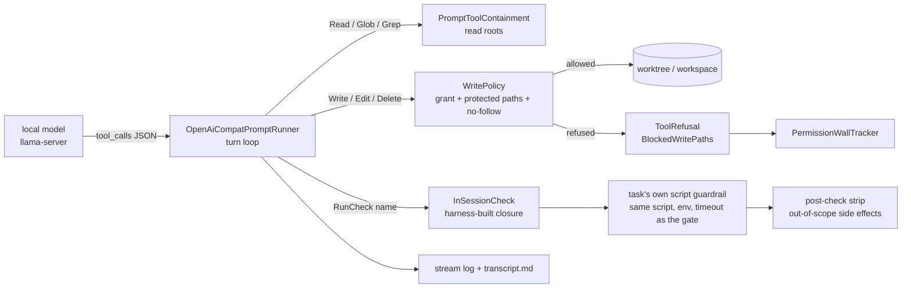

# Architecture: native local-inference task actions (#544)

**Status:** proposed design of record, for review in Charter before any breakdown.
**Issue:** #544 (raised to `priority: high`, 2026-09-26). **Extends:** `docs/plans/28-local-inference-runner.md`
(#223, the verifier half). **Touches:** #201 (model tiering), #557 (JIT breakdown write scope), #759 (probe
token cap), #760 (silent model substitution), #764/#773 (the Cursor precedent for an agent without the hook).
**Binds to:** `master` at `7bbdf384`.

---

## What's being asked

Let an `openai-compat` prompt runner, which talks directly to a local model server (`llama-server`, later MLX
or LM Studio), **perform task actions**, meaning write files and run commands, with no vendor agent harness
(Claude Code, Cursor) between the model and the repository.

Today a local model can only judge. Every action goes through a vendor CLI, including the `claude-local` bridge
the maintainer uses now (#570, last comment): Claude Code pointed at LiteLLM in front of `llama-server`. That
bridge works and stays supported. This design is about where the destination is: **the harness's own prompt
runner executes every tool call itself.**

The decider is containment, not effort (#544, plan 28 §3.2(a)). A write-capable local actor must never produce
**a green run over a tree the harness cannot account for.**

**Narrowing, stated up front.** "Run commands" is read as *"give the model a build/test feedback loop"*, not
*"give the model a shell."* §4 argues that the two differ, and that only the first can be contained on all
three operating systems in v1. The shell posture is question `shell-posture`.

### Goals

1. A task action can be routed to an `openai-compat` block and produce a real diff, in worktree mode and in
   serial mode, on Windows, macOS and Linux.
2. The containment boundary for **writes** is enforced in .NET, in-process, at the moment of the tool call. It
   must be at least as strong as the Claude hook, and stronger where it can be.
3. Every mechanism the Claude path relies on (the permission wall, salvage, staging, the state fragment, retry
   feedback, the transcript, cost, stalls, context overflow) has a stated answer (§6).
4. The claim is proven by plan 28's adversarial `FakeOpenAiServer` suite extended with write-side and
   command-side attacks. Each attack row asserts on bytes on disk, not on a refusal message (§9).

### Non-goals (v1)

- A general shell, or any tool that takes a model-authored command line.
- OS-level sandboxing (Seatbelt, bubblewrap/landlock, AppContainer).
- `routing` (tier candidacy) on an actor-capable local block.
- The `ai-merge` and `breakdown` profiles on a local block (Phase 2).
- Context compaction or summarization of a long session.
- Any change to the verifier path plan 28 shipped. A `Guardrail` or `Advisory` invocation on this runner must
  put the same bytes on the wire after this change as before it.

---

## 1. Placement

| Area | What lands there |
|---|---|
| **Harness** (`Guardrails.Core`) | The write tools, the `WritePolicy` primitive, the `RunCheck` capability, `PromptInvocation` fields, build facts, validator changes |
| **Schema / SSOT** | §9.8 gains an "Actions" part; §9.4, §9.3, §4.9, §3.4, §2 and §9.6 edits; one new code (`GR2083`) |
| **Skills** | `plan-breakdown` routing advice for a local actor (commands belong in script actions or script guardrails); `guardrails-domain-knowledge` |
| **v2 bets** | OS sandbox plus a general argv `Run` tool; `routing` for actors; sandboxing guardrail scripts harness-wide. Tracked as #544 Phase 3 (§10) until each has its own `03-roadmap.md` entry |
| **Out of scope** | A second wire protocol, auto-pulling models, and managing `llama-server` lifecycle (that stays `claude-local`'s or the operator's job) |

**No new kind.** The capability is added to `openai-compat`. §3.4 records why a sibling kind was rejected.

## 2. Invariants in play

| # | Invariant | How this design treats it |
|---|---|---|
| 1 | Deterministic guardrails over prompt judges | **Strengthened.** In-session feedback comes only from the task's own **script** guardrails (`RunCheck`), and the gate still runs after the action exactly as before. A `RunCheck` result is never a verdict. |
| 2 | Harness is the single writer of merged state | **Strengthened.** The model never touches the filesystem. The harness performs every write, after checking the target against policy. The plan folder is not writable by the actor at all. |
| 3 | Verdicts from files, never exit codes | Untouched. Actions produce no verdict. `RunCheck` reports an exit code **to the model**, never to the gate. |
| 4 | SSOT lands with the contract change | §8 lists the exact edits. They land with stage 1 of §10. |
| 5 | Honest halts | A refused write is named, tracked, and can settle `needs-human`. A dialect failure (tool calls emitted as text) settles `needs-human` with a remedy, never as a silent no-op. |
| 6 | Plain files, light setup | No daemon or container. The only external process is the operator's model server, which plan 28 already requires. |

---

## 3. The chosen architecture

### 3.1 The one idea: the harness is the policy point

With Claude Code, the model asks Claude Code to write a file and Claude Code writes it. The harness can only
intervene through a `PreToolUse` hook script, a separate OS process that re-implements the containment rule in
shell or PowerShell and guesses at Bash command text (SSOT §9.4 calls this *"not a security sandbox"*). Cursor
has no hook at all. Its writes are only checked afterwards (§9.9).

With a chat-completion endpoint, **the model cannot do anything.** It can only emit a structured `tool_calls`
entry. The harness parses the call, decides, and performs the effect itself. That removes the hook's weak
points, because there is:

- no second implementation of the rule in another language;
- no command text to parse, because there is no shell;
- no vendor runtime between the decision and the syscall;
- no chance for the policy to be skipped silently. The code that would perform the write is the same code
  that checks it.

:::diagram

:::

### 3.2 The tool surface

Tool names follow Claude Code's wherever a Claude tool exists. Plan 28 §3.2(c) set that rule: harness-owned
prose and plan prompts already use these names, and a schema whose names disagree with the prompt is a
contradiction handed to the weakest model in the system.

| Tool | Offered to | Arguments | Semantics |
|---|---|---|---|
| `Read` | all roles (shipped) | `file_path`, `offset?`, `limit?`, **`revision?` (new, Action only)** | Unchanged for judges. With `revision`, the harness runs `git show <revision>:<path>` itself, with fixed argv; `revision` must match `^[A-Za-z0-9][A-Za-z0-9._/@{}~^-]*$`. This replaces the `Bash(git show*)` salvage grant. |
| `Glob`, `Grep` | all roles (shipped) | unchanged | unchanged |
| `Write` | Action | `file_path`, `content` | Create or replace a UTF-8 text file. Replacing an existing file requires that it was `Read` or written earlier in this session (a guard against blind overwrites). The write is atomic (temp file plus rename). |
| `Edit` | Action | `file_path`, `old_string`, `new_string`, `replace_all?` | `old_string` must occur exactly once unless `replace_all` is set. Matching tolerates line-ending differences, and the file keeps its dominant line ending and its BOM. A non-UTF-8 file is a tool error. |
| `Delete` | Action | `file_path` | Deletes a single file. Directories are never deleted. Claude has no equivalent because it deletes through Bash, and without a shell a model would have no way to delete. |
| `RunCheck` | Action | `name` (a JSON-schema `enum` of the task's **script** guardrail names) | The harness runs that guardrail script exactly as the gate would (same script, cwd, §5.1 env, timeout) and returns its exit code plus the output tail (last 200 lines or 16 KiB; failure detail is at the end since #179). It is **not a verdict**: it is never journaled as a guardrail result and never skips the gate. Limited to 8 calls per attempt (a constant, disclosed in the `runner-notice`). |

**What is not offered: `Bash`, or any tool that takes a command string or argv.** Question `shell-posture`
asks whether v1 should stop here.

**The judge path is unchanged by construction.** Write tools, `RunCheck` and `Read.revision` are offered only
when the invocation carries a `WriteGrant` (§5.2). No `Guardrail` or `Advisory` call site sets one, so plan
28's catalogue and wire bytes stay the same. §9 asserts this byte-for-byte.

### 3.3 `RunCheck`: why the model may run only what the reviewer already approved

A coding model without a feedback loop is blind. It cannot see a compile error until a whole attempt has
failed and been retried. `RunCheck` gives it the loop without accepting a single model-authored command:

- **The commands are reviewed.** A script guardrail is part of the plan definition, so it is covered by
  `PlanDefinitionHash` and the review attestation. The model chooses *which* reviewed script runs and *when*.
  It never chooses *what* runs.
- **It adds no new kind of exposure.** The gate runs the same scripts over the same model-authored code after
  every action, on every runner. `RunCheck` only moves that execution earlier.
- **Side effects are stripped the way phase 2 already strips them.** Because `Write`/`Edit`/`Delete` enforce
  `writeScope` at call time, the model cannot have created an out-of-scope diff itself. Any out-of-scope
  change present after a `RunCheck` must come from the check. The harness therefore runs the existing
  phase-2 `ScopedRevert` (SSOT §3.4, #280) right after each `RunCheck` in worktree mode, which keeps phase
  1's later verdict about the **model's** writes only. In-scope side effects (for example a formatter
  rewriting a file) are kept, exactly as they are at gate time.
- **Evidence.** Each call records the check name, exit code, duration, and a content hash of every changed
  file at that moment (`run-check` lines in the stream log, `● RunCheck(name)` in `transcript.md`). Code the
  model wrote, ran, and then deleted therefore still leaves a trace.

`RunCheck` covers only the task's **own** `guardrails/` scripts. It excludes prompt judges, preflights, and
wave- or plan-level gates, because those are the gate's business and running them inside a session would
blur what certified what.

### 3.4 Rejected alternatives

:::comparison
| Alternative | Why rejected |
|---|---|
| **Keep using `claude-local` (Claude Code in front of LiteLLM)** | It works and remains the supported bridge. It is not the destination: the maintainer's position is that local actions belong in the harness's own runner, and the bridge needs Claude Code installed plus a LiteLLM model map that fails silently (#570 items 1 and 2). |
| **Wrap an open-source agent CLI (Aider, OpenHands, opencode, Goose) as a new `kind`** | Same shape as Cursor: an uncontained writer policed after the fact (§9.9), plus a new dialect to quarantine. It puts a vendor harness back in the loop, which is exactly what #544 is meant to remove. |
| **A new sibling kind (`local-agent`) beside `openai-compat`** | Same wire protocol and same class. Plan 28 §3.1 rejected `local` on those grounds. What differs is *capability per invocation*, and the `WriteGrant` expresses that more precisely than a kind can. |
| **Generate a hook script for the local runner too** | This would add back the out-of-process re-implementation the in-process policy removes. §9.4's weaknesses (no symlink resolution, heuristic command text) would come back with nothing gained. |
| **Post-hoc only: let writes land, then diff (the Cursor model)** | The git diff sees only the worktree. Writes to the plan folder, the main checkout or another worktree go unseen. We control the call site, so enforcing is cheaper than detecting. |
| **Patch mode: the model emits one unified diff and the harness `git apply`s it** | No read loop and no feedback. Weak models are poor at the diff format, and one bad hunk wastes the whole attempt. It could come back later as a cheap tier for tiny edits. |
| **General shell with a command-text allowlist** | Fails open by construction; SSOT §9.4 admits this about the Claude matcher. |
| **Structured argv `Run` tool with a program allowlist, unsandboxed** | Blocks *direct* escapes (`rm -rf ~`), but `dotnet build` or `npm test` runs whatever code the model just wrote. An allowlist on `argv[0]` contains nothing once the program executes model code. It is only sound together with an OS sandbox (Phase 3). |
| **OS sandbox now** | macOS `sandbox-exec` (Seatbelt) works but is a deprecated interface. Linux needs bubblewrap or landlock (kernel-dependent). Windows has no practical per-process filesystem-write sandbox without AppContainer ACL work. The 3-OS CI would split into three different guarantees. Deferred to Phase 3, where the deployment target (macOS) goes first. |
:::

---

## 4. Threat model

**Actors.** The model is the adversary in three strengths:

- **wrong:** a weak model making ordinary mistakes (wrong path, clobbered file);
- **confused:** prompt-injected by content it reads, such as a file or README containing instructions;
- **hostile:** model weights that behave adversarially. Unlikely for company-approved Qwen, but the boundary
  must not depend on that.

The operator and the plan author are trusted. The model server is trusted to relay, but not to be honest
about capabilities (plan 28 §6.6).

**Assets.** The main checkout; other tasks' worktrees; the plan folder (task definitions, guardrails,
`guardrails.json`, logs, verdicts); the git object store, refs, stash and hooks; agent configuration that
*another* runner will load (`.claude/`, `.cursor/`); anything outside the repository.

**Labels used below:**
- **ENFORCED**: the harness refuses before any effect happens.
- **DETECTED**: the effect can happen, but a deterministic check sees it and fails the attempt.
- **DISCLOSED**: not contained. The operator is told, by `GR2083` and the `runner-notice`.

| # | Attack | Mechanism | Label |
|---|---|---|---|
| T1 | `Write` to an absolute path outside the worktree (`/Users/x/.zshrc`, `C:\Windows\…`) | `WritePolicy`: normalized target must fall under a grant root | ENFORCED |
| T2 | `..` traversal, mixed separators, trailing dots or spaces, doubled separators | `Path.GetFullPath` normalization before matching; the result must match a root on a directory boundary | ENFORCED |
| T3 | Write through a symlink or junction inside the worktree that points outside | **No-follow:** any *existing* path component under the root that is a reparse point or symlink is refused | ENFORCED |
| T4 | Write through a hard link whose other name is outside | Atomic replace (temp plus rename) replaces the directory entry and never writes through the inode | ENFORCED (by construction) |
| T5 | Windows path tricks: `\\?\` / `\\.\` prefixes, UNC, alternate data streams (`a.cs:evil`), device names (`CON`, `NUL`), 8.3 short names | Refuse any `:` after the drive, `\\?\` / `\\.\` / UNC forms, and reserved device names. Short names are expanded by `GetFullPath` or the no-follow walk; residual risk noted in §7 | ENFORCED |
| T6 | Write `.git/hooks/pre-commit` (code execution the next time the harness commits), `.git/config`, a `.git` file | A `.git` segment anywhere in the path is refused, case-insensitively where the filesystem is | ENFORCED |
| T7 | Write `.claude/settings.json` with a hook, or `.cursor/…`, which a *different* runner in this worktree later loads (cross-runner escalation) | Agent-config segments are refused unless the task's `writeScope` names that prefix **literally**; a `**` wildcard never grants them (§5.3) | ENFORCED |
| T8 | Rewrite the task's own `task.json` or `guardrails/` to weaken its gate | The plan folder is never a write root. The task-definition tamper check also runs as a second line | ENFORCED + DETECTED |
| T9 | Write inside the worktree but outside `writeScope` | `WritePolicy` applies the same `IsInScope` matcher at call time. The phase-1 git-diff check still runs afterwards | ENFORCED + DETECTED |
| T10 | Plant `{"pass": true}` at the judge's staged verdict path | The grant allows exactly this attempt's `STATE_OUT` file, not the agent-io directory. The stale-verdict clear (§9.5) runs before every judge | ENFORCED + DETECTED |
| T11 | Delete tracked files out of scope, or delete a directory | `Delete` uses the same policy as `Write` and deletes single files only | ENFORCED |
| T12 | Disk fill: a huge `Write`, or a loop of writes | 1 MiB per call and 32 MiB per attempt (constants), both reported as a tool error; `maxTurns`; `Timeout` | ENFORCED |
| T13 | Read secrets outside the roots (`~/.ssh`) | `PromptToolContainment.IsReadable` (shipped, plan 28 §5) | ENFORCED |
| T14 | Read secrets *inside* the roots (`.env`) and send them out | The only channel is the model endpoint. On loopback, nowhere. On a remote endpoint, the model sees them | DISCLOSED |
| T15 | Prompt injection: a file contains a `<tool_call>` block or "now write to ~/…" | Tool calls are taken **only** from structured `tool_calls`, never parsed from content. Injected intent still meets `WritePolicy` | ENFORCED |
| T16 | A tool call for a tool that was not offered (`Bash`, `Write` on a judge) | Refused. Counts toward the #452 denial streak and is named | ENFORCED |
| T17 | `RunCheck` with an unknown name or extra arguments | The schema `enum` and a harness lookup both refuse it; the tool takes no arguments | ENFORCED |
| T18 | **Model-authored code writes outside the tree when `RunCheck` or the gate executes it** (a test that writes `~/x`, a hostile `Directory.Build.targets`) | Not contained. **This exposure predates #544 and applies to every runner**, because the gate always executes model-authored code. `RunCheck` only moves it earlier, and per-call change hashes record what ran | DISCLOSED (Phase 3 sandbox) |
| T19 | Write-then-run-then-delete, leaving no trace in the final diff | The `run-check` evidence lines record a content hash of every changed file at each call | DETECTED (evidence only; nothing fails) |
| T20 | TOCTOU: a path component is swapped for a symlink between check and write | Only another process could do this. `RunCheck` is synchronous and finished, and parallel tasks live in their own worktrees. Residual risk accepted | DISCLOSED |
| T21 | The server accepts `tools` and never calls one; the action "completes" having done nothing | Gates decide (invariant 1). The preflight tool probe (plan 28 §7) halts a server that cannot call tools | DETECTED |
| T22 | The model emits tool calls as text (a server whose chat template does not parse them, e.g. `llama-server` without `--jinja`) | Never executed (T15). A session with **zero** structured calls whose content has the tool-call shape settles `needs-human` with a server-template remedy (§6) | DETECTED |

:::warn
**T18 is the honest limit of v1, and it is not new.** Every Guardrails run already executes model-authored
code, unsandboxed, when a `dotnet test` guardrail runs. #544's promise is that the *actor's tools* cannot
escape. It is not a promise that *code the actor wrote* cannot escape when the gate runs it. That second
boundary is harness-wide (it covers Claude and Cursor runs equally). It belongs to a Phase 3 sandbox bet that
wraps guardrail scripts and `RunCheck` alike, and v1 must not claim it.
:::

---

## 5. The containment boundary spec

### 5.1 Summary

| Surface | Worktree mode | Serial mode | Label |
|---|---|---|---|
| **Reads** | roots = worktree + plan folder | roots = workspace + plan folder | ENFORCED (shipped primitive) |
| **Writes** | worktree ∩ `writeScope`, plus this attempt's `STATE_OUT` file, plus declared `stagingOutputs` staging paths, minus protected segments; no-follow; atomic | same, with the workspace as root | ENFORCED |
| **Writes, second line** | phase-1 git-diff check; task-definition tamper check | tamper check only (serial mode has no diff check today) | DETECTED |
| **Commands** | none. `RunCheck` runs reviewed scripts only | same | ENFORCED (no tool exists) |
| **Code the model wrote, when executed** | not contained | not contained | DISCLOSED |

**Serial mode is where this design gains the most.** A Claude action in serial mode has no containment hook at
all (§9.4: `--settings` is absent there). A native local action in serial mode is still limited to its
`writeScope`, at call time.

### 5.2 The `WriteGrant`: capability per invocation, set by the call site

`PromptInvocation` gains one optional member:

```csharp
/// <summary>What this invocation may WRITE (issue #544). Null ⇒ no write tools are offered and an Action
/// invocation is refused. Set by the call site, never inferred by the runner.</summary>
public WriteGrant? Writes { get; init; }

public sealed record WriteGrant(
    string Root,                          // absolute: the worktree (worktree mode) or the workspace (serial)
    IReadOnlyList<string>? Scope,         // the task's writeScope, root-relative; [] = writes nothing to the repo
    IReadOnlyList<string> ExactFiles,     // absolute: this attempt's STATE_OUT staging file, stagingOutputs staging paths
    IReadOnlyList<InSessionCheck> Checks);// RunCheck targets: the task's own script guardrails

public sealed record InSessionCheck(string Name, Func<CancellationToken, Task<CheckOutcome>> Run);
```

- **Null is the restrictive default.** Plan 28 made `Role` `required` so that a new call site could not
  silently receive the permissive value. Here the default is already the safe one, so the member stays
  optional and no fixture breaks.
- **The runner refuses an `Action` invocation with `Writes == null`.** This is what keeps `ai-merge` and
  `breakdown` unservable in Phase 1 (§6.3) even if a route to them is missed: their call sites set no grant.
- **`Checks` are closures built by `ActionRunner`** from the existing script-guardrail execution path, so the
  runner never learns how a script runs. It stays a vendor-free HTTP client, and the §9 quarantine holds.
- **`Scope == null` fails closed to `[]`**, the same coalescing `WriteScopeCheck.Check` already does (#389).

### 5.3 The `WritePolicy` decision, in order

`WritePolicy.Decide(WriteGrant grant, string requestedPath) → Allowed | Refused(reason)` is a pure function
apart from filesystem reads. It lives beside `PromptToolContainment`.

1. Reject rooted-path forms the platform cannot compare safely (T5). Then normalize with `Path.GetFullPath`,
   resolving relative paths against `Root`.
2. If the path equals one of `ExactFiles` → **allowed** (skip to step 6).
3. The path must be under `Root` on a directory boundary (`RealPath.Comparison`, which is case-insensitive
   on Windows and macOS).
4. Reject protected segments:
   - `.git` anywhere in the path;
   - `.guardrails-agent-io` and `.guardrails-staging` except for `ExactFiles`;
   - agent-config segments (`.claude`, `.cursor`), unless a `Scope` entry names that prefix **literally**,
     without a `*`, so that a broad glob can never grant them.
5. The root-relative path must satisfy `IsInScope(path, Scope)`, the plan 08 matcher the phase-1 check uses.
6. **No-follow walk:** every existing component from `Root` down to the target must be neither a symlink nor
   a reparse point. The target itself may exist only as a regular file.

A refusal becomes a `ToolRefusal(tool, path, reason)` whose reason names the rule and the enforced scope, for
example `outside writeScope [src/Foo/**] — ask for the scope to be widened, or write within it`. The refused
path is added to `BlockedWritePaths`.

**On agent-config paths (T7):** this is decided here rather than asked. Refusing them unconditionally would
break plans that legitimately author skills under `.claude/skills/`, and this repository is one of them.
Treating them like any other path would let an actor plant a hook that a later Claude judge in the same
worktree executes. Requiring a literal scope entry mirrors the reason Claude Code itself protects `.claude/`,
and it keeps the grant visible in the reviewed `task.json`.

---

## 6. What the Claude path gets, and this runner's answer

| Claude-path mechanism | Native actor answer |
|---|---|
| Permission denial → `BlockedWritePaths` → `PermissionWallTracker` (#86 / #104 / #708) | Policy refusals fill `BlockedWritePaths` and `RefusedToolCalls` (with reasons). `RefusedCommands` stays empty because there is no shell. The #86 repeated-target rule applies: the same out-of-scope path refused on two attempts means the plan's scope is wrong, so the task settles `needs-human`. **The #104 structural `.claude/` rule must not fire here**, because it describes Claude Code's own runtime wall, which this runner does not have. It becomes conditioned on a new build fact, `PromptRunnerKinds.HasVendorClaudeDirWall(kind)` (Claude and Cursor keep today's behavior). A `.claude/` refusal from this runner is the ordinary T7 rule, and its remedy names the literal scope entry. |
| The #452 consecutive-denial abort | Unchanged: already implemented in the turn loop and counted over write refusals too. It is active only where a caller sets the bound. No task action does today, so actions are bounded by #86, `maxTurns` and `Timeout`, as Cursor actions are (§9.9). |
| Salvage grant `Bash(git show*)` | `Read` with `revision` (§3.2). The salvage section of retry feedback becomes **capability-aware** through a new build fact, `PromptRunnerKinds.OffersShell(kind)`. It tells a shell-less actor to use `Read` with `revision: <ref>` instead of `git show`. This also fixes the inaccuracy §9.9 accepted for Cursor. |
| `--add-dir` reach to the plan folder | Reads: the plan folder is a read root (shipped). Writes: **none**. The plan folder is read-only to this actor, which is stricter than Claude. |
| `stagingOutputs` | Honored: the declared staging paths are in `ExactFiles`, and the harness's move is unchanged. They are unnecessary here (no vendor `.claude/` wall) but harmless. |
| `needsHarnessWrite` | Unchanged. The harness reads the fragment and performs the write. |
| State-out fragment | The action writes `GUARDRAILS_STATE_OUT` through `Write` to its #266 staged path, which is in `ExactFiles`. The composer's shipped "write to this path" text is correct as-is, because this action does have `Write`. |
| `## Worktree safety` section (git stash advice) | Omitted when `!OffersShell(kind)`. With no shell it would be advice about a tool the actor does not have: noise at best, and a contradiction at worst. |
| Retry feedback | Unchanged pipeline. The #773 `## Tool calls the runner refused this attempt` section renders `RefusedToolCalls`. `RunCheck` outputs are not repeated there, because the gate's own feedback already carries the failure tail. |
| `transcript.md` / stream log | Both are already written by the runner. **The action's `transcript.md` is read by dependent tasks** (`DependencyContextBuilder`), so the renderer adds a line per `Write` / `Edit` / `Delete` (path, bytes, +/− lines), per `RunCheck` (name, exit, duration), and per refusal. Stream-log `tool-result` lines gain `bytesWritten` and, for `RunCheck`, the change-hash evidence (T19). |
| Token and cost accounting | `Usage` is summed per turn (shipped). `CostUsd` is `null`. **`maxCostUsd` therefore cannot bind on local-actor spend**, and plan 28 finding 2's reassurance ("actions stay on Claude") no longer holds. It is not a liveness hole, because the run stays bounded by tasks × `maxAttempts` × `timeoutSeconds`, but `GR2083` states it, as `GR2080` does for Cursor. |
| Stall and timeout | `Timeout` covers the whole session, `RunCheck` included; the check's process tree is killed on cancel. `StallBound` is honored by the SSE watchdog (shipped) and is suspended while a `RunCheck` runs, because a running build is not a silent model. |
| Context-window overflow | The per-turn pessimistic refusal (plan 28 §6.1) applies unchanged and will fire more often on long action sessions. Mitigations: tool results are capped (`Read` 2,000 lines, `RunCheck` 16 KiB tail, `Write` / `Edit` results are one line), and reasoning text is kept out of the history (next row). **No compaction in v1**: a summary silently drops evidence the model read, which is a correctness risk. `ContextOverflow` fails the attempt with feedback advising smaller reads. |
| Reasoning models (Qwen `<think>`) | `reasoning_content` is never sent back. Inline `<think>…</think>` spans are stripped from assistant content before it re-enters the history; they remain in `transcript.md`. Prerequisite: **#759** (the probe's 64-token cap makes a reasoning model fail the tool probe). |
| Tool-calling reliability | Tool calls come only from structured `tool_calls` (T15). Arguments that do not parse as JSON produce a **tool error** result naming the parse error: not a refusal, and not counted as a denial. Parallel tool calls run sequentially in the order emitted. A session with zero structured calls whose content has the tool-call shape settles `needs-human` as `RunnerConfiguration` with the remedy "the server is not parsing tool calls; for llama.cpp start `llama-server` with `--jinja`" (T22). A text-shaped call that follows some structured calls is an ordinary `Error` and is retried. |
| Silent model substitution (#760) | Unchanged from plan 28: the preflight asserts every declared model is listed. `llama-server` lists only the loaded model, so two blocks naming two models on **one** `llama-server` port halt at preflight instead of both silently running the loaded one. Run two servers on two ports, or put a model-swapping proxy in front. |

### 6.1 Build facts, restated

| Fact | Claude | Cursor | OpenAiCompat (after) |
|---|---|---|---|
| `ServesRoles` | all | Action, Guardrail | **all** |
| `NeedsContainmentHook` | true | false | false |
| `HarnessMediatedTools` **(new)** | false | false | **true** |
| `OffersShell` **(new)** | true | true | **false** |
| `HasVendorClaudeDirWall` **(new)** | true | true | **false** |
| `WritesFiles` (judge verdict contract) | true | true | false: **unchanged, doc narrowed** to "a *judge* on this kind has a write tool" |
| `ServesActionProfiles` **(new)** (`ai-merge`, `breakdown`) | true | true | **false in Phase 1** |

The tamper check keys on `IsUncontainedWriter || HarnessMediatedTools`. For this runner it is a belt that
should never fire: a firing means `WritePolicy` has a bug.

**Unlisted kinds default to the safe side on every new fact:** `HarnessMediatedTools` false, `OffersShell`
true, `HasVendorClaudeDirWall` true, `ServesActionProfiles` false. This is the same fail-safe direction
`NeedsContainmentHook` already uses.

### 6.2 `ServesRoles` grows by construction

`ServesRoles(OpenAiCompat)` becomes all roles, pinned by constructing the real runner as plan 28 §3.5 requires.
The capability, though, is really the **pair** `(Role == Action, Writes != null)`. The by-construction pin
therefore covers the new refusal as well: an Action with no grant is refused, and an Action with a grant
proceeds.

### 6.3 Reachability: GR2066 narrows, GR2083 discloses

Plan 28's five routes, re-decided:

| Route | v1 of #544 | Why |
|---|---|---|
| 1. declares `routing` | **still GR2066 (error)** | That would be the harness *choosing* a local actor. It needs the measurement plan 28 §3.7 named. Question `routing-for-actors`. |
| 2. effective default (the `default` pointer, or the sole runner) | **legal** | A human act. This is the maintainer's configuration today. |
| 3. a task's `action.runner` | **legal** | A human act. |
| 4. an action prompt's frontmatter `runner:` | **legal** | A human act (the fold plan 28 §3.7 added keeps it visible to validation). |
| 5. declared under `ai-merge` / `breakdown` | **still GR2066 (error)** | Phase 2 (§10). |

When a local block is the default runner, `SchedulerFactory` **withholds** it from the `ai-merge` and
`breakdown` fallback, the same pattern it uses to withhold a Cursor block from the Advisory profiles (§9.9).
It prints one `Note:` per withheld profile and uses the existing OFF paths:

- a merge conflict settles `needs-human`, as with no merge runner;
- a JIT checkpoint honest-halts, as with no breakdown runner.

This also means #557's plan-wide JIT write hole is **not widened** by this change.

**GR2083 (WARNING, `OpenAiCompatActorContainment`)** fires once per `openai-compat` block reachable for an
Action by routes 2, 3 or 4. Its message states the §5.1 inventory in brief:

- writes are enforced in-process against `writeScope`;
- the plan folder is read-only to the actor;
- there is no shell, and `RunCheck` runs the task's own script guardrails;
- code the model writes is executed unsandboxed when checks and gates run (T18);
- `maxCostUsd` cannot bind (cost is `null`);
- `ai-merge` and `breakdown` are withheld.

It is a warning because running a local actor is a legitimate operator choice. What must not happen is that
choice being made silently.

**GR2071 extends to this runner** (§4.9, still a warning). For a task whose action resolves to an
`openai-compat` block, the grant set for commands is **definitively empty**, not a floor (#252 does not
apply, because there is no operator `settings.json` behind it). Every command candidate in the action prompt
therefore fires, with this runner's own remedy: *"this runner has no shell. The model can run the task's
script guardrails through `RunCheck` (<names>); move any other command into a script action or a script
guardrail."*

---

## 7. Config shape

**No new keys.** Actions are reached by the routes in §6.3, and every bound in this design is a constant
disclosed in the `runner-notice`. That keeps `guardrails.json` byte-identical for every existing plan, so no
review attestation is invalidated.

The maintainer's Mac, by way of illustration:

```jsonc
"maxParallelism": 1,                        // one llama-server, one loaded model
"promptRunners": {
  "default": "qwen36",
  "qwen36": {
    "kind": "openai-compat",
    "endpoint": "http://127.0.0.1:8080/v1", // llama-server --jinja -c 65536 ...
    "model": "qwen3.6-35b-a3b",             // must match what GET /models lists
    "contextTokens": 65536,                 // must match the server's -c, or the §6.1 after-check fails
    "maxOutputTokens": 8192,
    "maxTurns": 80,                         // action sessions need far more turns than judges
    "strength": 2,
    "engine": "llama.cpp"
  },
  "qwen38": {                               // a second llama-server on :8081 if memory allows
    "kind": "openai-compat", "endpoint": "http://127.0.0.1:8081/v1",
    "model": "qwen3.8-27b", "contextTokens": 65536, "maxOutputTokens": 8192,
    "maxTurns": 80, "strength": 3, "engine": "llama.cpp"
  }
}
// hard tasks: "action": { "runner": "qwen38", ... }
```

A judge pinned to the same model as the actor is self-grading. This design does not forbid it, but
`plan-breakdown` should prefer deterministic guardrails even more strongly for a local-actor plan, which is
already its default lean.

**Residual Windows note (T5).** 8.3 short names resolve only for components that exist. A not-yet-existing
leaf with a `~1`-shaped name is matched literally. It cannot reach outside the root, because every existing
parent is resolved and walked, so the worst case is a strangely named file inside scope.

---

## 8. Contract and SSOT changes (`02-schemas-and-contracts.md`)

These land in the same change as the code (invariant 4).

1. **§2, the `promptRunners` `kind` comment.** `openai-compat` serves Actions (§9.8), is reachable by the
   default, `action.runner` and frontmatter routes, and adds no keys. Keep the `canonical-schema:promptRunners`
   mirror (`.claude/skills/plan-breakdown/references/schemas.md`) byte-identical.
2. **§3.4, write-scope.** Add one paragraph: for an `openai-compat` action the same `IsInScope` predicate is
   *also* enforced at call time (§9.8). Phase 1 still runs and is the independent observation of the actual
   tree. Phase-2 strip semantics also run after each `RunCheck`.
3. **§4.9, GR2071.** Add the `openai-compat` clause: definitively empty command grants, with the `RunCheck`
   remedy.
4. **§5.1, env.** `RunCheck` runs a script guardrail with the env that guardrail gets at gate time. Any output
   paths it would write are redirected to a per-call scratch directory under the attempt log directory, so no
   gate artifact collides.
5. **§8, log layout.** Add the `tool-result` fields (`bytesWritten`, `run-check` evidence) and the transcript
   lines for write tools and `RunCheck`.
6. **§9 intro.** Add `PromptInvocation.Writes` (`WriteGrant`), the null-refuses-Action rule, and the four new
   build facts with their fail-safe defaults.
7. **§9.3, permission wall.** The #104 structural rule is conditioned on `HasVendorClaudeDirWall`.
8. **§9.4.** Add a paragraph: a runner with `HarnessMediatedTools` needs no hook, because its policy is
   in-process (§9.8). Its containment is not weaker than the hook: the rule runs in one implementation, with
   no command text and with no-follow.
9. **§9.8.** A new part, **"Actions (#544)"**: the tool table (§3.2), `WritePolicy` (§5.3), `RunCheck`
   (§3.3), the enforced / detected / disclosed inventory (§5.1), dialect handling (§6), and the withheld
   profiles. The plan-28 text "serves the `Guardrail` and `Advisory` roles only" is amended where it
   appears, **not deleted** (the historical record stays; live status changes).
10. **§9.6 validation table.** Amend the `GR2066` row to routes 1 and 5 only. Add:

| Code | Sev | Rule |
|---|---|---|
| `GR2083` | warning | `OpenAiCompatActorContainment` (#544, §9.8) — once per `openai-compat` block reachable for an **Action** by the default, `action.runner` or frontmatter route. States what is enforced (in-process write policy against `writeScope`; plan folder read-only; no shell; protected `.git` / agent-config segments), what is detected (phase-1 diff, tamper check), and what is not contained (model-authored code when `RunCheck` or the gate executes it). Also states that `maxCostUsd` cannot bind (cost `null`) and that `ai-merge` / `breakdown` are withheld from the block. A warning because a local actor is a legitimate operator choice, made visibly. |

11. **`DiagnosticCodes.cs`.** Take `GR2083`; advance the marker to `GR2084`.

---

## 9. How it is proven: extending the adversarial suite

**The seam is the OpenAI HTTP wire and the real filesystem**, per the #382 doctrine. Every row below drives the
real `OpenAiCompatPromptRunner`, with a real `WritePolicy`, against `FakeOpenAiServer` scripting the attack as
`tool_calls`, inside a real git worktree created by the real provider.

**Assertion rule (rung 1):** each attack asserts on **disk**:
- a sentinel file outside the root has unchanged bytes and timestamp;
- the target is absent, or has its original bytes.

**Firing control:** each row has a twin in which the same scripted call targets an *allowed* path and the
write is asserted to **happen**. This proves the fixture really performs writes, so a refusal row cannot pass
simply because nothing ever writes.

| # | The server scripts | The test asserts |
|---|---|---|
| A1 | `Write` to an absolute path in a sibling temp dir | sentinel unchanged; `ToolRefusal` names the grant; path in `BlockedWritePaths` |
| A2 | `Write` to `src/../../outside.txt`, and a mixed-separator variant | nothing is created outside the root |
| A3 | `Write` to `link/evil.cs`, where `link` is a committed symlink (a junction on Windows) to outside | the outside dir is unchanged. **Windows CI must create the junction, never skip**; a failure to create one fails the test (skipped tests are lost evidence) |
| A4 | `Write` to a file that is a hard link to an outside file | the outside inode's bytes are unchanged; the in-root name has the new bytes |
| A5 | (Windows) `a.cs:stream`, `CON`, `\\?\C:\…`, UNC | refused; no stream or device write |
| A6 | `Write` `.git/hooks/pre-commit`, `.GIT/config`, `sub/.git/x` | none written; a later harness commit runs no hook |
| A7 | `Write` `.claude/settings.json` with `writeScope: ["**"]`, then with `writeScope: [".claude/skills/"]` | refused in both; `.claude/skills/x/SKILL.md` is allowed in the second |
| A8 | `Write` the task's own `task.json` and `guardrails/01.sh` via the plan-folder path | plan-folder bytes unchanged; the tamper check did not fire (policy held first) |
| A9 | `Write` in-worktree but out of `writeScope` | refused at call time; phase 1 reports **no** offense (proving the call-time layer caught it) |
| A10 | `Write` the judge's staged `VERDICT_OUT` path | refused; a following judge that writes nothing **fails** |
| A11 | `Delete` a tracked out-of-scope file; `Delete` a directory | both refused; files present |
| A12 | 1 MiB + 1 byte `Write`; 33 × 1 MiB writes | tool errors; bytes on disk ≤ caps |
| A13 | content containing `<tool_call>{"name":"Write","arguments":{…outside…}}</tool_call>` with no structured call | nothing written; with zero structured calls in the session: `RunnerConfiguration`, `needs-human`, `--jinja` remedy |
| A14 | a structured `Bash` call; a `Write` on a **Guardrail** invocation | refused; counted toward #452 |
| A15 | `RunCheck` with `name: "../../x"` and with an extra `args` field | refused; no process started (a process-start counter on the injected closure) |
| A16 | `RunCheck` of a guardrail whose script creates an out-of-scope file | file stripped after the call; phase 1 reports no offense; evidence line present |
| A17 | the same out-of-scope path refused on attempts 1 and 2 | the #86 halt settles `needs-human` on attempt 2; **no #104 structural halt** on a `.claude/` refusal |
| A18 | arguments that are not JSON | tool-error result; not in `RefusedToolCalls`; the session continues |
| A19 | `<think>` in content across three turns | turn-3 request carries no `<think>` text; `transcript.md` does |
| A20 | a Guardrail invocation, before and after this change | **byte-identical request bodies** (the judge path is untouched) |
| A21 | an Action invocation with `Writes == null` | refused before any byte reaches the wire |
| A22 | two parallel `tool_calls` in one turn | executed in emitted order; both results returned with matching ids |

**Harness-level acceptances (integration, real CLI composition root, per the #382 lesson):**

- A one-task plan with `default: local` runs green in **worktree mode** and in **serial mode**, producing a
  commit whose diff is exactly the in-scope writes.
- `validate` reports `GR2083` for routes 2, 3 and 4, with one test per route; `GR2066` for routes 1 and 5; and
  GR2071's local-runner remedy.
- With a local default, `ai-merge` and `breakdown` print the withheld `Note:` lines and take their OFF paths.
- The salvage section and the `## Worktree safety` omission are asserted on the composed bytes, both ways.

**What the fake cannot prove:** that Qwen on `llama-server --jinja` emits well-formed `tool_calls` reliably
across an 80-turn session. That is dialect and model risk. It is retired by `guardrails providers check` (with
#759 fixed) plus a Phase 1 dogfood on the Mac, the same posture plan 28 §8 took.

---

## 10. Phased delivery

| Phase | Ships | Gate to start |
|---|---|---|
| **0: prerequisites** | #759 fixed (a reasoning model can pass the tool probe). `providers check` against `llama-server --jinja` + Qwen 3.6 on the Mac reports tool calling met. | now |
| **1: v1, task actions** | Everything in §3–§9 for task actions only | Phase 0; this design reviewed |
| **2: harness Action profiles** | `ai-merge` (grant = the one `GUARDRAILS_MERGE_OUT` file) and `breakdown` (grant = the wave folder being authored, which also closes #557 for this runner by construction). `ServesActionProfiles` flips, and GR2066 route 5 relaxes. | Phase 1 dogfooded; #557 fixed for the Claude path, so the scopes agree |
| **3: v2 bets** | (a) `routing` for actors, relaxing route 1 once the telemetry corpus (§15) shows local-actor pass rates per task class; (b) OS sandbox for `RunCheck` **and** guardrail scripts (macOS Seatbelt first, then Linux bubblewrap/landlock; Windows disclosed as unsandboxed) closing T18; (c) a general argv `Run` tool, only inside that sandbox | a named roadmap entry in `03-roadmap.md` |

### 10.1 Implementation handoff (Phase 1)

Sequenced; each stage green before the next.

| # | Agent | filesTouched | Deliverable |
|---|---|---|---|
| 1 | `guardrails-test-author` | `tests/Guardrails.Integration.Tests/OpenAiCompat/FakeOpenAiServer.cs` | Scripted write/check tool-call responses (A1–A22 shapes). **Authored before the runner**, as in plan 28. |
| 2 | `guardrails-harness-developer` | `src/Guardrails.Core/Prompts/PromptInvocation.cs`, `src/Guardrails.Core/Prompts/WritePolicy.cs`, `src/Guardrails.Core/Model/PromptRunnerConfig.cs` | `WriteGrant`, `InSessionCheck`, `WritePolicy` (§5.3), the four build facts, `ServesRoles` growth |
| 3 | `guardrails-harness-developer` | `src/Guardrails.Core/Prompts/OpenAiCompatPromptRunner.cs` | Write / Edit / Delete / RunCheck / `Read.revision`; null-grant refusal; think-stripping; text-tool-call detection; transcript and stream-log lines |
| 4 | `guardrails-harness-developer` | `src/Guardrails.Core/Execution/ActionRunner.cs`, `src/Guardrails.Core/Execution/TaskExecutor.cs`, `src/Guardrails.Core/Execution/PermissionWallTracker.cs`, `src/Guardrails.Core/Execution/RetryPolicy.cs`, `src/Guardrails.Core/Prompts/PromptComposer.cs`, `src/Guardrails.Core/Execution/SchedulerFactory.cs` | Grant construction; RunCheck closures and the post-check strip; tamper-check belt; the #104 condition; capability-aware salvage and worktree-safety sections; withheld profiles |
| 5 | `guardrails-harness-developer` | `src/Guardrails.Core/Loading/PlanValidator.cs`, `src/Guardrails.Core/Loading/DiagnosticCodes.cs` | GR2066 narrowing, GR2083, GR2071 extension |
| 6 | `guardrails-test-author` | `tests/Guardrails.Integration.Tests/OpenAiCompat/OpenAiCompatActionContainmentTests.cs`, `tests/Guardrails.Integration.Tests/OpenAiCompat/OpenAiCompatActionPlanTests.cs` | The §9 table and harness-level acceptances |
| 7 | `guardrails-skill-author` | `docs/plans/02-schemas-and-contracts.md`, `.claude/skills/plan-breakdown/references/schemas.md` | §8's SSOT edits, both halves of the drift-tested mirror |
| 8 | `guardrails-skill-author` | `.claude/skills/plan-breakdown/SKILL.md`, `.claude/skills/guardrails-domain-knowledge/SKILL.md` | Local-actor routing guidance; domain knowledge |

Stage 4 is wide on purpose: it is the composition-root wiring, and splitting it is how the #378/#382 class
(a green unit layer over a broken real path) happened. It is gated by the stage-6 harness-level acceptances.

---

## 11. Devil's advocate

**Strongest counter-argument: "`RunCheck` is a shell in disguise. The model writes code and makes the harness
run it, so the containment claim is hollow."**
*Response:* it is code execution, and §4 T18 says so in a warning callout rather than a footnote. Code
execution, though, is not the boundary #544 names. The failure #544 names is the *actor's tools* producing
state the harness cannot account for. Every run already executes model-authored code at the gate, on every
runner, and #544 does not change that exposure. It changes its timing, and T19 records what ran each time.
Sandboxing that execution is a harness-wide bet (Phase 3b) that would cover Claude and Cursor too, and it
should not be smuggled in as a local-runner feature.

**"The call-time check and phase 1 share `IsInScope`, so a matcher bug is common-mode."**
*Response:* true for the *predicate*. The observations are independent, though: phase 1 reads the actual tree
through git, so it also sees `RunCheck` side effects, and anything else that wrote. The matcher carries plan
08's 27-row truth table and fuzz properties. The residual risk is a scope-matcher bug that affects every
runner equally.

**"No shell makes the local actor too weak to be worth shipping."**
*Response:* possibly, and this is measurable rather than arguable. Most edit-the-code tasks need
read → write → build → test, and `RunCheck` provides the last two. Tasks that need `dotnet new` or
`npm install` belong in script actions, which `plan-breakdown` can emit. If the Phase 1 dogfood shows
otherwise, question `shell-posture` names the next step, and Phase 3c is where it lands safely.

**"Relaxing GR2066 without an opt-in key lets a copied plan route actions local by accident."**
*Response:* each legal route is an explicit human edit (`default`, `action.runner`, frontmatter), and GR2083
fires on every one of them. Plans that validate today do not change behavior. The one plan shape whose
behavior changes is a sole local runner, which today is a hard error. Question `action-declaration` offers
the stricter alternative.

---

## 12. Decisions for the maintainer

:::question
{ "id": "shell-posture", "title": "What command capability does a local actor get in v1?", "mode": "single", "options": ["RunCheck only: the task's own reviewed script guardrails, no model-authored commands", "Nothing: file tools only, the gate is the only build/test", "RunCheck plus an unsandboxed argv Run tool with a per-task program allowlist"], "recommended": "RunCheck only: the task's own reviewed script guardrails, no model-authored commands", "rationale": "RunCheck gives the model a build/test loop while every command it can cause is one a reviewer already approved, and it adds no execution the gate would not do anyway. File tools alone make a weak model wait a full retry to see a compile error. An unsandboxed argv tool contains nothing once dotnet or npm runs model-written code, so it only becomes honest inside the Phase 3 sandbox.", "target": "human" }
:::

:::question
{ "id": "action-declaration", "title": "What makes an openai-compat block legal for task actions?", "mode": "single", "options": ["The human routing acts themselves (default, action.runner, frontmatter), with GR2083 warning on each", "An explicit opt-in key on the block, e.g. \"actions\": true, else GR2066 stays an error"], "recommended": "The human routing acts themselves (default, action.runner, frontmatter), with GR2083 warning on each", "rationale": "Each legal route is already a deliberate edit, and no plan that validates today changes behavior. An opt-in key re-creates what plan 28 section 3.5 rejected, a config key that reads like a capability declaration, and it adds a step that a local-only operator will always take anyway.", "target": "human" }
:::

:::question
{ "id": "harness-action-profiles", "title": "When may ai-merge and breakdown run on a local block?", "mode": "single", "options": ["Phase 2, after the Phase 1 dogfood and after #557 is fixed", "In v1, with exact write grants (the merge-out file; the wave folder)"], "recommended": "Phase 2, after the Phase 1 dogfood and after #557 is fixed", "rationale": "The grant mechanism makes both cheap, but breakdown's correct scope is exactly what #557 says the Claude path gets wrong today. Shipping a local breakdown before that is settled would give two runners two different answers to the same question. Until then a local default leaves AI-merge off (conflicts settle needs-human) and JIT breakdown honest-halts, both announced at run start.", "target": "human" }
:::

:::question
{ "id": "routing-for-actors", "title": "When may routing make a local block a tier candidate for actions?", "mode": "single", "options": ["Phase 3, once the telemetry corpus shows local-actor pass rates per task class", "With Phase 1, requiring strength and costly to be declared on the block"], "recommended": "Phase 3, once the telemetry corpus shows local-actor pass rates per task class", "rationale": "Pinning covers the immediate need (Claude and Cursor budgets exhausted, so default local). Routing is the harness choosing a local model on its own, and plan 28 section 3.7 set that bar at measurement. Phase 1 dogfood runs are exactly what produce that measurement.", "target": "human" }
:::

---

## 13. What v1 deliberately does not do

- Give the model a shell or any model-authored command (§3.2, `shell-posture`).
- Contain code the model wrote when that code is executed (T18, Phase 3b).
- Serve `ai-merge` or `breakdown` (Phase 2), or declare `routing` (Phase 3a).
- Compact context. `ContextOverflow` fails the attempt honestly.
- Parse tool calls out of free text, ever.
- Manage the model server: start or stop `llama-server`, load models, or swap between them.
- Change a single byte of the judge or advisory path plan 28 shipped (A20).
