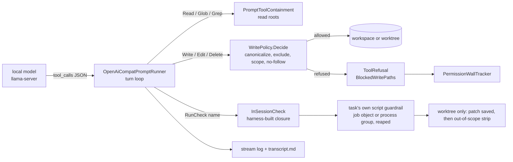

# Architecture: native local-inference task actions (#544)

**Status:** proposed design of record, for review in Charter before any breakdown.
**Issue:** #544 (raised to `priority: high`, 2026-09-26). **Extends:** `docs/plans/28-local-inference-runner.md`
(#223, the verifier half). **Touches:** #201 (model tiering), #557 (JIT breakdown write scope), #759 (probe
token cap), #760 (silent model substitution), #764/#773 (the Cursor precedent for an agent without the hook).
**Binds to:** `master` at `7bbdf384`.

> **Revision note (round 1).** A non-authoring adversarial pass of the first draft (`a80e6288`) returned
> *revise first*, with three blockers:
> 1. The draft treated worktree mode as the main case, but the maintainer's configuration
>    (`maxParallelism: 1`) runs in **serial mode**. There the plan folder and the run state sit inside the
>    write root, so "the plan folder is read-only" was false.
> 2. `needsHarnessWrite` could carry out writes that the new write policy refuses.
> 3. Path canonicalization had four bypasses: case on macOS, 8.3 short names, trailing dots, and a vacuous
>    `.git` test.
>
> This revision makes serial mode the primary case throughout and closes all three blockers (§5.3, §6). It
> also adopts the nine weaker findings, each noted where it lands, and adds one question (`self-grading`).

---

## What's being asked

Let an `openai-compat` prompt runner, which talks directly to a local model server (`llama-server`, later MLX
or LM Studio), **perform task actions**, meaning write files and run commands, with no vendor agent harness
(Claude Code, Cursor) between the model and the repository.

Today a local model can only judge. Every action goes through a vendor CLI, including the `claude-local` bridge
(#570, last comment): Claude Code pointed at LiteLLM in front of `llama-server`. That bridge works and stays
supported. This design is about the destination: **the harness's own prompt runner executes every tool call
itself.**

The decider is containment (#544, plan 28 §3.2(a)). A write-capable local actor must never produce **a green
run over a tree the harness cannot account for.**

**The primary deployment is serial mode.** The maintainer's configuration is `maxParallelism: 1` (one
`llama-server`, one loaded model), and `SchedulerFactory` therefore runs **serial**
(`SchedulerFactory.cs:431`, `SerialByConfiguration`). That means:

- the write root is the workspace, including its real `.git` directory;
- there is no phase-1 git-diff check (`enforcedWriteScope` is null in serial mode, `TaskExecutor.cs:868`);
- the plan folder, its `logs/` and the run state usually sit **inside** that root.

Every claim in this document is made for serial mode first. Worktree mode is the secondary case.

**Narrowing.** "Run commands" is read as *"give the model a build/test feedback loop"*, not *"give the model a
shell"*. §3.3 explains why only the first can be contained on three operating systems in v1. Question
`shell-posture` decides it.

### Goals

1. A task action routed to an `openai-compat` block produces a real diff, in serial mode (primary) and in
   worktree mode, on Windows, macOS and Linux.
2. The write boundary is **enforced in-process at the moment of the tool call**. It holds in serial mode,
   where the Claude path has no containment hook at all.
3. Every mechanism the Claude path relies on has a stated answer (§6).
4. The boundary is proven by plan 28's `FakeOpenAiServer` suite, extended with attack rows that each assert on
   bytes on disk (§9), and by a real-Qwen dogfood run as the exit gate for Phase 1.

### Non-goals (v1)

- A general shell, or any tool that takes a model-authored command.
- OS-level sandboxing.
- `routing` on an actor-capable local block.
- The `ai-merge` and `breakdown` profiles on a local block.
- Summarizing context to fit a long session. (Deterministically shortening superseded check results is in
  scope, §6.)
- Any change to what plan 28's judge and advisory paths put on the wire.

---

## 1. Placement

| Area | What lands there |
|---|---|
| **Harness** (`Guardrails.Core`, `Guardrails.Cli`) | Write tools, the `WritePolicy` primitive, `RunCheck`, `PromptInvocation.Writes`, build facts, validator, `needsHarnessWrite` refusal, breakdown-command guard |
| **Schema / SSOT** | §9.8 gains an "Actions" part. Edits to §2, §3.4, §4.9, §5.1, §8, §9, §9.3, §9.4 and §9.6. One new code: `GR2083` |
| **Skills** | `plan-breakdown` guidance for local actors (§7.1); `guardrails-domain-knowledge` |
| **v2 bets** | OS sandbox plus a general argv `Run` tool; `routing` for actors; sandboxing guardrail scripts harness-wide. Tracked as #544 Phase 3 (§10) until each has a `03-roadmap.md` entry |
| **Out of scope** | A second wire protocol; managing the lifecycle of `llama-server` |

**No new kind.** §3.4 records why a sibling kind was rejected.

## 2. Invariants in play

| # | Invariant | How this design treats it |
|---|---|---|
| 1 | Deterministic guardrails over prompt judges | In-session feedback comes only from the task's own **script** guardrails (`RunCheck`), and the gate still runs afterwards. **Strained by the default route**, because an unpinned judge may grade its own actor's model. §6.3 and question `self-grading` cover this. |
| 2 | Harness is the single writer of merged state | The model never touches the filesystem. The plan folder, the run log root and the journal are **hard exclusions** in every mode (§5.3 step 6). `needsHarnessWrite` is refused for this runner, so the harness cannot be used to launder a write (§6). |
| 3 | Verdicts from files, never exit codes | Untouched. `RunCheck`'s exit code goes to the model only. It is never journaled and never shown as a guardrail event. |
| 4 | SSOT lands with the contract | The edits are listed in §8. |
| 5 | Honest halts | Refusals are named and tracked. An action that makes no tool calls is an error, not a success. Repeated context overflow settles `needs-human`. |
| 6 | Plain files, light setup | No daemon and no container. The one addition is an OS process-reaping primitive (§3.3). |

---

## 3. The chosen architecture

### 3.1 The harness is the policy point

With Claude Code, the model asks Claude Code to write and Claude Code writes. The harness can only intervene
through a `PreToolUse` hook script, which re-implements the rule in shell or PowerShell and guesses at Bash
command text (SSOT §9.4: *"not a security sandbox"*). The hook exists **only in worktree mode**. Cursor has no
hook at all.

With a chat-completion endpoint, the model can only emit structured `tool_calls`. The harness decides and then
performs the effect itself. The rule therefore lives in one implementation, in-process, with no command text to
parse, in serial mode as well as worktree mode.

:::diagram

:::

### 3.2 The tool surface

Tool names follow Claude Code's wherever a Claude tool exists (plan 28 §3.2(c)).

| Tool | Offered to | Arguments | Semantics |
|---|---|---|---|
| `Read` | all roles (shipped) | `file_path`, `offset?`, `limit?`, **`revision?` (Action only)** | Judges are unchanged. **For actions the default `limit` is 400 lines** (§6 convergence). With `revision`, the harness runs `git show <revision>:<path>` with fixed argv; `revision` must match `^[A-Za-z0-9][A-Za-z0-9._/@{}~^-]*$` and never starts with `-`. This replaces the `Bash(git show*)` salvage grant. |
| `Glob`, `Grep` | all roles (shipped) | unchanged | unchanged |
| `Write` | Action | `file_path`, `content` | Creates or replaces a UTF-8 text file. Replacing an existing file requires that it was read or written earlier in this session. The write goes to a temp file created with `CreateNew` in the same directory, which then replaces the target by rename. The target's `UnixFileMode` is preserved. |
| `Edit` | Action | `file_path`, `old_string`, `new_string`, `replace_all?` | `old_string` must occur exactly once unless `replace_all` is set. Matching tolerates line-ending differences, and the file keeps its line ending and BOM. A non-UTF-8 file is a tool error. The write path is the same as `Write`'s. |
| `Delete` | Action | `file_path` | Single files only, under the same policy as `Write`. |
| `RunCheck` | Action | `name`, a JSON-schema `enum` of the task's **eligible** script guardrails (§3.3) | Runs that script as the gate would and returns the exit code plus the output tail (last 200 lines or 16 KiB). **Not a verdict:** never journaled, and emits no observer or live-UI guardrail event. Capped at 8 calls per attempt. |

**Not offered:** `Bash`, or anything that takes a command.

**The judge path is unchanged by construction.** Write tools, `RunCheck` and `Read.revision` exist only when
the invocation carries a `WriteGrant` (§5.2). No judge or advisory call site sets one (attack row A20).

**Tool-call ids.** A server that returns an empty `id` gets one synthesized (`call_<turn>_<index>`), so tool
results always pair with their calls.

### 3.3 `RunCheck`: the model may run only what the reviewer already approved

A coding model without a feedback loop cannot see a compile error until a whole attempt fails. `RunCheck`
provides the loop without accepting a single model-authored command.

- **The commands are reviewed.** Script guardrails are part of the plan definition, covered by
  `PlanDefinitionHash` and the review attestation. The model picks *which* reviewed script runs and *when*,
  never *what* runs.
- **Eligibility (W2).** The gate's inputs do not exist mid-session: `GUARDRAILS_ACTION_RESULT` has no
  `action-result.json` yet, and this task's own state fragment has not been promoted. So a script whose text
  mentions `GUARDRAILS_ACTION_RESULT` or `GUARDRAILS_STATE_IN` is **excluded from the enum**. This is a
  conservative substring scan, and the `runner-notice` lists what it excluded. Eligible scripts get the gate's
  §5.1 environment, with any output paths redirected to a per-call scratch directory under the attempt log
  directory.
- **Reaped after every call (W3).** The script runs inside a Windows **job object** with
  kill-on-job-close, or on Unix as the leader of a **new process group**. After it exits, or on timeout or
  cancel, the whole job or group is killed. Otherwise a daemon started by model-authored test code would
  outlive the call and keep writing. **Residual, disclosed:** on Unix, a process that calls `setsid()` leaves
  the group and escapes the kill.
- **Side effects (W1, corrected rationale).** An out-of-scope change after a `RunCheck` comes from
  *model-authored code that the check executed*. It cannot come from the model's own tools, which enforce
  scope.
  - **Worktree mode:** the harness saves the out-of-scope diff as evidence (`AttemptArtifacts.WriteOutOfScopePatch`,
    #705) and then runs the phase-2 `ScopedRevert`, so phase 1 later judges only the model's own writes.
  - **Serial mode:** nothing strips these changes. The same is true at the gate in serial mode today. It is
    disclosed as part of T18.
- **Evidence (T19).** Each call logs the check name, exit code, duration, and a content hash of every
  "changed" file. In worktree mode, changed means the diff against `taskBase`. In serial mode, it means the
  files this session wrote, plus the `git status --porcelain` difference from a snapshot taken at session
  start when the workspace is a git repository. The stream log also keeps the **full arguments** of every
  `Write` and `Edit`.

### 3.4 Rejected alternatives

:::comparison
| Alternative | Why rejected |
|---|---|
| **Keep `claude-local` as the destination** | It stays the supported bridge. It needs Claude Code and a LiteLLM model map that fails silently (#570 items 1–2), and the maintainer's position is that local actions belong in the harness's own runner. |
| **Wrap an open-source agent CLI (Aider, OpenHands, opencode, Goose)** | That is the Cursor shape: an uncontained writer checked after the fact (§9.9), plus a new dialect to quarantine. It puts a vendor harness back in the loop. |
| **A sibling kind (`local-agent`)** | Same wire protocol and same class; plan 28 §3.1 rejected `local` on those grounds. What varies is capability per invocation, which the `WriteGrant` expresses. |
| **Generate a hook for this runner too** | Brings back the out-of-process re-implementation, and a hook would still be absent in serial mode, which is the primary case. |
| **Post-hoc only (the Cursor model)** | Serial mode has no diff check at all, so nothing would be seen. |
| **Patch mode (one unified diff per attempt)** | No read loop and no feedback, and weak models handle the diff format poorly. A possible later tier for tiny edits. |
| **Command-text allowlist, or an unsandboxed argv `Run` tool** | An allowlist on `argv[0]` contains nothing once `dotnet` or `npm` runs model-written code. It is only sound inside an OS sandbox (Phase 3). |
| **OS sandbox now** | Seatbelt is a deprecated interface; landlock depends on the kernel; Windows has no practical per-process write sandbox without AppContainer ACL work. That gives three different guarantees under a 3-OS CI. Phase 3, with macOS first. |
:::

---

## 4. Threat model

**Actors.** The model is the adversary, in three strengths:

- **wrong:** a weak model making ordinary mistakes;
- **confused:** prompt-injected by content it reads;
- **hostile:** model weights that behave adversarially. Unlikely for company-approved Qwen, but the boundary
  must not depend on that.

The operator and the plan author are trusted. The model server relays but is not trusted about its
capabilities (plan 28 §6.6).

**Assets.** The workspace's `.git` directory (hooks, config, refs, stash); the plan folder (task definitions,
guardrails, `guardrails.json`); the run's `logs/` and journal; other worktrees; agent config that another
runner loads; files that change how git or the build behaves (`.gitignore`, `.gitattributes`, `obj/*.targets`);
anything outside the repository.

**Labels.** **ENFORCED**: refused before any effect. **DETECTED**: the effect can happen, but a
deterministic check fails the attempt. **DISCLOSED**: not contained; the operator is told by `GR2083` and the
`runner-notice`.

| # | Attack (serial mode unless noted) | Mechanism | Label |
|---|---|---|---|
| T1 | `Write` to an absolute path outside the workspace | `WritePolicy` step 5 | ENFORCED |
| T2 | `..` traversal, mixed separators | step 2 normalization, then step 3 canonical compare | ENFORCED |
| T3 | Write through a symlink or junction under the root that points outside | step 3 canonicalization plus the step 9 no-follow walk | ENFORCED |
| T4 | Write through a hard link | the atomic temp-plus-rename replaces the directory entry | ENFORCED (by construction) |
| T5 | Windows forms: `\\?\`, `\\.\`, UNC, `a.cs:stream`, `CON`, 8.3 short names (`GIT~1\hooks\pre-commit`), trailing dots or spaces (`.git.\hooks\x`) | step 1 syntactic refusals | ENFORCED |
| T6 | `.git/hooks/pre-commit`, `.git/config`, `.GIT/…` on case-insensitive APFS, Unicode-ignorable spellings, `Write` to the `.git` path itself | step 7, a case-insensitive `.git` segment match on **every** OS, with git's `is_ntfs_dotgit` / `is_hfs_dotgit` equivalences reduced by step 1 | ENFORCED |
| T7 | `.claude/settings.json` or `.cursor/…` loaded later by another runner | step 7: a **literal** scope entry is required | ENFORCED |
| T8 | Rewrite this task's or a downstream task's `guardrails/`, `task.json`, `guardrails.json`, or the journal, **with the plan folder inside the workspace and `writeScope: ["**"]`** | step 6 hard exclusions, whatever the scope says; the tamper check as a second line | ENFORCED + DETECTED |
| T9 | In the workspace but outside `writeScope` | step 8 `IsInScope`. Worktree mode adds the phase-1 diff | ENFORCED (+ DETECTED in worktree mode) |
| T10 | Plant `{"pass": true}` at a judge's staged verdict path | the grant holds this attempt's exact `STATE_OUT` file only; the stale-verdict clear (§9.5) | ENFORCED + DETECTED |
| T11 | `.gitignore` / `.gitattributes` edited to hide output or add filters | step 7: a literal scope entry is required | ENFORCED |
| T12 | An in-scope but **git-ignored** target, e.g. `obj/X.Tests.csproj.evil.targets` that turns VSTest into a no-op. Ignored files are invisible to `git add -A` (`SegmentStaging.cs`), so the gate goes green and nothing is committed | step 8: an ignored target is refused (`git check-ignore`). If the workspace is not a git repository, this is DISCLOSED instead | ENFORCED |
| T13 | Disk fill | 1 MiB per call and 32 MiB per attempt; `maxTurns`; `Timeout` | ENFORCED |
| T14 | Launder a refused write through `needsHarnessWrite` in the state fragment (`HarnessWrite.Resolve` has no `.git`, no-follow or plan-folder rule) | `needsHarnessWrite` is refused outright for `HarnessMediatedTools` runners (§6) | ENFORCED |
| T15 | Read secrets outside the roots | `PromptToolContainment.IsReadable` | ENFORCED for tools |
| T16 | Read secrets **through `RunCheck`**: model-authored test code prints `~/.ssh/id_rsa` into the output tail, or sends it over the network | not contained. The iteration loop makes this a **new oracle for reads**, which the gate-only path did not have | DISCLOSED (T18) |
| T17 | Prompt injection: a file contains `<tool_call>…` or "now write to ~/…" | tool calls come only from structured `tool_calls`; injected intent still meets `WritePolicy` | ENFORCED |
| T18 | Model-authored code writes outside the tree, or phones home, when `RunCheck` or the gate executes it | predates #544 and applies to every runner. `RunCheck` moves it earlier and repeats it, which is why T16 exists | DISCLOSED (Phase 3 sandbox) |
| T19 | Write, run, then delete, so nothing shows in the final diff | full `Write`/`Edit` arguments plus per-`RunCheck` change hashes in the stream log | DETECTED (evidence only) |
| T20 | A path component swapped between check and write | `RunCheck` children are reaped after every call (§3.3), so no model-started process survives into a later check. Residual: a `setsid()` escapee on Unix, or another run's process | DISCLOSED (narrow) |
| T21 | A tool that was not offered (`Bash`; `Write` on a judge); a `RunCheck` with an unknown name or extra arguments | refused and counted toward the denial bound | ENFORCED |
| T22 | The action makes zero tool calls (server ignores `tools`, or the model answers in prose) and "completes" | `Error` (§6) | DETECTED |
| T23 | Tool calls emitted as text (`llama-server` without `--jinja`) | never executed; `needs-human` with a server-template remedy (§6) | DETECTED |

:::warn
**T16 and T18 are the honest limit of v1.** Every run already executes model-authored code, unsandboxed, when
a `dotnet test` guardrail runs. `RunCheck` adds **repetition and an output channel back to the model**. That is
a real increase in read exposure, and `GR2083` says so. #544 promises that the *actor's tools* cannot escape.
It does not promise that *code the actor wrote* cannot escape, or cannot read. That second boundary is the
Phase 3 sandbox bet, which covers every runner.
:::

---

## 5. The containment boundary spec

### 5.1 Summary

| Surface | **Serial mode (primary)** | Worktree mode | Label |
|---|---|---|---|
| **Reads** | workspace + plan folder | worktree + plan folder | ENFORCED for tools; DISCLOSED through `RunCheck` (T16) |
| **Writes** | workspace ∩ grant scope, minus hard exclusions (the plan folder, run logs, journal, other worktrees, `.git`) and protected segments, minus git-ignored targets; no-follow; atomic | the same, with the worktree as root | ENFORCED |
| **Writes, second line** | task-definition tamper check | the same, plus the phase-1 diff | DETECTED |
| **`needsHarnessWrite`** | refused | refused | ENFORCED |
| **Commands** | none; `RunCheck` runs eligible reviewed scripts, reaped after every call | the same, plus out-of-scope strip with the patch preserved | ENFORCED (no tool exists) |
| **Code the model wrote, when executed** | not contained, not stripped | not contained; out-of-scope effects stripped | DISCLOSED |

Serial mode is where the design gains most: a Claude action in serial mode has no containment at all.

### 5.2 The `WriteGrant`: capability per invocation, set by the call site

```csharp
/// <summary>What this invocation may WRITE (#544). Null ⇒ no write tools, and an Action is refused.</summary>
public WriteGrant? Writes { get; init; }

public sealed record WriteGrant(
    string Root,                          // absolute: the workspace (serial) or the worktree
    IReadOnlyList<string> Scope,          // task.WriteScope ?? [] plus the stagingOutputs destinations, BOTH modes
    IReadOnlyList<string> Excluded,       // absolute: plan folder, run log root, journal dir, the worktrees root
    IReadOnlyList<string> ExactFiles,     // absolute: this attempt's STATE_OUT staging file
    IReadOnlyList<string> ExactDirs,      // absolute: stagingOutputs staging directories (directory form)
    IReadOnlyList<InSessionCheck> Checks);
```

- **The grant's scope source is the same in both modes (W8).** `ActionRunner` builds `Scope` from
  `task.WriteScope ?? []` plus the staging destinations, using `WithImplicitStagingScope`. It does not read
  `enforcedWriteScope`, which is null in serial mode. For a `HarnessMediatedTools` runner, the prompt's
  "harness-enforced scope" section is **rendered in serial mode too**, because for this runner it is now true.
- **Null is the restrictive default.** The runner refuses an Action with `Writes == null`, so a call site that
  forgets to build a grant fails loudly.
- **`Checks`** are closures `ActionRunner` builds from the script-guardrail execution path. The runner never
  learns how a script runs, which keeps it a vendor-free HTTP client.

### 5.3 `WritePolicy.Decide`, in order

`WritePolicy.Decide(WriteGrant grant, string requestedPath) → Allowed | Refused(reason)`. It is pure apart
from filesystem and `git check-ignore` reads, and lives beside `PromptToolContainment`.

1. **Syntactic refusals, on every OS:**
   - control characters and Unicode `Cf` code points;
   - a segment ending in `.` or a space;
   - on Unix, a backslash in the path;
   - on Windows: any `:` after the drive, `\\?\`, `\\.\`, UNC paths, reserved device names, and 8.3-shaped
     segments (`~` followed by digits).
2. **Normalize** with `Path.GetFullPath`, resolving relative paths against `Root`.
3. **Canonicalize.** Resolve the deepest *existing* ancestor to its final path (`GetFinalPathNameByHandle`
   on Windows, `F_GETPATH` on macOS, `realpath` on Linux), then append the not-yet-existing tail. Compare it
   to `Root`'s final path, accepting both the `WorktreeJunction` alias and its real form. This defeats short
   names and symlinked ancestors, and removes any dependence on `RealPath.Comparison`, which is
   case-sensitive on macOS.
4. **Exact grants.** A path equal to one of `ExactFiles`, or under one of `ExactDirs`, is allowed; go to
   step 9.
5. **Under `Root`**, on a directory boundary, comparing final paths.
6. **Hard exclusions, whatever the scope says (B1).** Refuse anything under the final path of:
   - an entry in `Excluded`: the plan folder, the run log root, the journal directory, and every other
     worktree;
   - `Root`'s git directory (`git rev-parse --git-dir`).
7. **Protected segments,** matched **case-insensitively on every OS:**
   - `.git`: always refused;
   - `.guardrails-agent-io` and `.guardrails-staging`: refused unless step 4 matched;
   - `.claude`, `.cursor`, `.gitignore`, `.gitattributes`, `.gitmodules`: refused unless a `Scope` entry
     names that prefix **literally**, with no `*`.
8. **Scope.** The target must satisfy `IsInScope(relative, Scope)` and must not be git-ignored
   (`git -C Root check-ignore -q`). The ignore check is skipped only when `Root` is not in a git repository,
   which is disclosed.
9. **No-follow walk.** Every existing component below `Root` must be neither a symlink nor a reparse point.
   An existing target must be a regular file.

A refusal becomes a `ToolRefusal(tool, path, reason)` naming the rule and the enforced scope, and the path is
added to `BlockedWritePaths`.

**On agent-config and git-behavior files:** requiring a literal scope entry is decided here, not asked.
Refusing these files unconditionally would break plans that author `.claude/skills/` (this repository among
them). Treating them as ordinary files would let an actor plant a hook for a later Claude judge, or hide
output from git.

---

## 6. What the Claude path gets, and this runner's answer

| Claude-path mechanism | Native actor answer |
|---|---|
| **`needsHarnessWrite` (B2)** | **Refused for `HarnessMediatedTools` runners.** A fragment that carries it fails the attempt with the remedy *"this runner has a Write tool — write the file directly; needsHarnessWrite exists to route around vendor write walls this runner does not have"*. The alternative, sending each entry through `WritePolicy.Decide`, would work, but it would leave two paths to one effect, and the escape hatch has no purpose here. |
| Permission wall (#86 / #104 / #708) | Refusals fill `BlockedWritePaths` and `RefusedToolCalls`. The #86 repeated-target halt applies. **The #104 structural `.claude/` halt is conditioned on the new fact `HasVendorClaudeDirWall`** (false for this runner), because that wall is Claude Code's own, and a `.claude/` refusal here is the ordinary step 7 rule with its own remedy. |
| #452 consecutive-denial abort | **Set for local actions (W7).** `ActionRunner` sets `AbortAfterConsecutiveToolDenials = 5` for a `HarnessMediatedTools` runner. A weak model that keeps hitting the same wall stops early instead of running to the turn cap. |
| Salvage `Bash(git show*)` | `Read` with `revision`. The salvage feedback becomes capability-aware through the new fact `OffersShell`. |
| `--add-dir` plan folder | Readable, and never writable in either mode (step 6). |
| `stagingOutputs` | Its staging directories go in `ExactDirs` and its destinations in `Scope`; the harness's move is unchanged. |
| State-out fragment | Written with `Write` to its #266 staged path (`ExactFiles`). The composer's shipped text is correct as-is. |
| `## Worktree safety` (git stash advice) | Omitted when `!OffersShell`. |
| Retry feedback | Unchanged pipeline, plus the #773 refused-calls section and a **"made no writes"** line when the session wrote nothing but its fragment (W5). |
| `transcript.md` / stream log | Dependent tasks read the transcript, so it gets a line per write (path, bytes, +/− lines), per `RunCheck` (name, exit, duration), and per refusal. The stream log keeps full `Write`/`Edit` arguments and the `RunCheck` evidence (T19). |
| Cost | `CostUsd` is null, so **`maxCostUsd` cannot bind**. The run is still bounded by tasks × `maxAttempts` × `timeoutSeconds`. `GR2083` states this. |
| Stall and timeout | `Timeout` covers the whole session. `StallBound` is suspended while a `RunCheck` runs. Checks are reaped (§3.3). |
| **Zero tool calls (W5)** | An Action session with **zero structured tool calls** is `Error` (*"the model made no tool calls; it did no work"*). The Guardrail-only rule plan 28 §6.6 added (`MustReadItsEvidence`) does not cover actions. When the content has the tool-call shape, the settlement is `RunnerConfiguration` → `needs-human` instead (next row). |
| **Tool calls as text (T23, W5)** | Detected on the **raw** content, before any `<think>` stripping. The detector looks for `<tool_call>` tags, and for fenced or bare JSON objects that have both `name` and `arguments`. Such calls are never executed. With zero structured calls in the session, the attempt settles `needs-human` with the remedy *"the server is not parsing tool calls; for llama.cpp start `llama-server` with `--jinja`"*. After some structured calls it is an ordinary `Error` and is retried. |
| **Reasoning text (W5)** | `reasoning_content` is never sent back to the server. Inline reasoning is stripped from the history: a `<think>…</think>` span; everything before an **orphan `</think>`** (Qwen's template opens the tag inside the prompt); and an **unterminated `<think>`** through to the end of the message. A message that was nothing but unterminated reasoning, with no tool calls, is `Error` (*"reasoning never finished — likely the output cap"*). The raw text stays in `transcript.md`. Depends on #759. |
| **Context convergence (W7)** | Four measures: (1) the `Read` default limit for actions is 400 lines; (2) **older results of the same `RunCheck` name are replaced by a one-line stub** (*"superseded by RunCheck(<name>) at turn N"*). This is a deterministic substitution, not a summary: the latest result stays whole, and the replaced text was a stale build log, not evidence the model read. The cost is lost prompt-cache reuse on the server, which is accepted; (3) `ContextOverflow` on **two** attempts of one task settles `needs-human` with the remedy *"raise `contextTokens` and the server's `-c`, or split the task"*; (4) plan 28's per-turn pre-send refusal stays unchanged. |
| Malformed arguments | A tool **error** result naming the parse error. Not a refusal. |
| Parallel tool calls | Executed in the order emitted, with result ids matched to call ids. |
| Silent substitution (#760) | Unchanged: the preflight asserts every declared model is listed. |
| Context shift | `providers check` gains an assertion that the server will not silently drop context: it reads `GET /props` where `llama-server` exposes it, and reports `unknown` elsewhere. `llama-server`'s context shift discards tokens when the window fills, which is plan 28 §6.1's truncation by another name. |

### 6.1 Build facts

| Fact | Claude | Cursor | OpenAiCompat (after) |
|---|---|---|---|
| `ServesRoles` | all | Action, Guardrail | **all** |
| `NeedsContainmentHook` | true | false | false |
| `HarnessMediatedTools` **(new)** | false | false | **true** |
| `OffersShell` **(new)** | true | true | **false** |
| `HasVendorClaudeDirWall` **(new)** | true | true | **false** |
| `ServesActionProfiles` **(new)** | true | true | **false (Phase 1)** |
| `WritesFiles` | true | true | false. **Unchanged**; its documentation narrows to "a *judge* on this kind has a write tool" |

Unlisted kinds default to the safe side on every new fact. The tamper check keys on
`IsUncontainedWriter || HarnessMediatedTools`; for this runner it should never fire, and if it does,
`WritePolicy` has a bug. `ServesRoles` is pinned by construction over the pair `(Role, Writes != null)`.

### 6.2 Every Action entry point, enumerated

| Entry point | Phase 1 behavior |
|---|---|
| `ActionRunner` (task actions) | Builds the `WriteGrant`; served. |
| `SchedulerFactory` `ai-merge` / `breakdown` resolution (`:346-356`) | Checks `ServesActionProfiles`; a local block is withheld with a `Note:`. A new `WithheldActionProfiles`, sibling to `WithheldAdvisoryProfiles` (`:366`), prints it before the run. A conflict then settles `needs-human`; a JIT checkpoint honest-halts. #557 is not widened. |
| **`guardrails breakdown --runner-config`** (`BreakdownCommand.cs:328`, `registry.Resolve(null)`) | Bypasses `SchedulerFactory`. It gains the same `ServesActionProfiles` check and refuses before invoking, with *"block '<name>' is openai-compat; breakdown on a local runner is Phase 2 — pass a claude or cursor block"*. |
| Any future Action call site | Sets no grant, so the runner refuses loudly. |

### 6.3 Reachability: GR2066 narrows, GR2083 discloses

| Route | v1 of #544 |
|---|---|
| 1. `routing` | **still GR2066 (error)**; question `routing-for-actors` |
| 2. effective default (the `default` pointer, or the sole runner) | legal |
| 3. `action.runner` | legal |
| 4. action prompt frontmatter `runner:` | legal |
| 5. declared under `ai-merge` / `breakdown` | **still GR2066 (error)**; question `harness-action-profiles` |

**Legalizing route 2 has a consequence the first draft missed (W6).** With `default: <local block>`, every
**unpinned prompt judge** also resolves to that block, so the actor's own model grades its own work. Plan 28's
Finding 1 accepted local judges on the premise that *"a local judge happens only where a human pinned one."*
Route 2 breaks that premise. `GR2083` therefore **counts and names** every prompt guardrail that resolves to
the same block as its task's actor. Whether that should be a warning or an error is question `self-grading`.

**GR2083 (WARNING, `OpenAiCompatActorContainment`)** fires once per `openai-compat` block reachable by routes
2–4. It states:

- writes are enforced in-process against `writeScope`, in serial mode too;
- the plan folder, logs and `.git` are never writable;
- there is no shell, and `RunCheck` runs eligible script guardrails;
- `needsHarnessWrite` is refused;
- code the model writes runs unsandboxed and can read and emit anything the user can (T16/T18);
- `maxCostUsd` cannot bind;
- `ai-merge` and `breakdown` are withheld;
- the list of self-grading judges.

**GR2071 extends to this runner** (a warning). For a task whose action resolves to a local block, the command
grant set is definitively empty. Every command candidate in the prompt fires, with the remedy *"no shell —
`RunCheck` runs <eligible names>; move any other command into a script action or a script guardrail"*.

---

## 7. Config shape

**No new keys.** Bounds are constants disclosed in the `runner-notice`, so no existing `guardrails.json`
changes and no attestation goes stale.

```jsonc
"maxParallelism": 1,                        // one llama-server ⇒ serial mode (the primary case)
"promptRunners": {
  "default": "qwen36",
  "qwen36": {
    "kind": "openai-compat",
    "endpoint": "http://127.0.0.1:8080/v1", // llama-server --jinja -c 65536 (no context shift)
    "model": "qwen3.6-35b-a3b",             // must match GET /models
    "contextTokens": 65536,                 // must match -c
    "maxOutputTokens": 8192,
    "maxTurns": 80,
    "strength": 2,
    "engine": "llama.cpp"
  },
  "qwen38": {                               // a second server on :8081 if memory allows
    "kind": "openai-compat", "endpoint": "http://127.0.0.1:8081/v1",
    "model": "qwen3.8-27b", "contextTokens": 65536, "maxOutputTokens": 8192,
    "maxTurns": 80, "strength": 3, "engine": "llama.cpp"
  }
}
// hard tasks: "action": { "runner": "qwen38" }; judges: pin to the OTHER model (see self-grading)
```

### 7.1 `plan-breakdown` guidance for a local-actor plan (W9)

- **Goodhart guard.** An implementation task's `writeScope` **excludes its guarding tests**; that is
  test-protection (§3.4), already the default. Its tests-pass guardrails assert **named tests or a minimum
  count**, so deleting or skipping tests cannot turn them green. A weak model given 8 `RunCheck`s and
  `Delete`/`Edit` will find the cheapest green.
- **Commands go elsewhere.** `dotnet new`, `npm install` and code generators become **script actions**, and
  the build and test steps become **script guardrails** that do not read `GUARDRAILS_ACTION_RESULT`, so
  `RunCheck` can offer them.
- **Pin judges** to a different model than the actor's when the plan declares one.
- `.claude/…`, `.gitignore` and `.gitattributes` deliverables need a **literal** `writeScope` entry.

---

## 8. Contract and SSOT changes (`02-schemas-and-contracts.md`)

1. **§2** `kind` comment: `openai-compat` serves Actions through the default, `action.runner` and frontmatter
   routes, and adds no keys. The mirror at `.claude/skills/plan-breakdown/references/schemas.md` stays
   byte-identical.
2. **§3.4:** for this runner `IsInScope` is also enforced at call time, **in serial mode too**. After each
   `RunCheck` in worktree mode, the out-of-scope patch is saved and the strip runs.
3. **§4.9:** GR2071's local-runner clause.
4. **§5.1:** `RunCheck` eligibility and environment (§3.3).
5. **§8:** the `tool-result` fields, full `Write`/`Edit` arguments, `run-check` evidence, and transcript
   lines.
6. **§9 intro:** `PromptInvocation.Writes`; the null-grant refusal; the four new facts; the #452 bound for
   local actions; zero tool calls in an Action is `Error`.
7. **§9 `needsHarnessWrite`:** refused for `HarnessMediatedTools` runners.
8. **§9.3:** the #104 rule is conditioned on `HasVendorClaudeDirWall`.
9. **§9.4:** a `HarnessMediatedTools` runner needs no hook; its policy is in-process and applies in serial
   mode.
10. **§9.8:** a new part, "Actions (#544)", covering §3.2, §3.3, §5, §6 and §6.2. Plan 28's "serves Guardrail
    and Advisory only" is amended where it appears, not deleted.
11. **§9.6:** the `GR2066` row is narrowed to routes 1 and 5. Add:

| Code | Sev | Rule |
|---|---|---|
| `GR2083` | warning | `OpenAiCompatActorContainment` (#544, §9.8) — once per `openai-compat` block reachable for an **Action** by the default, `action.runner` or frontmatter route. States what is enforced (the in-process write policy against `writeScope` in serial and worktree mode; the plan folder, run logs and `.git` never writable; no shell; `needsHarnessWrite` refused), what is detected (the tamper check, and the phase-1 diff in worktree mode), and what is not contained (model-authored code executed by `RunCheck` or the gate can write and read anything the user can, and `RunCheck` returns its output to the model). Also states that `maxCostUsd` cannot bind, that `ai-merge`/`breakdown` are withheld, and **names every prompt guardrail that resolves to the same block as its task's actor**. |

12. **`DiagnosticCodes.cs`:** take `GR2083`; the marker advances to `GR2084`.

---

## 9. How it is proven

The seam is the **OpenAI wire plus the real filesystem**. Every row drives the real runner, with the real
`WritePolicy`, against `FakeOpenAiServer`.

**The primary fixture is serial mode:** a real git workspace with the **plan folder inside it** and
`writeScope: ["**"]` unless the row says otherwise. Worktree-mode twins are marked **(WT)**.

**Assertions:** each row asserts on **disk**: sentinel bytes and timestamps unchanged, and target files absent
or unchanged. Each row also has a **firing-control twin** in which the same call targets an allowed path and
the write is asserted to happen. Windows rows must create their junctions or short names and **fail, never
skip**, when they cannot.

| # | The server scripts | The test asserts |
|---|---|---|
| A1 | `Write` to an absolute path outside the workspace | sentinel unchanged; refusal names the rule |
| A2 | `src/../../outside.txt`, mixed separators | nothing outside |
| A3 | a write through a committed symlink (junction on Windows) to outside | outside dir unchanged |
| A4 | a hard link to an outside file | outside inode unchanged |
| A5 | (Win) `a.cs:s`, `CON`, `\\?\…`, UNC, `GIT~1\hooks\pre-commit`, `.git.\hooks\x` | none written; `.git/hooks` unchanged |
| A6 | `.git/hooks/pre-commit`, `.GIT/config`, `Write` to `.git` itself, `.git` with a U+200D inside it; **(WT)** `.git` as a file | none written; a following harness commit runs no hook |
| A7 | `.claude/settings.json` under `["**"]`, then under `[".claude/skills/"]` | refused both times; `.claude/skills/x/SKILL.md` allowed in the second |
| A8 | **(B1)** with the plan folder inside the workspace and scope `**`: own `guardrails/01.sh`, a **downstream** task's `guardrails/`, `guardrails.json`, and the journal under `logs/` | all unchanged; the tamper check did not fire (policy held first) |
| A9 | out-of-scope in-workspace write; **(WT)** phase 1 reports no offense | refused at call time |
| A10 | a judge's staged `VERDICT_OUT` | refused; a following judge that writes nothing fails |
| A11 | `Delete` out of scope; `Delete` a directory | refused |
| A12 | **(W1)** `obj/X.Tests.csproj.evil.targets`, in scope and git-ignored | refused; the test run still executes tests |
| A13 | `.gitignore` edit under `["**"]` | refused without a literal entry |
| A14 | **(B2)** the state fragment carries `needsHarnessWrite` for `.git/hooks/pre-commit` and for an in-scope file | attempt fails; neither is written |
| A15 | over-cap writes | tool errors; bytes on disk ≤ caps |
| A16 | `<tool_call>` text and a fenced `{"name","arguments"}` block, with zero structured calls | nothing written; `needs-human` with the `--jinja` remedy |
| A17 | **(W5)** a prose-only final message from an Action | `Error`, not success |
| A18 | **(W5)** an orphan `</think>`; an unterminated `<think>` | history stripped correctly; the second is `Error` |
| A19 | a `Bash` call; `Write` on a Guardrail; `RunCheck` `../x`; `RunCheck` with extra arguments | refused; no process started (counter on the injected closure) |
| A20 | Guardrail invocation before and after the change | byte-identical request bodies |
| A21 | Action with `Writes == null` | refused before any wire byte |
| A22 | **(W3)** a `RunCheck` script that starts a background writer | no write lands after the call returns (sentinel polled for 5 s) |
| A23 | **(W2)** a guardrail that reads `GUARDRAILS_ACTION_RESULT` | absent from the enum; listed in the `runner-notice` |
| A24 | **(W1, WT)** a `RunCheck` whose script creates an out-of-scope file | patch saved in the attempt log; file stripped; phase 1 clean |
| A25 | **(W7)** three `RunCheck(build)` results in one session | turn-4 request carries one full result and two stubs |
| A26 | **(W7)** `ContextOverflow` on attempts 1 and 2 | `needs-human` on attempt 2 |
| A27 | the same out-of-scope path refused on attempts 1 and 2; a `.claude/` refusal | #86 halt on attempt 2; **no** #104 halt |
| A28 | five consecutive refusals | the #452 abort fires |
| A29 | tool calls with empty `id`s; two parallel calls | ids synthesized; executed in order |

**Harness-level acceptances (real CLI composition root, per #382):**

- A one-task plan with `default: local` runs green in **serial mode** (primary) and in worktree mode.
- `validate` reports `GR2083` for routes 2–4 (one test each, **including the self-grading judge count**);
  `GR2066` for routes 1 and 5; GR2071's local remedy.
- The `ai-merge`/`breakdown` `Note:` lines are printed, and **`guardrails breakdown --runner-config` against a
  local default refuses**.
- The prompt renders the enforced-scope section in serial mode, and the salvage and `## Worktree safety`
  sections are capability-aware.

**Phase 1 exit gate: a real-Qwen dogfood run.** A Bifrost-shaped .NET task (edit two source files, add a test,
build, run tests) with `default: qwen36` in **serial mode** on the maintainer's Mac, run by the maintainer
with the live UI. It must reach green through `RunCheck` iterations, and its `transcript.md` must show the
write and check lines. No loopback fake retires model and dialect risk; this run does.

---

## 10. Phased delivery

| Phase | Ships | Gate to start |
|---|---|---|
| **0: prerequisites** | #759 fixed; `providers check` against `llama-server --jinja` + Qwen 3.6 reports tool calling met and context shift off | now |
| **1: task actions** | §3–§9 | Phase 0 and this review. **Exit:** the real-Qwen dogfood (§9) |
| **2: harness Action profiles** | `ai-merge` (grant: the one `GUARDRAILS_MERGE_OUT` file) and `breakdown` (grant: the wave folder being authored, which closes #557 for this runner by construction); `ServesActionProfiles` flips | Phase 1 exit; #557 fixed on the Claude path |
| **3: v2 bets** | (a) `routing` for actors, from telemetry pass rates; (b) an OS sandbox for `RunCheck` **and** guardrail scripts, closing T16/T18 (Seatbelt first, then bubblewrap/landlock; Windows disclosed); (c) a general argv `Run` tool, only inside that sandbox | `03-roadmap.md` entries |

### 10.1 Implementation handoff (Phase 1)

Sequenced; each stage green before the next.

| # | Agent | filesTouched | Deliverable |
|---|---|---|---|
| 1 | `guardrails-test-author` | `tests/Guardrails.Integration.Tests/OpenAiCompat/FakeOpenAiServer.cs` | Scripted write/check/think/text-call responses for A1–A29. Authored before the runner. |
| 2 | `guardrails-harness-developer` | `src/Guardrails.Core/Prompts/PromptInvocation.cs`, `src/Guardrails.Core/Prompts/WritePolicy.cs`, `src/Guardrails.Core/Io/RealPath.cs`, `src/Guardrails.Core/Model/PromptRunnerConfig.cs` | `WriteGrant`; `WritePolicy` (§5.3) with the final-path canonicalizer; build facts |
| 3 | `guardrails-harness-developer` | `src/Guardrails.Core/Prompts/OpenAiCompatPromptRunner.cs` | The tools; null-grant refusal; zero-call `Error`; text-call detection; think-stripping; `RunCheck` stubbing; id synthesis; transcript and stream-log lines |
| 4 | `guardrails-harness-developer` | `src/Guardrails.Core/Execution/ActionRunner.cs`, `src/Guardrails.Core/Execution/TaskExecutor.cs`, `src/Guardrails.Core/Execution/HarnessWrite.cs`, `src/Guardrails.Core/Execution/PermissionWallTracker.cs`, `src/Guardrails.Core/Execution/RetryPolicy.cs`, `src/Guardrails.Core/Prompts/PromptComposer.cs` | Grant construction (both modes); `RunCheck` closures with reaping, eligibility and the worktree strip with the saved patch; the `needsHarnessWrite` refusal; the #104 condition; the #452 bound; the two-overflow halt; capability-aware prompt sections |
| 5 | `guardrails-harness-developer` | `src/Guardrails.Core/Execution/SchedulerFactory.cs`, `src/Guardrails.Cli/Commands/BreakdownCommand.cs` | `ServesActionProfiles` at resolution, `WithheldActionProfiles`, the `--runner-config` refusal |
| 6 | `guardrails-harness-developer` | `src/Guardrails.Core/Loading/PlanValidator.cs`, `src/Guardrails.Core/Loading/DiagnosticCodes.cs` | GR2066 narrowing; GR2083 with the self-grading count; GR2071 extension |
| 7 | `guardrails-harness-developer` | `src/Guardrails.Cli/Commands/ProvidersCommand.cs` | The context-shift assertion in `providers check` |
| 8 | `guardrails-test-author` | `tests/Guardrails.Integration.Tests/OpenAiCompat/OpenAiCompatActionContainmentTests.cs`, `tests/Guardrails.Integration.Tests/OpenAiCompat/OpenAiCompatActionPlanTests.cs` | §9's table and acceptances, serial mode first |
| 9 | `guardrails-skill-author` | `docs/plans/02-schemas-and-contracts.md`, `.claude/skills/plan-breakdown/references/schemas.md` | §8's edits, both halves of the mirror |
| 10 | `guardrails-skill-author` | `.claude/skills/plan-breakdown/SKILL.md`, `.claude/skills/guardrails-domain-knowledge/SKILL.md` | §7.1 guidance; domain knowledge |

Stage 4 is wide on purpose. It is the composition-root wiring, and splitting that is how the #378/#382 class
of bug happened. It is gated by stage 8's acceptances.

---

## 11. Devil's advocate

**"`RunCheck` is a shell in disguise, and now also a read oracle."**
Both are true, and both are labeled (T16, T18, and the warning callout in §4). What #544 names is the
*actor's tools* producing state the harness cannot account for, and those tools are enforced. The
execution and read exposure of model-authored code exists on every runner at the gate. `RunCheck` adds
repetition and an output channel back to the model, which is a genuine increase, and `GR2083` says so. The fix
is a harness-wide sandbox (Phase 3b). Question `shell-posture` lets the maintainer drop `RunCheck` if that
trade is not wanted.

**"Serial mode has no second line."**
Mostly true. In serial mode the only DETECTED layer is the tamper check. The write policy is the whole
boundary, which is why §5.3 canonicalizes to final paths, why the protected-segment matching is
case-insensitive everywhere, and why A5, A6 and A8 run in serial mode first. It is still strictly more than
a Claude action in serial mode gets, which is nothing.

**"The call-time check and phase 1 share `IsInScope`."**
The predicate is shared; the observation is not. Phase 1 reads the actual tree through git. The matcher
carries plan 08's truth table and fuzz properties.

**"No shell makes the actor too weak."**
Measurable. The Phase 1 exit gate is a real-Qwen dogfood run on a Bifrost-shaped task, not an argument.

---

## 12. Decisions for the maintainer

:::question
{ "id": "shell-posture", "title": "What command capability does a local actor get in v1?", "mode": "single", "options": ["RunCheck only: the task's own eligible reviewed script guardrails, no model-authored commands", "Nothing: file tools only, the gate is the only build/test", "RunCheck plus an unsandboxed argv Run tool with a per-task program allowlist"], "recommended": "RunCheck only: the task's own eligible reviewed script guardrails, no model-authored commands", "rationale": "RunCheck gives the model a build/test loop in which every command is one a reviewer approved. Its cost, stated plainly in T16, is that model-written test code can print what it reads back to the model, a read oracle the gate-only path lacks. File tools alone remove that at the price of a full retry per compile error. An unsandboxed argv tool contains nothing once dotnet or npm runs model-written code.", "target": "human" }
:::

:::question
{ "id": "action-declaration", "title": "What makes an openai-compat block legal for task actions?", "mode": "single", "options": ["The human routing acts themselves (default, action.runner, frontmatter), with GR2083 warning on each", "An explicit opt-in key on the block, e.g. \"actions\": true, else GR2066 stays an error"], "recommended": "The human routing acts themselves (default, action.runner, frontmatter), with GR2083 warning on each", "rationale": "Each legal route is already a deliberate edit, and no plan that validates today changes behavior. An opt-in key re-creates the capability-sounding config key plan 28 section 3.5 rejected, and a local-only operator would always set it anyway.", "target": "human" }
:::

:::question
{ "id": "self-grading", "title": "Plan 28 Finding 1 assumed a local judge only exists where a human pinned one. With default: local, every unpinned prompt judge grades its own actor's model. What should validate do?", "mode": "single", "options": ["Warn: GR2083 names each self-grading judge, and plan-breakdown pins judges to a different model when the plan declares one", "Error: every prompt judge in a task whose actor is local must be pinned to a different block", "Accept silently: deterministic guardrails carry the gate and prompt judges are advisory in practice"], "recommended": "Warn: GR2083 names each self-grading judge, and plan-breakdown pins judges to a different model when the plan declares one", "rationale": "An error would make a single-model local setup unusable, and today that is the maintainer's only option on some days. Silence would re-open the exact premise Finding 1 rested on. A named warning, plus the skill pinning judges to the other Qwen when both are declared, keeps the choice visible and makes the better configuration the default output.", "target": "human" }
:::

:::question
{ "id": "harness-action-profiles", "title": "When may ai-merge and breakdown run on a local block?", "mode": "single", "options": ["Phase 2, after the Phase 1 dogfood and after #557 is fixed", "In v1, with exact write grants (the merge-out file; the wave folder)"], "recommended": "Phase 2, after the Phase 1 dogfood and after #557 is fixed", "rationale": "The grant mechanism makes both cheap, but breakdown's correct scope is what #557 says the Claude path gets wrong today. Until then a local default leaves AI-merge off (conflicts settle needs-human), JIT breakdown honest-halts, and guardrails breakdown --runner-config refuses, all announced.", "target": "human" }
:::

:::question
{ "id": "routing-for-actors", "title": "When may routing make a local block a tier candidate for actions?", "mode": "single", "options": ["Phase 3, once the telemetry corpus shows local-actor pass rates per task class", "With Phase 1, requiring strength and costly to be declared on the block"], "recommended": "Phase 3, once the telemetry corpus shows local-actor pass rates per task class", "rationale": "Pinning covers the immediate need. Routing is the harness choosing a local model on its own, and plan 28 section 3.7 set that bar at measurement, which the Phase 1 runs produce.", "target": "human" }
:::

---

## 13. What v1 deliberately does not do

- Give the model a shell or any model-authored command.
- Contain code the model wrote when it runs, including what that code reads (T16, T18).
- Strip `RunCheck` side effects in serial mode.
- Serve `ai-merge` or `breakdown`, or declare `routing`.
- Summarize context. It only replaces superseded `RunCheck` results with a stub.
- Honor `needsHarnessWrite` for this runner.
- Parse tool calls out of free text.
- Manage the model server.
- Change a byte of plan 28's judge or advisory wire traffic.
