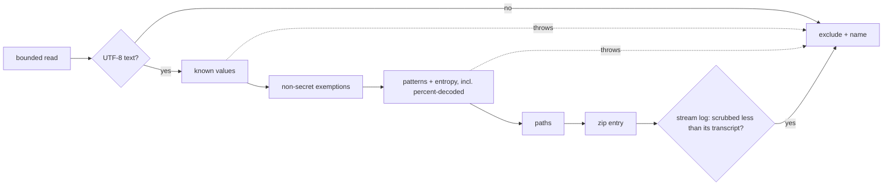

# `guardrails bundle`: a run's evidence in one redacted zip (#799)

**What's being asked.** Dogfood issues are now often filed by the agent on the operator's machine, and that
agent is frequently a local model. It picks evidence badly: #791 left out the token that was actually sent, and
#797 left out the files that explained the journal's normal settle behavior. The harness already knows which
artifacts describe a run. This verb packages them **deterministically**, including while the run is still
going, into one zip that is **safe to attach to a public GitHub issue by default**.

**Narrowings** (annotate any you disagree with):
- "Safe by default" covers two separate things: **credentials** are scrubbed (*Redaction*), and **proprietary
  content** (prompts, transcripts, diffs) is **included by default**, redacted, under a loud warning. That was
  resolved in review (`content-default`): someone asking for debug help is letting us investigate fully. `--lean`
  withholds that content.
- The bundle opens **no network connection**. `providers check` output is included only if a file records it,
  and nothing records it today.
- Designed against **#798's described outcome**: a per-task in-flight marker in `run.json` (attempt number,
  `startedAt`, phase) and attempt numbers on observer events. #798 is being implemented concurrently on another
  branch. The bundle reads the marker when present and falls back when absent (*SUMMARY.md*), so neither change
  blocks the other.

## Placement

**Harness, CLI verb.** New read-only verb `guardrails bundle` plus a small `Guardrails.Core/Bundle/` library, a
sibling of `attach`, `status` and `logs`. No skill change and no `guardrails.json` or `task.json` schema change.
The SSOT gains a new **§17** (this contract) and one sentence in §7 (the bundle joins the journal readers #727
retries for). `diagnostics` is the GR-code glossary (#558), so the verb is `bundle`.

## Invariants in play

| # | Invariant | How the design respects it |
|---|---|---|
| 2 | Harness is the single writer | The bundle writes **nothing** under the plan folder, the logs or any worktree. It takes no lock; every read is one short call with a permissive sharing mode. |
| 5 | Honest halts | Every exclusion, trim and redaction is a MANIFEST.md or REDACTIONS.md row. A file that cannot be read or scanned is **excluded and named**, never shipped raw. What redaction cannot catch is stated, and that statement is itself tested. |
| 1 | Deterministic over judges | SUMMARY.md is computed from journal, provenance and route facts. No model runs. |
| 6 | Plain files | A zip. No upload, no service, no network. |
| 4 | SSOT in the same change | §17 lands in the implementing PR. |

## Surface

```text
guardrails bundle [folder] [--run <id>] [--task <id>]... [--out <file.zip> | --dir <path>] [--force-path]
                  [--max-size <MB>] [--lean] [--include-worktree-diff] [--without-agent-text]
                  [--keep-paths] [--no-redact]
```

| Option | Default | Meaning |
|---|---|---|
| `--run <id>` | the journal's run | Bundle an earlier `logs/<runId>/` (the issue's own example). `run.json` describes only the current run, so an earlier run gets a SUMMARY built from its logs alone, and the SUMMARY says so. |
| `--task <id>` | all | Repeatable. Narrows per-task evidence; run-level files are always included. |
| `--out` / `--dir` | `~/guardrails-bundles/<plan>-<runId>[-<task>].zip` | `--dir` writes the tree unzipped. Both are **refused inside any git working tree** (checked with `git rev-parse --is-inside-work-tree` on the nearest existing ancestor), including the plan folder and the run's worktrees, unless `--force-path` is given. The absolute path is always printed. |
| `--max-size <MB>` | `20` | Cap on the **finished zip**. GitHub accepts file attachments up to 25 MB. |
| `--lean` | off | Withholds the content classes marked *full* below (prompts, transcripts, streams, gateway sessions, patches), leaving only the harness-written evidence set. Use it for a public issue when the code is private. |
| `--include-worktree-diff` | off | Full `git diff` of the integration worktree and the selected segments. It is source code, so it is refused with `--lean`. |
| `--without-agent-text` | off | The only way past the D1 refusal (*Redaction*, pass 5). Ships the bundle with **all** agent-derived free text removed, run-wide. |
| `--keep-paths` | off | Disables path anonymization (the issue's `--anonymize-paths` is the default). |
| `--no-redact` | off | See *`--no-redact`*. |

## Live-run safety

A reader can hurt a live run. #727: on Windows, the atomic replace that `AtomicFile` performs fails while **any**
handle has the target open. That covers `run.json` (`RunJournal`), and also `feedback.md`, provenance and route
logs (`AttemptJournaler`, `AttemptArtifacts`) and gate results (`GateArtifacts`). `AtomicFile` retries for
about a third of a second, then the write fails, and for `run.json` the Scheduler aborts. So:

1. **One bounded read per file, then close.** Each file is opened with `FileShare.ReadWrite | FileShare.Delete`,
   read into memory (the whole file, or a bounded tail), and closed. No handle is held while hashing, redacting
   or zipping.
2. **`run.json` is read first** and is the snapshot's reference point. Anything on disk that is newer than the
   journal (an `attempt-N/` it does not list) is reported as such. That is the #797 confusion, made explicit.
3. **Sharing errors** (Win32 32/33, `UnauthorizedAccessException`) are retried 5 times with a 10–50 ms backoff.
   After that the file is **excluded and named**.
4. **Tail reads.** A file over its cap is read as a tail window. The window's leading partial line is dropped
   **before any scan**; if the window contains no newline, the file is excluded and named. Because only whole
   lines are kept, a UTF-8 sequence is never split. A file that grows during the read keeps what was read, minus
   the trailing partial line (`live-tail-cut`). `transcript.md` reads are capped like the stream logs.
5. **Git takes no optional locks, anywhere in the process.** At startup the verb sets `GIT_OPTIONAL_LOCKS=0`,
   and adds `core.fsmonitor=false` and `core.untrackedCache=false` **process-wide** by **appending** them at
   indexes N and N+1, where N is the existing `GIT_CONFIG_COUNT`. An existing `GIT_CONFIG_KEY_*` or
   `GIT_CONFIG_VALUE_*` (a `safe.directory`, say) is never overwritten. An unparsable count is treated as 0, and
   MANIFEST.md notes it. So its own calls and every git child it spawns (the validate probes below) inherit them. Its own calls are
   `status --porcelain=v1 -b`, `log -5 --format='%h %ad %s'` (no author name or email), and
   `diff --stat <taskBase>..HEAD`, each with a 30 s timeout.
   **Residual (§17):** on Windows, a git reader briefly holds `.git/index` open while the harness's git renames
   `index.lock` over it. Git for Windows retries that rename. The live test runs specifically through commit
   and merge phases to prove the retry is enough.
6. **Validate is re-run, and it is not read-only.** `PlanProbe` (Guardrails.Cli) runs
   `InterpreterScriptSyntaxProbe`, which writes a temp directory **outside the plan** and spawns `bash`/`pwsh`.
   It also runs `GitLsFilesProbe` and `GitRevListDriftProbe`, which spawn `git`. The verb runs validate as-is
   under the process-wide git settings in item 5, and labels `validate.txt` *"re-run at bundle time; wrote only
   an OS temp directory; spawned bash/pwsh/git read-only"*. SUMMARY reports definition drift against the
   journal's `definitionHash`.

## Contents: an allow-list, never a directory sweep

Only **named artifact kinds** are included. An unknown file under `logs/<runId>/` is listed by path and size and
nothing more. A directory sweep would have shipped `claude-config/.claude.json` and `shell-snapshots/` (which
capture environment variables) the day they appeared.

```text
guardrails-bundle-<plan>-<runId>[-<task>].zip          lean = always   full = default, withheld by --lean
├── SUMMARY.md  MANIFEST.md  REDACTIONS.md             lean
├── plan/       guardrails.json (redacted), selected task.json, validate.txt         lean
├── state/run.json                                                                    lean
├── run/        events.jsonl, observer.jsonl, autonomy.jsonl, escalations/*.json (tails) lean
├── gates/      preflights/** + guardrails/**: result.json, stdout/stderr tails        lean
├── tasks/<id>/ feedback.md, overwatch.jsonl, triage.json, union-reverify-*.log       lean
│   └── attempt-N/ feedback.md, attempt-provenance.json, attempt-route.log,
│                  action-result.json, guardrail-*.verdict.json,
│                  guardrail-*.std{out,err}.log (tails)                               lean
│                  composed-prompt*.md, transcript.md, guardrail-*.transcript.md,
│                  claude-stream.jsonl + guardrail-*.stream.jsonl (tails), *.patch    full
├── gateway/sessions/  claude-config/projects/**/*.jsonl ONLY (tails)                 full
└── git/        integration.txt, <task>.txt: status, log -5, diff --stat              lean
```

The rest of `claude-config/` is excluded **by construction**, and the exclusion is named. Even a `--lean` bundle's
`diff --stat` and `status` **expose file names**, and SUMMARY says so. State fragments are Phase 2.

### SUMMARY.md: facts only, in a fixed order

1. **Bundled at** `<utc>`. This is the one line the determinism check masks. Then versions: Guardrails (this
   binary *and* the journal's `environment.harnessVersion`, flagged when they differ), `claude`, `agent`,
   `dotnet` and `git` via `--version` with a 10 s timeout (or `not on PATH` / `timed out`), the OS, and whether
   the run used worktree mode.
2. **Run:** runId, then liveness via `RunLiveness.Assess`, which is **injected** so tests stay deterministic. It
   names all six states: `NotRecorded`, `Running`, `ExitedWithoutFinishing`, `Ended`, `OnAnotherHost` and
   `CannotCheck`. Next the plan preflight and terminal gate results, then **"Last halt or needs-human
   reason:"**, which is the `halt` headline and failed checks, else the newest needs-human task's reason, else
   `none`.
3. **Per task:** status, then one row per journaled attempt: number, outcome, duration, exit code, provenance
   `summary`, and model requested vs served. Then the **in-flight attempt**, taken from #798's marker when it
   exists. Without the marker it is inferred: *"attempt-4/ exists on disk and is not in the journal: in flight,
   or the run died during it (liveness: …)"*.
4. **Gateway and endpoint blocks:** `baseUrl`, model, and backend identity (verified or unverified). **Token in
   the run** comes from recorded facts only. A gateway launch refuses fail-closed when `authTokenEnv` is unset
   (`ClaudePromptRunner.cs:103-111`). So any gateway attempt that launched proves the variable was set, and a
   recorded refusal proves it was not. For `openai-compat`, a 401's recorded `ApiKeyDiagnosis`
   (`OpenAiCompatPromptRunner.cs:1381-1397`) says whether the variable was set. Anything else prints `unknown`.
   No `authTokenEnv` at all means the placeholder `guardrails-gateway-no-auth` was sent, which would have closed
   #791 in the first message. The **bundling shell's** state for the same variables is printed separately, under
   *Redaction coverage*, because it describes the scrub and not the run.
5. **Withheld:** what `--lean` left out, when it was given, and, under `--without-agent-text`, the statement that all agent-derived
   free text was removed run-wide, with the variables that forced it.
6. **Issue skeleton:** *Observed* is the halt headline when there is a halt; with no halt it is **left blank**,
   followed by *Candidate facts*: tasks not succeeded, with their last outcome and summary, and in-flight
   attempts. Then *Expected* (blank), *Evidence* (bundle-relative paths), and *Environment* (item 1 on one line).

**Determinism.** Identical on-disk state plus injected probes (versions, liveness, clock) gives a byte-identical
zip: entries sorted ordinally, entry timestamps fixed at 1980-01-01, fixed compression level.

## Redaction: the load-bearing part

:::diagram

:::

**1. Known values.** Every spelling is replaced: raw; JSON-escaped the way System.Text.Json writes it by default
(`+` as `\u002B`, and likewise `<` `>` `&` `'`, with the hex matched case-insensitively); JSON-escaped the way
Node's `JSON.stringify` writes it (only `"`, `\` and control characters); and URL-encoded. The values are
collected once, at bundle time:
- from the **bundling shell's environment**: `ANTHROPIC_AUTH_TOKEN`, `ANTHROPIC_API_KEY`,
  `CLAUDE_CODE_OAUTH_TOKEN`, `ANTHROPIC_FOUNDRY_API_KEY`, `OPENAI_API_KEY`, `CURSOR_API_KEY`, `GH_TOKEN`,
  `GITHUB_TOKEN`, **every variable any block's `authTokenEnv` or `apiKeyEnv` names**, and any variable whose name
  matches
  `(?i)(TOKEN|SECRET|PASSWORD|PASSWD|_PWD$|^PWD_|API_?KEY|_KEY|KEY\b|CREDENTIAL|AUTH|COOKIE|SESSION|CONN(ECTION)?_?STR|DSN)`.
  `PWD` and `OLDPWD` are excluded by exact name, because they hold paths;
- as **literal values** in any `env` map (`guardrails.json`, `task.json`, `guardrailOverrides.env`) stored
  under a key matching that rule, **or under any key an `authTokenEnv`/`apiKeyEnv` names**. This matters because
  `OpenAiCompatPromptRunner.BearerToken` reads the injected environment first (`:1188-1198`), so a plan-literal
  value really is sent.

Only values of 8 characters or more are collected. Each becomes a stable label, `[REDACTED:ANTHROPIC_AUTH_TOKEN#1]`,
with the same label for the same value across the bundle. No hash of a secret is ever emitted, because a short
hash works as a confirmation oracle for a weak password.

**2. Patterns**, applied to the text and again to its percent-decoded form:
- `sk-[A-Za-z0-9_-]{16,}`, `sk_live_`/`rk_live_`, `gh[pousr]_`/`github_pat_`, `glpat-`, `npm_`, `AIza…`, `AKIA[0-9A-Z]{16}`, `xox[abprs]-`, `xapp-`, and JWTs;
- `Bearer <value>`, and the values of the `Authorization:`, `x-api-key:`, `api-key:`,
  `Ocp-Apim-Subscription-Key:`, `Cookie:` and `Set-Cookie:` headers;
- URL credentials (`://[^/\s:@]+:[^/\s@]+@`), `.netrc` `machine … login … password …` lines, and PEM `PRIVATE KEY` blocks;
- `NAME=value` and `"name": "value"` pairs whose name matches the rule in step 1;
- **high-entropy runs**: at least 24 characters of the **broad** class `[A-Za-z0-9+/=_~.-]`, so base64url and
  Azure client secrets (which contain `_ ~ . -`) are not split into short pieces. The whole run must contain
  upper case, lower case **and** a digit, with Shannon entropy above 4.0 bits per character. Hex tops out at
  exactly 4.0, so SHAs pass. The mixed-class requirement is what spares branch names and PascalCase test names;
  whole-token exemptions cover task ids and branches that happen to qualify.

**Non-secret exemptions** apply **only to the pattern and entropy passes, never to known values**. A known
secret is scrubbed even if it happens to equal a task id. They match exact whole tokens, never substrings: task
ids, wave names, the plan name, branches recorded in the journal, path segments **enumerated from the plan and
journal** (never from a disk walk), and the placeholder `guardrails-gateway-no-auth`. The placeholder is spared
inside `Bearer …` too, because it is diagnostic (#791).

**3. Paths** (default on). Replace the home directory with `~`, the workspace with `<workspace>`, the worktree
root with `<worktrees>`, the OS user name inside paths with `<user>`, and `environment.host`/`owner.host` with
`<host>`. This runs after the secret passes, so a label is never rewritten.

**4. Stream consistency (default).** Claude is launched with `stream-json --verbose` and without partial
messages (`ClaudePromptRunner.BuildArguments`, `:236-262`), so its tool results arrive whole. Other runners may
stream `*_delta` events, which can split a value across lines. Two defaults cover that. A stream log with delta
events is also scanned as the concatenated delta text of each content block. And if a value or pattern was
redacted in an attempt's `transcript.md` but **not** in its stream log, the stream log is excluded and named.

**5. D1: refuse when this shell cannot see a run token (run-scoped).** Suppose **any** block the plan declares
names an `authTokenEnv` or `apiKeyEnv` that is **unset or empty in the bundling shell**. Then `bundle` **exits 1
before writing anything**. It names each such variable and gives the remedy: *"export LITELLM_MASTER_KEY in this
shell and re-run `guardrails bundle`"*.

The check is run-scoped because attributing a token to individual files is not sound. A prompt judge picks its
own block (`GuardrailRunner.cs:173-182`, through `TierResolver.ResolveJudge` with the judge's frontmatter
`runner`). Preflight and terminal gates, the overwatcher, triage and union re-verify all run with no attempt
route log. And a token-holding child's output can be quoted anywhere downstream.

**`--without-agent-text`** is the explicit opt-out. It ships the bundle with **all agent-derived free text
removed, run-wide**: any file that can quote the output of a process that held the token. That means
transcripts, streams, gateway sessions, composed prompts, guardrail and gate stdout/stderr, `feedback.md`,
`triage.json`, `overwatch.jsonl`, `escalations/*.json`, `union-reverify-*.log`, `events.jsonl`,
`observer.jsonl`, `autonomy.jsonl` and `git log` subjects. What remains is structured facts:
- a **field allow-list projection** of `run.json` and `attempt-provenance.json`: ids, statuses, outcomes,
  attempt numbers, timestamps, durations, exit codes, hashes, and runner and model names. Every `reason`,
  `headline`, `summary` and needs-human text field becomes `[withheld: agent text]`;
- `attempt-route.log` (route facts the harness writes);
- gate `result.json` with `reason` withheld;
- `git status` and `diff --stat`, and `validate.txt`.

SUMMARY opens by stating the removal and naming the variables that forced it. The attribution to individual
attempts from the previous revision is dropped: it is not needed for safety.

**6. Fail closed.** A file that is not UTF-8, or whose scan throws or times out (1 s per MB), is excluded and
named.

**REDACTIONS.md** has one row per file with counts per label or kind (never values), then a fixed, enumerated
*Cannot catch* list. Each entry has an id that the tests refer to:
- `CC1`: a secret that no shape rule matches and that the entropy rule misses: **hex-only**, **under 24
  characters**, or **lacking one of upper case, lower case or digit**;
- `CC2`: **space-separated** credentials (`password hunter2`, `login alice secret`) outside the netrc, header,
  `NAME=value` and JSON-pair shapes;
- `CC3`: a known value **transformed** before it was written: base64, reversed, or partly echoed;
- `CC4`: a secret that reached the run from a variable **no block names** and **the bundling shell does not
  have**;
- `CC5`: proprietary content, which a default (full) bundle includes. Redaction removes credentials, not
  intellectual property. `--lean` withholds it;
- `CC6`: the bundling shell holds a **different value** of a variable than the run used (a rotated key, another
  profile). D1 sees the variable as set, the known-value pass scrubs the wrong value, and the difference cannot
  be detected without a fingerprint of the run's value, which this design refuses to emit.

:::warn
**A false negative is the failure that matters: a leaked key on a public issue.** That is why the canaries are
**authored independently of the patterns**, by a different agent working from a threat list before it has seen
the pattern code. The threat list **must name** base64url tokens (Python `secrets.token_urlsafe(16)` and
`(32)`) and Azure client-secret shapes (with `~ . _ -`). Each canary must be **caught, or disclosed**: tagged
`CC1`–`CC6`, with the test asserting that id appears in REDACTIONS.md. Over-redaction is the accepted cost, and
it is counted.
:::

**`--no-redact`** skips passes 1, 2, 4 and 5 (so no D1 refusal: nothing is claimed scrubbed), but keeps path anonymization unless `--keep-paths` is given. The
rest of `claude-config/` stays excluded regardless. The zip name gets an `-UNREDACTED` suffix, REDACTIONS.md
becomes a one-line *NOT REDACTED: do not post publicly*, and the warning is printed before and after the write.

## Size budget

The cap applies to the finished zip. The zip is built, measured, and then trimmed one tier at a time in a fixed
order until it fits:
1. the worktree diff falls back to `--stat`;
2. stream logs and gateway sessions go for every attempt except each task's **first and latest**;
3. transcripts and composed prompts go for the **middle** attempts, oldest first. The first and latest are
   kept, because the first shows the original approach and the latest shows the failure;
4. tail caps are halved (streams 2 MB, then 1 MB, then 512 KB; logs 256 KB, then 128 KB);
5. stream logs and transcripts of first attempts go, but never those of the latest attempt of a failing or
   in-flight task.

**Never trimmed:** SUMMARY, MANIFEST, REDACTIONS, `run.json`, `guardrails.json`, and every attempt's
`feedback.md`, provenance and route log. If those alone exceed the cap, the zip is still written, the command
exits `1`, and it names `--task`. Every trim is a MANIFEST.md row, and SUMMARY opens with one line when anything
was trimmed.

## Output and upload

**Every full bundle carries a loud warning.** It is printed to **stderr** and also as the **first block of
SUMMARY.md**:

```text
WARNING: this bundle includes your code, your prompts and model output (transcripts, stream logs, gateway
sessions, patches). Credentials were redacted, but redaction cannot catch everything (REDACTIONS.md, CC1-CC6).
If your code is private, re-run with --lean before attaching this to a public issue.
```

`--lean` bundles print a one-line note of what was withheld instead. Then a stdout line with the **absolute
path** and size, and the upload hint: *"`gh` cannot attach
files to an issue. Drag this zip into the issue's comment box in the browser, or attach it to a gist or a
release and paste the link."*

:::question
{ "id": "content-default", "title": "What does a bundle include by default?", "mode": "single",
  "options": ["(a) Lean by default; --full opts in to prompts, transcripts, streams, gateway sessions and patches, confirmed y/N on a TTY or with --confirm-full when not a TTY", "(b) Full by default, with a loud warning and --lean to opt out"],
  "recommended": "(a) Lean by default; --full opts in to prompts, transcripts, streams, gateway sessions and patches, confirmed y/N on a TTY or with --confirm-full when not a TTY",
  "rationale": "RESOLVED (b) by the maintainer, overriding this lean: 'If someone is asking for debug help, assume they are letting us investigate fully.' The --full flag and its y/N / --confirm-full gating were removed. Original argument for (a): the deciding evidence in #791 (route log, provenance, refusal text, config) and in #797 (run.json, the attempt dirs, provenance summary) is all in the lean set. The filer is often a weak agent that will not heed a warning, and the #797 run was an employer's private plan, so (b) puts private code on a public issue by default. Under (a), SUMMARY lists exactly what was withheld, so a maintainer can ask for --full in one line. On a TTY, --full shows the withheld list and asks y/N. Off a TTY it is refused without --confirm-full: friction an agent can pass, but only by writing a flag that says what it is doing. (b) saves that one round trip when a transcript is decisive.",
  "target": "human", "answer": ["(b) Full by default, with a loud warning and --lean to opt out"] }
:::

**Resolved: full by default.** Prompts, transcripts, streams, gateway sessions and patches ship by default,
fully redacted, under the warning above. `--lean` is the opt-out. All the redaction passes, the D1 refusal,
`--no-redact`, the output rules, the size cap and the trim order are unchanged.

**Output location (reviewed, settled).** The default is `~/guardrails-bundles/`: outside every repo and easy to
find from a browser file picker. Every destination, including that default, is refused inside a git working tree
without `--force-path`, so a dotfiles repo at `~` is caught rather than silently committed.

**Docs.** In the README CLI table, one row. In `docs/local-inference.md`, a first *Troubleshooting* row and a
*Filing an issue* paragraph an agent can follow: *"Run `guardrails bundle <plan>/` (add `--task <id>` when one
task is at fault). Attach the zip it prints. Paste the issue skeleton from the end of SUMMARY.md. If the
code is private, add `--lean`. Never pass `--no-redact`, `--keep-paths` or `--force-path` for a public issue."*

## Tests and acceptance

| Test | Level | What it proves |
|---|---|---|
| **Live bundle from a second process** | Integration, 3 OS | A fake-claude plan is bundled in a loop from a separate process, **specifically through commit and merge phases**. The run completes green, and the plan folder and worktrees hash identically to a control run's. |
| **Windows sharing** | Integration, Windows | While the bundle is reading, `AtomicFile.WriteAllText` succeeds within its retry budget (via the `onRetry` seam) for `run.json`, `feedback.md`, `attempt-provenance.json` and a gate `result.json`. A file held with `FileShare.None` is excluded and named, not a crash. |
| **Independent canary corpus** | Core | Authored blind from a threat list, **before** the redactor exists (handoff row 2). Canaries are planted in every allow-listed artifact kind, in files written by **both** System.Text.Json and a Node-style serializer, and include `+ / = &`. Each canary is caught (its bytes absent from the raw zip entries) **or** its `CCn` tag appears in REDACTIONS.md. |
| **Pattern unit tests** | Core | Every pattern in *Redaction*, including percent-decoded and delta-split forms. |
| **No false scrub** | Core | A corpus of SHAs, `sha256:` hashes, GUIDs, branch names, PascalCase test names, task ids and the placeholder survives unchanged, including `Bearer guardrails-gateway-no-auth`. |
| **D1 and stream consistency** | Core, Integration | An unset `authTokenEnv` or `apiKeyEnv` on **any** block, including one used only by a judge, exits `1` before writing, naming the variable. With `--without-agent-text`, a canary planted in every agent-text file kind **and** in `run.json`'s reason fields is absent. A stream log scrubbed less than its transcript is excluded. |
| **Git config append** | Core | A pre-set `GIT_CONFIG_COUNT=1` with a `safe.directory` survives, and the bundle's keys land at indexes 1 and 2. |
| **Tail reads** | Core | Partial first line dropped before the scan; a newline-free window excluded; multi-byte UTF-8 never split. |
| **Content default** | Core | A default bundle includes transcripts, streams, gateway sessions, composed prompts and patches (redacted), and the full-bundle warning appears on stderr and as SUMMARY.md's first block. `--lean` excludes every *full*-class file and names each in MANIFEST.md, and `--lean --include-worktree-diff` is refused. |
| **Determinism** | Core | Identical bytes with versions, liveness and clock injected. All six liveness states render. |
| **Size cap** | Core | Tiers apply in order, keeping first and latest attempts. A protected core over the cap exits `1`. |
| **#798 both ways** | Core | In-flight attempt from the marker, and from the disk-vs-journal inference. |
| **Path refusal** | Integration | `--out` and `--dir` inside a git working tree are refused before anything is read; `--force-path` allows them. |

## Phasing

**Phase 1:** everything above, including `--run` (the issue's own example, needed to bundle an earlier run after
a re-run) and `--include-worktree-diff` (a single git call; refused with `--lean`). **Phase 2:** state fragments, and
`providers check` output once something records it. Phase 1 alone would have closed #791 and #797 on first
contact.

## Devil's advocate

**Strongest objection:** *"Automatic redaction invites false confidence. An agent attaches the zip unread, and
one miss is a leaked key."* **Response:** The manual process is strictly worse on the same axis. #791's reporter
pasted excerpts by hand, and a weak model pasting a transcript scrubs nothing. This design redacts every file,
warns loudly on every full bundle and offers `--lean`, fails closed whenever the scrub is blind (the D1 refusal, unreadable files, a stream that disagrees with its
transcript), and states what it cannot catch. That statement is tested against canaries authored by someone
other than the pattern author. Silent failure is this repo's recurring defect, and the corpus is what keeps
redaction from regressing silently.

**Second:** *"Reading while the harness writes will bring back #727."* It can. So the read discipline is a
numbered contract, git takes no optional locks process-wide, and the Windows test covers every `AtomicFile`
target the bundle reads, not just `run.json`.

## Implementation handoff

| # | Agent | filesTouched | Order |
|---|---|---|---|
| 1 | guardrails-architect | `docs/plans/02-schemas-and-contracts.md` | first; new §17 (this doc's contract, with the Windows index-handle residual) and the §7 readers sentence |
| 2 | guardrails-test-author | `tests/Guardrails.Core.Tests/BundleCanaryCorpusTests.cs` | after 1; **blind**: from the threat list (which names base64url and Azure client-secret shapes) and the `CC1`–`CC6` ids only, before row 3 exists |
| 3 | guardrails-harness-developer | `src/Guardrails.Core/Bundle/`, `tests/Guardrails.Core.Tests/BundleRedactorTests.cs` | after 2; the patterns and their unit tests; must not edit row 2's corpus |
| 4 | guardrails-harness-developer | `src/Guardrails.Cli/Commands/BundleCommand.cs`, `src/Guardrails.Cli/CommandFactory.cs` | after 3 |
| 5 | guardrails-test-author | `tests/Guardrails.Integration.Tests/BundleCliTests.cs` | after 4; live, Windows-sharing and path-refusal tests |
| 6 | guardrails-skill-author | `README.md`, `docs/local-inference.md`, `.claude/skills/guardrails-domain-knowledge/SKILL.md` | after 4 |

## Proposed plan-document edits

- **§17 (new), "Run evidence bundle (`guardrails bundle`), issue #799":** the surface; read-discipline items
  1–6, including the process-wide git settings, the fact that validate is not read-only, and the Windows
  index-handle residual; the allow-list tree with its lean/full classes (full by default, `--lean` to opt out) and the full-bundle warning; SUMMARY's order; redaction passes 1–6 and the exemptions
  with labels, the D1 refusal and the `--without-agent-text` set, and the `CC1`–`CC6` list; the trim order and protected core; path refusal; and exit codes (`0`
  written, `1` refused (D1, path), unreadable plan, or over the cap after trimming).
- **§7, journal-readers paragraph:** *"and `guardrails bundle` reads it once, first, per bundle (§17)"*.
- **§8, intro:** `guardrails bundle` packages this layout under an allow-list (§17).
- **§9.10 residuals:** *"`guardrails bundle` scrubs the gateway token from session transcripts, or refuses to bundle
  when the bundling shell cannot see it (unless `--without-agent-text`); the loopback viewer does neither"*.
