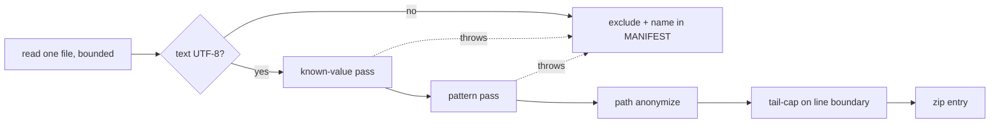

# `guardrails bundle`: a run's evidence in one redacted zip (#799)

**What's being asked.** Dogfood issues are now often filed by the agent on the operator's machine, and that
agent is frequently a local model. It picks evidence badly: #791 left out the token that was actually sent, and
#797 left out the files that explained the journal's normal settle behavior. The harness already knows which
artifacts describe a run. This verb packages them **deterministically**, including while the run is still
going, into one zip that is **safe to attach to a public GitHub issue by default**.

**Narrowings I made** (annotate any you disagree with):
- "Safe by default" means *credentials are scrubbed*. It does **not** mean *proprietary content is removed*:
  prompts, transcripts and diffs contain the operator's code. That trade is question `content-default` below.
- The bundle opens **no network connection**. `providers check` results go in only if a file already records
  them, and no such file exists today, so v1 has none.
- Designed against **#798's described outcome** (a per-task in-flight marker in `run.json` carrying the attempt
  number, `startedAt` and phase; attempt numbers on observer events). #798 is being implemented concurrently on
  another branch. The bundle reads the marker when present and degrades cleanly when it is absent (see
  SUMMARY.md below), so neither change blocks the other.

## Placement

**Harness, CLI verb.** New read-only verb `guardrails bundle`, plus a small `Guardrails.Core/Bundle/` library.
It is a sibling of `attach`, `status` and `logs`: a second process that only reads files. No skill change and no
`guardrails.json` or `task.json` schema change. The SSOT gains a new **§17** (the bundle contract) and one
sentence in §7 (the bundle joins the list of journal readers #727 retries for). `diagnostics` is already the
GR-code glossary (#558), so the verb is `bundle`.

## Invariants in play

| # | Invariant | How the design respects it |
|---|---|---|
| 2 | Harness is the single writer of merged state | The bundle writes **nothing** under the plan folder, the logs or any worktree. It holds no lock, and every read is one short call with a permissive sharing mode (below). |
| 5 | Honest halts, nothing claimed unverified | Every exclusion, truncation, trim and redaction is written into MANIFEST.md or REDACTIONS.md. A file that could not be read or scanned is **excluded and named**, never included raw. REDACTIONS.md states what redaction cannot catch. |
| 1 | Deterministic over judges | SUMMARY.md is computed from journal, provenance and route facts. No model is ever invoked. |
| 6 | Plain files, light setup | A zip file. No upload, no service, no network. |
| 4 | SSOT in the same change | §17 lands in the implementing PR, and §8 gains a pointer to it. |

## Surface

```text
guardrails bundle [folder] [--task <id>]... [--out <path.zip> | --dir <path>]
                  [--max-size <MB>] [--include-worktree-diff] [--keep-paths] [--no-redact]
```

| Option | Default | Meaning |
|---|---|---|
| `--task <id>` | all tasks | Repeatable. Narrows per-task evidence. Run-level files (journal, config, streams) are always included. |
| `--out <file>` | see *Output* | Zip destination. Refused if it resolves inside the plan folder or any worktree of the run. |
| `--dir <path>` | off | Write the same tree unzipped, for local inspection. Mutually exclusive with `--out`. Same redaction. |
| `--max-size <MB>` | `20` | Cap on the **finished zip**. GitHub accepts file attachments up to 25 MB. |
| `--include-worktree-diff` | off | Full `git diff` of the integration worktree and the selected tasks' segments, instead of `--stat`. |
| `--keep-paths` | off | Turns off path anonymization. The issue's `--anonymize-paths` is the default, so this flag is its negation. |
| `--no-redact` | off | Skips the secret scrub (see *`--no-redact`*). |

**`--run <id>` is Phase 2.** `run.json` describes only the current run. An older `logs/<runId>/` has streams but
no journal, so its SUMMARY would be degraded. Phase 1 bundles the journal's current run only.

## Live-run safety

The bundle must not be able to hurt a running harness. #727 showed that a reader can: on Windows, the atomic
replace behind `run.json` fails while **any** handle has the file open, and the Scheduler treats a failed journal
write as fatal. `AtomicFile` retries for about a third of a second. The bundle lives inside that budget:

1. **Every file is read by one bounded call and closed immediately.** The file is opened with
   `FileShare.ReadWrite | FileShare.Delete`, read into memory (the whole file, or a bounded tail, below), and
   closed. No handle is held while hashing, redacting or zipping.
2. **Read order is fixed: `run.json` first**, then everything else. The journal is the snapshot's reference
   point. Anything on disk that is newer than it (an `attempt-N/` the journal does not list yet) is reported as
   such, which is exactly the #797 confusion.
3. **Transient sharing errors** (Win32 32/33, `UnauthorizedAccessException`) are retried 5 times with a 10–50 ms
   backoff, like `AtomicFile`. After that the file is **excluded** and MANIFEST.md says why.
4. **A file that grows while it is read** (a live stream log, `transcript.md`) is taken up to the length that
   was read. The last partial line is dropped and MANIFEST.md marks the file `live-tail-cut`. `run.json` cannot
   tear, because it is replaced atomically. If it fails to parse anyway, it is re-read once, and on a second
   failure it is included raw and marked `unparsed`.
5. **Git is read-only in fact, not just in intent.** `git status` refreshes the index opportunistically, which
   takes `index.lock` inside a worktree the harness is committing to. So every git call is
   `git --no-optional-locks -C <wt> …` with `GIT_OPTIONAL_LOCKS=0`, a 30 s timeout, and no hooks involved:
   `status --porcelain=v1 -b`, `log -5 --format=…`, and `diff --stat <taskBase>..HEAD`.
6. **Validate is re-run in-process** (`PlanProbe.LoadAndValidate`, which only reads). Its output is labeled
   *as of bundle time*, and the SUMMARY reports definition drift against the journal's `definitionHash`, so a
   plan edited after launch is visible rather than silently mixed in.

The acceptance test runs a real plan, bundles it from a second process mid-attempt in a loop, and asserts that
the run completes green and that the plan folder and worktrees are byte-identical to a control run (Tests,
below).

## Contents: an allow-list, never a directory sweep

The bundle includes only **named artifact kinds**. An unknown file under `logs/<runId>/` is listed in
MANIFEST.md by relative path and size, but its bytes are not included. A directory sweep would have shipped
`claude-config/.claude.json` and `shell-snapshots/` (which capture environment variables) the day they appeared.

```text
guardrails-bundle-<plan>-<runId>[-<task>].zip
├── SUMMARY.md          generated, first thing a reader opens
├── MANIFEST.md         every file: size, sha256 of the BUNDLED bytes, disposition
├── REDACTIONS.md       what was scrubbed (counts and kinds, never values) + what redaction cannot catch
├── plan/               guardrails.json (redacted), selected tasks' task.json, validate.txt (re-run now)
├── state/run.json
├── run/                events.jsonl, observer.jsonl, autonomy.jsonl, escalations/*.json   (tail-capped)
├── gates/              logs/<runId>/preflights/** and guardrails/** (result.json + stdout/stderr tails)
├── tasks/<id>/         task-level feedback.md, overwatch.jsonl, triage.json, union-reverify-*.log
│   └── attempt-N/      feedback.md, attempt-provenance.json, attempt-route.log, action-result.json,
│                       composed-prompt*.md, transcript.md, guardrail-*.transcript.md, guardrail-*.verdict.json,
│                       guardrail-*.std{out,err}.log (tail), claude-stream.jsonl (tail, 2 MB),
│                       prior-attempt.patch, out-of-scope.patch
├── gateway/sessions/   logs/<runId>/claude-config/projects/**/*.jsonl ONLY, redacted (tail-capped)
└── git/                integration.txt, <task>.txt: status, log -5, diff --stat (full diff with the flag)
```

Everything else under `claude-config/` (`.claude.json`, `shell-snapshots/`, `todos/`, `statsig/`, and whatever
Claude Code adds next) is excluded **by construction**, and the exclusion is named in MANIFEST.md. State
fragments (`state-in.json`, `fragment.json`) are left out of Phase 1: they are large and seldom decisive, and
`run.json` already carries the merge record.

### SUMMARY.md — facts only, in a fixed order

1. **Versions:** Guardrails (from this binary, *and* the journal's `environment.harnessVersion`, flagged when
   they differ), `claude`, `agent`, `dotnet` and `git`. Each comes from `--version` with a 10 s timeout, or is
   reported as `not on PATH` or `timed out`. Also the OS, and whether the run used worktree mode.
2. **Run:** runId, liveness verdict (reused from `status`: RUNNING, ENDED or EXITED WITHOUT FINISHING, via
   `RunLiveness.Assess`), the `halt` record (headline, kind, failed checks, logDir), and the plan preflight and
   terminal gate results.
3. **Per task:** status, then one row per journaled attempt (number, outcome, duration, action exit code, the
   provenance `summary`, model requested vs served), then the **in-flight attempt**. With #798 that comes from
   the journal's marker. Without #798 it is inferred: *"attempt-4/ exists on disk and is not in the journal:
   in flight, or the run died during it (liveness: …)"*.
4. **Gateway blocks:** `baseUrl`, model, backend identity (verified or unverified, from the route log), and
   **whether `authTokenEnv` names a variable that is set in the bundling shell**, with its length but never its
   value. When no `authTokenEnv` is set, it says the placeholder `guardrails-gateway-no-auth` was sent. That one
   line would have closed #791 in the first message.
5. **Issue skeleton** to paste: *Observed* (the halt headline, or the last failing attempt's outcome and
   summary), *Expected* (left for the reporter), *Evidence* (bundle-relative paths to the three most specific
   files: the failing attempt's `feedback.md`, its route log, and the halt's gate `result.json`), and
   *Environment* (item 1 in a single line).

**Determinism.** Identical on-disk state gives a byte-identical zip. Entries are sorted ordinally, every entry's
timestamp is fixed at 1980-01-01, the compression level is fixed, and no "generated at" time is written: the
snapshot is identified by the journal's run id and the newest settled attempt's `endedAt`. The version probes
are environmental facts about the machine, so the determinism test injects them.

## Redaction — the load-bearing part

**Pipeline, applied per file after reading and before anything is written:**

:::diagram

:::

**1. Known values: exact-substring replace, including the JSON-escaped and URL-encoded forms.** These values are
collected once, at bundle time, from:
- the **current process environment**: `ANTHROPIC_AUTH_TOKEN`, `ANTHROPIC_API_KEY`, `CLAUDE_CODE_OAUTH_TOKEN`,
  `ANTHROPIC_FOUNDRY_API_KEY`, `OPENAI_API_KEY`, `CURSOR_API_KEY`, `GH_TOKEN`, `GITHUB_TOKEN`, and **every
  variable named by any block's `authTokenEnv` or `apiKeyEnv`** in `guardrails.json`;
- any environment variable whose **name** matches `(?i)(TOKEN|SECRET|PASSWORD|PASSWD|API_?KEY|CREDENTIAL|AUTH)`;
- **literal values** in any `env` map in `guardrails.json` or `task.json` (including `guardrailOverrides.env`)
  under a key with such a name.

Only values of 8 or more characters are collected, so `AUTH=1` does not scrub every `1` in the bundle. The
non-secret placeholder `guardrails-gateway-no-auth` is **never** redacted: it is diagnostic (#791). Each value
is replaced by a stable label, `[REDACTED:ANTHROPIC_AUTH_TOKEN#1]`. The same value gets the same label across the
whole bundle, so a reader can see that the token in the transcript is the configured one without learning it.
No hash or fingerprint of a secret is ever emitted: a short hash would work as a confirmation oracle for a weak
password.

**2. Patterns: token shapes the harness was never told about.** `sk-[A-Za-z0-9_-]{16,}` (covers `sk-ant-…`),
`Bearer\s+\S{8,}`, `Authorization:` header values, `gh[pousr]_…` and `github_pat_…`, `AKIA[0-9A-Z]{16}`,
`xox[abprs]-…`, JWTs (`eyJ….eyJ….…`), PEM `PRIVATE KEY` blocks, `NAME=value` and `"name": "value"` pairs whose
name matches the rule in step 1, and **high-entropy runs**: 32 or more characters from `[A-Za-z0-9+/=_-]` with
Shannon entropy above 4.0 bits per character. Hex tops out at exactly 4.0, so git SHAs, `sha256:` hashes and
GUIDs pass through untouched. A pattern hit becomes `[REDACTED:pattern:<kind>]`.

**3. Paths** (default on, `--keep-paths` to disable). Replace the home directory with `~`, the workspace root
with `<workspace>`, the worktree root (`<temp>/gr-wt/<hash>/<runId>`, or `GUARDRAILS_WORKTREE_ROOT`) with
`<worktrees>`, and the OS user name inside any path with `<user>`. `run.json`'s `environment.host` and
`owner.host` become `<host>`. Paths are anonymized after secrets are scrubbed, so a label is never rewritten.

**4. Fail closed.** A file that is not valid UTF-8, or whose scan throws or times out (1 s per MB, guarding
against regex blowup), is **excluded** and named in MANIFEST.md with the reason. A file is never included on
the grounds that it could not be checked.

**5. REDACTIONS.md** has one row per file (the count per label or kind, never the value), then a fixed section,
*What this cannot catch*:
- a secret the harness was never told about, is under 32 characters, and has no recognizable shape (for example
  a short password typed into a prompt);
- a known secret that was **transformed** before it was written: base64-encoded, split across stream-json
  deltas, or partly echoed;
- a secret whose variable is **unset in the shell running `bundle`**, when the run's shell had it. Known-value
  redaction reads the environment at bundle time. The pattern pass still applies;
- **proprietary content.** Prompts, transcripts and diffs contain your code and plan text. Redaction removes
  credentials, not intellectual property.

The verb prints the last point as one line on every bundle, next to the upload hint.

:::warn
**A false negative is the failure mode that matters, and a leaked secret ends up on a public issue.** That is why
this design scrubs everything the harness *might* know about, and not only the values it explicitly configured.
It is also why the canary tests below plant a token in **every** artifact kind, rather than trusting the pattern
list. Over-redaction (a base64 integrity hash in a lockfile) is the accepted cost, and REDACTIONS.md counts it.
:::

**`--no-redact`** skips passes 1 and 2 and keeps path anonymization unless `--keep-paths` is also given. It
**still excludes** everything under `claude-config/` except the session transcripts, because those files are
account state with no diagnostic value. The zip name gets an `-UNREDACTED` suffix, REDACTIONS.md is replaced by a
one-line *NOT REDACTED: do not post publicly* notice, and the verb prints the same warning before and after
the write.

## Size budget

The cap applies to the **finished zip**, because compression varies too much to predict from the source sizes.
The bundle is built, measured, and then trimmed in a **fixed order** and rebuilt, one tier at a time, until it
fits:

1. the full worktree diff, if requested, falls back to `--stat`;
2. stream logs (`claude-stream.jsonl`, `guardrail-*.stream.jsonl`, `gateway/sessions/`) are dropped for every
   attempt except the **latest attempt of each selected task**. The `transcript.md` projection stays;
3. `transcript.md` and `composed-prompt*.md` of the oldest attempts go next, oldest first across tasks. The
   latest attempt of a failing or in-flight task is never dropped;
4. tail caps are halved (streams 2 MB → 1 MB → 512 KB; logs 256 KB → 128 KB).

**Never trimmed:** SUMMARY.md, MANIFEST.md, REDACTIONS.md, `run.json`, `guardrails.json`, and every attempt's
`feedback.md`, provenance and route log. If those alone exceed the cap, the zip is still written, the verb exits
`1`, and it names `--task` as the remedy. Every trim is a MANIFEST.md row (`trimmed: tier 2`), and SUMMARY.md
opens with a single line when anything was trimmed.

## Output and upload

A single stdout line with the absolute path and size, then the content warning and the upload hint:
*"`gh` cannot attach files to an issue. Drag this zip into the issue's comment box in the browser, or attach it
to a gist or a release and paste the link."*

:::question
{ "id": "output-default", "title": "Where does the zip go when --out is not given?", "mode": "single",
  "options": ["~/guardrails-bundles/ (created if missing)", "The current working directory", "The OS temp directory"],
  "recommended": "~/guardrails-bundles/ (created if missing)",
  "rationale": "It must not land in the plan folder or any repo: the agent that runs bundle often runs `git add -A` next. The cwd is usually inside the target repo, so a zip there is one commit away from being pushed. Temp is safe but painful to reach from a browser file picker, especially the /var/folders path on the Mac. A fixed home folder is outside every repo, easy to find, and persistent. --out still accepts any path except the plan folder and the run's worktrees.",
  "target": "human" }
:::

:::question
{ "id": "content-default", "title": "By default, does the bundle include prompts, transcripts and stream tails (which contain the operator's code)?", "mode": "single",
  "options": ["Yes, include them, warn loudly, and offer --lean", "No, --lean by default, with --full to include them"],
  "recommended": "Yes, include them, warn loudly, and offer --lean",
  "rationale": "The issue exists because the reporting agent picks evidence badly, and the transcript is usually where the answer is (#797). A lean default reproduces that exact round trip. The cost: a plan run against a private repo (the #797 run was an employer's plan) puts that code into a public issue if the operator does not read the warning. --lean keeps SUMMARY, MANIFEST, REDACTIONS, run.json, guardrails.json, feedback.md, provenance and route logs, gate results and git --stat, and leaves out prompts, transcripts, streams and patches.",
  "target": "human" }
:::

**Docs.** In the README CLI table, one row. In `docs/local-inference.md`, a new first row in *Troubleshooting*
and a short *Filing an issue* paragraph written so an agent can follow it: *"Run `guardrails bundle <plan>/`
(add `--task <id>` when one task is at fault). Attach the zip it prints. Paste the issue skeleton from the end
of SUMMARY.md and fill in Expected. Do not pass `--no-redact` or `--keep-paths` for a public issue."*

## Tests and acceptance

| Test | Level | What it proves |
|---|---|---|
| **Live bundle from a second process** | Integration, 3 OS | A fake-claude plan with slow attempts is bundled in a loop from a separate process during every phase. The run completes green with no `AtomicFile` retry exhausted, and the plan folder and worktrees hash identically to a control run's (excluding `logs/` and the journal's timestamps). |
| **Windows sharing** | Integration, Windows | While `bundle` holds its read, `AtomicFile.WriteAllText(run.json)` succeeds within its retry budget (use the `onRetry` seam, not a sleep). And a file held with `FileShare.None` is **excluded and named**, not a crash. |
| **Canary matrix** | Core | One canary per source (a known env var, an `authTokenEnv`-named var, a literal `env` value, an unnamed `sk-…`, a high-entropy string, a JWT, a PEM block) planted in **every** artifact kind in the allow-list, including a JSON-escaped copy in a stream log and an echoed `env` dump in a gateway session transcript. Assertion: **no canary byte sequence appears anywhere in the zip**, checked by scanning the raw zip entries, not the redactor's report. |
| **No false scrub** | Core | Git SHAs, `sha256:` hashes, GUIDs, and the `guardrails-gateway-no-auth` placeholder survive unchanged. |
| **Fail-closed** | Core | A non-UTF-8 file, and a file whose scan is forced to throw, are both excluded and named in MANIFEST.md. |
| **claude-config allow-list** | Core | `.claude.json`, `shell-snapshots/*` and an unknown new file are absent. `projects/**/*.jsonl` is present and redacted. |
| **Determinism** | Core | Two bundles of the same fixture, with the version probes injected, are byte-identical. |
| **Size cap** | Core | An oversized fixture fits under `--max-size 1` by trimming tiers in order, each named in MANIFEST.md. A protected core over the cap exits `1`. |
| **#798 both ways** | Core | SUMMARY names the in-flight attempt from the marker when present, and from the disk-vs-journal inference when it is not. |
| **`--out` refusal** | Integration | `--out` inside the plan folder, or inside a worktree, is refused before anything is read. |

## Phasing

**Phase 1** is the whole acceptance list in the issue: the verb, the allow-list, SUMMARY/MANIFEST/REDACTIONS,
redaction, the size cap, `--task`/`--out`/`--dir`/`--max-size`/`--keep-paths`/`--no-redact`, the git `--stat`
views, and the docs. **Phase 2:** `--include-worktree-diff`, `--run <older-id>` (a degraded summary without a
journal), state fragments, and recorded `providers check` output once something records it. Phase 1 alone
would have closed both #791 and #797 on first contact. Phase 2 adds size and edge cases, not answers.

## Devil's advocate

**Strongest objection:** *"Automatic redaction invites false confidence. An agent will attach the zip without
reading it, and one miss becomes a leaked key on a public issue. It is safer to ship no bundle and keep the
manual process."* **Response:** The manual process is strictly worse on the same axis. #791's reporter pasted
config and log excerpts by hand, and a weak model copy-pasting a transcript applies **no** scrub at all. The
bundle applies a known-value pass, a pattern pass and an allow-list on every file, fails closed, and says in
REDACTIONS.md exactly what it cannot catch. The residual risk is real and disclosed, not claimed away. The
canary matrix is what keeps it from regressing silently, and silent failure is this repo's recurring defect.

**Second:** *"Reading while the harness writes will reintroduce #727."* It can, which is why the read discipline
is a numbered contract here and in §17, and why it has its own Windows test against `AtomicFile`'s retry seam
rather than an assumption.

## Implementation handoff

| # | Agent | filesTouched | Order |
|---|---|---|---|
| 1 | guardrails-architect | `docs/plans/02-schemas-and-contracts.md` (new §17 and the §7 readers sentence) | first; §17 is this doc's contract sections, verbatim |
| 2 | guardrails-test-author | `tests/Guardrails.Core.Tests/BundleRedactorTests.cs`, `tests/Guardrails.Core.Tests/BundleBuilderTests.cs` | after 1; canary matrix and fixtures written first |
| 3 | guardrails-harness-developer | `src/Guardrails.Core/Bundle/` | after 2 |
| 4 | guardrails-harness-developer | `src/Guardrails.Cli/Commands/BundleCommand.cs`, `src/Guardrails.Cli/CommandFactory.cs` | after 3 |
| 5 | guardrails-test-author | `tests/Guardrails.Integration.Tests/BundleCliTests.cs` | after 4; live and Windows-sharing tests |
| 6 | guardrails-skill-author | `README.md`, `docs/local-inference.md`, `.claude/skills/guardrails-domain-knowledge/SKILL.md` | after 4 |

## Proposed plan-document edits

- **§17 (new): "Run evidence bundle (`guardrails bundle`), issue #799".** Covers the surface, the read
  discipline (items 1–6 of *Live-run safety*), the allow-list tree, SUMMARY's order, the redaction passes and
  labels, the fail-closed rule, the trim order and protected core, the output default, and exit codes
  (`0` written, `1` refused, unreadable plan, or over the cap after trimming).
- **§7, the journal-readers paragraph:** add *"and `guardrails bundle` reads it once, first, per bundle (§17)"*.
- **§8, intro:** one line saying that `guardrails bundle` packages this layout under an allow-list (§17).
- **§9.10 residuals:** add a pointer: *"`guardrails bundle` scrubs the gateway token from session transcripts;
  the loopback viewer does not"*.
