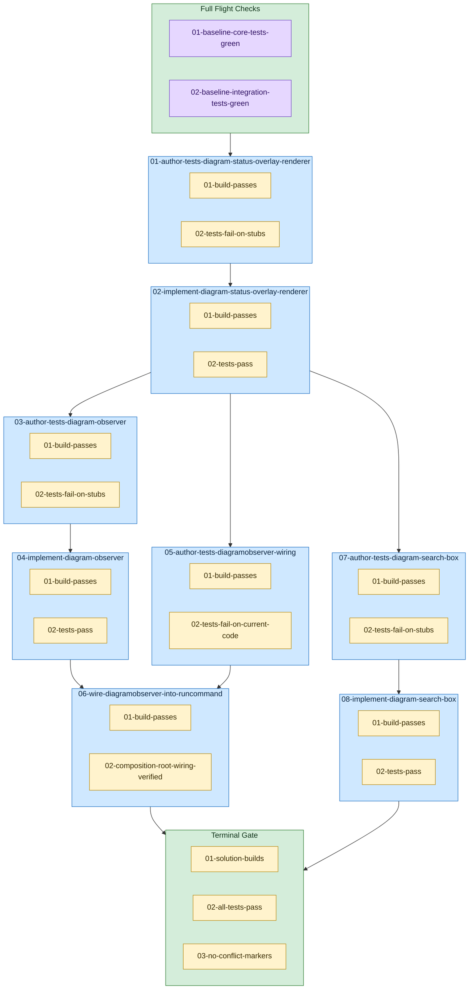

<!-- guardrails:graph v1 source-sha256=0e91341ed6fcaa1fc386606fde2e821707de4a3c7147556b50bbc4b65e98ea93 -->

_Structure only — retry, feedback, and needs-human edges are omitted._

**Legend**

- 🟣 **Preflight** — verified BEFORE the task's attempt loop; gates entry (dependency-delivery precondition)
- 🟡 **Guardrail** — verified AFTER the task's action; must pass for the task to finish
- 🟢 Plan-level containers ("Full Flight Checks" top, "Terminal Gate" bottom) run the same two checks once for the whole plan, at the very start and very end.
