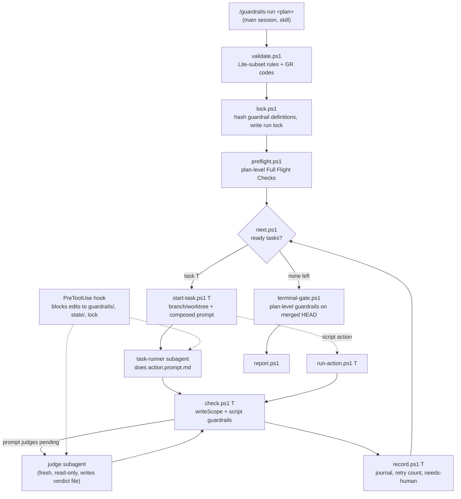

# Guardrails Lite: the method without the compiled binary (Guardrails #823)

Some organizations will not allow an **unreviewed compiled executable** on developer machines. Today
that rules out Guardrails completely. The `guardrails` binary (~107k lines of C# under `src/`) is the
harness, and the skills that produce its input can't work without it: `plan-breakdown` calls
`guardrails validate`, `graph`, `lock`, `samples` and `merge`, and `guardrails-review` calls
`mark-reviewed` and `plan-hash`.

This plan adds a second **delivery profile** to this repo. It ships only reviewable text: skills, agent
definitions, hooks and PowerShell scripts. The main Claude Code session does the orchestration that the
binary does today. **Everything deterministic is still done by scripts, not the model.**

:::note
**The objection is to a compiled binary, not to orchestration.** The user confirmed the constraint is
"no unreviewed compiled executable" — not "no autonomous agent execution". Readable scripts shipped as
plain text pass that bar. If the constraint turns out to be wider, this plan does not help, and the
right move is to stop at the design stage.
:::

## Why this lives in this repo, not in a fork

The alternative was a separate `GuardrailsLite` repository holding copies of the skills. We rejected it
because of drift: most change here is change to the **task-folder contract**
(`docs/plans/02-schemas-and-contracts.md`), and a fork only finds out about a contract change when
something breaks in the field.

:::comparison
| Option | Verdict |
|---|---|
| **Skills-only package, no other change** | **Not viable.** The skills call the binary at several steps, so `/plan-breakdown` would fail partway through self-validation. |
| **Separate GuardrailsLite fork** | **Rejected.** It copies ~7k lines of skill text plus contract knowledge, and finds out about each contract change too late. |
| **Lite profile in this repo, same skill sources, parity-tested in CI** | **Chosen.** One source of truth. A contract change that breaks Lite fails CI **in the same PR that makes it**. |
:::

## What "Lite" is: a strict subset of the plan format

A Lite plan is **a valid full plan**. Anything Lite can run, `guardrails run` can also run, and gets
the same verdict. The reverse is not true: Lite refuses plans that use features it does not implement.
It says which feature, and it never runs a plan partially.

| Feature | Lite v1 |
|---|---|
| Flat `tasks/` DAG with `dependsOn` | ✅ |
| Script actions (`action.ps1` / `.sh` / `.py`) and prompt actions (`action.prompt.md`) | ✅ |
| Task-level `guardrails/` and `preflights/`, script and `.prompt.md` judges | ✅ |
| Plan-level `preflights/` (Full Flight Checks) and `guardrails/` (Terminal Gate) | ✅ |
| `writeScope` check, `retries`, `failFast` | ✅ |
| Guardrail lock (hash of definitions at run start) | ✅ |
| Resume after the session dies (continue from the journal) | ✅ |
| `reset <plan> <task>…`: rewind the named tasks and their descendants, refusing when unsafe; `reset <plan> -y` for a full rebuild | ✅ `reset.ps1`, same safe/unsafe rule as the harness |
| Review attestation (`mark-reviewed`, `plan-hash`): a run warns when the folder changed after review | ✅ `mark-reviewed.ps1`, `plan-hash.ps1`, same attestation file and hash |
| Waved plans, JIT breakdown | ❌ refused, tracked in #824 |
| Overwatch, AI merge resolution, model tiering, gateway blocks | ❌ refused (or ignored with a warning when the key is inert), tracked in #824 |
| Unattended multi-hour runs, stall/compaction detection, cost caps, telemetry, `bundle` | ❌ out of scope: the runner is an interactive session. Tracked in #824 |

:::warn
**Lite is weaker than the harness, and its documentation must say so.** A Claude Code session running
the loop can run out of context, share its permission mode with the task subagents, and be stopped by the
person at the keyboard. Scripts and on-disk state make it resumable and keep verdicts honest. They don't
make it unattended. The README must not describe Lite as "Guardrails without the binary."

**The orchestrator itself is non-deterministic.** In the harness, the loop is compiled code: it can't
skip a step, and it can't report a pass that didn't happen. In Lite, the loop is a model following a
skill, and a model can skip `check.ps1`, call `record.ps1` for the wrong task, or say "all green" in
chat when the journal says otherwise. The scripts decide *verdicts*. Only the checks below stop the
model from *misdriving* them.
:::

The kernel defends against a misdriving orchestrator in three ways. None of them relies on the model
being honest:

1. **Step tokens.** Each kernel script writes a per-attempt step record into the journal, and each one
   refuses to run unless the step before it has run for the same task and attempt. `record.ps1` refuses
   a pass without a `check.ps1` record, and `check.ps1` refuses without a `start-task.ps1` record. A
   skipped step fails loudly instead of producing a pass.
2. **The verdict comes from the journal, not the chat.** The run ends by printing `report.ps1`'s output
   **verbatim**. The skill forbids summarizing the result in its own words, and the report is built only
   from the journal.
3. **A Stop hook.** While a run lock exists and the journal has no terminal state, the hook stops the
   session from ending, and its message names the next step `next.ps1` returns. A model that decides it
   is done early is sent back to the loop. (This hook runs in the host's main session. It does not need
   to fire inside subagents.)

## Architecture

**The orchestrator is a skill that runs in the main session, not a subagent.** Claude Code subagents
can't start other subagents, and the runner has to start one per task action and one per prompt-judge.
So `/guardrails-run` loads the orchestration protocol into the main session, and two **agent
definitions** do the work it hands out.

:::diagram

:::

### The deterministic kernel (scripts)

The model **never decides run state and never grades its own work**. Each script prints one JSON object
to stdout and uses a documented exit-code vocabulary. The skill tells the model to branch on the exit
code and to relay failure output verbatim, never paraphrased.

| Script | Responsibility |
|---|---|
| `validate.ps1 <plan>` | The Lite subset of `guardrails validate`, using the **same GR codes**, plus one Lite-only code for "feature not supported by Lite". |
| `lock.ps1 <plan>` | Hashes every action/guardrail/preflight definition, writes the run lock. `record.ps1` refuses a pass if any hash has changed. |
| `next.ps1 <plan>` | Reads the DAG and the journal, returns the ready tasks. It's the only thing that decides what runs next. |
| `start-task.ps1 <plan> <task>` | Prepares the workspace, then **composes the task prompt deterministically**: the action body, context from dependencies, and the previous attempt's failure feedback. |
| `run-action.ps1 <plan> <task>` | Runs a script action, with a timeout. |
| `check.ps1 <plan> <task>` | Runs the `writeScope` check and the script guardrails in ordinal order, failFast. Lists the prompt-judges still pending, and the file path where each verdict must be written. |
| `record.ps1 <plan> <task>` | Folds the verdicts into the journal, enforces `retries`, moves the task to `needs-human` when retries run out, commits or merges the task's work. |
| `terminal-gate.ps1`, `preflight.ps1`, `report.ps1` | Plan-level gates and the final report. |
| `reset.ps1 <plan> <task>… [-y]` | Rewinds the named tasks and their descendants on the plan branch and resets their journal entries. It **refuses** when a commit from a task outside that set comes after the earliest commit being rewound. Running sequentially makes that the common case, so the refusal message names the blocking task and suggests `-y`. |
| `mark-reviewed.ps1`, `plan-hash.ps1` | The `guardrails-review` attestation: the same hash over the task folder, written to the same attestation file. `validate.ps1` warns when the folder changed after the attestation was written. |

`state/` uses the **same file names and shapes** as the harness wherever the harness already defines
them. The goal is that `guardrails` could resume a run Lite started. That is not a requirement for v1,
but nothing Lite writes should prevent it.

### Tamper resistance

Two independent layers. Either one on its own catches the common failure, where the implementing agent
"fixes" a failing guardrail by weakening it:

1. **Hash lock.** `lock.ps1` records the definition hashes. `record.ps1` recomputes them and refuses the
   verdict if anything changed. This works even if the hook is missing.
2. **PreToolUse hook.** While a run lock exists, `Edit`/`Write`/`Bash` calls that touch
   `tasks/*/guardrails/**`, `preflights/**`, the plan-level `guardrails/`, `state/` or the lock are
   blocked, and the block message tells the agent to report the problem instead of working around it.

### Changes to existing skills

- **`plan-breakdown`** gets a Lite profile. Each step that calls the binary gets a Lite equivalent
  (`validate.ps1`, `lock.ps1`) or is skipped with a stated reason (`graph` diagrams, `samples`). The
  profile also limits what gets generated to the subset above. Selection is described in the
  `lite-profile-selection` question below.

:::note
**The skill does not get twice as long.** The skills mention the binary about 60 times
(`plan-breakdown` 38, `guardrails-review` 24), so a Lite branch at each call site would roughly double
them. That is exactly what we're avoiding. Instead, each skill gets **one short preamble**: *"In the Lite
profile, `guardrails <verb> <args>` means `pwsh <lite-root>/<verb>.ps1 <args>`, and for the verbs listed
in `references/lite-profile.md`, do what that file says instead."* The call sites don't change. Every
Lite-specific detail (skipped verbs, the subset limits, and what to generate differently) goes in the
reference file, which is loaded only in the Lite profile.

Two CI checks hold this in place:
- **Line budget.** Lite text in each `SKILL.md` stays under a fixed limit (about 15 lines).
- **Verb coverage.** Every `guardrails <verb>` the skills mention either has a matching `<verb>.ps1` or
  appears in `lite-profile.md`'s skip list. When a skill starts using a new verb, CI fails until Lite
  decides what to do with it.
:::
- **`guardrails-review`**: its `mark-reviewed` and `plan-hash` steps need Lite equivalents, because the
  review attestation is part of what makes a breakdown trustworthy.
- **`guardrails-domain-knowledge`**: one section on the Lite profile and the parity invariant, so future
  contract work knows Lite exists.

## Other hosts: Cursor

**Yes, most of this carries over to Cursor**, and the kernel carries over completely. The scripts, the
journal, the hash lock and the parity CI don't depend on the host. What changes is the **glue**:
where the orchestrator skill, the two agents and the hooks live, and how they're declared. Cursor
(2.4+) already reads `.claude/skills/` and `.claude/agents/` for compatibility, and it has a blocking
`preToolUse` hook that covers `Write`, `Shell` and `Delete`. So the **same package** could install
into a Cursor project with a `hooks.json` added.

What a Cursor Lite would be missing, compared with Claude Code Lite:

| Capability | Claude Code | Cursor | Consequence for Cursor Lite |
|---|---|---|---|
| Hook scoped to the running skill (frontmatter `hooks:`) | ✅ (to verify, see `lite-hook-delivery`) | ❌ `SKILL.md` has no `hooks` field | Hooks must go in the project's `.cursor/hooks.json`. They're active outside runs too, gated on the run lock existing. |
| Tamper hook fires for tool calls **inside subagents** | to verify | **Undocumented** | The hash lock is the only *guaranteed* layer until a spike proves the hook fires inside the task-runner. |
| Stop hook that can keep the session running | ✅ blocking `Stop` | `stop` is observe-only (it can queue a follow-up message, not block) | The orchestrator can still end early. The next `/guardrails-run` resumes correctly, but the early exit isn't prevented. |
| Read-only judge | agent `tools:` allow-list | `readonly: true` frontmatter | Equivalent. The judge still has to write its verdict file, so the verdict goes back **in the reply** and `record.ps1` writes it. |
| Tool names the hook matches | `Edit`, `Write`, `Bash` | `Write`, `Delete`, `Shell` | One hook script with both matcher sets. The hook's CI test covers both. |
| Nesting | subagents can't start subagents | one level of nesting | No loss. (Cursor could run the orchestrator as a subagent, but we keep one design.) |
| Headless/CLI run | `claude -p` | `cursor-agent`: approval flags differ, and #773 (no-flag shell rejected, yet exits 0) | Lite is interactive-only anyway. It matters only for the execution-parity driver, which runs no model. |

**Recommendation:** v1 targets Claude Code, and Cursor comes next, starting with a spike on the one
unknown that decides it: does `preToolUse` fire for a subagent's `Write`? Tracked in #824. See the
`lite-cursor-host` question.

### Considered: MCP Apps

MCP Apps let an MCP server return an interactive HTML page that the host renders in a sandboxed iframe.
It's a **display** surface, and it doesn't remove the need to run code: the app is served by an MCP
server, which is a process on the user's machine (typically a Node package with its own dependency tree)
or a remote service. Both hit the same security review, and the Node case is arguably worse than one
binary, because a transitive `npm` tree is harder to review. Host support also matters: the MCP Apps
overview's client list (checked 2026-09-29) includes Claude Desktop and VS Code Copilot, but not Claude
Code or Cursor.

So it doesn't meet the "no unreviewed executable" constraint on its own. It is a candidate for a
**later, optional** run-status view (the job the harness's live web view does today), for organizations
that already approve an MCP server. It's out of scope for v1 and tracked in #824.

## Distribution

- A new release asset, `guardrails-lite-<version>.zip`, built by `release.yml` from the **same commit**
  as the binary. It contains skills, agents, hooks and scripts. It must contain **no compiled file of
  any kind**, and CI fails the release if one appears.
- `install-lite.ps1` / `install-lite.sh` download that zip and install it. They never download, build or
  run a binary. The installer is short and readable, because it is the first thing a security reviewer
  will read.
- Scripts make **no network calls**, and CI enforces this with a lint over `scripts/lite/`.
- The version matches Guardrails'. Lite's `--version` script is what `plan-breakdown`'s version gate
  checks in the Lite profile.

## Drift control

This is the main reason for building Lite in this repo, so it gets its own acceptance criteria:

1. **Validation parity.** A corpus of plan folders (`examples/` plus Lite fixtures, including deliberately
   invalid ones) goes through `guardrails validate` and `validate.ps1`. For each fixture, both must
   report the same set of GR codes, with an explicit allow-list for codes Lite doesn't implement.
2. **Execution parity.** Fixtures made only of **script** actions and script guardrails (no model
   involved, so fully deterministic) go through `guardrails run` and a non-interactive Lite driver that
   calls the kernel scripts in order. Final task states and verdicts must match.
3. **Contract-change tripwire.** When `docs/plans/02-schemas-and-contracts.md` changes, a CI check
   requires either a change under the Lite paths or a `lite-parity: n/a — <reason>` line in the PR
   description.
4. **Subset guarantee.** Every Lite fixture that passes `validate.ps1` also passes `guardrails validate`.

The parity checks run in the existing CI matrix, next to the harness tests.

## Acceptance

- `examples/hello-guardrails` and `examples/parallel-hello` run end to end under `/guardrails-run` on a
  machine where the `guardrails` binary is **not on PATH**.
- `/plan-breakdown` in the Lite profile produces a folder that passes `validate.ps1` **and**
  `guardrails validate`.
- A seeded tamper attempt (a task prompt that tells the agent to edit its own guardrail) is blocked by
  the hook. With the hook disabled, it is caught by the hash lock.
- Killing the session mid-run and running `/guardrails-run` again continues from the journal. It does
  not restart the run and does not repeat completed tasks.
- The release zip contains no compiled files, and CI fails the release if one appears.
- `reset.ps1` on a task and its descendants reruns only that set. On a set whose rewind would discard
  another task's commit, it refuses and names that task.
- `plan-hash.ps1` produces the same hash as `guardrails plan-hash` on every parity fixture, and a folder
  edited after `mark-reviewed.ps1` makes `validate.ps1` warn.
- A skipped kernel step (calling `record.ps1` without `check.ps1`) fails with a named error and never
  records a pass.
- The `SKILL.md` line budget and verb-coverage checks run in CI and fail on a seeded violation.

## Decisions for the reviewer

:::question
{ "id": "lite-profile-selection", "title": "How should plan-breakdown carry the Lite profile?",
  "mode": "single",
  "options": ["One SKILL.md, with Lite steps gated on a profile and detailed in references/lite-profile.md", "A Lite SKILL.md generated from the full one at build time", "A separate hand-maintained lite skill"],
  "recommended": "One SKILL.md, with Lite steps gated on a profile and detailed in references/lite-profile.md",
  "rationale": "A single source keeps a change to the full profile visible to anyone editing it. A generator hides drift inside its transformation rules, and a hand-maintained copy is the fork we rejected. The cost is more branching in an already long skill, and moving the Lite details into a reference file limits that.",
  "target": "human", "answer": ["One SKILL.md, with Lite steps gated on a profile and detailed in references/lite-profile.md"] }
:::

:::question
{ "id": "lite-plan-marker", "title": "How is a plan marked as Lite?",
  "mode": "single",
  "options": ["An explicit \"profile\": \"lite\" key in guardrails.json, which the full harness accepts and ignores", "No marker; Lite checks for unsupported features at validate time"],
  "recommended": "An explicit \"profile\": \"lite\" key in guardrails.json, which the full harness accepts and ignores",
  "rationale": "An explicit marker lets plan-breakdown and validate.ps1 refuse out-of-subset features at authoring time, not at run time, and makes the choice visible in review. It is a contract change, so it goes in 02-schemas-and-contracts.md first. It also needs a harness-side change so the full validator accepts the key.",
  "target": "human", "answer": ["An explicit \u0022profile\u0022: \u0022lite\u0022 key in guardrails.json, which the full harness accepts and ignores"] }
:::

:::question
{ "id": "lite-parallelism", "title": "Should Lite v1 run tasks in parallel?",
  "mode": "single",
  "options": ["Sequential only; maxParallelism above 1 runs sequentially with a warning", "Parallel, with script-managed worktrees and merge"],
  "recommended": "Sequential only; maxParallelism above 1 runs sequentially with a warning",
  "rationale": "Parallel subagents are possible, but worktree setup, merging and conflict handling are a large part of the harness's complexity, and AI merge is already out of scope (both tracked in #824). Running sequentially on one plan branch keeps the kernel small enough for a security reviewer to read. parallel-hello still has to pass. It just runs serially.",
  "target": "human", "answer": ["Sequential only; maxParallelism above 1 runs sequentially with a warning"] }
:::

:::question
{ "id": "lite-script-runtime", "title": "Which script runtime should the kernel use?",
  "mode": "single",
  "options": ["PowerShell 7 (pwsh) only, on all OSes", "pwsh and bash twins for every script"],
  "recommended": "PowerShell 7 (pwsh) only, on all OSes",
  "rationale": "The repo's guardrails are already mostly .ps1, pwsh runs on all three CI OSes, and twin scripts double both the review surface and the drift surface. The cost is that pwsh becomes a prerequisite on macOS/Linux, and install-lite.sh has to check for it and say so clearly.",
  "target": "human", "answer": ["PowerShell 7 (pwsh) only, on all OSes"] }
:::

:::question
{ "id": "lite-hook-delivery", "title": "How should the tamper-protection hook be installed?",
  "mode": "single",
  "options": ["Scoped to the guardrails-run skill (skill frontmatter hooks), with a fallback to settings.json if unsupported", "Always written into the project's .claude/settings.json by the installer"],
  "recommended": "Scoped to the guardrails-run skill (skill frontmatter hooks), with a fallback to settings.json if unsupported",
  "rationale": "A skill-scoped hook is only active during a run and doesn't change the user's settings. Before committing to it, confirm that the current Claude Code release supports frontmatter hooks on skills and that they apply to subagents the skill starts. If either is not true, use the settings.json fallback. The hash lock covers the gap either way.",
  "target": "agent", "answer": ["Scoped to the guardrails-run skill (skill frontmatter hooks), with a fallback to settings.json if unsupported"] }
:::

:::question
{ "id": "lite-deferral-tracking", "title": "The refused features (waves, JIT breakdown, overwatch, parallelism, unattended runs) have no tracking issue. File one?",
  "mode": "single",
  "options": ["File one umbrella issue: Lite feature gaps vs. the harness", "File one issue per feature", "Leave them untracked; this plan records them"],
  "recommended": "File one umbrella issue: Lite feature gaps vs. the harness",
  "rationale": "Once this plan is archived, the subset table is the only record of what Lite leaves out. One umbrella issue keeps the gaps together and gives someone a place to argue for moving one into Lite. Filing issues is your decision.",
  "target": "human", "answer": ["File one umbrella issue: Lite feature gaps vs. the harness"] }
:::

Filed as **#824**, which the subset table cites.

:::question
{ "id": "lite-cursor-host", "title": "Should Cursor be a Lite v1 host?",
  "mode": "single",
  "options": ["Claude Code only in v1; Cursor next, after a spike on subagent hook coverage (#824)", "Both hosts in v1, with the hash lock as Cursor's only guaranteed tamper layer", "Claude Code only; no Cursor plans"],
  "recommended": "Claude Code only in v1; Cursor next, after a spike on subagent hook coverage (#824)",
  "rationale": "The kernel is host-neutral, so Cursor costs only the glue (hooks.json plus a hook that matches both sets of tool names). But two of its gaps weaken the guarantees this plan leads with: a Stop hook that can't block, and an undocumented question about whether preToolUse fires inside subagents. Shipping both in v1 would make the weaker host part of the same promise. A spike answers the subagent question in about an hour, and Cursor then joins with a documented, not guessed, gap list.",
  "target": "human" }
:::
