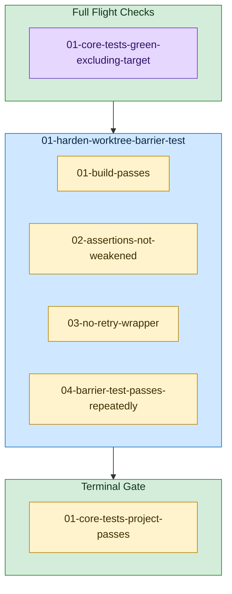

<!-- guardrails:graph v1 source-sha256=299b01c5a4a610496f63b61c987f25f9702efbf6aef6edb6b80afb980112fe8e -->

_Structure only — retry, feedback, and needs-human edges are omitted._

**Legend**

- 🟣 **Preflight** — verified BEFORE the task's attempt loop; gates entry (dependency-delivery precondition)
- 🟡 **Guardrail** — verified AFTER the task's action; must pass for the task to finish
- 🟢 Plan-level containers ("Full Flight Checks" top, "Terminal Gate" bottom) run the same two checks once for the whole plan, at the very start and very end.
