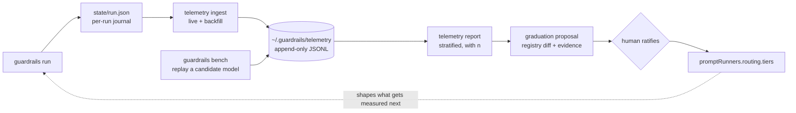

# Model evidence — a local telemetry corpus, and evidence-based model graduation

**Issue:** [#533](https://github.com/Servant-Software-LLC/Guardrails/issues/533).
**Parent epic:** #201 (model tiering, closed). **Depends on / unblocks:** #223 (local inference,
`docs/plans/28-local-inference-runner.md`), #228 (escalation ladder), #519 (v2 bets, explicitly gated on
the measurement this plan produces).

This charter is the reviewable form of #533. It is a **plan to build a measurement**, not a plan to change
routing: nothing here moves a task to a different model. It builds the record that would let us decide to,
with evidence instead of intuition.

---

## 1. The sentence we cannot say today

> *"qwen 3.6 was faster and averaged only 1.3 attempts on tasks of difficulty X, so opus is overkill there
> — even though opus averaged 1.1 attempts, its attempts took 4x as long and cost real money."*

Every noun in that sentence is a number the harness already produces and immediately discards. A task's
difficulty tag is a **judgement call** made once, by `/plan-breakdown`, and nothing ever checks it against
what happened. That is tolerable with one provider. It stops being tolerable the moment a Mac Studio puts
three or four local models next to the frontier ones and someone has to choose between them.

:::note
The precondition that makes this cheap is already true, and is unusual. **Guardrails are a deterministic
grader.** "A prompt may propose, only a deterministic gate may certify" means every attempt this harness has
ever run already carries an objective pass/fail — not a human rating, not an LLM-judge score. A corpus of
those outcomes is a model-evaluation suite that costs nothing extra to collect. This plan is about *keeping*
it and *reading* it honestly.
:::

---

## 2. What exists, and the grain that is missing

:::comparison
| Surface | Grain | Answers |
|---|---|---|
| `JournalTierSpend` (#230-lite, shipped) | one run | "what did each rung cost in this run" |
| #528 / plan 29 | one run | "what did tiering save in this run, projected" |
| #524 / plan 29 | one run | "which model ran this task" |
| #228 ladder (deferred) | one task, in flight | "this attempt failed — escalate the next one" |
| **this plan** | **every run, every machine, over time** | **"which model should serve tier X at all"** |
:::

Every existing surface is per-run and dies with the run. `state/run.json` is written into the plan's log
site and is never read across plans, across repos, or across time. #519 gates the entire v2 tiering slate
on a measurement — *"neither is worth building until #230-lite's measurements say the routing is actually
saving money"* — and there is no place where those measurements accumulate.

---

## 3. The mechanism

:::diagram

:::

The dashed edge is the risk, not the design: routing decides which models get observed, so observation
alone can never discover that a model *could* have served a harder rung. §7's bench is the deliberate
answer to it.

### 3.1 Two grains, both recorded

A **task record** (one per task per run) is the unit a difficulty claim is *about*: `definitionHash` — the
identity that makes the same task comparable across runs and machines — plan/wave/task/run ids, declared
tier and its origin, the task's observable shape, and its terminal outcome.

An **attempt record** (one per attempt) is the unit a *model* is measured on: the route it resolved to, what
it cost, how long it took, and whether the gate passed.

`AttemptRecord` and `AttemptProvenance` already carry most of the second. The gaps below are the ones that
actually decide the qwen-versus-opus question:

| Datum | Status |
|---|---|
| attempt number, start/end, outcome, failed guardrails, log dir | have |
| route: `model`, `requestedModel`, `runner`, `kind`, `tier`, `tierSource`, `effort` | have |
| `costUsd`, `usage.inputTokens` / `outputTokens`, judge route | have |
| **turns used** — `PromptOutcome.NumTurns` is computed and printed at `Scheduler.cs:1908`, then thrown away; `AttemptRecord` has no turns field | **gap — the cheapest fix here** |
| **segmented duration** — prompt wall time vs guardrail wall time vs worktree/harness overhead | gap |
| **model fingerprint** — kind + model string + resolved version/digest + quantization + context window | gap |
| **warm or cold** — was the local model already resident | gap |
| **machine profile + concurrency degree at the time** | gap |
| **harness and skill versions** | gap |
| **retry context** — was prior-attempt feedback included, was `maxTurns` multiplied | gap |

:::warn
Only the attempt *envelope* is timed today, so "the model was slow" cannot be distinguished from "the test
suite is slow". Any speed comparison built before segmented durations exist is measuring the repo, not the
model.
:::

---

## 4. "Difficulty" is three different things

The instinct that `easy | medium | hard` is too coarse is right. The fix is **not** a finer-grained
judgement — a 1-to-10 guess is a worse guess, not a better number. Split the concept instead:

1. **Declared tier — the routing dial.** `easy | medium | hard`, chosen by `/plan-breakdown` or a human,
   consumed by the resolver. **Unchanged by this plan.**
2. **Task fingerprint — the observable features.** Computed from the task folder, never from an opinion:
   archetype, writeScope breadth, guardrail count and kind mix, `maxTurns`, dependency position, whether it
   authors tests or consumes them, whether it touches a composition root. *This is what makes two tasks
   comparable.*
3. **Realized difficulty — derived after the fact.** What the corpus learns: attempts-to-green on the
   strongest model that ran it, turn consumption against budget, guardrail failure *kinds*, whether a human
   was ever needed.

Only the third is a measurement. The first is a judgement and the second is a fact about the task.

:::note
A free by-product falls out of (3) versus (1): **the mis-tag report.** "These 14 tasks were declared `easy`
and consistently realize as `hard`" is directly actionable against `/plan-breakdown`'s tagging heuristics —
and it is the honest v1 answer to the mis-tagged-minority problem that #228's ladder was deferred over.
:::

:::question
{ "id": "realized-difficulty-inference", "title": "Should Phase 0 infer realized difficulty, or just show the stratification?",
  "mode": "single",
  "options": ["Report the raw stratification only; a human reads it", "Compute a realized-difficulty label per task", "Both — raw tables, plus a labelled mis-tag report"],
  "recommended": "Report the raw stratification only; a human reads it",
  "rationale": "A derived label is a model of a model and it will be wrong in ways that are hard to see, whereas a stratified table is just arithmetic over recorded facts. Shipping the table first tells us whether the label is even wanted, and the mis-tag report can be added once the raw view has been read a few times in anger.",
  "target": "human" }
:::

---

## 5. The honesty rules

A model-comparison report is exactly the kind of surface where a rosier-than-justified number is invisible,
which is this repo's signature defect (#516, #501, #510). These are constraints on the report, not notes.

:::warn
**Selection confounding — the big one.** Models are not assigned to tasks at random; the resolver assigns
*by declared tier*. A naive per-model average therefore compares the weak model's easy work against the
strong model's hard work and concludes the weak model is better. **Any per-model figure not stratified by
tier and fingerprint bucket is misinformation.** Stratification must be structural, not a convention the
next report author can forget.
:::

:::warn
**Survivorship in "average attempts".** Averaging attempts-to-green over *successes only* flatters exactly
the model that gives up. A model that abandons every hard task and nails every easy one posts a beautiful
1.1. **Attempts-to-green never renders without abandonment rate over the same denominator.**
:::

- **Non-determinism.** Same model, same task, different day, different answer. A single data point is never
  evidence: minimum n before any verdict renders, median and p90 rather than the mean alone, and
  **"insufficient evidence" as a first-class output**, not a blank cell.
- **Model drift.** `qwen3.6:Q4_K_M` and `qwen3.6:Q8` are different models; `claude-sonnet-5` is a moving
  endpoint; an `ollama pull` silently replaces a model under a stable tag. A changed digest starts a **new
  sample** — pooling across a silent swap is the same defect class as the stale-skill and stale-tool bugs
  already fixed here.
- **Wall-clock is a machine measurement.** Under parallel execution contention dominates. Compare durations
  only within the same machine profile and concurrency degree, or normalize to tokens/sec and say so.
- **The gate is not the whole truth.** An attempt can pass its guardrails and still be bad work — that is
  the premise of `/guardrails-review` and of #510. The corpus therefore also carries the cheap post-gate
  signals: needs-human triage kind, overwatcher intervention, whether a later task failed *because* of this
  one, merge-conflict incidence. A model that games gates looks excellent on pass rate alone.

---

## 6. The metrics, and the decision function

Per **(model fingerprint x tier x fingerprint bucket)**, every row carrying `n` and a confidence marker:

- **first-attempt pass rate** — the headline
- **attempts-to-green**, median and p90, paired with **abandonment rate**
- **needs-human rate**, split by kind
- **wall-clock per attempt** and **per green task** — the number that kills a "cheap" model needing four
  attempts — plus tokens/sec and turn consumption against budget
- **cost per green task**, degrading honestly to time-only for a costless local provider rather than
  printing a fabricated `$0` (`JournalTierSpend` already draws exactly this null-versus-zero distinction;
  reuse it)
- **failure taxonomy** — compile, test, regex/content, prompt-judge, max-turns, timeout. A model that fails
  on turns wants a bigger budget, not a demotion.

The decision then becomes explicit and auditable: *the cheapest model whose lower confidence bound on
first-attempt pass rate clears the tier's floor, and whose expected end-to-end time-to-green is within
tolerance.* The weights belong to the operator, in config, not in code.

:::question
{ "id": "default-objective", "title": "What should the default objective be when the report ranks models?",
  "mode": "single",
  "options": ["Time-to-green and human interventions; cost is a tiebreak", "Cost per green task; time is a tiebreak", "No default — refuse to rank until the operator states a weighting"],
  "recommended": "Time-to-green and human interventions; cost is a tiebreak",
  "rationale": "The standing position in this project is that cost is not the constraint — a Max subscription plus local hardware means the scarce resources are wall-clock and attended human attention. A cost-first default would rank a slow local model above a fast frontier one on a machine where the dollars were already spent.",
  "target": "human" }
:::

---

## 7. The bench — deliberate experiment, not just observation

Observational data cannot escape §5's confounding, and the feedback loop in §3 means exploration will not
happen by itself. The fix is already in the repo: **a completed task folder is a graded exam.** It has a
prompt, a writeScope, a base commit, and deterministic guardrails that say pass or fail.

```
guardrails bench --model <candidate> --from <corpus-selection>
```

It re-runs recorded tasks against a candidate model in a throwaway worktree at the recorded base commit,
grades them with **their own guardrails**, and writes attempt records tagged as bench. Same task, same
gate, different model — a controlled A/B rather than an observation.

Local inference is what makes this cheap: no marginal token cost, so a candidate can be benched against 200
recorded tasks overnight. It composes with plan 28's verifier-first stance — the same mechanism benches a
candidate *judge*.

:::warn
Bench runs must be sandboxed: throwaway worktrees, no merge, no push. They must skip tasks whose base
commit no longer exists. And they must be honest that a **replayed task is easier than a novel one** — any
task whose guardrails were themselves authored in response to a model's failure is contaminated evidence
for that model.
:::

:::question
{ "id": "bench-pooling", "title": "May bench rows ever be pooled with production rows in the same report?",
  "mode": "single",
  "options": ["Never — bench is always a separate view", "Only behind an explicit flag", "Yes, once the contamination rules are enforced"],
  "recommended": "Only behind an explicit flag",
  "rationale": "A replayed task is systematically easier than a novel one, so pooling silently inflates a candidate model. But bench rows are also the only rows that escape selection confounding, so a permanent wall would throw away the better evidence. A flag keeps the default honest and the union reachable.",
  "target": "human" }
:::

---

## 8. Graduation

**Graduation is a model earning the right to serve a tier** — mechanically,
`promptRunners.<block>.routing.tiers` gains a rung. The rules are inherited from decisions this project has
already made, and this plan does not reopen them:

- **Never silently self-edit the registry.** Graduation emits a **proposal** — a diff against
  `guardrails.json` plus the evidence table justifying it — and a human ratifies it. Auto-promotion is the
  "guardrails without guardrails" pattern already ruled against once.
- **Demotion is symmetric and must exist.** Promotion-only is how a corpus lies slowly.
- **Probation.** A newly graduated model serves its new rung under a tighter watch until it clears a second
  sample.
- **Graduation events are provenance.** The journal should be able to say *"ran on qwen3.6 because it
  graduated to `medium` on 2026-09-14 on n=37"*.
- **One owner for tier movement** (#519, DoR §9.2 D16). Graduation moves the *registry*; #228's ladder moves
  a task's rung *mid-run*; the overwatcher fix-op pins *one task*. Three dials — provenance must always name
  which one turned.
- **The `costly` floor stands.** Nothing here creates a path for the harness to auto-select a
  `costly: true` model.

---

## 9. Storage, privacy, ingest

- **Local and machine-scoped**, not in the repo: `~/.guardrails/telemetry/`. In-repo would conflict on every
  branch, leak absolute paths, and bind machine-specific timings to shared history.
- **Append-only JSONL**, one record per line, month-rotated, `schemaVersion` on every row.
- **Idempotent ingest** keyed `(runId, taskId, attempt)` — re-ingesting a plan is safe by construction.
- **Two ingest paths**: live during a run, and `guardrails telemetry ingest <plan>` over existing
  `state/run.json` journals. The second matters more than it sounds — **the corpus can be backfilled today
  from runs already on disk**, which is exactly the arithmetic #528 quotes being done by hand over plan 24.
- **No prompt text, no file contents, no diffs, no absolute paths** outside the machine profile. Facts and
  identifiers only. **Nothing is transmitted anywhere**, now or later; there is no upload story in this plan.

:::question
{ "id": "collection-default", "title": "Is local collection on by default, or opt-in?",
  "mode": "single",
  "options": ["On by default, with an opt-out and a purge verb", "Opt-in — a config key must enable it", "On by default for this repo only; opt-in elsewhere"],
  "recommended": "On by default, with an opt-out and a purge verb",
  "rationale": "The corpus is worthless until it is large, and an opt-in flag guarantees it stays empty on exactly the machines that would benefit. Nothing leaves the machine and nothing sensitive is recorded, so the usual argument for opt-in does not apply here — but shipping a purge verb and an off switch in the same change is what keeps that claim honest.",
  "target": "human" }
:::

:::question
{ "id": "corpus-identity", "title": "Is the corpus scoped per machine, or per machine and repo?",
  "mode": "single",
  "options": ["One corpus per machine; repo is a recorded dimension", "One corpus per machine and repo, never pooled", "One per machine and repo, with opt-in pooling for reports"],
  "recommended": "One corpus per machine; repo is a recorded dimension",
  "rationale": "A definitionHash is repo-local, so cross-repo rows can never be compared task-for-task — but they can be compared by fingerprint bucket, and that pooling is what makes samples big enough to say anything. Keeping the repo as a column preserves the ability to split later; separate stores cannot be rejoined without moving files.",
  "target": "human" }
:::

---

## 10. Surfaces

- `guardrails telemetry ingest | report | export | purge`
- `guardrails bench` (§7)
- `guardrails providers graduate` — render the proposal and its evidence, apply on ratification
- A page in the existing log viewer for the report
- **Not** the live table. This is an after-the-fact instrument.

---

## 11. What we build, in what order

### Phase 0 — the corpus, from data that already exists

**In:** ETL from `state/run.json` to JSONL; backfill over runs already on disk; a stratified
`telemetry report` that refuses to render a verdict below minimum n; the honesty rules of §5 enforced
structurally. **No new instrumentation.**

**Out:** everything in Phases 1-3 below, each tracked by #533 until sub-issues are cut.

This alone delivers the measurement #519 says gates the whole v2 slate.

:::note
**Phase 0 is worth doing before the hardware arrives.** It makes the current single-provider era the
baseline every local model is later compared against — and that baseline is only collectable now. Once a
second provider is in the mix, the clean single-model period is over and cannot be reconstructed.
:::

### Phase 1 — close the instrumentation gaps

Turns-used first (computed, printed, discarded today), then segmented durations, model fingerprint and
digest, warm/cold, machine and concurrency profile, harness and skill versions. Tracked by #533.

### Phase 2 — the bench

Lands with the Mac Studio and plan 28's `openai-compat` runner (#223). Tracked by #533 and #223.

### Phase 3 — graduation

Proposal, ratification, probation, demotion, provenance. Feeds #228 with evidence-derived rungs and closes
#519's gate. Tracked by #533, #228, #519.

:::question
{ "id": "file-phase-issues", "title": "File sub-issues per phase now, or keep everything under #533 until Phase 0 lands?",
  "mode": "single",
  "options": ["File one sub-issue per phase now", "File only a Phase 0 issue; cut the rest when it lands", "Keep everything under #533 for now"],
  "recommended": "File only a Phase 0 issue; cut the rest when it lands",
  "rationale": "Phases 1 to 3 are shaped by what Phase 0's first real report shows, so issues cut now would be rewritten before anyone worked them. Phase 0 is concrete today and deserves its own trackable scope; the rest stays deferred against #533, which is open and owned.",
  "target": "human" }
:::

:::question
{ "id": "phase0-route", "title": "How does Phase 0 reach execution?",
  "mode": "single",
  "options": ["Straight to /plan-breakdown from this charter", "Write a numbered DoR first, like plan 17", "Charter Phase 0 separately in its own detailed plan"],
  "recommended": "Straight to /plan-breakdown from this charter",
  "rationale": "Phase 0 is an ETL plus a report over a schema that already exists, with no contract change to guardrails.json and no new execution semantics — the conditions that made a full DoR necessary for model tiering are absent. Phases 2 and 3 do change contracts and should get one when they are scheduled.",
  "target": "human" }
:::

---

## 12. Not in scope

- **No telemetry leaves the machine.** Ever.
- **No change to the routing vocabulary** — `easy | medium | hard` stays as it is.
- **No auto-editing of the provider registry** (§8).
- **Does not replace** #528's per-run saving line or #230's per-tier spend; it consumes the same journal at
  a different grain.
- **Not an LLM-judge quality score.** The gates are the grader; where a gate cannot see quality, §5's cheap
  post-gate signals are the honest substitute, not a rubric.
