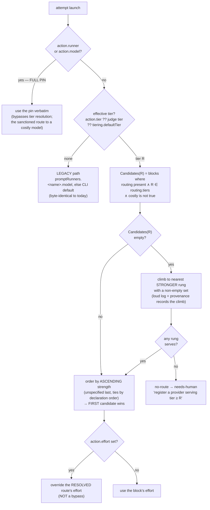

# Model tiering — Stage 2: the resolver (#226)

Stage 1 taught the harness to **describe** models. Stage 2 teaches it to **choose** one.

Everything Stage 1 and Stage 1.5 shipped is inert today: `routing.tiers`, `strength`, `costly`,
`specialization`, `effort` and `tiering.verifier.minTier` are all parsed, validated and annotated — and
nothing reads them at runtime. A task tagged `hard` runs on exactly the model an untagged task runs on.
Stage 2 is the slice where a tier stops being a label and starts being a routing decision.

:::note
Scope anchor: this stage implements **DoR §6** (`docs/plans/17-model-tiering.md`, PR #342) — §6.1
precedence, §6.2 candidate selection and the costly floor, §6.3 unavailability, and §6.5 the verifier
route. §6.4 probes (**#227**), §7 ladder (**#228**) and §8 steering (**#231**) stay **v2** and are
explicitly out of scope — all three are open, tracked issues, not deferrals into the void. Where this
charter and the DoR disagree, **the DoR wins** — the same rule Stage 1.5 was created to enforce.
:::

## What already exists

Stage 1 + Stage 1.5 (shipped in v1.6.0) left the resolver a clean foundation:

- **The candidacy predicate is already written, once.** `PromptRunnerConfig.ServesTier(tier)` is
  `routing` present ∧ `tier ∈ routing.tiers` ∧ `costly is not true`. Its costly-ignoring twin
  `DeclaresTier` exists so GR2048 can tell "no block serves this rung" from "the only blocks serving it
  are costly". **This is D22a already satisfied** — Stage 2 must *consume* this predicate, never
  re-implement it.
- **`validate` already refuses unroutable configs** — GR2043–GR2050, including GR2048 (a used tier with
  no candidate rung at or above it).
- **The registry is authorable** — `guardrails providers init` annotates blocks in place, comment-preserving
  and idempotent.
- **`costly` is tri-state** — absent and explicit-`false` both serve; the third state is what lets
  `providers init` find the un-stated ones and ask.

What does **not** exist: any `TierResolver`, any attempt-launch wiring, any `no-route` outcome, any judge
resolution, and any per-attempt provenance recording a resolved route.

## The work

### A · The `TierResolver` — a pure function of (effective tier + registry)

A new `TierResolver` in `Guardrails.Core.Prompts`, with no dependency on the attempt loop, so it is
testable as a pure function. It implements DoR §6.1 precedence and §6.2 selection:

:::diagram

:::

The three rules that must not be softened, each of which has a named failure mode behind it:

1. **Never weaker than asked.** An empty candidate set climbs to a *stronger* rung, never a weaker one.
   Routing down is not automatic in v1 — the only lever below the floor is halt-and-edit-config.
2. **Never costly without you.** `costly: true` is excluded at *every* rung — its own, a climbed-to
   stronger rung, and (§6.5) a judge bump. No override, no `--force`, no autonomy dial. The only paths to
   a costly model are an explicit task pin or the registry `default` pointer, both of which are a *human*
   assigning a model.
   **But a binding ceiling must be LOUD** *(review addition — amends DoR §6.2, see "DoR amendments"
   below)*. When a stronger block was excluded *only* because it is `costly: true`, and the task then
   goes to a re-attempt, the harness logs a strong warning naming the block it was not allowed to pick.
   Without it, a failure caused by the weaker model running out of reasoning is indistinguishable from
   an ordinary failure, and neither a human nor a reviewing agent can tell that the ceiling was the
   cause. This changes what is **logged**, never what is **selected**, so the floor is untouched.
3. **Ascending strength, so the weakest capable model wins.** A `hard` task gets the weakest model the
   operator declared capable of hard. There is no numeric tier→strength mapping, ever.

### B · Attempt-launch wiring and provenance

Resolution runs immediately before **every** attempt, including retries — replacing today's two-level
`ResolveModelForDisplay(task.Action.Model, runnerModel)` fallback in `TaskExecutor`. The resolved
`(provider, model, effort)` is recorded in the attempt's log header, extending the per-attempt model
logging from #198.

:::warn
Per-attempt, not per-task. In static v1 the resolver is a pure function of *(tag + registry)* and so
returns the same block every attempt — but **neither input is frozen for the life of a run**. A resumed
run whose `guardrails.json` was edited between sessions, an overwatcher-applied change (#269), or a
human hand-edit between waves (#254) all move an input mid-run. Resolving once per task would silently
serve a stale route.
:::

### C · The `no-route` outcome

The defensive residual: resolution finds literally zero candidate blocks at runtime for a used rung — a
config gap GR2048 should have caught. It settles **needs-human** with an actionable message naming the
rung. Cheap, honest, and independent of probes, so it stays in v1.

### D · The verifier route (§6.5) — "a prompt may propose, only an equal-or-stronger judge may vouch"

The failure this prevents is the model-layer analogue of #382: if a task runs on a local 32B and its
*judge* guardrail runs on the same local 32B, a plausible-but-wrong implementation and a
plausible-but-wrong "looks good to me" can agree, and the run goes green over broken work.

A judge resolves its own route in the **same** `TierResolver`, at the same moment as the actor:

- **Explicit wins** — a judge's frontmatter `tier`/`runner` pin resolves like an action's.
- **Otherwise the judge's rung = the actor's rung.** Not the actor's strength — the *rung*, because rung
  is what `routing.tiers` is expressed in.
- **The bump is in STRENGTH, never in tier.** When the actor is weak, the judge is the weakest candidate
  *at the actor's rung* whose `strength` is strictly greater. Bumping the tier instead would mean
  "pretend the work is harder", which contradicts the difficulty-≠-strength split.
- **A bump crosses providers, and that is the point — not a side effect.** `Candidates(R)` is computed
  over *every* block in the registry regardless of `kind`; the only ordering axis is ascending
  `strength`. So a local 32B actor bumping to a Claude block is exactly what the rule produces. Nothing
  in the predicate mentions the provider, and no implementation may add a same-provider constraint.
- **Human sanction propagates to the judge** *(review ruling — amends DoR §6.5 point 5, see "DoR
  amendments" below)*. Once a human has pinned a costly model for the **actor**, costly spend is already
  sanctioned for that task, so the judge may bump into a `costly: true` block without a halt and without
  a further prompt. This is consistent with the floor as stated rather than an exception to it: the
  floor constrains the *harness choosing*, never the *human assigning* — and here the human has already
  assigned. Absent such a pin, DoR §6.5 point 5 stands unchanged: the judge stays at the actor's route
  and fires the advisory.
- **`guardrailOverrides` compose with the resolved JUDGE block, not the actor's.** An implementer will
  get this backwards otherwise, silently mis-profiling every bumped judge.

The asymmetry at the centre of this stage — and the thing most likely to be implemented wrong by
symmetry-seeking instinct:

:::comparison
| | Actor, when the only capable block is `costly` | Verifier, in the same situation |
|---|---|---|
| **Behaviour** | **Halts** — GR2048 at validate time, `no-route` at runtime | **Degrades** — stays at the actor's route and fires the #229 advisory |
| **Why** | The actor's route is load-bearing: routing it wrong produces wrong work | The judge's route is advisory: a weaker judge is a weaker opinion, not broken work |
| **What it never does** | Silently drop to a weaker rung, or quietly reach for the costly block | Block the run on a model-quality opinion, attended or unattended |
:::

Surfacing is **advisory at both boundaries, and both are v1**: a preflight line before the run, and a
per-attempt JIT re-check. The de-duplication ruling matters — the preflight emits one summary line per
affected task; the JIT check records `judge.advisory` in provenance *always* but logs **only when the
observed pair differs from what the preflight predicted**. Three surfaces reporting one condition is how
you train people to ignore all three.

:::note
Why both boundaries, when a static resolver makes them agree? **Because that agreement is the point.**
The preflight is a *model* of the resolver; the JIT check *is* the resolver. Any disagreement is by
definition a resolver bug no preflight could catch. This repo has already paid for the general version
of that lesson — #382, where a static check mirroring the real path certified green while the real path
was broken.
:::

### E · Per-tier spend line (#230-lite)

The run report aggregates cost and tokens per tier from the §9.3 provenance. This is the measurement that
makes the v2 deferrals (probes, ladder, steering) decidable with data rather than intuition.

## Acceptance

- A tagged task resolves to a block by tier, and the resolved `(provider, model, effort)` appears in the
  attempt log header and in provenance.
- A `hard` task whose only capable block is `costly: true` **fails `validate` (GR2048) — before the run
  starts, at zero spend.** This is a config refusal, *not* a mid-run halt: it never interrupts a task
  that has a capable block, and it cannot cut a running task short. If forced past validate it settles
  `no-route` at runtime, never running on the costly block and never dropping to `easy`.
- **A task with a capable block spends its whole retry budget on that block.** In static v1 the resolver
  is a pure function of *(tag + registry)*, so it returns the same block on every attempt — a task that
  fails on attempt 1 re-attempts on the *same* model, collecting the retry feedback each time. There is
  no path in this stage by which a task is halted early on the theory that its model is too weak.
- An empty candidate set at rung R climbs to the nearest stronger rung, and the climb is visible in the
  log and in provenance.
- A full pin (`action.runner` / `action.model`) bypasses resolution entirely; `action.effort` alone does
  **not** — it overrides the resolved route's effort.
- A judge guardrail on a weak actor resolves to a strictly-stronger block at the same rung; when the only
  stronger block is costly, it stays put and fires the advisory rather than halting.
- **Invariant 7 holds**: a plan with no tags and a registry with no `routing` block anywhere produces a
  run byte-identical to today, with zero tier-resolution activity.

## Dogfooding this stage

Stage 1.5 and workstream B were hand-coded because their guardrails would have needed live network calls,
and a flaky guardrail erodes trust in a whole run. **§6 has no such problem** — the resolver is a pure
function over config, so every guardrail here is deterministic and offline.

:::warn
Two hazards carried forward from the Stage 1 run, both of which bit that run specifically:

**The overwatcher will not save a thrashing task (#452).** On the Stage 1 run it fired, spent $0.66, and
recorded **zero** decisions — its own Bash calls were permission-denied, so it burned 11 turns on blocked
reads and died `error_max_turns`. It is silent *and* billed. Do not plan around a supervisor verdict.

**The real Stage 1 defect was the turn budget, not the missing supervisor.** Task
`02-implement-runner-kind-and-axes` ended `max-turns` on three attempts with `failedGuardrails: []` —
nothing was failing, it was running out of room — then passed every guardrail on the final attempt. That
is a *plan-authoring* input, not something to delegate.
:::

## Failing early

The Stage 1 run was **9/9 green and still shipped a materially different schema than the design of
record** — no `routing.tiers` at all, so this stage's resolver would have had nothing to read. It was
green because guardrails verified what the *tasks* specified, the tasks came from the charter, and
nothing in the pipeline ever compared shipped code against the DoR.

That gap is more dangerous here than it was in Stage 1. Stage 1's drift was *visible* the moment Stage 2
tried to read a field that did not exist. A resolver that quietly selects the wrong block produces runs
that look completely normal — the wrong model, on budget, all green.

## Open decisions (for your review)

:::question
{ "id": "s2-verifier-scope", "title": "Does the verifier route (§6.5) ship inside Stage 2, or split into its own stage?",
  "mode": "single", "options": ["Include §6.5 in Stage 2", "Split §6.5 into a separate Stage 3", "Include only the preflight half now, JIT later"],
  "recommended": "Include §6.5 in Stage 2", "target": "human",
  "rationale": "The DoR puts the judge in the SAME TierResolver, and §6.5 point 3 notes the judge provenance object is written per attempt regardless — so the judge route is already resolved at every attempt launch. Splitting it means building that provenance twice and re-opening the resolver a second time. The cost is that Stage 2 roughly doubles in surface area. Note the third option is the one the DoR explicitly overruled: it considered deferring the JIT half and rejected it, because a preflight that is the only check is a fake mask over the composition root.", "answer": ["Include \u00A76.5 in Stage 2"] }
:::

:::question
{ "id": "s2-dor-gate", "title": "Should PR #342 (the design of record) be merged before Stage 2 implementation starts?",
  "mode": "single", "options": ["Merge #342 first — treat it as a real gate", "Start Stage 2 now, merge #342 in parallel", "Leave #342 as a draft as before"],
  "recommended": "Merge #342 first — treat it as a real gate", "target": "human",
  "rationale": "Stage 1's charter said the DoR must be reviewed and merged first, 'not a formality' — and nothing enforced it, so Stage 1 shipped ahead of its own gate and drifted. Stage 2 IS the implementation of §6, so a draft spec matters more here than it did there: every acceptance criterion above cites a section of a document that is not on master. The cost is a real delay if #342 needs another review round.", "answer": ["Merge #342 first \u2014 treat it as a real gate"] }
:::

:::question
{ "id": "s2-conformance-gate", "title": "How should Stage 2 prove the shipped code matches the DoR, rather than merely matching its tasks?",
  "mode": "single", "options": ["A terminal DoR-conformance guardrail asserting named §6 contract lines landed", "Per-task conformance assertions inside each task's guardrails", "Rely on /guardrails-review to catch drift"],
  "recommended": "A terminal DoR-conformance guardrail asserting named §6 contract lines landed",
  "target": "human",
  "rationale": "This is the direct remedy for the Stage 1 failure — 9/9 green with the wrong schema, because nothing compared shipped code to the design of record. The salvage plan already proved the mechanism works (an 'ssot-contract-line-landed' guardrail). A terminal gate is one place to maintain and can assert the whole §6 contract at once; per-task assertions catch drift earlier but scatter the spec across many files and can be satisfied piecemeal while the composition root stays broken — which is exactly the #382 shape.", "answer": ["A terminal DoR-conformance guardrail asserting named \u00A76 contract lines landed"] }
:::

:::question
{ "id": "s2-waved", "title": "Author Stage 2 as a #254 waved plan, or a flat task DAG?",
  "mode": "single", "options": ["Waved — foundation / wiring / verifier as three strict-ordered waves", "Flat task DAG with dependsOn edges"],
  "recommended": "Waved — foundation / wiring / verifier as three strict-ordered waves",
  "target": "human",
  "rationale": "The DoR leaves this to you explicitly (OD-D) and notes the stages have the strict-order, hard-barrier shape waves enforce. Stage 2 has a genuine barrier: the TierResolver must exist and be proven before anything wires it into the attempt loop or resolves a judge against it. Waves also give per-wave union gates, which is where a cross-file break would surface. Against it: waves add a layer whose own bugs (#447, #459, #465) are still being found, so this dogfoods #254 on work you care about.", "answer": ["Waved \u2014 foundation / wiring / verifier as three strict-ordered waves"] }
:::

:::question
{ "id": "s2-turn-budget", "title": "What maxTurns should Stage 2's implementation tasks carry?",
  "mode": "single", "options": ["80 — raise it from Stage 1's 50", "50 — unchanged from Stage 1", "100 — raise it substantially"],
  "recommended": "80 — raise it from Stage 1's 50", "target": "human",
  "rationale": "Measured, not guessed: Stage 1's task 02 hit max-turns on three attempts at maxTurns 50 with failedGuardrails empty, then passed everything on the final attempt — the textbook 'a bigger budget would finish' case (#94). Stage 2's tasks are comparable or larger. Since #452 means the overwatcher will not notice and grant more, the budget has to be right at authoring time. 80 is a ~60% headroom increase; 100 buys more margin but also lets a genuinely stuck task burn longer before halting.", "answer": ["80 \u2014 raise it from Stage 1\u0027s 50"] }
:::

## DoR amendments this review created

Two review rulings **change** the design of record rather than restate it. Recording them here is not
sufficient — the Stage 1 lesson is precisely that plan-only text loses to the DoR, and the next
implementer reading §6 would revert both:

| Ruling | Amends | What changes |
|---|---|---|
| A binding costly ceiling logs a strong warning on re-attempt | **§6.2** | §6.2 specifies the costly *exclusion* but no *surfacing* for it. Adds a log obligation; selection is untouched. |
| Human sanction propagates — a costly **actor pin** licenses a costly **judge** bump | **§6.5 point 5** | §6.5 point 5 currently applies the costly floor to the judge bump unconditionally. Adds the pinned-actor carve-out. |

:::warn
**These amendments are now on the critical path.** You chose *"Merge #342 first — treat it as a real
gate"*, so #342 must absorb both **before** Stage 2 implementation starts. Merging #342 as it stands and
then discovering the plan contradicts it in two places would reproduce the exact Stage 1 failure this
stage is built to avoid — except this time the drift would be *authored deliberately* and then lost.
:::

## Follow-ups this review raised (tracked, not deferred into the void)

- **`/plan-breakdown` should recommend a costly model where warranted.** The constructive counterpart to
  the halt: instead of only refusing to *choose* costly, the breakdown tells you *where* costly is
  justified and lets you pin it. This preserves the floor exactly — recommending and assigning are
  different acts, and only assigning is a selection. **Skill-side work, not resolver work**, so it is out
  of this stage's scope; to be filed against the tagging doctrine (#225 / #229 area).
- **The v2 ladder must not escalate before the retry budget is spent** (#228). Retry feedback is itself a
  lever — escalating early buys a stronger model while throwing away the cheaper fix. No effect on this
  stage, which has no escalation at all; to be recorded on #228.
- **Charter #156** — an authoring agent should verify every deferral a plan names is covered by a tracked
  issue and raise a `:::question` when nothing tracks it. Filed from this review.

## Scope / non-goals

**In:** DoR §6.1 precedence · §6.2 candidate selection + the costly floor · §6.3 connection-failure
classification riding the shipped #115 pause · §6.5 the verifier route (pending the scope question above)
· `no-route` · per-attempt provenance · #230-lite per-tier spend line.

**Out, and deferred to v2 by the DoR's organizing decision (D18):** §6.4 budget/limit probes and
`guardrails providers status` (#227) · §7 the escalation ladder and `tierSource: "escalated"` (#228) ·
§8 threshold prompts, ambient steering and `--prefer` (#231). The v2 designs are *retained* in the DoR so
v2 inherits a ratified spec rather than a blank page — do not partially implement them here.

**Also out:** the #223 concrete non-Claude runner (a standalone issue that plugs into the `kind` seam),
per-model dollar pricing tables, and overwatcher tier-pinning.

## Related

- **#226** — this stage's issue (attempt-launch resolution).
- **#201** — the epic. **#342 / `docs/plans/17-model-tiering.md`** — the design of record, §6 especially.
- **#224 / #225** — the registry and the static tag this consumes, both shipped in Stage 1.
- **#229** — the model-appropriateness review finding this stage's advisory feeds.
- **#452** — the overwatcher no-op, the reason the turn budget must be right up front.
- **#382** — the passing-but-blind precedent behind both the verifier route and the conformance gate.
