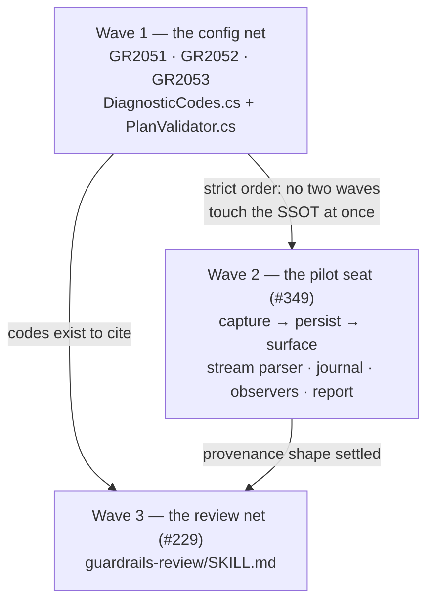

# Model tiering — Stage 3: honesty and visibility (#229 · GR2051–GR2053 · #349)

Stage 1 taught the harness to **describe** models. Stage 2 taught it to **choose** one. Stage 3 is the
stage where a human can **see what it chose, and be told when the choice was never really made.**

Three gaps survive v1, and they are the same gap wearing three hats. A plan can name a tier nothing can
serve and `validate` says nothing. A task can carry no tier at all and `/guardrails-review` says nothing.
An attempt can run on a model nobody asked for and the journal records the model we *guessed*. In each
case the mechanism reports health it has not verified — the defect shape this repo pays for most often.

:::note
**Scope anchor.** This stage implements the last un-shipped v1 rows of the design of record
(`docs/plans/17-model-tiering.md`): **§4.2 / §12.6**'s three remaining validate warnings
(**GR2051 / GR2052 / GR2053**, reserved by name and still free), **§6.5 / §12.6**'s third advisory
surface — the **#229** `/guardrails-review` model-appropriateness check — and **§9.3**'s provenance base,
**#349**, which Stage 2 explicitly did not block on and did not fully land. §6.4 probes (**#227**), §7 the
ladder (**#228**) and §8 steering (**#231**) stay **v2**; **#223** (the concrete non-Claude runner) stays
standalone. Where this charter and the DoR disagree, **the DoR wins** — except where this charter says
plainly that it is *amending* the DoR, which it does once, in a section named for it.
:::

## What already exists — verified against the tree, not the issue text

Several of these are **open issues whose work has shipped**. Reading the tracker alone would mis-scope
this stage in both directions, so every row below was checked in the source.

| DoR item | State | Evidence |
|---|---|---|
| Stage 1 + 1.5 — registry, three axes, gated tagging | **shipped** | `Providers/RegistryAxes.cs`, `Model/TieringConfig.cs` |
| Stage 2 — §6.1/§6.2 static resolver | **shipped** | `Prompts/TierResolver.cs`, `Prompts/TierResolution.cs` |
| Stage 2 — §6.5 verifier route, both boundaries | **shipped** | `Prompts/VerifierAdvisory.cs`; preflight in `Scheduler.cs:299`, JIT in `GuardrailRunner.cs:326` |
| §9.3 judge provenance object (D32) | **shipped** | `AttemptJudge` — 8 members, `Bumped` non-optional |
| #230-**lite** per-tier spend line | **shipped** | `Journal/JournalTierSpend.cs` → `RunCommand.cs:1993` |
| GR2047–GR2050 | **shipped** | `DiagnosticCodes.cs:591–651` |
| **GR2051 / GR2052 / GR2053** | **not allocated** | `DiagnosticCodes.cs:848` still reserves them by name |
| **#229** review-time check | **not built** | `guardrails-review/SKILL.md` only *references* #229; no check exists |
| **#349** the model that actually ran | **not built** | `ClaudeStreamParser.cs` still discards every non-`result` line |

Two consequences worth stating before the work, because both change how this stage should be read.

:::warn
**The epic's headline is still inert, and this stage does not fix that.** `ClaudePromptRunner` is the
**only** `IPromptRunner` in the tree. Every tier — `easy`, `medium`, `hard` — resolves to a Claude model,
because there is nowhere else to route. Routing across Haiku/Sonnet/Opus is real saving and this stage
makes it legible; *"route easy work to the local box"* is not reachable until **#223** ships, and #223 is
gated on a real local endpoint existing to test against. Nothing here should be read as delivering the
local-inference thesis.
:::

:::warn
**Two of #229's three surfaces already exist, which makes the third one's absence easy to miss.** §6.5
requires the weak-judge advisory at three places: a startup preflight line, a per-attempt JIT re-check,
and a #229 review finding. Stage 2 built the first two. So a maintainer watching a run *does* see verifier
advisories today — which reads as "#229 is done" — while the surface that fires **before any money is
spent** was never built. That is the whole value proposition of #229: catching a mis-tag at review time
rather than discovering it mid-run.
:::

## The work

### A · The config net — GR2051, GR2052, GR2053 (validate time)

Three warnings the DoR specified, Stage 1 deferred, and Stage 2 deliberately declined to take. They are
already reserved by name in `DiagnosticCodes.cs`, so **this stage takes them at exactly those numbers** —
no re-allocation, no renumbering.

| Code | Name | Condition | Why it matters |
|---|---|---|---|
| **GR2051** | `NonRoutableBlockIsDefault` | a `costly: true` **or** `routing`-less block is the registry `default` pointer in a tiering-configured file (§4.2) | the reserved-model back door: an untagged task with no `defaultTier` falls to legacy resolution, lands on the reserved model, and the reservation evaporates silently |
| **GR2052** | `CostlyBlockRoutingInert` | a `costly: true` block also declares `routing` (§4.2) | the routing can never apply — the candidacy predicate excludes costly first. A warning, not an error, so GR2048 can still report the *real* consequence |
| **GR2053** | `PinAndTierCoexist` | a full pin (`action.runner`/`action.model`) and `action.tier` on one action (§6.1, DA F3) | the tier is dead weight the pin overrides; the author believes they tiered a task they actually pinned |

All three are **warnings**. The plan still runs. §12.6 is explicit that none of the verifier-family
conditions may fail a build, and these three inherit that posture.

:::note
**One task owns `DiagnosticCodes.cs`.** Not a style preference — a measured failure. Stage 1 had two
same-tier tasks each allocate a code and each edit the "CURRENT next-free" marker; the agents handled it
*well* (task 02 skipped GR2043 with a comment explaining the concurrent allocation) and the **merge still
could not combine them**. There is no mechanism for that negotiation. Three codes, one owner, pre-named
here.
:::

### B · The pilot seat — #349, the model that actually ran

`ResolvedModelForDisplay` records what the harness **asked for**. The CLI already tells us what actually
**ran** — Claude Code's `stream-json` opens with
`{"type":"system","subtype":"init","model":"claude-…"}` — and the harness already tees that stream to
`claude-stream.jsonl`. `ClaudeStreamParser.Feed` returns on every line whose `type != "result"`, throwing
the init model away. **That one discard is the entire gap.**

The mechanism is to parse the echo, never to force `--model`. Forcing one would pin the zero-setup user
who deliberately passes nothing, and would record the model we *requested* — the weaker fact.

Five surfaces, in dependency order:

1. **Capture** — `ClaudeStreamParser` reads `model` from `system`/`init`, falling back to the terminal
   `result` line; `PromptResult.ResolvedModel`; populated in `ClaudePromptRunner`. *The load-bearing change.*
2. **Persist** — the provenance record (see the conflict below), populated in `AttemptJournaler`.
3. **Log header** — the per-attempt preamble prints the resolved model, and both strings on mismatch.
4. **Live UI** — a new default-method `IRunObserver` event, rendered by `LiveRunObserver` and forwarded by
   both decorators (`OnTheFlyLogSiteObserver`, `OnTheFlyDiagramObserver`).
5. **Run report** — a models-used summary line.

:::warn
**#349's design and Stage 2's shipped code give opposite instructions, and neither knows about the other.**

DoR **§9.3** ruled: *"Stage 2 lands whichever of `resolvedModel` / `effort` is not already present, in the
shape #349 specifies, and #349 then becomes a no-op for those fields."*

Stage 2 landed `Effort`. It did **not** land `resolvedModel` — and wrote the refusal into the contract, at
`JournalModel.cs:401`: *"deliberately no second `resolvedModel` key — two fields claiming the same fact is
how they drift."*

Both are defensible and they cannot both stand. The DoR-wins rule says §9.3 governs; the shipped comment
says otherwise and is the thing an implementer will actually read. **This is the decision that must be
settled before any task authors against `AttemptProvenance`** — and it is exactly what the stale
`pilot-seat-model-provenance/` folder would have executed blind, since it was authored on 2026-08-11,
eight days before Stage 2 restructured the record it targets.
:::

:::comparison
| Reconciliation | What `provenance.model` means | Mismatch detectable? | Cost |
|---|---|---|---|
| **`model` becomes best-known-actual; add `requestedModel` only when it differs** | observed ?? route ?? sentinel | yes — `requestedModel` present *is* the mismatch | amends §9.3's wording; changes a shipped field's semantics |
| **Add `resolvedModel` beside `model`, as §9.3 specifies** | unchanged — the route's model | yes — compare the two keys | two keys carry the same fact whenever they agree, which is nearly always |
| **One field, no mismatch detection** | observed ?? route ?? sentinel | **no** | cheapest, and gives up the silent-substitution catch that motivated #349 |
:::

The first row is the one that satisfies both arguments rather than picking a winner: Stage 2's objection
is to *duplication*, and `requestedModel` written **only on disagreement** is never a duplicate.

**Settled at review (`s3-provenance-shape`): row 1.** `provenance.model` becomes best-known-actual —
observed ?? route ?? sentinel — and `requestedModel` is written **only when it differs**. Existing
readers improve with no change on their side, mismatch stays detectable, and no two keys ever carry the
same fact. This amends DoR §9.3; see *The DoR amendment this charter creates* below.

### C · The review net — #229 (`/guardrails-review`)

The third advisory surface, and the only one that fires at zero spend. Two findings, of very different
character — worth separating, because one is deterministic and one is a model's opinion:

- **Missing classification** *(deterministic)* — a prompt-action task, or a surviving judge guardrail,
  with neither a difficulty tag nor an explicit `action.model`/`action.effort` pin. This is a fact about
  the folder. It is the safety net for a task a human hand-added after breakdown, and with the ladder
  (#228) deferred to v2 there is **no runtime backstop** — a mis-tag is caught here or not at all.
- **Mismatched tier** *(judgment)* — a high-risk task tagged for a weak tier, or a mechanical one tagged
  frontier-only. Genuinely a model's opinion about difficulty.

Both are advisory findings in the review report, at the skill's existing severity conventions, never a
silent auto-fix. Per §12.6 neither gets a GR code: *a GR code is a thing that can fail a build, and the
harness does not block on a model-quality opinion.*

:::note
**Graceful skip is a requirement, not politeness.** A plan generated before tiering shipped has no tier
field anywhere. The check must produce nothing at all on such a folder — Invariant 7's review-time
counterpart. A check that fires on every legacy plan gets muted within a week, and a muted check is
indistinguishable from the absence this stage exists to fix.
:::

## Waves, and the union hazard that decides them

:::diagram

:::

Strict-ordered waves are chosen here for a specific, measured reason rather than tidiness.

:::warn
**Stage 1 lost a run to two tasks sharing `src/Guardrails.Core/`, and #458 makes that shape now
*guaranteed* to halt rather than merely likely to.** `AiMergeResolver.cs:86` is literally
`conflictedFiles[0]` — a union conflicting in **2 or more files can never be AI-resolved**, deterministic
and total. Stage 1 conflicted in exactly two files; `DiagnosticCodes.cs` was the second, which is why it
still carried conflict markers after a "successful" merge. #451 fixed the *symptom*, so today you get an
honest needs-human rollback instead of a corrupted delivery — a real improvement that still stops the run.

**Two files are shared sinks across all three workstreams**, and they are the collision:
`docs/plans/02-schemas-and-contracts.md` (the SSOT — also `eol=lf`-pinned and **byte-compared** by
`SchemaDriftTests`, so even a whitespace-level union is fatal) and
`.claude/skills/guardrails-domain-knowledge/SKILL.md`. Wave boundaries are hard barriers, so sequencing
the three workstreams means no two SSOT edits are ever in flight together. **Within** a wave, exactly one
task — the last — may touch either file.

`/guardrails-review` has a probe for the trait-filter deadlock (#455) but **none** for "two same-tier
tasks share a writeScope". This one is still entirely on the author. **Filed as #493** from this review,
with its natural slot noted as *before* this stage runs.
:::

## The toolchain preflight — added by review

A **plan-root preflight** that runs before any wave, at zero AI spend, and asserts the harness executing
this plan is the one the plan was designed for:

- `guardrails --version` reports **≥ 1.8.0**.
- Each skill this run depends on carries the **matching install-time stamp** — the two-line
  `metadata: guardrails-version` block #169 injects at install. Verified today at
  `~/.claude/skills/<skill>/SKILL.md` for `plan-breakdown`, `guardrails-review` and
  `guardrails-domain-knowledge`, all reading `guardrails-version: 1.8.0`.

:::warn
**This preflight is load-bearing precisely because waves 2 and 3 are authored just-in-time.** The JIT
salvage depends on `/plan-breakdown` writing `state/breakdown-intent.json`; the harness half is complete,
but **a stale skill that never emits the manifest turns a truncated breakdown back into a wholesale
quarantine** — silently, since a skill that does not know about a file cannot warn that it skipped it.
GR2064 catches a manifest that is *present but unusable*; nothing catches one that was never written by a
skill too old to know about it.

The version stamp exists because this exact failure already shipped once: **#169** — the #156 build-time
stamp targeted `$(OutDir)` while `PackAsTool` packs the *publish* output, so every published nupkg
shipped **unstamped** skills and the drift check had nothing to read. A tool and its skills can disagree
while both report success, which is why this asserts the pair rather than either half.
:::

Deliberately a **preflight**, not a task guardrail: it is a precondition on the whole run, it should fail
before anything is authored or spent, and #181/#182 established the no-op-root preflight as the general
archetype for exactly this — *never build on red*, stated positively.

## Acceptance

- A tiering-configured registry whose `default` names a `costly: true` block warns **GR2051** at
  `validate`; the same registry with tiering unconfigured warns nothing.
- A `costly: true` block carrying `routing` warns **GR2052**, and a plan that *also* has an unservable
  tier still reports **GR2048** — the two compose rather than mask each other.
- An action carrying both a full pin and `action.tier` warns **GR2053**; a pin with no tier, and a tier
  with no pin, each warn nothing.
- A canned `stream-json` fixture with a known `init` model **parses to that exact model string**; a stream
  with no model line yields **null, not a crash**, and the attempt still settles normally.
- An attempt's `run.json` provenance carries the **real** model and **never the bare `"(cli default)"`
  sentinel when the stream reported one**; a requested≠resolved case is recorded in whatever shape the
  provenance question below settles on.
- The per-attempt log header, the live UI, and the run report each show the resolved model, and the two
  observer decorators forward the new event — asserted on the decorators themselves, not only on
  `LiveRunObserver`.
- `/guardrails-review` reports a prompt-action task with no tier and no pin as a finding, and reports
  **nothing at all** on a pre-tiering plan folder.
- **Invariant 7 holds.** The golden plans (`hello-guardrails`, `parallel-hello`) run byte-identically for
  routing and spend; journals written before this stage still load; a run with no tiering configured emits
  no new warning, no new report section, and no new advisory.

## Dogfooding this stage

Every guardrail here is deterministic and offline. The validate warnings are pure functions over config;
the stream parser is a pure function over a canned fixture; the review check is skill text. **Nothing in
this stage needs a network call**, which is what made Stage 1.5 and workstream B hand-coded work — a flaky
guardrail erodes trust in the whole run.

:::warn
**The JIT breakdown path has never actually been run since v1.8.0 fixed it.** #385/#402 (checkpointed
authoring), #489 (Ctrl+C skipping quarantine), #469 (a 30-minute authoring window rendered as a FINISHED
run), #471 (inventory-scoped revert), #472/#488 (the per-wave review marker) are all unit- and
integration-tested and **none has met a real run**. If this stage's waves are authored just-in-time, that
is the first real exercise. A finding there is a finding, not a surprise — but it should be a deliberate
choice, which is why it is a question below rather than an assumption.

**Two carried-forward run hazards.** The overwatcher no-op (#452) is now **closed**, so a supervisor
verdict should actually appear this time — it produced none at all on the Stage 1 run. And
`--revalidate-task` still refuses worktree mode (**#456**, open), so a task stranded by a defective
guardrail costs a full re-attempt rather than a re-check.
:::

## Failing early — how this stage could go green and be wrong

Stage 1 was **9/9 green and shipped a materially different schema than the design of record**, because
guardrails verified what the *tasks* specified and nothing compared shipped code against the DoR. Stage 2
answered that with a terminal DoR-conformance guardrail asserting named contract lines landed. **This
stage inherits that mechanism**, and needs it pointed at three different sections rather than one: §4.2 /
§12.6 for the warnings, §9.3 for the provenance shape, §6.5 / §12.6 for the review surface.

The specific way *this* stage goes green and wrong is worth naming, because it is the shape all three
workstreams share: **a check that is silent when the thing it guards is broken.** A GR2051 that never
fires because it reads the wrong config node. A stream parser that returns null on the real format and
falls back to the sentinel, indistinguishable from "the CLI said nothing". A #229 check whose graceful
skip swallows every plan, legacy or not. Each passes its own tests, ships, and certifies nothing —
forever. Every guardrail in this stage must therefore prove a **positive** firing on a fixture that should
trip it, not merely the absence of false positives.

## Open decisions (for your review)

:::question
{ "id": "s3-provenance-shape", "title": "How should #349 reconcile with Stage 2's shipped 'one resolved-model field' ruling?",
  "mode": "single",
  "options": ["provenance.model becomes best-known-actual; add requestedModel ONLY when it differs", "Add resolvedModel beside model, exactly as DoR 9.3 specifies", "One field only, and drop mismatch detection"],
  "recommended": "provenance.model becomes best-known-actual; add requestedModel ONLY when it differs",
  "rationale": "DoR 9.3 told Stage 2 to land resolvedModel in the shape #349 specifies. Stage 2 landed effort, declined resolvedModel, and wrote the refusal into JournalModel.cs:401 as 'two fields claiming the same fact is how they drift'. Both are defensible and only one can stand. The recommended option satisfies both arguments instead of picking a winner: the objection is to duplication, and a requestedModel written only on disagreement is never a duplicate, while mismatch detection - the silent-substitution catch that motivated #349 - survives. It costs a DoR amendment and a semantic change to a field that has already shipped, which is why it is yours to decide.",
  "target": "human", "answer": ["provenance.model becomes best-known-actual; add requestedModel ONLY when it differs"] }
:::

:::question
{ "id": "s3-wave-authoring", "title": "Author all three waves up front, or break the later ones down just-in-time?",
  "mode": "single",
  "options": ["Author wave 1 up front, JIT waves 2 and 3", "Author all three waves up front", "Author wave 1 only and JIT everything after it"],
  "recommended": "Author wave 1 up front, JIT waves 2 and 3",
  "rationale": "The whole v1.8.0 JIT durability arc has never met a real run - checkpointed authoring, the quarantine fix, the FINISHED-run rendering fix, the per-wave review marker. Exercising it on work you care about is the point of dogfooding, but starting the run on a fully-authored wave 1 means the first 30-minute authoring window happens after something has already succeeded, not before anything has. Wave 2 is also the wave whose task shape depends on the provenance question above, so authoring it later means authoring it with that answer in hand. Against it: a JIT breakdown can still truncate, and the salvage depends on plan-breakdown emitting state/breakdown-intent.json - GR2064 now reports a manifest that is present but unusable, which used to cost the whole salvage silently.",
  "target": "human", "answer": ["Author wave 1 up front, JIT waves 2 and 3 (Recommended), but make sure that we have a guardrail to unsure that v1.8.0 is installed with its properly versioned skills in place too."] }
:::

:::question
{ "id": "s3-shared-file-ownership", "title": "How should this stage prevent the Stage 1 union conflict from recurring?",
  "mode": "single",
  "options": ["Strict-ordered waves, and exactly one task per wave owns each shared file", "File-level disjoint writeScope with tasks parallel wherever files differ", "One end-of-plan documentation task owns the SSOT and the domain-knowledge skill for all three waves"],
  "recommended": "Strict-ordered waves, and exactly one task per wave owns each shared file",
  "rationale": "Stage 1 cost a run abort, a corrupted SSOT delivered to master and about $20 because two same-tier tasks both declared src/Guardrails.Core as writeScope. #458 makes that shape worse than it was: AiMergeResolver.cs:86 is conflictedFiles[0], so any union conflicting in two or more files can never be AI-resolved at all. Two files here are shared sinks across all three workstreams - the SSOT, which is byte-compared by SchemaDriftTests so even whitespace is fatal, and the domain-knowledge skill. The third option is tempting and is the #378 anti-pattern: an over-scoped end-of-wave sink cannot fix a cross-file break, and it separates each contract change from the code it describes, which SSOT invariant 4 forbids.",
  "target": "human", "answer": ["Strict-ordered waves, and exactly one task per wave owns each shared file"] }
:::

:::question
{ "id": "s3-229-halves", "title": "Does #229 ship both findings, or only the deterministic one?",
  "mode": "single",
  "options": ["Both halves - missing classification and mismatched tier", "Missing classification only; defer the judgment half", "Both, but the judgment half is report-only and can never change the review verdict"],
  "recommended": "Both halves - missing classification and mismatched tier",
  "rationale": "The two findings are different in kind. Missing classification is a fact about the folder - a task with no tier and no pin - and with the escalation ladder deferred to v2 there is no runtime backstop, so it is caught at review time or not at all. Mismatched tier is a model's opinion about difficulty, and an opinion that can be confidently wrong in the direction that looks fine. Shipping both is what the DoR asks for and what makes the tag-quality net actually a net. The third option is the cautious middle and is worth considering, but guardrails-review findings are already advisory by construction, so it may be a distinction without a difference.",
  "target": "human", "answer": ["Both halves - missing classification and mismatched tier"] }
:::

:::question
{ "id": "s3-stale-plan-folder", "title": "What happens to the stale docs/plans/pilot-seat-model-provenance/ folder?",
  "mode": "single",
  "options": ["Delete it in this stage - this charter supersedes it", "Keep it, with a superseded note pointing here", "Leave it exactly as it is"],
  "recommended": "Delete it in this stage - this charter supersedes it",
  "rationale": "It holds 12 hand-reviewed tasks, was never run, and is dated 2026-08-11. Stage 2 then restructured the exact surfaces it targets - AttemptProvenance gained runner/kind/tier/tierSource/effort/judge, and ResolveModelForDisplay was renamed. It still looks runnable, and its task 04 would author against a provenance contract that has moved, including the resolvedModel key Stage 2 explicitly refused. A plan folder that looks executable and is not is the same hazard class as everything else in this stage. Against deleting: the task decomposition in it is good and this stage's wave 2 should borrow from it before it goes.",
  "target": "human", "answer": ["Delete it in this stage - this charter supersedes it"] }
:::

:::question
{ "id": "s3-breakdown-model-annotation", "title": "Nothing tracks #349's deferred surface 5 - should an issue be filed?",
  "mode": "single",
  "options": ["File an issue for it now", "Fold it into this stage", "Leave it untracked - the #349 brief records it and that is enough"],
  "recommended": "File an issue for it now",
  "rationale": "The #349 brief defers the plan-breakdown-model annotation - recording which model authored a breakdown - as a fast-follow, out of that plan. No open issue covers it: a sweep of the tracker for model, tier and provenance returns #349, #230, #229, #228, #226, #225, #224 and #201, none of which is it. Once this charter closes #349 that sentence is the only record, in a brief nobody re-reads. Filing an issue is a decision with an owner attached, so it is yours rather than something to do quietly. Folding it in is the option I would not take: it is a breakdown-time concern, not a run-time one, and it would be the only part of this stage that is.",
  "target": "human", "answer": ["File an issue for it now"] }
:::

**Filed as #495 and sequenced in #201.** Writing the issue surfaced something the brief did not know,
because it predates v1.8.0: the deferred surface is **two halves with different feasibility**. A **JIT
wave** breakdown is harness-invoked — `WaveBreakdownInvoker` drives `plan-breakdown` through the
`IPromptRunner` seam and awaits a `PromptResult` (`WaveBreakdownInvoker.cs:73, 76, 131`) — so its model
is capturable by exactly the mechanism #349 is adding, essentially for free. The **interactive**
`/plan-breakdown` runs in the user's own session, which DoR §4.2 puts outside the registry entirely, so
it is not capturable at all and would need the skill to self-report — an assertion rather than an
observation, and a separate decision.

The urgency also inverted since the brief was written. Deferring made sense when breakdown was something
a human drove and could remember. Waved plans plus JIT breakdown mean a wave's whole task DAG — its
guardrails, its `writeScope` declarations — can now be authored **by a model, mid-run, unattended**, and
nothing records which one. #495 is sequenced **after #349** so it inherits one answer to "what is a
resolved model" rather than inventing a second.

## The DoR amendment this charter creates

One ruling here would **change** the design of record rather than restate it. Recording it only in this
charter is not sufficient — the Stage 1 lesson is precisely that plan-only text loses, and the next
implementer reading §9.3 would revert it:

| Ruling | Amends | What changes |
|---|---|---|
| `provenance.model` becomes best-known-actual, and a `requestedModel` key is written **only on mismatch** | **§9.3** (and §12.4's provenance delta) | §9.3 instructs an implementer to land `resolvedModel` "in the shape #349 specifies". Stage 2 refused that key in the shipped contract. The amendment names one field for one fact and one field for the disagreement. **Settled at review** (`s3-provenance-shape`) — §9.3 must be amended, and `JournalModel.cs:401`'s comment updated to say *why* there is no `resolvedModel` key rather than merely that there is none. |

Either way one of the two has to move. They currently contradict each other in the repo, and the
contradiction is invisible from either side.

## Follow-ups — all three actioned at review, 2026-08-22

- **#224, #225 and #226 were open but shipped. Now CLOSED**, each with the evidence in its closing
  comment rather than a bare "done": #224 the registry, the three axes and `providers init`; #225 both
  halves of gated tagging including the not-configured gate; #226 the static resolver at DoR §10's v1
  scope. Every deferral in this charter that cites them now reads correctly.
- **The writeScope probe is filed as #493**, priority medium, and added to the #201 sequencing with an
  explicit note that its natural slot is *before* this stage runs — Stage 3's wave structure was
  hand-designed around the hazard precisely because nothing checks it. Still not this stage's work: it is
  a review-skill feature, and this stage is already changing that skill for #229.
- **The §13.3 coverage gap is CLOSED, and the note recording it was stale.** Re-verified against the
  file: GR2043 `InvalidTierValue` now covers **all four** tier-bearing sites, not two —
  `PlanValidator.cs:465, 473, 487, 498` — because Stage 2 landed both `tiering.verifier.minTier`
  (parsed at `PlanLoader.cs:222`) and the judge-frontmatter `tier`. GR2047–GR2050 shipped too, leaving
  only this stage's three. **A dated status block has been added to DoR §13.3** rather than rewriting it,
  per that section's own "recorded, not silently fixed" discipline — the note was true when written and
  false when read, which is the failure mode this charter is about.
- **A Codex CLI runner is filed as #494**, v2, deliberately separate from #223 — see *Scope* below for
  why they must not be sequenced together.

## Scope / non-goals

:::note
**"Out" here means out of STAGE 3, never out of the epic.** Everything in both lists below is still
#201 work with a tracked issue and a place in the epic's sequencing — this section scopes one execution
slice, it does not narrow the arc. The only things genuinely outside #201 are named as such.
:::

**In:** GR2051 / GR2052 / GR2053 (§4.2, §12.6) · #349's five surfaces (§9.3's provenance base) · #229's
review-time findings, **both halves** (§6.5, §12.6) · the toolchain preflight above · **deleting the
superseded `docs/plans/pilot-seat-model-provenance/` folder** · the SSOT deltas and
`guardrails-domain-knowledge` updates each wave requires, landed **in the same change as the code they
describe** (invariant 4).

**Still #201, deferred to v2 by the DoR's organizing decision (D18):** §6.4 budget/limit probes and
`guardrails providers status` (**#227**) · §7 the escalation ladder and `tierSource: "escalated"`
(**#228**) · §8 threshold prompts, ambient steering and `--prefer` (**#231**) · a **Codex CLI runner**
filling the reserved `codex` kind (**#494**, filed from this review). All four are open and tracked. The
v2 designs stay in the DoR so v2 inherits a ratified spec — do not partially implement them.

**Still #201, but not on this stage's path:** the concrete local-inference runner (**#223** — standalone,
gated on a real endpoint being available to test against; note **#494** deliberately is *not* gated the
same way, which is why they are separate issues) · per-model dollar pricing, which keeps #230 at
tokens-only (**#230**) · overwatcher tier-pinning · recording which model **authored** a breakdown
(**#495**, filed from this review and sequenced immediately after #349 — its JIT half is nearly free
once #349 lands, so it is a fast-follow rather than a distant bet).

**Outside #201 entirely:** **#493**, the `/guardrails-review` writeScope-collision probe. It is
harness-protection rather than a tiering feature — it is filed against the #201 arc only because this
epic's Stage 1 is what paid to discover it, and because its natural slot is before *this* stage runs.

## Related

- **#229** — the review check. **#349** — the pilot seat. **#230** — the report split this makes richer.
- **#201** — the epic. **`docs/plans/17-model-tiering.md`** — the design of record: §4.2, §6.5, §9.3, §12.6.
- **`docs/plans/model-tiering-stage-2.charter.md`** — the immediate predecessor, and the source of the
  conformance-gate mechanism and the turn-budget precedent this stage inherits.
- **#458** — the two-file union limitation that decides this stage's wave structure. **#456** — no
  `--revalidate-task` in worktree mode. **#382** — the passing-but-blind precedent behind *Failing early*.
