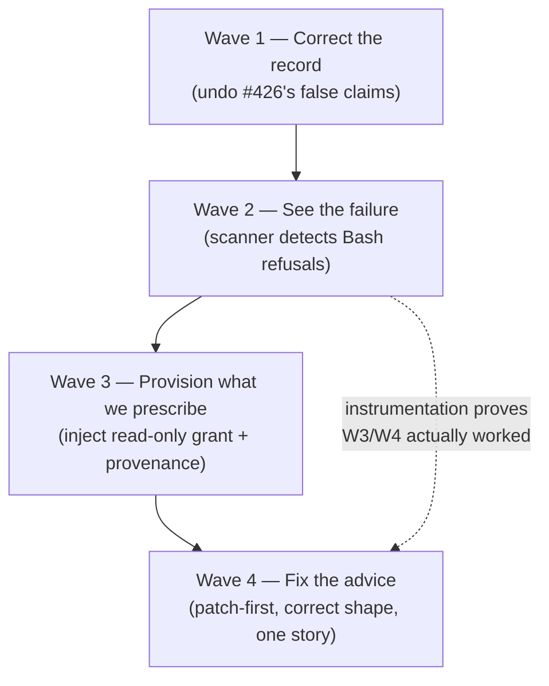

# Retry-salvage advice: provision what we prescribe (Guardrails #374 / #427)

The harness authors a retry-salvage protocol, tells the agent which commands to run to recover prior
work — and then depends on a *plan author* remembering #252, plus whatever happens to be in the
*operator's* `~/.claude/settings.json`, for those commands to be permitted. It prescribes a recipe whose
preconditions it never establishes.

This plan fixes that, and corrects the two misdiagnoses it caused along the way.

:::warn
**This defect has now been misdiagnosed twice, and the second time it shipped.** #374 blamed the `--`
pathspec separator — wrong. PR #426 (merged) then blamed the plan's `allowedTools` — also wrong, and it
introduced a *new* false claim plus SSOT drift. Both diagnoses were plausible, both were adopted without
evidence from the run transcripts, and the harness could not contradict either because it **cannot see
Bash refusals at all**. Treat every "obvious" cause here as unproven until a transcript says otherwise.
:::

## What the evidence actually shows

A four-lens review of the run logs established facts that neither #374 nor #426 had:

| Claim previously believed | What the transcripts show |
|---|---|
| The `--` pathspec separator is false-flagged | No. `git checkout "<ref>" -- <path>` runs fine; `--` is not the trigger. |
| `git checkout` is refused by the #252 allow-list | It **succeeded 2/2** in the cited run. `allowedTools` is a **floor, not a ceiling** — Claude Code merges it with the operator's `settings.json`, which grants `Bash(git checkout:*)` on the maintainer's box. A consumer or CI box gets denied. |
| The agent "gave up on the one-liner and re-applied by hand" | It made three Bash calls and **never attempted** `git apply` or `git checkout`. |
| The `git show` route "works under the default read-only git permissions" | False for real plans. `diagram-live-status-and-search` grants **no git at all** and *did* fire salvage. |
| The blocked thing is a *verb* | The dominant refusal is an **invocation shape**: `git -C <abs-path> …` was refused **86 times** in one run — and it kills read-only verbs too (4/4 `git -C show`). |

:::note
**The cost argument for loosening permissions did not survive measurement.** Salvage fires on ~1 in 8
attempts; patches run 41–79 KB. But across **356 real file-emitting tool calls**, the largest single
emission was **13% of the output cap** — agents use targeted `Edit`, never whole-file rewrites. One
measured hand-recovery cost ~4,200 output tokens (6.6% of cap) with **no transcription drift**. The real
waste is ~4 turns retrying refused commands: a wording-and-provisioning problem, not a permissions one.
So **no write verb is granted anywhere in this plan.**
:::

## The decision this plan implements

:::comparison
| Option | Verdict |
|---|---|
| **Grant a write verb** (`git restore`) per #427 | **Rejected.** 3 of 4 reviewers opposed. `git restore --source=<ref> --worktree --staged .` is a de-facto `git reset --hard <any ref>` that also deletes the current attempt's output, and a prefix glob cannot exclude that form. The cost data removed the only argument for it. |
| **Recommend only the "floor"** (never assume any grant) | **Insufficient alone.** There is no reliable floor: a real plan in this repo grants no git whatsoever. Taken strictly it means recommending no git command at all — which is achievable, but leaves the harness still guessing. |
| **Provision what we prescribe** (inject the read-only grant the protocol needs) | **Chosen.** Direct precedent: `ClaudePromptRunner` already injects `--add-dir <planDirectory>` unconditionally so the agent can reach `prior-attempt.patch`. Injecting the read-only git verb the retry text references is the same move for the same reason — zero new write surface, and **not even a new information grant**, since those bytes are already reachable via the patch. It is also the only option that fixes plans already authored, because the tool auto-updates and plan folders do not. |
:::

The cost of injection is **transparency** — the effective permission set would no longer match what
`task.json` declares. That is answerable, not fatal, and answering it is mandatory here: injected entries
must be recorded in attempt provenance and stated in the SSOT.

:::diagram

:::

Waves are strictly ordered. Wave 2 comes before the fixes deliberately: **instrument before you repair**,
so the refusal count is observable and the later waves can be proven to drive it to zero rather than
asserted to.

## Wave 1: Correct the record

Undo the defects PR #426 merged. No behaviour depends on this wave; it exists because the codebase
currently states things that are false.

- Remove the unconditional claim in `RetryPolicy.AppendSalvageSection` that the `git show` route "works
  under the default read-only git permissions" — false for any plan with no git entries.
- Remove the "writeScope-enforced at write time" rationale from the code comment. There is **no**
  write-time writeScope enforcement: `WriteScope.IsInScope` has three call sites (the harness's own
  `HarnessWrite`, a `StagingMover` path match, and the retrospective `WriteScopeCheck`).
  `WorktreeContainmentHook` enforces worktree containment only, and with `permissionMode: acceptEdits`
  the Write/Edit route bypasses the allow-list entirely — making it the *less* governed route.
- Fix the SSOT drift #426 left: `docs/plans/02-schemas-and-contracts.md` lines 382 and 574, and
  `.claude/skills/guardrails-domain-knowledge/SKILL.md` lines 254, 800, 808, still specify
  `git checkout <ref> -- <path>` as the SOME-recovery route.
- Correct the skill wording that claims state-mutating git "stays outside `allowedTools`" — the
  mechanism cannot deliver that. The list is a floor; it grants and cannot withhold.

## Wave 2: See the failure

Builds on Wave 1. The harness is blind to the entire failure class this plan addresses — 86 refusals in
one run were detected as **zero** permission walls.

- `ClaudePermissionScanner.DenialPhrase` matches none of the real refusal texts
  (`"This command requires approval"`, `"…contains multiple operations. The following part requires
  approval"`), and `WriteFamilyTools` excludes `Bash` outright. Both must change.
- A refused command must surface as a first-class, countable signal — this is the observability that
  would have caught #374 without a human dogfooding it.
- Add coverage that pins the real refusal strings verbatim, sourced from the committed transcripts, so a
  future phrasing change is caught rather than silently re-blinding the harness.

## Wave 3: Provision what we prescribe

Builds on Wave 2, so the effect is measurable. The harness stops depending on a plan author or an
operator dotfile for its own protocol to function.

- Inject **`Bash(git show*)` and nothing else**, unconditionally, alongside the existing
  `--add-dir <planDirectory>` injection in `ClaudePromptRunner` (decisions 1 and 2).
- Record the injected entries in **both** the attempt provenance record and the attempt log header, so
  the **effective** permission set is auditable and can never silently diverge from the declared one
  (decision 3).
- Land the contract change in the SSOT in the same wave: the harness's retry feedback must never present
  a runnable command the effective permission set does not grant.
- **State the widening explicitly** (decision 4): unconditional injection moves `git show` reach from
  "plans that happened to grant it" to *every* plan, and `refs/guardrails/<taskId>/attempt-N` is
  repo-global — so every task can now read every other task's discarded attempts. That is already true
  wherever #252 applied; this makes it universal. Documented here, decided in its own issue.
- No write verb is injected, under any condition.

## Wave 4: Fix the advice

Builds on Wave 3. Make every recommendation correct, cheapest-first, and consistent across all three
places the harness gives recovery advice.

- **Lead with the patch-file route.** `prior-attempt.patch` needs no git at all, is already inside the
  granted read surface, and is *strictly better* than `git show` for surgical edits — a diff beats a
  whole blob. Today it is framed as "Pull in EVERYTHING", which reads all-or-nothing and hides the
  cheapest option.
- **Route by size.** `SalvageRef.DiffStat` already carries per-file changed-line counts and is already
  embedded in the feedback — connect it to the advice: few changed lines → read the hunk and `Edit`;
  essentially-new file → pull the whole blob.
- **Drop the `git diff <taskBase> <ref>` alternative** (forced by decision 1). It is the only remaining
  command in the salvage text outside the injected grant, and leaving it would reproduce this exact
  defect in miniature. `git show --stat "<ref>"` already covers inspection, so the prescribed set
  collapses to the single provisioned verb. **Acceptance for this wave: every command the salvage text
  emits is `git show`, the patch path, or a file-editing tool — nothing else.**
- **Name the working invocation shape.** The harness sets cwd to the worktree, so `git -C <abs-path>` is
  both unnecessary and the dominant cause of refusals. Say so.
- **Reconcile the three sites into one story.** After #426 a single worktree-mode prompt contradicts
  itself: `PromptComposer.cs:347-349` ships an unhedged block recommending
  `git diff > /tmp/mine.patch` → `git checkout -- <files>` → `git apply` (the redirect is blocked by the
  harness's own containment hook, and both verbs are ungranted on a clean box), and
  `WorktreeContainmentHook.cs:263/375` repeats the same recipe in its block message — while `RetryPolicy`
  now says the opposite. Note `PromptComposerTests.cs:267` pins the current text.
- **Warn that whole-patch adoption is often wrong.** In a real run the agent correctly refused
  `git apply` because the patch carried out-of-scope `packages.lock.json` churn that would have failed
  the write-scope check.

## Decisions

:::note
**Provenance of these four calls.** The maintainer reviewed the open decisions and delegated them:
*"For all the questions please go with your advice and answer them."* They are therefore the **authoring
agent's** calls made under explicit delegation — not four judgements the maintainer weighed individually.
Recorded this way so a later reader can tell delegated calls from ratified ones, and knows which to
re-open cheaply. The one most worth a second look is flagged below.
:::

**1. Injection scope — inject `git show` only, and narrow the advice to match.**
Provision exactly what the protocol prescribes, nothing more. This has a consequence the option text did
not: the current advice also references `git diff <taskBase> <ref>` for inspection, which would remain
ungranted and reproduce the same defect in miniature. So Wave 4 **drops the `git diff` alternative** —
`git show --stat "<ref>"` already covers inspection and `git show "<ref>:<path>"` covers content. One
verb prescribed, one verb provisioned, exactly equal. Rejected the full read-only set (`log`/`status`
are not part of this protocol; #252 can still grant them for general inspection) and rejected
inject-nothing (the patch route leads, but the harness should not keep *guessing* about the verb it
still names).

**2. Injection timing — unconditional**, exactly like the existing `--add-dir <planDirectory>`.
Conditioning on "an attempt that carries a salvage ref" would make the effective permission set vary
between attempts of the same task — reintroducing the nondeterminism this plan exists to remove.
Conditioning on "only when the plan lacks it" needs fragile prefix-glob matching against the declared
list and yields an identical effective set anyway. Unconditional is the simplest rule that is always
true, and the grant is read-only.

**3. Provenance shape — both.**
Machine-queryable in the attempt provenance record (extending #198) so divergence between declared and
effective is *checkable*; echoed in the attempt log header so it is *noticeable* by a human reading
logs. The failure this whole plan corrects is "nobody could see it" — the answer to that is not to pick
one channel. Both already exist; this adds a line to each.

**4. Repo-global salvage refs — separate issue** (the flagged one).
It predates this plan, is already reachable today via `git show`, and re-designing ref visibility
(per-task namespacing, or a hook matcher on other tasks' refs) is its own design job — folding it in
would turn Wave 3 from "provision a read verb" into a namespace redesign. **But the interaction is real
and must not be discovered later:** injecting `git show` unconditionally widens reach from "plans that
happened to grant it" to *every* plan. Wave 3 therefore states that consequence explicitly, and the
separate issue inherits it as motivation. If the answer there turns out to be "cross-task reads are not
acceptable", this plan's injection is what makes it urgent — which is exactly why it is flagged rather
than quietly deferred.

## Scope / non-goals

- **In:** what the harness *recommends*, what it *provisions* for its own protocol, and whether it can
  *observe* a refusal.
- **Out:** granting any git **write** verb (`restore`/`checkout`/`reset`/`apply`) — decided against on
  the evidence, closing #427. Also out: the model-tiering arc, and any change to the deterministic-first
  guardrail posture.

## Related

#374 (the original report, misdiagnosed) · #426 (merged, defective — Wave 1 corrects it) · #427 (the
grant question this plan closes as "no") · #252 (the read-only git default, whose wording Wave 1 fixes) ·
#199 (`WorktreeContainmentHook`) · #306 / #195 (retry salvage) · #198 (per-attempt provenance, extended
in Wave 3) · #114 (output cap, the ceiling the advice must respect).
