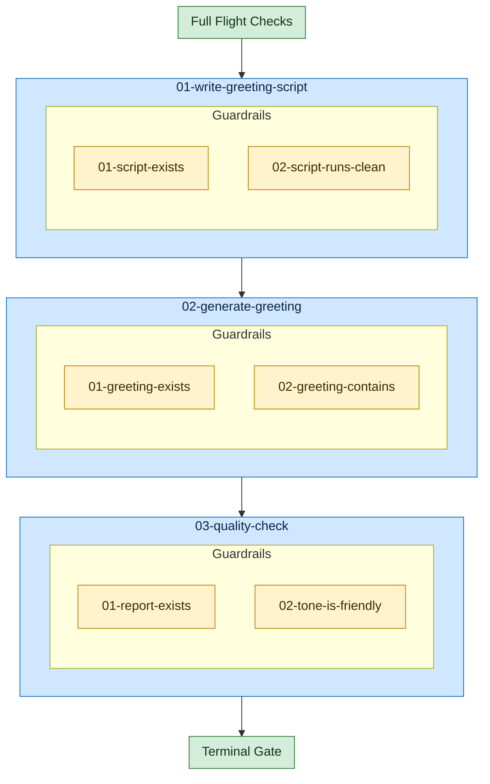

<!-- guardrails:graph v1 source-sha256=fee2a34bd43a3577dfc2aab73460dcd6b5be6cf6e0530d546ae26a91f64194c0 -->

```mermaid
flowchart TD
  subgraph plan_preflights["Full Flight Checks"]
  end
  style plan_preflights fill:#d4edda,stroke:#2e7d32,color:#10341a;
  subgraph task_01_write_greeting_script["01-write-greeting-script"]
    subgraph task_01_write_greeting_script_guardrails["Guardrails"]
      task_01_write_greeting_script_gr_0["01-script-exists"]:::guardrail
      task_01_write_greeting_script_gr_1["02-script-runs-clean"]:::guardrail
    end
  end
  style task_01_write_greeting_script fill:#cfe8ff,stroke:#1b6ec2,color:#0b2545;
  subgraph task_02_generate_greeting["02-generate-greeting"]
    subgraph task_02_generate_greeting_guardrails["Guardrails"]
      task_02_generate_greeting_gr_0["01-greeting-exists"]:::guardrail
      task_02_generate_greeting_gr_1["02-greeting-contains"]:::guardrail
    end
  end
  style task_02_generate_greeting fill:#cfe8ff,stroke:#1b6ec2,color:#0b2545;
  subgraph task_03_quality_check["03-quality-check"]
    subgraph task_03_quality_check_guardrails["Guardrails"]
      task_03_quality_check_gr_0["01-report-exists"]:::guardrail
      task_03_quality_check_gr_1["02-tone-is-friendly"]:::guardrail
    end
  end
  style task_03_quality_check fill:#cfe8ff,stroke:#1b6ec2,color:#0b2545;
  subgraph plan_guardrails["Terminal Gate"]
  end
  style plan_guardrails fill:#d4edda,stroke:#2e7d32,color:#10341a;
  plan_preflights --> task_01_write_greeting_script
  task_01_write_greeting_script --> task_02_generate_greeting
  task_02_generate_greeting --> task_03_quality_check
  task_03_quality_check --> plan_guardrails
  classDef preflight fill:#e6d7ff,stroke:#6f42c1,color:#2e1065;
  classDef guardrail fill:#fff3cd,stroke:#b8860b,color:#3d2c00;
```

_Structure only — retry, feedback, and needs-human edges are omitted._
