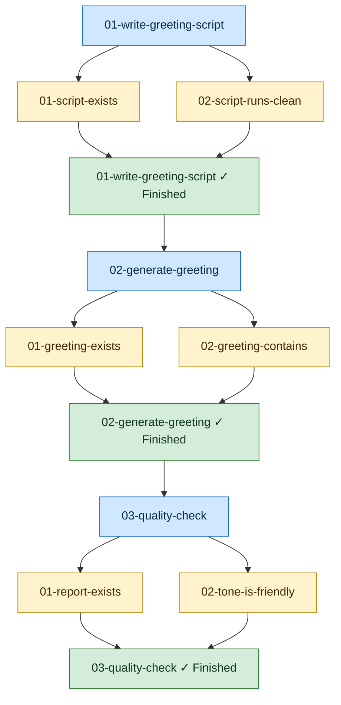

<!-- guardrails:graph v1 source-sha256=56459e16d4eb626893edf0bb21262d8cf1eba3deb414f3f6f6027d7e5bb7e938 -->

```mermaid
flowchart TD
  task_01_write_greeting_script["01-write-greeting-script"]:::task
  gr_01_write_greeting_script_0["01-script-exists"]:::guardrail
  task_01_write_greeting_script --> gr_01_write_greeting_script_0
  gr_01_write_greeting_script_0 --> done_01_write_greeting_script
  gr_01_write_greeting_script_1["02-script-runs-clean"]:::guardrail
  task_01_write_greeting_script --> gr_01_write_greeting_script_1
  gr_01_write_greeting_script_1 --> done_01_write_greeting_script
  done_01_write_greeting_script["01-write-greeting-script ✓ Finished"]:::done
  task_02_generate_greeting["02-generate-greeting"]:::task
  gr_02_generate_greeting_0["01-greeting-exists"]:::guardrail
  task_02_generate_greeting --> gr_02_generate_greeting_0
  gr_02_generate_greeting_0 --> done_02_generate_greeting
  gr_02_generate_greeting_1["02-greeting-contains"]:::guardrail
  task_02_generate_greeting --> gr_02_generate_greeting_1
  gr_02_generate_greeting_1 --> done_02_generate_greeting
  done_02_generate_greeting["02-generate-greeting ✓ Finished"]:::done
  task_03_quality_check["03-quality-check"]:::task
  gr_03_quality_check_0["01-report-exists"]:::guardrail
  task_03_quality_check --> gr_03_quality_check_0
  gr_03_quality_check_0 --> done_03_quality_check
  gr_03_quality_check_1["02-tone-is-friendly"]:::guardrail
  task_03_quality_check --> gr_03_quality_check_1
  gr_03_quality_check_1 --> done_03_quality_check
  done_03_quality_check["03-quality-check ✓ Finished"]:::done
  done_01_write_greeting_script --> task_02_generate_greeting
  done_02_generate_greeting --> task_03_quality_check
  classDef task fill:#cfe8ff,stroke:#1b6ec2,color:#0b2545;
  classDef guardrail fill:#fff3cd,stroke:#b8860b,color:#3d2c00;
  classDef done fill:#d4edda,stroke:#2e7d32,color:#10341a;
```

_Structure only — retry, feedback, and needs-human edges are omitted._
