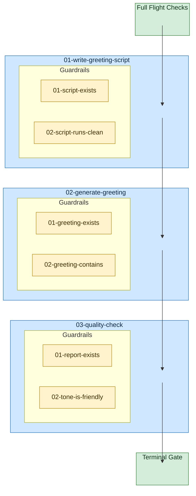

<!-- guardrails:graph v1 source-sha256=26606566be4ca9e6ad2932bb2a5db5ae6793ea248c7f60eed6c3384e9f24dab8 -->

```mermaid
flowchart TD
  subgraph plan_preflights["Full Flight Checks"]
    plan_preflights_anchor[" "]:::invisible
  end
  class plan_preflights planLevel;
  subgraph task_01_write_greeting_script["01-write-greeting-script"]
    task_01_write_greeting_script_anchor[" "]:::invisible
    subgraph task_01_write_greeting_script_guardrails["Guardrails"]
      task_01_write_greeting_script_gr_0["01-script-exists"]:::guardrail
      task_01_write_greeting_script_gr_1["02-script-runs-clean"]:::guardrail
    end
  end
  class task_01_write_greeting_script task;
  subgraph task_02_generate_greeting["02-generate-greeting"]
    task_02_generate_greeting_anchor[" "]:::invisible
    subgraph task_02_generate_greeting_guardrails["Guardrails"]
      task_02_generate_greeting_gr_0["01-greeting-exists"]:::guardrail
      task_02_generate_greeting_gr_1["02-greeting-contains"]:::guardrail
    end
  end
  class task_02_generate_greeting task;
  subgraph task_03_quality_check["03-quality-check"]
    task_03_quality_check_anchor[" "]:::invisible
    subgraph task_03_quality_check_guardrails["Guardrails"]
      task_03_quality_check_gr_0["01-report-exists"]:::guardrail
      task_03_quality_check_gr_1["02-tone-is-friendly"]:::guardrail
    end
  end
  class task_03_quality_check task;
  subgraph plan_guardrails["Terminal Gate"]
    plan_guardrails_anchor[" "]:::invisible
  end
  class plan_guardrails planLevel;
  plan_preflights_anchor --> task_01_write_greeting_script_anchor
  task_01_write_greeting_script_anchor --> task_02_generate_greeting_anchor
  task_02_generate_greeting_anchor --> task_03_quality_check_anchor
  task_03_quality_check_anchor --> plan_guardrails_anchor
  classDef task fill:#cfe8ff,stroke:#1b6ec2,color:#0b2545;
  classDef preflight fill:#e6d7ff,stroke:#6f42c1,color:#2e1065;
  classDef guardrail fill:#fff3cd,stroke:#b8860b,color:#3d2c00;
  classDef planLevel fill:#d4edda,stroke:#2e7d32,color:#10341a;
  classDef invisible fill:none,stroke:none;
```

_Structure only — retry, feedback, and needs-human edges are omitted._
